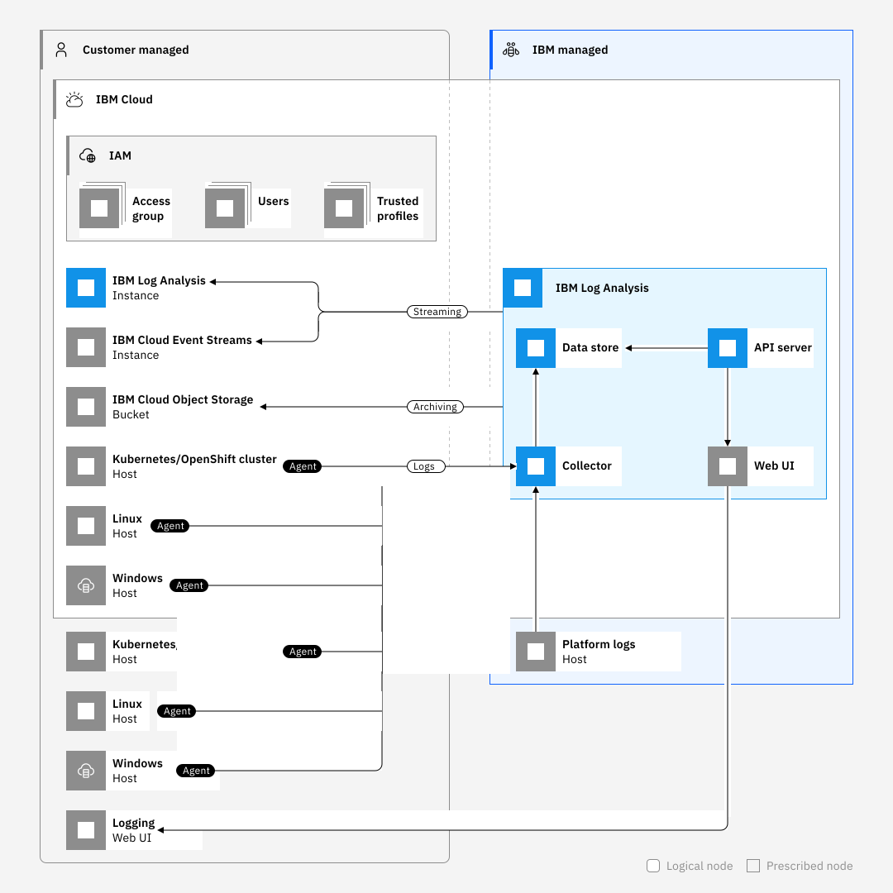

---

copyright:
  years:  2018, 2024
lastupdated: "2024-05-24"

keywords:

subcollection: log-analysis

---

{{site.data.keyword.attribute-definition-list}}

# About
{: #about}

Use {{site.data.keyword.la_full}} to add log management capabilities to your {{site.data.keyword.cloud_notm}} architecture.
{: shortdesc}

{{_include-segments/deprecation_notice.md}}

You can use {{site.data.keyword.la_full_notm}} to manage operating system logs, application logs, and platform logs in the {{site.data.keyword.cloud_notm}}. {{site.data.keyword.la_full_notm}} offers administrators, DevOps teams, and developers advanced features to filter, search, and tail log data, define alerts, and design custom views to monitor application and system logs.

## Features
{: #about_features}

{{site.data.keyword.la_full_notm}} provides the following features.

- Troubleshooting logs in real time to diagnose issues and identify problems

    By using the *live streaming tail* feature, developers and DevOps teams can diagnose issues, analyze stack traces and exceptions, identify the source of errors, and monitor different log sources through a single view. 

- Issuing alerts to be notified of important actions
 
    DevOps teams can configure the system so critical or warning alert notifications are sent to email, Slack, webHook, or PagerDuty.  This helps DevOps teams to act promptly on important application and services events.

- Exporting logs to a local file for analysis or to an archive service to meet auditing requirements

    You can export specific log lines to a local copy or archive logs from {{site.data.keyword.la_full_notm}} to {{site.data.keyword.cloud}} Object Storage.

    Log lines are exported in JSON line format. Logs are archived in JSON format with the metadata that is associated with each line. 

- Controlling logging infrastructure costs by customizing {{site.data.keyword.la_full_notm}} managed logs

    You can control the cost of your {{site.data.keyword.cloud_notm}} logging infrastructure by configuring the log sources that are collecting and managing logs. 

## Overview
{: #about_started_ov}

Log data is stored on the {{site.data.keyword.cloud_notm}}.

Because {{site.data.keyword.la_full_notm}} is part of the {{site.data.keyword.cloud_notm}}, users must have the following permissions:

* Your users must have platform permissions to create, view, and delete an instance of a service in the {{site.data.keyword.cloud_notm}}.
* Your users must have platform permissions to create resources within the context of the resource group where the logging instance is provisioned.

To add logging features in the {{site.data.keyword.cloud_notm}}, you must provision an instance of {{site.data.keyword.la_full_notm}}.

An {{site.data.keyword.la_full_notm}} instance is provisioned within the context of a resource group. Your services are organized for access control and billing purposes by using resource groups. You can provision the instance in the *default* resource group or in a custom resource group.

After provisioning an instance of {{site.data.keyword.la_full_notm}}, you receive the ingestion key for your account.
- You use the ingestion key to configure log sources so logs from that source are forwarded to your {{site.data.keyword.la_full_notm}} instance. A log source is a Cloud or on-prem resource that generates logs.
- You also use the ingestion key to configure logging agents that are responsible for collecting and forwarding logs to your {{site.data.keyword.la_full_notm}} instance. After the logging agent is deployed in a log source, logs are collected and forwarded automatically to the {{site.data.keyword.la_full_notm}} instance. [Learn more](/docs/log-analysis?topic=log-analysis-log_analysis_agent).

The following table lists some log sources:

 Log source | Steps |
|------------|-------------|
| {{site.data.keyword.cloud_notm}} service | [Configuring {{site.data.keyword.cloud_notm}} platform logs](/docs/log-analysis?topic=log-analysis-config_svc_logs) |
| Standard Kubernetes cluster | [Collecting and analyzing logs from a Kubernetes cluster](/docs/log-analysis?topic=log-analysis-kube#kube) |
| Linux | [Collecting and analyzing logs from a Linux environment](/docs/log-analysis?topic=log-analysis-ubuntu#ubuntu) |
| Windows Server | [Collecting and analyzing logs from Windows Server systems](/docs/log-analysis?topic=log-analysis-windows_serv) |
{: caption="Table 1. Tutorials to get started working with the {{site.data.keyword.la_full_notm}} service" caption-side="top"}

Once your log sources are configured, you can launch the {{site.data.keyword.la_full_notm}} Web UI to view, monitor, and manage your logs from the {{site.data.keyword.cloud_notm}} Menu  &gt; **Observability** &gt; **Logging** page. For more information, see [Launch the logging web UI](/docs/log-analysis?topic=log-analysis-launch).

The following figure shows the components comprising the {{site.data.keyword.la_full_notm}} service that is running on {{site.data.keyword.cloud_notm}}:

{: caption="Figure 1. Example services integration scenario." caption-side="bottom"}"

To view and manage logs, see [View and manage your logs](/docs/log-analysis?topic=log-analysis-view_logs).

## Managing access with IAM
{: #about_iam}

{{site.data.keyword.iamlong}} (IAM) enables you to securely authenticate users and control access to all cloud resources consistently in the {{site.data.keyword.cloud_notm}}.

Every user that accesses the {{site.data.keyword.la_full_notm}} service in your account must be assigned an access policy with an IAM user role defined. The policy determines what actions the user can perform within the context of the service or instance you select. The allowable actions are customized and defined as operations that are allowed to be performed on the service. The actions are then mapped to IAM user roles.

For more information, see [Managing access with IAM](/docs/log-analysis?topic=log-analysis-iam).

## Using Terraform
{: #about_tf}

You can use the **LogDNA Terraform provider** to manage {{site.data.keyword.la_full_notm}} resources by using HashiCorp Configuration Language (HCL).

- You can provison an instance by using Terraform. For more information, see [Provisioning an instance by using Terraform](/docs/log-analysis?topic=log-analysis-terraform-setup).

You can use the terraform provider to manage:
- The archiving configuration of an instance. For more information, see [Managing archiving by using Terraform](/docs/log-analysis?topic=log-analysis-terraform-archive).
- Manage the streaming configuration of an instance and related exclusion rules. For more information, see [Managing streaming by using Terraform](/docs/log-analysis?topic=log-analysis-terraform-streaming).

When you use the LogDNA provider, the maximum rate limit is 50 requests per minute.
{: note}

The minimum LogDNA provider version that is supported is `0.12.0`.
