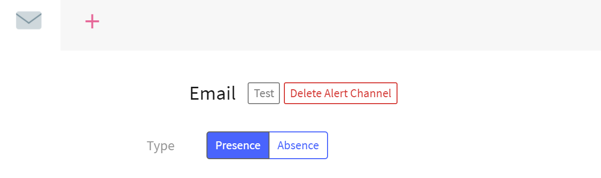

---

copyright:
  years:  2018, 2024
lastupdated: "2024-05-24"

keywords: IBM, Log Analysis, logging, alerts, preset, template

subcollection: log-analysis

---

{{site.data.keyword.attribute-definition-list}}

# Managing presets through the UI
{: #preset_ui}

To reuse an alert configuration, a service administrator can configure an **alert preset** (alert template).
{: shortdesc}

{{../_include-segments/deprecation_notice.md}}

## Creating a preset
{: #preset_ui_create}

Complete the following steps to configure a preset:

1. In the web UI, select the **Settings** icon .
2. Select **ALERTS**.
3. Select **Add Preset**.
4. Specify a name for the preset.
5. Select the type of alert (Slack, Email, Webhook, or PagerDuty).  If you selected the wrong alert type and you want to change it, click **Delete Alert Channel**.
6. Configure the type of alert.
   1. Select if you want the alert to be sent when the condition exists (**Presence**) or does not exist (**Absence**).
   2. Indicate the logging criteria when an alert should be sent.  For example, when 100 lines matching in the view are logged in an hour.  A graph will help you determine the number of log lines matching your specified criteria.
   3. Select if the alert should be sent at the end of the selected period or immediately when the number of lines are logged.
   4. Optionally you can specify a **Custom schedule** with alerting limited to a specified timezone, days of the week, or timeframe. To configure a **Custom schedule**:
      1. Select **on** for **Custom schedule**.
      2. Select the Timezone for the log entries.
      3. Select the days of the week when alerts should be generated.
      4. Optionally specify a time range for the selected days. A graph will help you determine the number of log entries for the timezone and time range.
   5. Depending on the type of alert you will also need to configure additional settings:

      **Slack**:  Specify your **Webhook** URL and the desired **Message color**.

      **Email**: Specify the **Recipients** of the email and a **Timezone**. The timezone defines the timestamp value of each event that is included in the email. To see UTC timestamps, you can select **(GMT +00:00) UTC**.

      **PagerDuty**: Specify the **Service**.  If required, you will be prompted to connect to PagerDuty.

      **Webhook**: Specify the **Method & URL**, and the **Headers** and **Body** of the `JSON` used to interact with your webhook.  You can use **Validate JSON** to make sure your `JSON` is correct before creating the alert.

   6. You can click **Test** to test that your alert configuration is correct.

      

   7. Click **Save Alert**

   8. If you want to create an additional alert channel, click **+** and follow the prior steps to create additional channels.  You can create different channel types, for example, an email and a Slack channel.  Or, you can create multiple channels of the same type with different alert criteria.

Your preset can now be used by others to setup alerts.

## Deleting a preset
{: #preset_ui_delete}

You can manage presets through the **ALERTS** dashboard.

Complete the following steps to delete a preset from the **ALERTS** dashboard:

1. In the web UI, select the **Settings** icon .
2. Select **ALERTS**.
3. Hover the mouse over the **Edit** button of the preset that you want to delete. The **Delete** option displays.
4. Click **Delete**.
5. Confirm that you want to delete the preset by clicking **Yes, delete**.

When you delete a preset, any alerts that are defined by using this preset are automatically deleted.
{: note}
