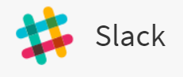

---

copyright:
  years:  2021, 2024
lastupdated: "2024-03-27"

keywords: IBM, Log Analysis, Slack

subcollection: log-analysis

---

{{site.data.keyword.attribute-definition-list}}

# Integrating with Slack
{: #slack}

You can send {{site.data.keyword.la_full}} alerts to Slack.
{: shortdesc}

<!-- common deprecation notice -->
{{../_include-segments/deprecation_notice.md}}

## Prerequsite
{: #slack-prereq}

Before configuring a Slack alert in {{site.data.keyword.la_full}}, you will need to [configure a webhook in Slack.](https://api.slack.com/messaging/webhooks){: external}

## Configuring Slack
{: #slack-config}

When you [configure an alert](/docs/log-analysis?topic=log-analysis-alerts) you can have that alert sent to a Slack.

1. When configuring your alert, click .

2. Select if you want the alert to be sent when the condition exists (**Presence**) or does not exist (**Absence**).

3. Indicate the logging criteria when an alert should be sent.  For example, when 100 lines matching in the view are logged in an hour.  A graph will help you determine the number of log lines matching your specified criteria.

4. Select if the alert should be sent at the end of the selected period or immediately when the number of lines are logged.

5. Optionally you can specify a **Custom schedule** with alerting limited to a specified timezone, days of the week, or timeframe. To configure a **Custom schedule**:

    1. Select **on** for **Custom schedule**.
    2. Select the Timezone for the log entries.
    3. Select the days of the week when alerts should be generated.
    4. Optionally specify a time range for the selected days. A graph will help you determine the number of log entries for the timezone and time range.

6. Specify the **Webhook URL** to receive the alert.

7. Specify the color of the mesage to be displayed in Slack.

8. Click **Save Alert**.

   The alert definition must be saved for alerts to be sent to your slack.
   {: important}
