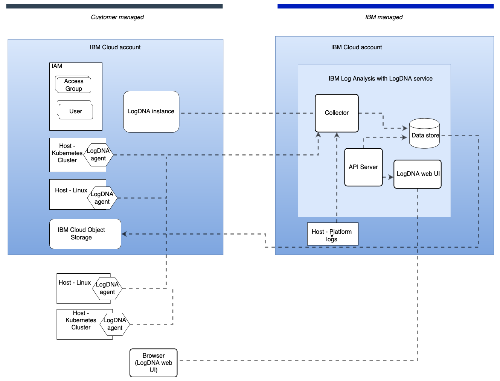

---

copyright:
  years: 2018, 2021
lastupdated: "2021-03-28"

keywords: LogDNA, IBM, Log Analysis, logging, security, connection

subcollection: Log-Analysis-with-LogDNA

---

{:new_window: target="_blank"}
{:shortdesc: .shortdesc}
{:screen: .screen}
{:pre: .pre}
{:codeblock: .codeblock}
{:tip: .tip}
{:note: .note}
{:important: .important}
{:deprecated: .deprecated}
{:download: .download}
{:preview: .preview}

# Learning about {{site.data.keyword.la_full_notm}} architecture and workload isolation
{: #compute-isolation}

Review the following sample architecture for {{site.data.keyword.la_full_notm}}, and learn more about different isolation levels so that you can choose the solution that best meets the requirements of the workloads that you want to run in the cloud.
{: shortdesc}

## {{site.data.keyword.la_full_notm}} architecture
{: #architecture}

{{site.data.keyword.la_full_notm}} is a multi-tenant, regional service that is available in {{site.data.keyword.cloud_notm}}. You can use it to monitor your applications, platform resources, and infrastructure.

The API server component provides a web and an API interface to the logging service.

The collector component ingest data that logging agents forward to the logging service.

The datastore component stores data, alerts, and user metadata.

You can use logging agents to monitor and collect logs from hosts such as a Kubernetes cluster or a Linux system. A logging agent connects to 1 logging instance. The agent forwards data to the instance that is connected. 

Platform logs are collected automatically for enabled-logging services in each region. The data is forwarded to the {{site.data.keyword.la_full_notm}} service instance that is enabled to collect and monitor platform metrics in a region.

The logging web UI is the front-end component where users can monitor and manage logs from hosts through dashboards, views, screens, and alerts.

## {{site.data.keyword.la_full_notm}} workload isolation
{: #workload-isolation}

Each regional deployment of the {{site.data.keyword.la_full_notm}} service serves multiple tenants that are identified by the {{site.data.keyword.IBM_notm}} service instance.

* There is 1 {{site.data.keyword.la_full_notm}} service per region that is responsible for running user workloads in the region.
* The logging data that is collected and processed by the {{site.data.keyword.la_full_notm}} service is associated with that location and not visible to the other regions by virtue of this association.
* Within a service instance, logging data is isolated per logging instance within a region. 
* The {{site.data.keyword.la_full_notm}} service offers soft isolation for data storage. Data is mixed together in the same data stores and segmented by tags that are associated with each of the log records to enforce access control policies.

You can use {{site.data.keyword.cloud_notm}} Identity and Access Management (IAM) to control which users see, create, use, and manage resources in your service instance. [Learn more](/docs/Log-Analysis-with-LogDNA?topic=Log-Analysis-with-LogDNA-work_iam)
.
* To grant access to manage the {{site.data.keyword.la_full_notm}} in {{site.data.keyword.cloud_notm}}, you can assign platform roles that define users levels of access for completing platform management tasks and accessing account resources. 
* To grant access to manage the logging logging instance and its resources, you can assign service roles that define users levels of access for viewing data and managing features such as dashboards, screens, and alerts.

