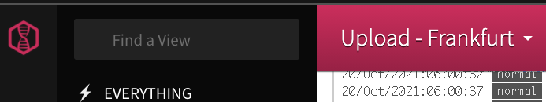
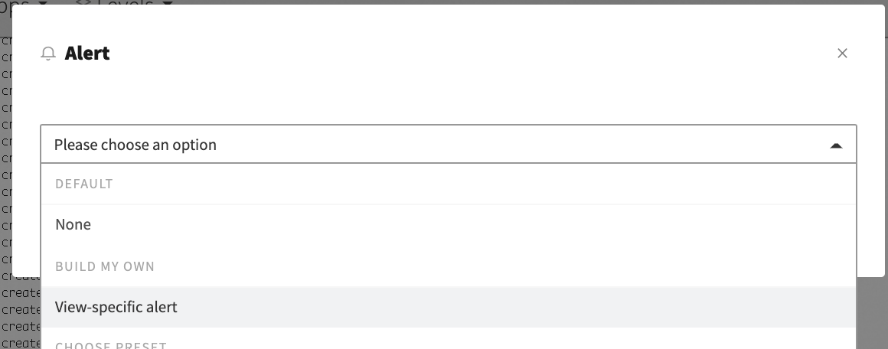
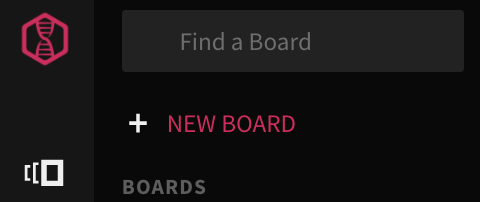
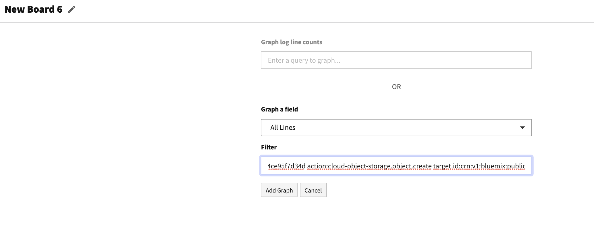
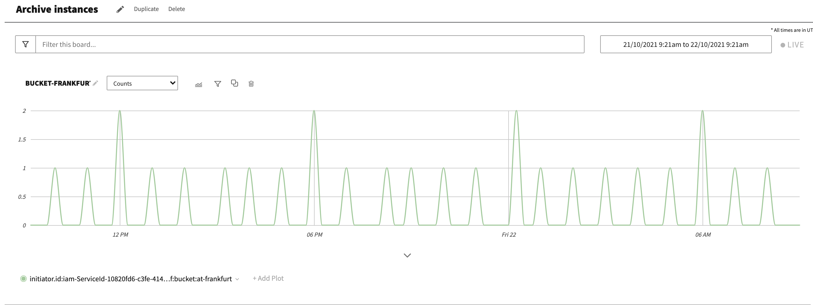

---

copyright:
  years: 2019, 2022
lastupdated: "2022-05-04"

keywords: IBM Cloud, Log Analysis, archive logs, COS, cloud object storage

subcollection: log-analysis

---

{{site.data.keyword.attribute-definition-list}}

 
# Monitor archiving with {{site.data.keyword.at_short}}
{: #archiving-la-monitor}

You can monitor archiving of an {{site.data.keyword.la_short}} instance by monitoring the service ID that is used to write data into {{site.data.keyword.cos_full_notm}} (COS) by using the {{site.data.keyword.at_short}} service. 
{: shortdesc}

## Prereqs
{: #archiving-la-monitor-prereqs}

### {{site.data.keyword.at_short}} service
{: #archiving-la-monitor-prereqs-la}

- You must have an {{site.data.keyword.at_short}} instance provisioned that receives events from the COS bucket that you use for archiving.  Normally this instance is in the same region as the COS bucket.

- **You must have a paid service plan** for the {{site.data.keyword.at_full_notm}} service. [Learn more](/docs/activity-tracker?topic=activity-tracker-service_plans).

- Check that your user ID has permissions to launch the web UI and create views and alerts in the {{site.data.keyword.at_short}} instance. The following table lists the minimum roles that a user must have to be able to launch the {{site.data.keyword.at_full_notm}} web UI, and manage resources:

| Role                      | Permission granted            |
|---------------------------|-------------------------------|  
| Platform role: `Viewer`     | Allows the user to view the list of service instances in the Observability dashboard. |
| Service role: `standard-user` \n  or \n Service role: `manager`     | Allows the user to launch the web UI and configure resources.  |
{: caption="Table 1. IAM roles" caption-side="top"} 

For more information on how to configure policies for a user, see [Granting user permissions to a user or service ID](/docs/activity-tracker?topic=activity-tracker-iam_view_events).

### {{site.data.keyword.cos_full_notm}} service
{: #archiving-at-monitor-prereqs-cos}

- You must have enabled collection of data events for the bucket where you are archiving data for the {{site.data.keyword.la_short}} instance.  Make sure the events are saved to your {{site.data.keyword.at_full_notm}} instance.

    You must enable `write` data events to monitor upload of objects to the bucket.

    You must enable `read` data events to monitor download of objects from the bucket.

- You must have access to view the bucket CRN.

- You must have access to view the service ID CRN value that is associated with the service credential that is used to configure archiving in {{site.data.keyword.la_short}}.


## Configure an alert to monitor archiving
{: #archiving-la-monitor-alert}

### Step 1. Get the service ID
{: #archiving-la-monitor-alert-1}

Complete the following steps to get the service ID that is used to configure archiving in {{site.data.keyword.la_short}}:

1. From the Navigation menu, select **Resource List** > **Storage**.

2. Select the {{site.data.keyword.cos_full_notm}} instance where the bucket is available.

3. Select **Service credentials**. 

4. For the service ID that you used to configure archiving, open the details for the **Key name**. You will see information that is related to the key. 

5. Copy the service ID value. This is the last section of the CRN value that is set for the field **iam_serviceid_crn**. 

    For example, an `iam_serviceid_crn` is similar to the following:

    ```text
    "iam_serviceid_crn": "crn:v1:bluemix:public:iam-identity::a/xxxxxxxxx::serviceid:ServiceId-xxxxxxxx-xxxx-xxxx-xxxx-xxxxxxxxxx"
    ```
    {: screen}

    You must copy the section: `ServiceId-xxxxxxxx-xxxx-xxxx-xxxx-xxxxxxxxxx`

6. Select **Buckets**.

7. Select the bucket you are using for archiving.

8. Click the **Configuration** tab.

9. Copy the *Bucket Instance CRN*.

10. In the **Activity Tracker** section make sure the selected service instance is the one you are using.  Also make sure **Data events** is set to *read & write*. 

### Step 2. Define a view to filter the events that report the usage of that service ID
{: #archiving-la-monitor-alert-2}

Complete the following steps to define a view:
1. [Launch the {{site.data.keyword.at_short}} UI](/docs/activity-tracker?topic=activity-tracker-launch). The *Views* section opens.

2. Select the **Everything** view.

    

3. In the search bar, enter the following query:

    ```text
    initiator.id:iam-ServiceId-<GUID> action:cloud-object-storage.object.create target.id:<BUCKET-CRN>
    ```
    {: codeblock}

    Replace `<GUID>` with the ID value of the service ID that you copied earlier.

    Replace `<BUCKET-CRN>` with the CRN value of the bucket that you found on the the bucket configuration page.

4. Save the view. For example, you can name the view `Upload Frankfurt` to indicate archive files into the bucket from an {{site.data.keyword.la_full_notm}} instance located in Frankfurt.

    The data that is displayed through the view reports write actions of archive files to the archive bucket.


### Step 3. Define an alert to notify the absence of new archive files
{: #archiving-la-monitor-alert-3}

Complete the following steps to define an absence alert that notifies you when archiving is not happening:

1. Select the view name.

    

2. Select **Attach an alert**. The following page opens.

    

3. Select **View-specific alert**.

4. Choose the notification channel.

5. Configure an **Absence** alert.

    

    Archiving is configured hourly. Consider configuring the absence alert over a period of 24 hours to monitor archiving daily.

For more details on how to configure an alert, see [Creating alerts](/docs/log-analysis?topic=log-analysis-create_alert_ui).


## Configure an alert to detect unauthorize access to the bucket
{: #archiving-la-monitor-alert-403}

Notice that you must enable data events **read and write** for the bucket to collect detailed bucket events in your account. Data events are enabled for each bucket.
{: important}

You should monitor requests that report unauthorized access to the bucket. There are different reasons for which you might get this type of situation, for example, invalid credentials if the service ID permissions are changed or the service ID is deleted, or a user or service without permissions is trying to access the bucket to upload data or download it.

To configure this alert, you must create a view with the following query so that you monitor any unauthorized access to the bucket:

```text
target.id:<BUCKET-CRN> reason.reasonCode:403
```
{: codeblock}

Replace `<BUCKET-CRN>` with the CRN value of the bucket that you can get from the bucket configuration page.


Then, you must create a presence alert so you are notified as soon as you start receiving this type of event. For more details on how to configure an alert, see [Creating alerts](/docs/activity-tracker?topic=activity-tracker-create_alert_ui).


## Configure a dashboard to monitor archiving
{: #archiving-la-monitor-board}

Complete the following steps to define a dashboard:
1. [Launch the {{site.data.keyword.at_short}} UI](/docs/activity-tracker?topic=activity-tracker-launch). The *Views* section opens.

2. Select the **Boards** icon .

3. Select **New board**.

    

4. Select **Add Graph**.

5. Select **All lines** in the *Graph a field* section. 

6. Select *Advance filtering* and add the following query:

    ```text
    initiator.id:iam-ServiceId-<GUID> action:cloud-object-storage.object.create target.id:<BUCKET-CRN>
    ```
    {: codeblock}

    Replace `<GUID>` with the ID value of the service ID that you copied earlier.

    Replace `<BUCKET-CRN>` with the CRN value of the bucket that you can get from the bucket configuration page.

    

7. Select **Add graph**. The following dashboard is created where you can monitor the archiving activity in your account for the bucket that you specified in the configuration.

    


