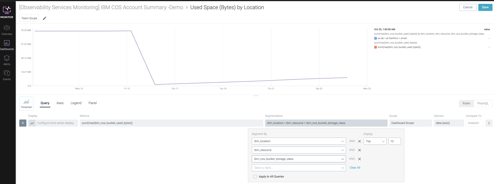
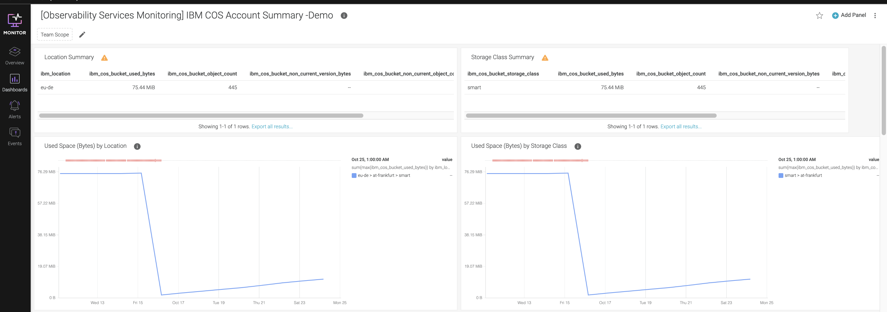

---

copyright:
  years: 2019, 2024
lastupdated: "2024-03-27"

keywords:

subcollection: log-analysis

---

{{site.data.keyword.attribute-definition-list}}

# Monitoring archiving by using {{site.data.keyword.mon_full_notm}}
{: #archiving-monitor}

{{site.data.keyword.cos_full_notm}} is integrated with the {{site.data.keyword.mon_short}} service. {{site.data.keyword.mon_short}} provides a default template that you can customize to monitor the bucket that you configure to store data for long term from an {{site.data.keyword.at_short}} instance.
{: shortdesc}

<!-- common deprecation notice -->
{{../_include-segments/deprecation_notice.md}}

This information applies only if you use an {{site.data.keyword.at_full}} [hosted event search offering](/docs/activity-tracker?topic=activity-tracker-service_plan).
{: important}

Complete the following steps to monitor the {{site.data.keyword.messagehub}} instance:

1. Check that you have an instance of the {{site.data.keyword.mon_short}} in the same region as your {{site.data.keyword.cos_full_notm}} instance. This instance must be configured to collect platform metrics. For more information, see [Enabling platform metrics](/docs/monitoring?topic=monitoring-platform_metrics_enabling).

2. [Launch the {{site.data.keyword.mon_short}} UI](/docs/monitoring?topic=monitoring-launch).

3. In the **Dashboards** section, go to **Dashboard templates** and select the template **IBM** > **IBM COS Bucket**.

4. Create a copy of the template by clicking **Create custom dashboard**.

    Select **2W** resolution.

    You can use the metric *ibm_cos_bucket_used_bytes* to see how much data is the used space in bytes by Location.

    You can use the metric *ibm_cos_bucket_object_count)* to see how many objects are uploaded into the bucket.

5. (Optional) Edit each panel to view data by bucket name and storage class.

    

    Then, customize the metric to see data per storage class.

    

    Check that the resolution is set to **10M**.

For more information, see [Using IBM Cloud Monitoring with IBM Cloud Object Storage](/docs/cloud-object-storage?topic=cloud-object-storage-mm-cos-integration).
