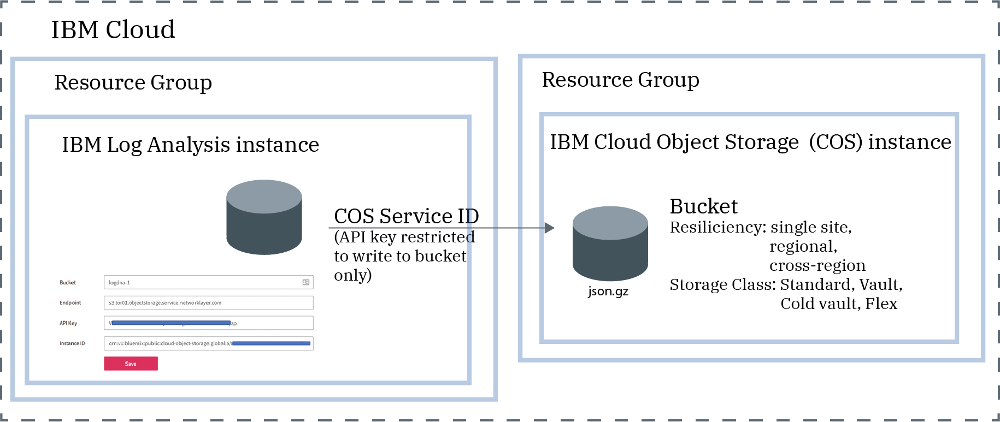

---

copyright:
  years:  2018, 2023
lastupdated: "2021-08-01"

keywords: IBM, Log Analysis, logging, archive logs, COS, cloud object storage

subcollection: log-analysis

---

{{site.data.keyword.attribute-definition-list}}


# Archiving logs to {{site.data.keyword.cos_full_notm}}
{: #archiving-ov}

You can archive logs from an {{site.data.keyword.la_full}} instance into a bucket in an {{site.data.keyword.cos_full_notm}} (COS) instance.
{: shortdesc}

In {{site.data.keyword.la_short}}, by default archiving is not enabled. Data is available for search and analysis for the number of days that your service instance plan indicates. However, you might need to access the data longer for troubleshooting. You might also have to keep the data for longer for compliance, and for corporate or industry regulations. When you need access to data for longer than the number of search days, you must configure archiving.

You can have 1 or more {{site.data.keyword.la_short}} instances per region. Each {{site.data.keyword.la_full_notm}} instance has its own archiving configuration.
{: important}

The following figure shows a high-level view of the different components that are involved when archiving logs:



The {{site.data.keyword.cos_full_notm}} instance is provisioned within the context of a resource group. The {{site.data.keyword.la_full_notm}} instance is also provisioned within the context of a resource group. Both instances can be grouped under the same resource group or in different ones.

{{site.data.keyword.la_full_notm}} uses a service ID to communicate with the {{site.data.keyword.cos_full_notm}} service.
* The service ID that you create for an {{site.data.keyword.cos_full_notm}} instance is used by {{site.data.keyword.la_full_notm}} to authenticate and access the {{site.data.keyword.cos_full_notm}} instance.
* You can assign specific access policies to the service ID that restrict permissions on the {{site.data.keyword.cos_full_notm}} instance. Restrict the service ID to only have writing permissions on the bucket where you plan to archive the logs.
* You can also restrict the IP addresses that are allowed to manage the bucket.

You are responsible for configuring and managing the bucket and the data stored in it.
- If you configure archiving in an EU-managed location, you must configure a bucket that complies with the EU-managed and GDPR regulations.


After you configure archiving,consider the following information:
- Logs are automatically archived in a compressed format **(.json.gz)**. Each log preserves its metadata.
- Logs are archived within 24-48 hours after you save the configuration.
- Logs are archived hourly.
- The first archive file is created when the archiving process runs and there is data.

The first time the archive process runs the number of days archived is dependent on the plan:
- The maximum number of days that data is archived includes logs for the past 30 days when the instance has a `30 day search` plan.
- The maximum number of days that data is archived includes logs for the past 14 days when the instance has a `14 day search` plan.
- The maximum number of days that data is archived includes logs for the past 7 days when the instance has a `7 day search` plan.

For example, you have a service plan of 30 days. You configured the instance 10 days ago. You enable archiving on the 10th day. The archiving process generates multiple files. Each file includes logs for the period of time indicated as part of its name. If there is no data, the archive file for that period is empty.


## Archived file format
{: #archiving-ov-format}

The archive directory format looks like this:

```text
year=<YYYY>/month=<MM>/day=<DD>/<accountID>.<YYYY>-<MM>-<DD>.<HHHH>.json.gz
```
{: codeblock}

Where

`YYYY` represents the year; `MM` represents the month; and `DD` represents the day.

`<accountID>` represents the logging account ID, that is, the ID that is shown in the [web UI URL](/docs/log-analysis?topic=log-analysis-get_web_url).

`HHHH` represents hours in 24 format.

* The timestamp that is used to determine whether the log is included in an archive is the UTC timestamp.

Depending on your location, there might be logs that you see in local time in your views on a specific day. However, you cannot find them in the archive file. You are most likely viewing logs in local time and the archive process uses the UTC timestamp.
{: note}


## Configure archiving
{: ##archiving-ov-configure}

For information on how to configure archiving, see:
- [Configuring archiving through the UI](/docs/log-analysis?topic=log-analysis-archiving).
- [Configuring archiving by using the API](/docs/log-analysis?topic=log-analysis-archiving-manage-api#archivingapi-conf).

In addition, consider the following information:
- You must have the **manager** role to configure archiving in the {{site.data.keyword.la_full_notm}} instance. This role includes the **logdna.dashboard.manage** IAM action role that allows a user to perform admin tasks such as configure archiving.
- When you configure archiving, the {{site.data.keyword.la_short}} instance and the {{site.data.keyword.cos_full_notm}} (COS) instance must be provisioned in the same account.
- The credential that {{site.data.keyword.la_short}} uses to write data into a COS bucket must have **writer** role.


## Monitor archiving
{: #archiving-ov-monitor}

To monitor archiving, you can use the following services:

- {{site.data.keyword.mon_full_notm}} service:

    {{site.data.keyword.cos_full_notm}} is integrated with the {{site.data.keyword.mon_short}} service. {{site.data.keyword.mon_short}} provides a default template that you can customize to monitor the bucket that you configure to store data for long term.

    For more information, see [Monitoring archiving by using {{site.data.keyword.mon_full_notm}}](/docs/log-analysis?topic=log-analysis-archiving-monitor).

- {{site.data.keyword.at_full_notm}}:

    You can monitor archiving of a {{site.data.keyword.la_short}} instance by monitoring the service ID that is used to write data into {{site.data.keyword.cos_full_notm}} (COS).

    For more information, see [Configuring an alert to monitor archiving](/docs/log-analysis?topic=log-analysis-archiving-at-monitor).


## IAM permissions to configure archiving
{: #archiving-ov-iam}

To configure archiving, you need the following permissions:

### {{site.data.keyword.la_full_notm}} service
{: #archiving-ov-iam-at}

The following table lists the minimum roles that a user must have to be able to launch the {{site.data.keyword.la_full_notm}} web UI, and configure archiving through the UI or by using the API:

| Role                      | Permission granted            |
|---------------------------|-------------------------------|
| Platform role: `Viewer`     | Allows the user to view the list of service instances in the Observability dashboard. |
| Service role: `Manager`      | Allows the user to launch the web UI and configure archiving through the web UI or by using the API.  |
{: caption="Table 1. IAM roles" caption-side="top"}

For more information on how to configure policies for a user, see [Granting user permissions to a user or service ID](/docs/services/log-analysis?topic=log-analysis-iam_view_logs#iam_view_logs).


### {{site.data.keyword.cos_full_notm}} service
{: #archiving-ov-iam-cos}

The following table lists the roles that a user can have to complete the actions required to configure the {{site.data.keyword.cos_full_notm}} service:

| Service                    | Roles    | Action                                                                                        |
|----------------------------|-------------------|-----------------------------------------------------------------------------------------------|
| `Cloud Object Storage`     | Platform role: `Administrator`     | Allows the user to assign policies to users in the account to work with the {{site.data.keyword.cos_full_notm}} service. |
| `Cloud Object Storage`     |  Platform role: `Administrator`   \n  or \n Platform role:`Editor` | Allows the user to provision an instance of the {{site.data.keyword.cos_full_notm}} service.    |
| `Cloud Object Storage`     |  Platform role: `Administrator`   \n or \n  Platform role:`Editor` \n or   \n  Platform role: `Operator` | Allows the user to create a service ID.    |
| `Cloud Object Storage`     |  Service role: `writer` | Grants permissions to create, modify, and delete buckets. In addition, grants permissions to upload and download the objects in the bucket.   |
{: caption="Table 2. Roles and actions" caption-side="top"}

For more information on how to configure policies for a user, see [Grant IAM policies to a user to work with {{site.data.keyword.cos_full_notm}}D](/docs/log-analysis?topic=log-analysis-archiving#archiving_step1).

### Service ID
{: #archiving-ov-iam-cos-cred}

The service ID that you must create for an {{site.data.keyword.cos_full_notm}} instance is used by {{site.data.keyword.la_full_notm}} to authenticate and access the {{site.data.keyword.cos_full_notm}} instance. This service ID must have the **writer** role. This role grants permissions to upload archive files in the bucket.

When the service credential is rotated, make sure the [API Key is updated with the new API Key.](/docs/log-analysis?topic=log-analysis-archiving#archiving_step8)  Archiving will stop if the API Key is not updated.
{: important}

## {{site.data.keyword.at_short}} logs
{: #archiving-ov-at-logs}


The following {{site.data.keyword.at_short}} logs are generated when you configure archiving:

| Action                                            | Description                |
|---------------------------------------------------|----------------------------|
| `logdna.account-archive-setting.configure` | This log is generated when an administrator configures archiving for an logging instance. |
{: caption="Table 3. Archiving {{site.data.keyword.at_short}} logs" caption-side="top"}
