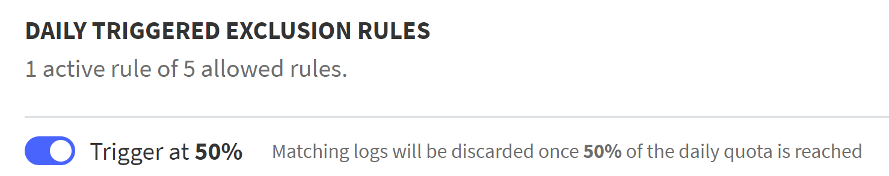

---

copyright:
  years: 2019, 2024
lastupdated: "2024-05-24"

keywords: IBM Cloud, Log Analysis, usage, usage quotas

subcollection: log-analysis

---

{{site.data.keyword.attribute-definition-list}}

# Managing usage quotas
{: #control_usage_quotas}

In {{site.data.keyword.la_full}}, you can use the *Usage Quota* settings to control how much data is stored so you can manage your data cost while still being able to view and retain the data you need.
{: shortdesc}

<!-- common deprecation notice -->
{{../_include-segments/deprecation_notice.md}}

## What are usage quotas?
{: #about_usage_quotas}

You can use the *Usage Quotas* feature to set daily or monthly thresholds for the volume of log files that are to be stored.  When the threshold is exceeded, {{site.data.keyword.la_full_notm}} will take the actions you configure.

You can configure the system to:

* Stop storing all logs when the threshold is exceeded.
* Stop storing specific logs based on exclusion rules.
* Create alerts when a usage quote threshold is met.

When you stop storing some or all logs, logs will still be available in the live tail but will be unavailable for historical or audit purposes.  Logs that are not stored do not count towards your usage billing.
{: important}

By setting *Usage Quotas* you can balance your organization's needs to view, alert, and maintain important logs while balacing the need to manage the cost of data storage.

## Types of usage quotas
{: #usage_quota_types}

There are three types of usage quotas.

Hard quotas
:   A hard quota will stop saving or archiving all logs when the configured daily or monthly quota threshold is reached.

Soft quotas
:   A soft quota will stop saving or archiving logs based on the exclusion rules you define.  These exclusion rules can be configured to specify which logs to store and which to discard.  For example, you can specify exclusion rules to discard rules from a specific host, application, or other query.

Alert-only
:   An alert-only quota will send an alert allowing logs to continue to be saved, and your data usage to grow, even though the defined threshold has been exceeded.

## Considerations when using usage quotas
{: #usage_quotas_considerations}

When you exclude logs using the *Usage Quotas* function, the excluded logs will not be archived or streamed.
{: important}

When deciding to use *Usage Quotas*, consider the following:

* *Usage Quotas* configured actions are separate from any other [defined exclusion rules.](/docs/log-analysis?topic=log-analysis-exclusion_rules)   *Usage Quotas* rules are triggered dynamically based on your defined thresholds while other exclusion rules are always in effect.

* If the quota is set to a value lower than what has been consumed and sent to storage, all incoming logs after the rule value has been set will be discarded.

* If you change your daily or monthly usage quota, all exclusion rules will be automatically disabled.  For example, if your set your monthly usage quota to 100 GB, and you have three daily exclusion rules configured to that quota, if you change your monthly usage quota to a different value the exclusion rules will be disabled.  You can reenable them if desired.  Exclusion rules are automatically disabled to help avoid having having logs being unintentionally discarded.

## Configuring usage quotas
{: #configure_usage_quotas}

You can configure quotas and what is done when various thresholds are reached.

### Accessing usage quotas
{: #access_usage_quotas}

To configure *Usage Quotas*, access the **Usage Quotas** settings by doing the following:

The Usage Quotas option is in the left-pane of the LogDNA application, under **Settings** &gt; **Usage** .

1. [Log in to your {{site.data.keyword.cloud_notm}} account](https://cloud.ibm.com/login){: external}.

	After you log in with your user ID and password, the {{site.data.keyword.cloud_notm}} dashboard opens.

2. Click the **Menu** icon  &gt; **Observability**.

3. Select **Logging**.

    The list of {{site.data.keyword.la_full_notm}} instances is displayed.

4. Select the instance in the region where you want to view events. Then, click **Open Dashboard**.

5. In the web UI, click the **Usage** icon  &gt; **Usage Quotas**.

### Enabling and disabling Usage Quotas
{: #enable_disable_usage_quotas}

To enable *Usage Quotas* make sure the selection at the top of the dialog is set to **on**.  To disable the *Usage Quota* configuration, make sure the selection is set to **off**.  *Usage Quotes* are disabled by default.

### Setting up your usage quotas
{: #setup_usage_quota}

When you first access the *Usage Quotas* dialog you will see the daily and monthly quotas set for your instance.

To change the daily and monthly quotas, do the following:

1. Click **Edit Usage Quotas**

2. Change the **Daily Usage Quota** and **Monthly Usage Quota** to your desired values. The quotas can be specified in `MB`, `GB`, or `TB`.  These are hard quotas.

3. Select what you would like to occur when the quotas are reached.

   **Discard logs when the Daily Usage Quota is reached until midnight UTC**
   :   If selected, when the daily quota is reached within a 24-hour period at UTC, logs will no longer be saved.

   **Discard logs when the Monthly Usage Quota is reached until the next billing cycle**
   :   If selected, when the monthly quota is reached before the end of the billing cycle, logs will no longer be saved.

   If logs are not being saved they will still be available for live tail and alerting.

   Verify all conditions and exclusion rules when selecting these options.  Selecting these options will result in logs being discarded and not saved for searching, archiving, or streaming.
   {: important}

4. Click **Apply** to save your changes.

### Configuring usage quota exclusion rules
{: #rules_usage_quota}

If you want to take action prior to daily or monthly quota being reached, you can set up exclusion rules that operate as soft quotas.

These exclusion rules will allow you to discard specific non-critial logs before reaching the hard quota threshold.

For example, if the daily usage quote is 2 GB and your set an exclusion rule for 50%, {{site.data.keyword.la_full_notm}} will apply the configured exclusion rule and no longer retain logs from the sources, apps, hosts, or queries specified in the rule.

You can specify up to 5 daily exclusion rules and 5 monthly exclusion rules.
{: note}

#### Daily exclusion rules
{: #daily_usage_quota}

To specify a daily exclusion rule, do the following from the *Usage Quotas* dialog:

Verify that each exclusion rule that you add behaves as expected. Improper configured exclusion rules can result in storing data not intended for storage.
{: important}

1. In the **Triggered Exclusion Rules** section click **Add daily rule**.

2. Drag the slider to the percentage of the daily usage quota when you want the rule triggered.  For example, 50%.  If you try to set a percentage where an exclusion rule exists, you will be warned that the existing rule will be replaced.

3. Select the source of the logs you want to exclude.

4. Select the apps you want to exclude.

5. Specify a [query](/docs/log-analysis?topic=log-analysis-views) to select the log lines you want to exclude.

6. Select if your want to discard all matching log lines until midnight UTC and if you want those log lines preserved for live tail and alerting.

   All configured alert recipients will be alerted when the percentage threshold of the daily quota is reached.  This behavior cannot be changed.
   {: note}

7. Click **Apply** to save the exclusion rule.

    Check the query in a custom view by entering the search criteria in the search bar of the *Everything* view, and validating that the data that is displayed is the data that you want excluded.
    {: tip}

#### Monthly exclusion rules
{: #monthly_usage_quota}

To specify a monthly exclusion rule, do the following from the *Usage Quotas* dialog:

Verify that each exclusion rule that you add behaves as expected. Improper configured exclusion rules can result in storing data not intended for storage.
{: important}

1. In the **Triggered Exclusion Rules** section click **Add monthly rule**.

2. Drag the slider to the percentage of the monthly usage quota when you want the rule triggered.  For example, 50%.  If you try to set a percentage where an exclusion rule exists, you will be warned that the existing rule will be replaced.

3. Select the source of the logs you want to exclude.

4. Select the apps you want to exclude.

5. Specify a [query](/docs/log-analysis?topic=log-analysis-views) to select the log lines you want to exclude.

6. Select if your want to discard all matching log lines until the next billing cycle and if you want those log lines preserved for live tail and alerting.

   All configured alert recipients will be alerted when the percentage threshold of the monthly quota is reached. This behavior cannot be changed.
   {: note}

7. Click **Apply** to save the exclusion rule.

    Check the query in a custom view by entering the search criteria in the search bar of the *Everything* view, and validating that the data that is displayed is the data that you want excluded.
    {: tip}

#### Enable and disabling exclusion rules
{: #enable_usage_rules}

Toggle the selection next to the exclusion rules to enable or disable the rule.

{: caption="Figure 1. Example switch showing exclusion rule is enabled" caption-side="bottom"}

#### Editing exclusion rules
{: #editing_usage_rules}

To edit an exclusion rule click **Edit** next to the exclusion rule that you want to change.

### Configuring usage quota alerts
{: #alerts_usage_quota}

By default the account owner is configured to receive alert emails.  You can configure your systems to send email alerts, Slack notifications, or both.

To configure notifications when a quota threshold is exceeded, do the following:

1. Under **Alert recipients** select the desired recipient email addresses. There must be at least one email address configured if Slack notifcations are not configured.

2. If desired, select one or more **Slack recipients** to receive notifications.  If you configure a Slack recipient, you can delete all email recipients if desired.
