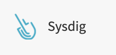

---

copyright:
  years:  2018, 2021
lastupdated: "2021-03-28"

keywords: IBM, Log Analysis

subcollection: log-analysis

---

{{site.data.keyword.attribute-definition-list}}

# Integrating with {{site.data.keyword.mon_full_notm}}
{: #monitoring}

You can send alerts to {{site.data.keyword.mon_full_notm}} and manage them through the *Events* view section.
{: shortdesc}

## Configuring an alert
{: #monitoring-config}

When you [configure an alert](/docs/log-analysis?topic=log-analysis-alerts) you can have that alert sent to {{site.data.keyword.mon_full_notm}}.

1. When configuring your alert, click .

2. Select if you want the alert to be sent when the condition exists (**Presence**) or does not exist (**Absence**).

3. Indicate the logging criteria when an alert should be sent.  For example, when 100 lines matching in the view are logged in an hour.  A graph will help you determine the number of log lines matching your specified criteria.

4. Select if the alert should be sent at the end of the selected period or immediately when the number of lines are logged.

5. Optionally you can specify a **Custom schedule** with alerting limited to a specified timezone, days of the week, or timeframe. To configure a **Custom schedule**:

    1. Select **on** for **Custom schedule**.
    2. Select the Timezone for the log entries. 
    3. Select the days of the week when alerts should be generated.
    4. Optionally specify a time range for the selected days. A graph will help you determine the number of log entries for the timezone and time range.

6. Configure the Monitoring instance details.

    Specify the **API key**. Set this field to the API token. For more information on how to get the token, see [Working with tokens](/docs/monitoring?topic=monitoring-api_monitoring_token).

    Specify the **{{site.data.keyword.mon_full_notm}} instance URL**. Set this field to the endpoint where the instance is available. For more information, see [{{site.data.keyword.mon_full_notm}} endpoints](/docs/monitoring?topic=monitoring-endpoints#endpoints_monitoring).

    Specify the **Severity**. Valid values are `Info`, `Low`, `Medium`, or `High`. 

7. Optional: You can click **Test** to test that your alert configuration is correct.

8. Click **Save Alert**.

   The alert definition must be saved for alerts to be sent to {{site.data.keyword.mon_full_notm}}.
   {: important}

## Managing alerts
{: #monitoring-manage}

You get a **custom** event when an alert is triggered. 

You can view the events by filtering by name or level in the *Events* section of the {{site.data.keyword.mon_full_notm}} instance.

To view alerts, a user must have permissions to navigate to the web UI. [Learn more](/docs/Monitoring-with-Sysdig?topic=Monitoring-with-Sysdig-launch).

