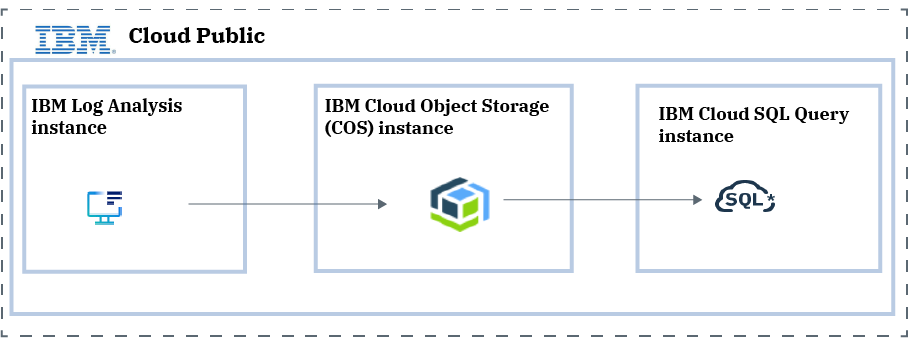

---

copyright:
  years:  2018, 2021
lastupdated: "2021-03-28"

keywords: IBM Cloud, {{site.data.keyword.la_short}}, EU-supported

subcollection: log-analysis

---

{:new_window: target="_blank"}
{:shortdesc: .shortdesc}
{:screen: .screen}
{:pre: .pre}
{:table: .aria-labeledby="caption"}
{:codeblock: .codeblock}
{:tip: .tip}
{:download: .download}
{:important: .important}
{:note: .note}
{:external: target="_blank" .external}

# Searching archive data by using the {{site.data.keyword.sqlquery_short}} service
{: #sqlquery}

You can use the {{site.data.keyword.sqlquery_short}} service to query {{site.data.keyword.la_full_notm}} archive files that are stored in an {{site.data.keyword.cos_short}} (COS) bucket in your account. You can run queries from the {{site.data.keyword.cloud_notm}} UI, or programmatically.
{:shortdesc}



Each {{site.data.keyword.la_full_notm}} instance has a service plan associated that indicates the number of days that you can query data through the web UI. To have access to the events after this period, you must enable archiving in the {{site.data.keyword.la_full_notm}} instance. When you enable archiving, you get an archive file daily. This file contains information for the previous day. Notice that UTC timestamps are used to determine which records are included in each file. The file name includes the ID of your {{site.data.keyword.la_full_notm}} instance and the date of the records that are included in the file.

To query the archive data in a file, you can use the {{site.data.keyword.sqlquery_short}} service. The service offers an SQL editor through the UI, and also programmatic options such as a REST API.

Use the {{site.data.keyword.sqlquery_short}} user interface (UI) to develop and test your queries, and the [SQL Query REST API](#restapi) to automate them. 
{: tip}

The {{site.data.keyword.sqlquery_short}} service provides a serverless, no-ETL solution to easily query data stored in {{site.data.keyword.cos_short}}. Underneath, SQL Query uses Apache Spark SQL as its underlying query engine. 

You can use the {{site.data.keyword.sqlquery_short}} to run SQL queries (that is, `SELECT` statements) to analyze, transform structured and semi-structured data, or clean up rectangular data. You cannot run actions such as `CREATE`, `DELETE`, `INSERT`, and `UPDATE`.

The {{site.data.keyword.sqlquery_short}} service can process input data that is read from CSV, JSON, ORC, Parquet, or AVRO files. The archive files from an {{site.data.keyword.la_full_notm}} instance contain data in JSON format.

Each query result can be written to a `CSV`, `JSON`, `ORC`, `PARQUET`, or `AVRO` file in a {{site.data.keyword.cos_short}} instance of your choice. 

When you query an {{site.data.keyword.la_full_notm}} archive file, you must convert the JSON formatted file into `PARQUET` format to be able to query the contents successfully.
{: important}


## Prerequisites
{: #sqlquery_prereq}

To be able to use the {{site.data.keyword.sqlquery_short}} service to query archived event files, check the following prerequites: 

* You must have access to a COS instance in your account. 

    You must have access to a bucket that contains the {{site.data.keyword.la_full_notm}} archive files and a bucket to use to store results from your queries. 

* You must have an {{site.data.keyword.la_full_notm}} instance provisioned in your account that has [archiving configured to a bucket in the COS instance in your account](/docs/log-analysis?topic=log-analysis-archiving). 

    Events are archived to a file in a COS bucket. 

    If archiving is not configured, you must wait at least 24 hours before an archive file is available after archiving is configured.

* You must have 1 or more archive files uploaded in the bucket.

* You must have a policy on the COS service with at least the platform role **reader** so that you can view data in the COS bucket where the archive files are uploaded.

* You must have a policy on the COS instance with at least **writer** access to at least one COS bucket so that result files (files containing output data) can be written there.


## Step 1. Provisioning an {{site.data.keyword.sqlquery_short}} instance
{: #sqlquery_step1}

To query archive files hosted in a COS bucket, you can use the {{site.data.keyword.sqlquery_short}} service.

You must provision the {{site.data.keyword.sqlquery_short}} service in the same account where the COS instance that manages the bucket with the archive files is available.
{: important}

To provision an instance, see [Create your {{site.data.keyword.sqlquery_short}} service instance](/docs/services/sql-query?topic=sql-query-gettingstarted#sql_query).


Once you have {{site.data.keyword.sqlquery_short}} running on {{site.data.keyword.cloud_notm}}, you can immediately start querying your data by using the {{site.data.keyword.sqlquery_short}} UI, or programmatically by using either [the {{site.data.keyword.sqlquery_short}} REST API](https://cloud.ibm.com/apidocs/sql-query){: external}, or the Python `ibmcloudsql` library. 


## Step 2. Granting user permissions to run a query
{: #sqlquery_step2}

To run queries with the SQL query service, a user needs a platform role and a service role. The following tables show the roles and actions that you can assign a user to run SQL queries:


| Platform actions                   | Administrator                                     | Editor | Operator | Viewer  |
|------------------------------------|:-------------------------------------------------:|:-------:|:--------:|:------:|
| `View details of the {{site.data.keyword.sqlquery_short}} service instance`    |   |     |       |     |
{: caption="Table 1. Platform roles" caption-side="top"}


| Service actions                 | Manager                                           | Writer                                            | Reader           |
|:-------------------------------:|:-------------------------------------------------:|:-------------------------------------------------:|:----------------:|
| `Run an SQL query`              |  |  |                  |
{: caption="Table 2. Service roles" caption-side="top"}

Users with the service role **reader** get an access error when they launch the SQL Query UI.

To manage access or assign new access for users by using IAM policies, you must be the account owner, administrator on all services in the account, or an administrator for the particular service or service instance. 

Choose any of the following actions to manage IAM policies in the {{site.data.keyword.cloud_notm}}:

* To grant permissions to a user, see [Assigning access](/docs/account?topic=account-assign-access-resources#assign_new_access).
* To revoke permissions, see [Removing access](/docs/account?topic=account-assign-access-resources#removing_access).
* To review a user's permissions, see [Reviewing your assigned access](/docs/account?topic=account-assign-access-resources#review_your_access).


## Step 3. Running a query through the {{site.data.keyword.sqlquery_short}} UI
{: #sqlquery_step3}

In SQL, the term *query* is just another way of saying *SELECT statement*. 

To run a query, complete the following steps:

### Step 3.1. Launch the {{site.data.keyword.sqlquery_short}} query UI
{: #sqlquery_step3-1}

1. [Log in to your {{site.data.keyword.cloud_notm}} account](https://cloud.ibm.com/login){: external}.

	After you log in with your user ID and password, the {{site.data.keyword.cloud_notm}} dashboard opens.

2. Click the **Menu** icon  &gt; **Resource list** &gt; **Services**.

3. Select an {{site.data.keyword.sqlquery_short}} instance.

4. From the *Manage* tab, select **Launch {{site.data.keyword.sqlquery_short}} UI**.

When the {{site.data.keyword.sqlquery_short}} query UI opens, a COS bucket is automatically generated. This bucket is used by default by the {{site.data.keyword.sqlquery_short}} service to store the results from your SQL queries. 

Wen you run queries, you can specify a custom bucket to store results in. If your query does not specify one, the default one is used.
{: note}

### Step 3.2. Get information on the file that you want to query in COS
{: #sqlquery_step3-2}

Complete the following steps:

1. In the {{site.data.keyword.cloud_notm}} dashboard, click the **Menu** icon  &gt; **Resource list** &gt; **Storage**.

2. Select the {{site.data.keyword.sqlquery_short}} instance that has the bucket with the archive files.

    Contact your {{site.data.keyword.la_full_notm}} administrator to get the COS information.

3. Select **Buckets**. 

4. Select the bucket name. You can see the list of archive files in the bucket.

5. Identify the file that you want to query.

    Notice that the file name has the name of your {{site.data.keyword.la_full_notm}} instance and the date, in UTC format, of the events that are included.

    If you get a file of `20 bytes`, that file does not have any data.

6. For that file, select **SQL URL**.

    A window opens that shows the URL.

7. Copy the URL.

### Step 3.3. Get information on the COS bucket that is used to store results from queries
{: #sqlquery_step3-3}

Complete the following steps:

1. In the COS instance UI, select **Buckets**. 

2. Select the bucket name that you plan to use to store the results from queries.

3. For that bucket, select **SQL URL**.

    A window opens that shows the URL.

4. Copy the URL.


### Step 3.4. Transform an archive file to PARQUET format
{: #sqlquery_step3-4}

When you query an archive file, the format of the data is JSON. You must transform the format to **PARQUET** to query successfully the data. 
{: important}

Parquet is an open source file format that stores nested data structures into a flat columnar format, and preserves the schema of the original data. 

The {{site.data.keyword.sqlquery_short}} UI is an editor that lets you immediately start composing SQL queries. Since SQL Query uses Spark SQL, you can use Spark SQL functions and ANSI SQL to compose both simple and complex queries that involve large amounts of data.


Complete the following steps to run the query to transform content from JSON into PARQUET:
1. In the SQL editor field of the {{site.data.keyword.sqlquery_short}} UI, enter the following SELECT statement:

    ```
    SELECT * FROM cleancols(SQL_URL STORED AS JSON) 
    INTO RESULTS_BUCKET STORED AS PARQUET
    ```
    {: codeblock}

    Where

    * **SQL_URL** is the SQL URL of the archive file in COS
    
    * **RESULTS_BUCKET** is the SQL URL of the custom COS bucket that you plan to use to upload the query results

    * Use [cleancols](/docs/sql-query?topic=sql-query-sql-reference) to avoid transformation problems into PARQUET format when the name of the columns include special characters or blanks.

    For example, the following query is used to transform an archive file:

    ```
    SELECT * FROM cleancols(cos://ams03/at-logdna-eu-de/999999d8f1f.2019-06-03.62.json.gz STORED AS JSON)
    INTO cos://eu-de/results-at STORED AS PARQUET
    ```
    {: screen}

2. Click **Run**.

    You can see the query result in the *Result* area of the UI. 

    You can see the target COS URL in the *Result location* area of the UI. This URL points to the object storage bucket used by {{site.data.keyword.sqlquery_short}} to store the results.
    
    With the lite plan, you can run only 1 query. You can run up to 5 queries simultaneously with a paid plan.

3. Copy the **Result location URL**. You need it to run other queries to analyze the events that are included in that archive file.

After you run the query, three objects are written as a result set in your COS results bucket:

1. `jobid=<job_id>`
2. `jobid=<job_id>/_SUCCESS`
3. `jobid=<job_id>/<part-number>`

Only one object contains the result set (`jobid=<job_id>/<part-number>`), and the other two are empty and don't contain any data. 

It is important not to delete any of the files if you want to use the result set.
{: important}

Each result is stored with an own job ID prefix that allows you to use the result directly in a query.

When you want to specify a result as input in your SQL query, specify the first (`jobid=<job_id>`) or the third one (`jobid=<job_id>/<part-number>`).

[Learn more about the result set created per query](/docs/services/sql-query?topic=sql-query-overview#result).

After you have the file converted to 'PARQUET` format, you can run queries to analyze its content.
{: note}


### Step 3.5. Run a query to determine the number of events in the archive file
{: #sqlquery_step3-5}

To report on the total number of events that are included in the archive file, run the following query:

```
SELECT COUNT(*) AS NUMBER_EVENTS FROM <PARQUET_FILE> STORED AS PARQUET
INTO <RESULTS_BUCKET> STORED AS CSV
```
{: codeblock}

Where

* **NUMBER_EVENTS** is the name of the field that you want to use to report the numerical value
* **PARQUET_FILE** is the **Result location URL** that you get when you transform the archive file from JSON to PARQUET
* **RESULTS_BUCKET** is the SQL URL of the custom COS bucket that you plan to use to upload the query results

For example, to get the total number of events in a file, you can run the following query:
```
SELECT COUNT(*) AS logLines FROM cos://eu-de/results-at/jobid=f178778e-7707-46a9-982d-1e89261b63a5 STORED AS PARQUET
INTO cos://eu-de/results-marisa STORED AS CSV
```
{: screen }


### Step 3.6. Run a query to get a custom view of a subset of the event fields
{: #sqlquery_step3-6}

To see information about each event, run the following query:

```
SELECT <FIELDS> FROM <PARQUET_FILE> STORED AS PARQUET
INTO <RESULTS_BUCKET> STORED AS CSV
```
{: codeblock}

Where

* **FIELDS** is the list of fields that you want to get information on for the different records. For example, you can enter `_source.eventTime AS EVENTTIME, _source.action AS ACTION, _source.severity AS SEVERITY, _source.outcome AS OUTCOME, _source.o_initiator.id AS INITIATOR_ID, _source.o_initiator.name AS INITIATOR_NAME`
* **PARQUET_FILE** is the **Result location URL** that you get when you transform the archive file from JSON to PARQUET
* **RESULTS_BUCKET** is the SQL URL of the custom COS bucket that you plan to use to upload the query results

For example, to get the list of actions, you can run the following query:

```
SELECT DISTINCT  _source.action
FROM cos://eu-gb/sql-results/jobid=17cee056-4da1-4429-8aca-3a7eb320ee27 STORED AS PARQUET 
INTO cos://eu-gb/sql-results STORED AS CSV
```
{: screen}

For example, to get the list of actions for a user, you can run the following query:

```
SELECT  _source.eventTime, _source.action, _source.o_target.name
FROM cos://eu-gb/sql-results/jobid=3aa9e732-ba88-4ffe-b9fc-b8a265876467 STORED AS PARQUET 
WHERE _source.o_initiator.name = "xxx@ibm.com"
ORDER BY _source.eventTime
INTO cos://eu-gb/sql-results STORED AS CSV
```
{: screen}

For example, to get the event time, the action, the criticality of the action, and the outcome, you can run the following query:

```
SELECT _source.eventTime AS EVENTTIME, _source.action AS ACTION, _source.severity AS SEVERITY, _source.outcome AS OUTCOME FROM PARQUET_FILE STORED AS PARQUET
INTO RESULTS_BUCKET STORED AS CSV
```
{: screen}


### Step 3.7. Get a subset of the event fields ordered by the event time

{: #sqlquery_step3-7}

To see information about each event, run the following query:

```
SELECT FIELDS FROM PARQUET_FILE STORED AS PARQUET 
ORDER BY _source.eventTime
INTO RESULTS_BUCKET STORED AS CSV
```
{: codeblock}

Where

* **FIELDS** is the list of fields that you want to get information on for the different records. For example, you can enter `_source.eventTime AS EVENTTIME, _source.action AS ACTION, _source.severity AS SEVERITY, _source.outcome AS OUTCOME`
* **PARQUET_FILE** is the **Result location URL** that you get when you transform the archive file from JSON to PARQUET
* **RESULTS_BUCKET** is the SQL URL of the custom COS bucket that you plan to use to upload the query results

For example, to get the event time, the action, the criticality of the action, and the outcome, you can run the following query:

```
SELECT _source.eventTime AS EVENTTIME, _source.action AS ACTION, _source.severity AS SEVERITY, _source.outcome AS OUTCOME FROM PARQUET_FILE STORED AS PARQUET ORDER BY _source.eventTime
INTO RESULTS_BUCKET STORED AS CSV
```
{: screen}


### Step 3.8. Run a query to list all events for a specific action
{: #sqlquery_step3-8}

To see all the events for a specific action, run the following query:

```
SELECT FIELDS 
FROM PARQUET_FILE STORED AS PARQUET 
WHERE _source.action = ACTION
ORDER BY _source.eventTime
INTO RESULTS_BUCKET STORED AS CSV
```
{: codeblock}

Where

* **FIELDS** is the list of fields that you want to get information on for the different records. For example, you can enter `_source.eventTime AS EVENTTIME, _source.action AS ACTION, _source.severity AS SEVERITY, _source.outcome AS OUTCOME`
* **PARQUET_FILE** is the **Result location URL** that you get when you transform the archive file from JSON to PARQUET
* **RESULTS_BUCKET** is the SQL URL of the custom COS bucket that you plan to use to upload the query results
* **ACTION*** is the action value that is set in the action field of an event

For example, to get all the events for the action **iam-identity.serviceid-apikey.login**, you can run the following query:

```
SELECT _source.eventTime AS EVENTTIME, _source.action AS ACTION, _source.severity AS severity, _source.outcome AS OUTCOME 
FROM cos://eu-de/results-marisa/jobid=f178778e-7707-46a9-982d-1e89261b63a5 STORED AS PARQUET 
WHERE _source.action = "iam-identity.serviceid-apikey.login"
ORDER BY _source.eventTime
INTO cos://eu-de/results-marisa STORED AS CSV
```
{: screen}


## Reference. Event field names for SQL queries
{: #sqlquery-ref}

The following table lists the event fields and the column name that you must use when you build your SQL queries:

| Log Analysis event field   | SLQ query column name |
|--------------------------------|-----------------------|
| `id`                           | `_source.id`          |
| `eventTime`                    | `_source.eventTime`   |
| `action`                       | `_source.action`      |
| `outcome`                      | `_source.outcome`     |
| `message`                      | `_source.message`     |
| `initiator.id`                 | `_source.o_initiator.id` |
| `initiator.typeURI`            | `_source.o_initiator.typeURI` |
| `initiator.name`               | `_source.o_initiator.name` |
| `initiator.host.address`       | `_source.o_initiator.o_host.address` |
| `initiator.host.agent`         | `_source.o_initiator.o_host.agent` |
| `initiator.credential.type`    | `_source.o_initiator.o_credential.type` |
| `target.id`                    | `_source.o_target.id` |
| `target.name`                 | `_source.o_target.name`  |
| `target.typeURI`              | `_source.o_target.typeURI` |
| `reason.reasonCode`            | `_source.o_reason.reasonCode`    |
| `reason.reasonType`            | `_source.o_reason.reasonType`    |
| `severity`                    | `_source.severity`    |
| `requestData`                 | `_source.requestData` |
| `responseData`                | `_source.responseData` |
{: caption="Table 3. Mapping of event fields to SQL query column names" caption-side="top"} 


