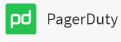
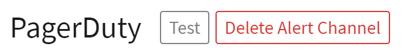

---

copyright:
  years:  2021
lastupdated: "2021-03-24"

keywords: LogDNA, IBM, Log Analysis, Sysdig

subcollection: Log-Analysis-with-LogDNA

---

{:shortdesc: .shortdesc}
{:screen: .screen}
{:pre: .pre}
{:table: .aria-labeledby="caption"}
{:codeblock: .codeblock}
{:tip: .tip}
{:download: .download}
{:important: .important}
{:note: .note}
{:external: target="_blank" .external}

# Integrating with Sysdig
{: #sysdig}

You can send alerts to Sysdig. For more information on LogDNA integration with PagerDuty, see the [LogDNA Integration Guide.](https://www.pagerduty.com/docs/guides/logdna-integration-guide/){: external}  
{:shortdesc}

## Configuring PagerDuty
{: #pagerduty-config}

When you [configure an alert](/docs/Log-Analysis-with-LogDNA?topic=Log-Analysis-with-LogDNA-alerts) in LogDNA you can have that alert sent to PagerDuty.

1. When configuring your alert, click .

2. Select if you want the alert to be sent when the condition exists (**Presence**) or does not exist (**Absence**).

3. Indicate the logging criteria when an alert should be sent.  For example, when 100 lines matching in the view are logged in an hour.  A graph will help you determine the number of log lines matching your specified criteria.

4. Select if the alert should be sent at the end of the selected period or immediately when the number of lines are logged.

5. Optionally you can specify a **Custom schedule** with alerting limited to a specified timezone, days of the week, or timeframe. To configure a **Custom schedule**:

  1. Select **on** for **Custom schedule**.
  2. Select the Timezone for the log entries. 
  3. Select the days of the week when alerts should be generated.
  4. Optionally specify a time range for the selected days. A graph will help you determine the number of log entries for the timezone and time range.

6. Specify the **Service**.  If required, you will be prompted to connect to PagerDuty.  If no services are listed, click **Add PagerDuty** to connect and add a service.  You will be directed to PagerDuty to authorize the integration.  After authorization, your alerts will display in the PagerDuty incidents dashboard.

7. Optional: You can click **Test** to test that your alert configuration is correct.

   

8. Click **Save Alert**.

   The alert definition must be saved for alerts to be sent to PagerDuty.
   {: important}

## Limitations
{: #pagerduty-limitations}

Due to [PagerDuty API limitations](https://developer.pagerduty.com/docs/events-api-v2/overview/){: external}, all requests are trimmed to a maximum of 400 KB.

