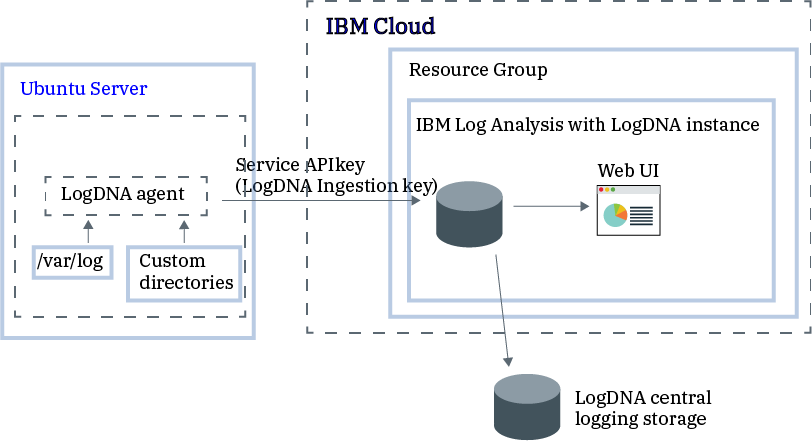

---

copyright:
  years:  2018, 2019
lastupdated: "2019-10-01"

keywords: LogDNA, IBM, Log Analysis, logging, getting started

subcollection: LogDNA

---

{:new_window: target="_blank"}
{:shortdesc: .shortdesc}
{:screen: .screen}
{:pre: .pre}
{:table: .aria-labeledby="caption"}
{:codeblock: .codeblock}
{:tip: .tip}
{:download: .download}
{:important: .important}
{:note: .note}

# Getting started tutorial
{: #getting-started}

Use {{site.data.keyword.la_full}} to add log management capabilities to your {{site.data.keyword.cloud_notm}} architecture. {{site.data.keyword.la_full_notm}} is operated by LogDNA in partnership with {{site.data.keyword.IBM_notm}}.
{:shortdesc}

You can use {{site.data.keyword.la_full_notm}} to manage system and application logs in the {{site.data.keyword.cloud_notm}}.

{{site.data.keyword.la_full_notm}} offers administrators, DevOps teams, and developers advanced features to filter, search, and tail log data, define alerts, and design custom views to monitor application and system logs.

## Features
{: #getting-started_features}

**Troubleshoot logs in real time to diagnose issues and identify problems.**

By using the *live streaming tail* feature, developers and DevOps teams can diagnose issues, analyze stack traces and exceptions, identify the source of errors, and monitor different log sources through a single view.  This feature is available through the command line and through the web interface. 

**Issue alerts to be notified of important actions.**
 
To act promptly on application and services events that you identify as critical or warning, DevOps teams can configure alert notification integrations to the following systems: email, Slack, webHook, and PagerDuty.

**Export logs to a local file for analysis or to an archive service to meet auditing requirements.**

Export specific log lines to a local copy or archive logs from {{site.data.keyword.la_full_notm}} to IBM Cloud Object Storage.
Log lines are exported in JSON line format. Logs are archived in JSON format and preserve the metadata that is associated with each line. 

**Control logging infrastructure costs by customizing what logs to manage through {{site.data.keyword.la_full_notm}}.**

Control the cost of your logging infrastructure in the IBM Cloud by configuring the log sources for which you want to collect and manage logs. 

## Overview
{: #getting-started_ov}

To add logging features with LogDNA in the {{site.data.keyword.cloud_notm}}, you must provision an instance of {{site.data.keyword.la_full_notm}}.

Before you provision an instance of {{site.data.keyword.la_full_notm}}, consider the following information:
* Log data is hosted on the {{site.data.keyword.cloud_notm}}.
* Log data is sent to a third party.
* Your users must have platform permissions to create, view, and delete an instance of a service in the {{site.data.keyword.cloud_notm}}.
* Your users must have platform permissions to create resources within the context of the resource group where you plan to provision the LogDNA instance.

You provision an {{site.data.keyword.la_full_notm}} instance within the context of a resource group. You organize your services for access control and billing purposes by using resource groups. You can provision the instance in the *default* resource group or in a custom resource group.

After you provision an instance of {{site.data.keyword.la_full_notm}}, an account is created in LogDNA, and you receive the ingestion key for your account.

Then, you must configure your log sources:

* You can enable per region a LogDNA instance to host logs from enabled {{site.data.keyword.cloud_notm}} services. For example, to collect logs from a Cloud Foundry app, you can enable the *service platform logs* flag. [Learn more](/docs/services/Log-Analysis-with-LogDNA?topic=LogDNA-config_svc_logs). As soon as this feature is enabled, logs are collected automatically.
* You can configure a LogDNA agent for a log source. A log source is a Cloud or on-prem resource that generates logs. For example, a log source can be a Kubernetes cluster. You use the ingestion key to configure the LogDNA agent that is responsible for collecting and forwarding logs to your {{site.data.keyword.la_full_notm}} instance. [Learn more](/docs/services/Log-Analysis-with-LogDNA?topic=LogDNA-config_agent_std_cluster). After the LogDNA agent is deployed in a log source, collection and forwarding of logs to the {{site.data.keyword.la_full_notm}} instance is automatic.

You can launch the {{site.data.keyword.la_full_notm}} Web UI to view, monitor, and manage your logs from the **Observability** &gt; **Logging** page.

The following figure shows the components overview for the {{site.data.keyword.la_full_notm}} service that is running on {{site.data.keyword.cloud_notm}}:

## Step 1. Before you begin
{: #getting-started_prereqs}

* Check the regions where the service is available. For more information, see [Regions](/docs/services/Log-Analysis-with-LogDNA?topic=LogDNA-regions).
* Get a user ID that is a member or an owner of an {{site.data.keyword.cloud_notm}} account. 

    To get an {{site.data.keyword.cloud_notm}} user ID, click [Registration ](https://cloud.ibm.com/login){:new_window}.

## Step 2. Get started
{: #getting-started_step2}

Choose a cloud resource for which you want to manage logs. Then, configure this log source so that you can monitor its logs through the {{site.data.keyword.la_full_notm}} service. The log source can be located in the same region where you provision an {{site.data.keyword.la_full_notm}} instance or in a different region.

The following table lists examples of cloud resources that you can configure to store and manage logs by using the {{site.data.keyword.la_full_notm}} service. Complete the tutorial for a resource to get started with the logging service:

<table>
  <caption>Tutorials to get started working with the {{site.data.keyword.la_full_notm}} service </caption>
  <tr>
    <th>Resource</th>
    <th>Tutorial</th>
    <th>Environment</th>
    <th>Scenario</th>
  </tr>
  <tr>
    <td>Containers running on the {{site.data.keyword.containershort}}</td>
    <td>[Managing Kubernetes cluster logs with {{site.data.keyword.la_full_notm}}](/docs/services/Log-Analysis-with-LogDNA?topic=LogDNA-kube#kube)</td>
    <td>{{site.data.keyword.cloud_notm}} Public </td>
    <td></td>
  </tr>
  <tr>
    <td>Linux Ubuntu, Linux Debian</td>
    <td>[Managing Linux Ubuntu logs with {{site.data.keyword.la_full_notm}}](/docs/services/Log-Analysis-with-LogDNA?topic=LogDNA-ubuntu#ubuntu)</td>
    <td>On premisses</td>
    <td></td>
  </tr>
</table>

## Step 3. Upgrade the plan
{: #getting-started_step3}

Enable more logging features.

Upgrade the {{site.data.keyword.la_full_notm}} service plan to a paid plan to be able to [filter logs](/docs/services/Log-Analysis-with-LogDNA?topic=LogDNA-view_logs#view_logs_step5), [search logs](/docs/services/Log-Analysis-with-LogDNA?topic=LogDNA-view_logs#view_logs_step6), [define views](/docs/services/Log-Analysis-with-LogDNA?topic=LogDNA-view_logs#view_logs_step7), and [configure alerts](https://docs.logdna.com/docs/alerts). For more information about {{site.data.keyword.la_full_notm}} service plans, see [Pricing plans](/docs/services/Log-Analysis-with-LogDNA?topic=LogDNA-about#overview_pricing_plans).

## Step 4. Next steps 
{: #getting-started_iam}

Next, manage user access with IAM.

Identify the IAM policies that a user needs to work with the {{site.data.keyword.la_full_notm}} service.

To learn more about IAM integration with the {{site.data.keyword.la_full_notm}} service, see [Managing user access with IAM](/docs/services/Log-Analysis-with-LogDNA?topic=LogDNA-iam#iam).

For example, choose one user role to learn how to grant permissions to that user to work with the {{site.data.keyword.la_full_notm}} service. 

| User role in the {{site.data.keyword.cloud_notm}} | For more information                     |
|-----------------------------------------------------|------------------------------------------|
| Account owner                                       | [Granting permissions to a user to become an administrator of the service in the {{site.data.keyword.cloud_notm}} account](/docs/services/Log-Analysis-with-LogDNA?topic=LogDNA-work_iam#admin_account) |
| Platform service administrator in the account       | [Granting permissions to a user to become an administrator of the service in the {{site.data.keyword.cloud_notm}} account](/docs/services/Log-Analysis-with-LogDNA?topic=LogDNA-work_iam#admin_account) |
| Platform service administrator in a resource group  | [Granting permissions to a user to become an administrator of the service within a resource group](/docs/services/Log-Analysis-with-LogDNA?topic=LogDNA-work_iam#admin_rg) |
| Platform DevOps operator in the account           | [Granting permissions to a DevOps user to manage the service in the {{site.data.keyword.cloud_notm}} account](/docs/services/Log-Analysis-with-LogDNA?topic=LogDNA-work_iam#devops_account) |
| Platform DevOps operator in a resource group        | [Granting permissions to a DevOps user to manage the service within a resource group](/docs/services/Log-Analysis-with-LogDNA?topic=LogDNA-work_iam#devops_rg) |
| Service administrator in LogDNA                     | [Granting permissions to manage logs and configure alerts in LogDNA](/docs/services/Log-Analysis-with-LogDNA?topic=LogDNA-work_iam#admin_user_logdna)              |
| User / Developer                                    | [Granting permissions to a user to view and manage logs in LogDNA](/docs/services/Log-Analysis-with-LogDNA?topic=LogDNA-work_iam#user_logdna)               |
{: caption="Table 2. Cloud roles in the {{site.data.keyword.cloud_notm}}" caption-side="top"}

