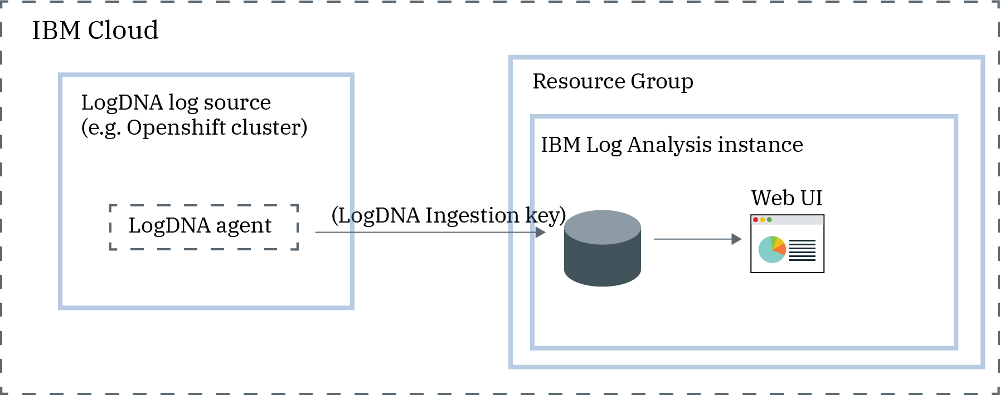

---

copyright:
  years: 2018
lastupdated: "2018-10-15"

---

{:new_window: target="_blank"}
{:shortdesc: .shortdesc}
{:screen: .screen}
{:pre: .pre}
{:table: .aria-labeledby="caption"}
{:codeblock: .codeblock}
{:tip: .tip}
{:download: .download}

# Getting started with IBM Log Analysis with LogDNA
{: #getting-started}

Use IBM Log Analysis with LogDNA to add log management capabilities to your {{site.data.keyword.Bluemix}} architecture. IBM Log Analysis with LogDNA is operated by LogDNA in partnership with {{site.data.keyword.IBM_notm}}.
{:shortdesc}

## Before you begin
{: #prereqs}

Read about IBM Log Analysis with LogDNA. For more information, see [About LogDNA](/docs/services/Log-Analysis-with-LogDNA/overview.html#about).

Check the regions where the service is available. For more information, see [Regions](/docs/services/Log-Analysis-with-LogDNA/overview.html#regions).

The Cloud resource for which you want to manage logs and the IBM Log Analysis with LogDNA instance that you must use to manage those logs must run in the same account and in the same region.

You must have a user ID that is a member or an owner of an {{site.data.keyword.Bluemix_notm}} account. To get an {{site.data.keyword.Bluemix_notm}} user ID, go to: [Registration ](https://console.bluemix.net/registration/){:new_window}.

Install the {{site.data.keyword.Bluemix_notm}} CLI. For more information, see [Installing the {{site.data.keyword.Bluemix_notm}} CLI](/docs/cli/index.html#overview).

## Step1: Identify the IAM policies that a user needs to work with IBM Log Analysis with LogDNA
{: #step1}

As the **account owner** or as an **IBM Log Analysis with LogDNA service administrator**, you must have permissions to run the following actions: 

* Grant other account members access to work with the service
* Provision a service instance
* Delete a service instance
* View details of a service instance
* Create a service ID

Therefore, you need to have an IAM policy for the IBM Log Analysis with LogDNA service with the platform role **Administrator**.

As a **Devops user**, you must have permissions to run the following actions: 

* Provision a service instance
* Delete a service instance
* View details of a service instance
* Create a service ID

Therefore, you need to have an IAM policy for the IBM Log Analysis with LogDNA service with the platform role **Editor**.

For **developers** and **auditors**, you must have permissions to run the following actions: 

* View logs
* Search logs
* Filter logs

Therefore, you need to have an IAM policy for the IBM Log Analysis with LogDNA service with the service role **Writer**, or **Manager**.

## Step2: Choose a cloud resource for which you want to manage logs
{: #step2}

The following table lists cloud resources that you can configure to store and manage logs by using the IBM Log Analysis with LogDNA service. Complete the tutorial for a resource to get started working with the {{site.data.keyword.loganalysisshort}} service:

<table>
  <caption>Tutorials to get started working with the IBM Log Analysis with LogDNA service </caption>
  <tr>
    <th>Resource</th>
    <th>Tutorial</th>
    <th>Cloud environment</th>
    <th>Scenario</th>
  </tr>
  <tr>
    <td>Containers running on the {{site.data.keyword.containershort}}</td>
    <td>[Managing Kubernetes cluster logs with IBM Log Analysis with LogDNA]()</td>
    <td>Public </td>
    <td></td>
  </tr>
  <tr>
    <td>Linux Ubuntu Debian</td>
    <td>[Managing Linux Ubuntu logs with IBM Log Analysis with LogDNA]()</td>
    <td>Public</td>
    <td></td>
  </tr>
</table>

## Next steps
{: #next_steps}

Upgrade the IBM Log Analysis with LogDNA service plan to a paid plan to be able to [filter logs](https://docs.logdna.com/docs/filters), [search logs](https://docs.logdna.com/docs/search), [define views](https://docs.logdna.com/docs/views), and [configure alerts](https://docs.logdna.com/docs/alerts).

For more information about IBM Log Analysis with LogDNA service plans, see [Pricing plans](/docs/services/Log-Analysis-with-LogDNA/overview.html#pricing_plans).
