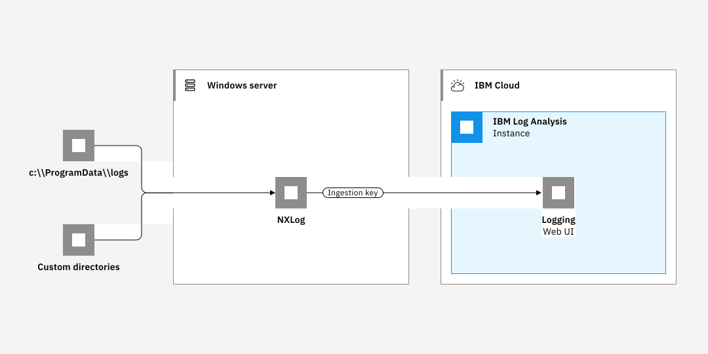

---

copyright:
  years:  2018, 2024
lastupdated: "2024-05-24"

keywords:

subcollection: log-analysis

---

{{site.data.keyword.attribute-definition-list}}

# Logging with infrastructure overview
{: #infra_logging}

In {{site.data.keyword.la_short}}, you can send infrastructure logs to an {{site.data.keyword.la_full_notm}} instance from a broad range of sources:
{: shortdesc}

{{../_include-segments/deprecation_notice.md}}

## Logging with Kubernetes clusters
{: #infra_logging_cluster}

You can configure a logging agent to collect logs from a Kubernetes cluster and forward them to an instance of the {{site.data.keyword.la_full_notm}} service.

You can collect and monitor logs from a Kubernetes cluster that is located in the same {{site.data.keyword.cloud_notm}} region as your {{site.data.keyword.la_full_notm}} instance or in a different one. You can also collect and monitor logs from clusters that are located outside the {{site.data.keyword.cloud_notm}}.

To configure cluster-level logging for a Kubernetes cluster, you must complete the following steps:

1. Provision an instance of the {{site.data.keyword.la_full_notm}} service. With this step, you configure a centralized log management system where log data is hosted on {{site.data.keyword.cloud_notm}}.
2. Provision a cluster, for example, a standard cluster on the {{site.data.keyword.containerlong_notm}}.
3. Deploy and configure the logging agent in the cluster.

{: caption="Log Analysis component overview on the {{site.data.keyword.cloud_notm}} for Kubernetes" caption-side="bottom"}

For more information, see [Logging with Kubernetes clusters](/docs/log-analysis?topic=log-analysis-kube).

## Logging with Bare metal
{: #infra_logging_bm}

You can use the {{site.data.keyword.la_full}} service to monitor and manage logs from a bare metal in a centralized logging system on the {{site.data.keyword.cloud_notm}}. You can collect and monitor system and application logs.

By default, the logging agent on Linux servers monitors log files in the `/var/log` directory. For example, the Ubuntu system log (`/var/log/syslog`) is monitored by default.

On the {{site.data.keyword.cloud_notm}}, you can configure an bare metal to forward logs to an {{site.data.keyword.la_full_notm}} instance by completing the following steps:

1. Provision a bare metal running Ubuntu Linux.
2. Provision an instance of the {{site.data.keyword.la_full_notm}} service.
3. Configure the logging agent in the bare metal.
4. Optionally, add additional directories to be monitored by the agent.

{: caption="Log Analysis component overview on the {{site.data.keyword.cloud_notm}} for bare metal" caption-side="bottom"}

For more information, see [Logging with Bare metals](/docs/log-analysis?topic=log-analysis-ubuntu_baremetal).

## Logging with Linux VPC instances
{: #infra_logging_vpc}

You can use the {{site.data.keyword.la_full}} service to monitor and manage logs from a Linux VPC server instance in a centralized logging system on the {{site.data.keyword.cloud_notm}}. You can collect and monitor system and application logs.

By default, the logging agent for Linux VPC instances monitors log files in the `/var/log` directory. For example, the Ubuntu system log (`/var/log/syslog`) is monitored by default.

On the {{site.data.keyword.cloud_notm}}, you can configure a Linux VPC server to forward logs to an {{site.data.keyword.la_full_notm}} instance by completing the following steps:

1. Provision a VPC running Ubuntu Linux for example.
2. Provision an instance of the {{site.data.keyword.la_full_notm}} service.
3. Configure the logging agent in the Ubuntu server.
4. Optionally, add additional directories to be monitored by the agent.

{: caption="Log Analysis component overview on the {{site.data.keyword.cloud_notm}} for Ubuntu Linux" caption-side="bottom"}

For more information, see [Logging with Linux VPC server instances](/docs/log-analysis?topic=log-analysis-ubuntu).

## Logging with Syslog
{: #infra_logging_syslog}

You can send logs to an {{site.data.keyword.la_full_notm}} instance via Syslog. TCP and TCP+TLS are both supported.

To configure syslog, you must enable a port to send logs via syslog to your logging instance. If you are using (a) the classic syslog protocol, (b) a custom port in syslog-ng, or (c) a custom port in rsyslog, there is no authentication available and anyone with knowledge of the endpoint can submit logs to your instance.  Depending on your environment, this may present a significant security risk. Use these configurations at your organization’s own risk.  Validate with your compliance and security teams whether this security risk is acceptable to your organization.
{: important}

To use a custom port to send logs via UDP and to disable a custom port, you can open an IBM support ticket. For information about opening an IBM support ticket, or about support levels and ticket severities, see [Getting support](/docs/get-support).

For more information on using Syslog, see [Logging with Syslog](/docs/log-analysis?topic=log-analysis-syslog).

## Logging with Windows systems
{: #infra_logging_windows}

You can use the {{site.data.keyword.la_full}} service to monitor and manage logs from Windows systems.

NXLog is used to provide log files to {{site.data.keyword.la_full}}.

To configure NXLog, you must enable a port to send logs via syslog to your logging instance. If you are using (a) the classic syslog protocol, (b) a custom port in `syslog-ng`, or (c) a custom port in `rsyslog`, there is no authentication available and anyone with knowledge of the endpoint can submit logs to your instance. As a result, depending on your environment, your use of the classic syslog protocol or custom port configurations with `syslog-ng` or `rsyslog` may present a significant security risk.  Use these configurations at your organization's own risk.  Validate with your compliance and security teams whether this security risk is acceptable to your organization.
{: important}

By default, NXLog monitors log files in the `C:\\ProgramData\\logs` directory.

On the {{site.data.keyword.cloud_notm}}, configure an Windows server to forward logs to an {{site.data.keyword.la_full_notm}} instance by completing the following steps:

1. Provision an instance of the {{site.data.keyword.la_full_notm}} service.
2. Configure NXLog on the Windows server.
3. Optionally, add additional directories to be monitored by the agent.

{: caption="Log Analysis component overview on the {{site.data.keyword.cloud_notm}} for Windows" caption-side="bottom"}

For more information on logging from Windows systems, see the following:

* [Logging from a Windows client](/docs/log-analysis?topic=log-analysis-windows)
* [Logging from Windows Server systems](/docs/log-analysis?topic=log-analysis-windows_serv)
* [Logging with Windows VPC server instances](/docs/log-analysis?topic=log-analysis-windows_vpc_tutorial)

## Logging for VMware vCenter Server deployments
{: #infra_logging_vmware}

You can add logging capabilities to VMware vCenter Server deployments by configuring a centralized syslog server that collects logs from your vSphere environment and sends them to {{site.data.keyword.la_full_notm}} by using rsyslog for analysis, troubleshooting, and alerting.

[VMware templates](/docs/log-analysis?topic=log-analysis-templates-vmware) are available to gain insight on your VMware environments.
{: tip}

VMware vCenter Server® is a hosted private cloud that delivers the VMware vSphere® stack as a service. The VMware® environment is built in addition to a minimum of three {{site.data.keyword.cloud}} bare metal servers and it offers shared network-attached storage and dedicated software-defined storage options. It also includes the automatic deployment and configuration of an easy-to-manage logical edge firewall, which VMware NSX® powers. For more information, see [vCenter Server overview](/docs/vmwaresolutions?topic=vmwaresolutions-vc_vcenterserveroverview).

The following graphic depicts the high-level architecture and components of a three node vCenter Server with NSX-T deployment.

{: caption="Figure 1. Architecture of a vCenter Server NSX-T deployment" caption-side="bottom"}

For more information on logging from VMware vCenter Server deployments, see [Logging for VMware vCenter Server deployments](/docs/log-analysis?topic=log-analysis-vmware-vcenter).

