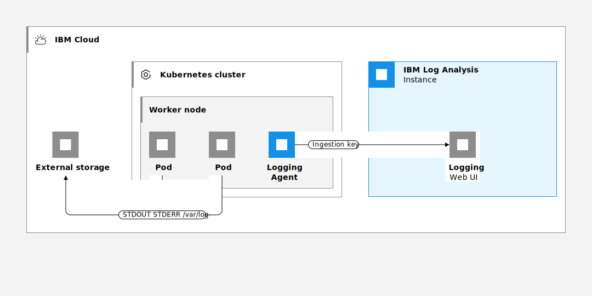

---

copyright:
  years:  2018, 2024
lastupdated: "2024-05-24"

keywords:

subcollection: log-analysis

---

{{site.data.keyword.attribute-definition-list}}

# Logging for Kubernetes clusters
{: #kube}

You can configure a Kubernetes cluster to forward logs to the {{site.data.keyword.la_full_notm}} service.
{: shortdesc}

{{../_include-segments/deprecation_notice.md}}

From the moment you provision a cluster with {{site.data.keyword.containerlong_notm}}, you want to know what is happening inside the cluster. You need to access logs to troubleshoot problems and pre-empt issues. At any time, you want to have access to different types of logs such as worker logs, pod logs, app logs, or network logs. In addition, you want to monitor different sources of log data in your Kubernetes cluster. Therefore, your ability to manage and access log records from any of these sources is critical. Your success managing and monitoring logs depends on how you configure the logging capabilities for your Kubernetes platform.

By default, the logs of a pod have the same lifetime as the pod. When the pod dies, the logs of the pod are not available. Therefore, if you need to troubleshoot a problem, you might find out that the logs are not available. Configuring cluster-level logging in your Kubernetes cluster helps address this problem by separating the life cycle of nodes and pods from the one of logs. You can configure a logging agent as a DaemonSet in your cluster. Each node runs a pod of the logging agent.

To configure cluster-level logging for a Kubernetes cluster, consider the following information:

* You must be able to store log data, system logs, and containerized application logs on separate storage from Kubernetes system components.
* You must deploy a logging agent to every worker node in your cluster. This agent collects and forwards logs to an external logging back-end.
* You must be able to centralize log data for analysis on an external logging back-end.

On the {{site.data.keyword.cloud_notm}}, to configure cluster-level logging for a Kubernetes cluster, you must complete the following steps:

1. Provision an instance of the {{site.data.keyword.la_full_notm}} service. With this step, you configure a centralized log management system where log data is hosted on {{site.data.keyword.cloud_notm}}.
2. Provision a cluster on the {{site.data.keyword.containerlong_notm}}. Kubernetes v1.9+ clusters are supported.
3. Configure the logging agent on every worker (node) in a cluster.

{: caption="Figure 1. Logging component overview on the {{site.data.keyword.cloud_notm}}" caption-side="bottom"}

By default, logs are generated and written locally for all the following {{site.data.keyword.containerlong_notm}} cluster components: worker nodes, containers, applications, persistent storage, Ingress application load balancer, Kubernetes API, and the kube-system namespace.

{{site.data.keyword.la_full}}
: Manage pod container logs by deploying an instance of {{site.data.keyword.la_full_notm}} and configuring this instance for your cluster in {{site.data.keyword.containershort_notm}}. A logging agent collects logs with the extension `*.log` and extensionless files that are stored in the `/var/log` directory of your pod from all namespaces, including `kube-system`. The agent then forwards the logs to your {{site.data.keyword.la_full_notm}} service instance. For more information about the service, see the [{{site.data.keyword.la_full_notm}}](/docs/log-analysis?topic=log-analysis-getting-started) documentation. To enable {{site.data.keyword.la_full_notm}} in your cluster, see [Forwarding cluster and app logs to {{site.data.keyword.la_full_notm}}](#logging).

{{site.data.keyword.at_full}}
: To monitor user-initiated administrative activity made in your cluster, {{site.data.keyword.containershort_notm}} automatically generates cluster management events and forwards these event logs to {{site.data.keyword.at_full_notm}}. To access these logs, [provision an instance of {{site.data.keyword.at_full_notm}}](/docs/activity-tracker?topic=activity-tracker-getting-started). For more information about the types of {{site.data.keyword.containerlong_notm}} events that you can track, see [Activity Tracker events](/docs/containers?topic=containers-at_events).

there are many layers to logging in Kubernetes
- Kubernetes container logging

    Container logs are logs generated by your containerized applications. The easiest way to capture container logs is to use stdout and stderr.

    Let’s say you have a Pod named app, where you are logging something to stdout.

- Kubernetes node logging

    Everything that a containerized application writes to stdout or stderr is streamed somewhere by the container engine – in Docker’s case, for example, to a logging driver. These logs are usually located in the /var/log/containers directory on your host.

If a container restarts, kubelet keeps logs on the node. To prevent logs from filling up all the available space on the node, Kubernetes has a log rotation policy set in place. Therefore, when a pod is evicted from the node, all corresponding containers are also evicted, along with their logs.

Depending on your operating system and services, there are various node-level logs you can collect, such as kernel logs or systemd logs.

On nodes with systemd both the kubelet and container runtime write to journald. If systemd is not present, they write to .log files in the /var/log directory.

You can access systemd logs with the journalctl command.

- Kubernetes cluster logging

Kubernetes cluster logs refer to Kubernetes itself and all of its system component logs, and we can differentiate between components that run in a container and components that do not run in a container. Each has its own role, giving you insight into the health of your Kubernetes system. For example, kube-scheduler, kube-apiserver, etcd, and kube-proxy run inside a container, while kubelet and the container runtime run on the operating system level, usually, as a systemd service.

By default, system components outside a container write files to journald, while components running in containers write to /var/log directory. However, there is the option to configure the container engine to stream logs to a preferred location.

Kubernetes doesn’t provide a native solution for logging at cluster level. However, there are other approaches available to you:

    Use a node-level logging agent that runs on every node

- Kubernetes events

Besides system component logs, you can also log Kubernetes events and audit logs.

Kubernetes events hold information about resources state changes or errors such as why pods are evicted or what decisions were made by the scheduler, as well as other informational messages that provide insight into what’s happening inside your cluster.

Events are API objects that are stored in the apiserver on master.

- Kubernetes audit logs

Kubernetes audit logs are detailed descriptions of each call made to the kube-apiserver. They provide a chronological sequence of activities that lead to the state of the system at a specific moment. They are extremely useful for security and compliance purposes, telling you exactly who did what, when, and how.

You need to enable audit logs only on the master nodes. First of all you need to create a policy to specify what will be recorded.

You can collect different types of cluster logs:

- System component logs: These logs are very useful for debugging. They record events that occur in cluster.

    There are two types of system components: those that run in a container and those that do not run in a container. For example:

    The Kubernetes scheduler and kube-proxy run in a container.
    The kubelet and container runtime do not run in containers.

    On machines with systemd, the kubelet and container runtime write to journald. Otherwise, they write to .log files in the /var/log directory. System components inside containers always write to .log files in the /var/log directory,

- System component traces record the latency of and relationships between operations in the cluster.

    The kube-apiserver generates spans for incoming HTTP requests, and for outgoing requests to webhooks, etcd, and re-entrant requests. It propagates the W3C Trace Context with outgoing requests

    There are two types of system components: those that typically run in a container, and those components directly involved in running containers. For example:

    The kubelet and container runtime do not run in containers. The kubelet runs your containers (grouped together in pods)
    The Kubernetes scheduler, controller manager, and API server run within pods (usually static Pods). The etcd component runs in the control plane, and most commonly also as a static pod. If your cluster uses kube-proxy, you typically run this as a DaemonSet

    On Linux nodes that use systemd, the kubelet and container runtime write to journald by default. You use journalctl to read the systemd journal; for example: journalctl -u kubelet.

    If systemd is not present, the kubelet and container runtime write to .log files in the /var/log directory. If you want to have logs written elsewhere, you can indirectly run the kubelet via a helper tool, kube-log-runner, and use that tool to redirect kubelet logs to a directory that you choose.

- Pod and container logs

    A container runtime handles and redirects any output generated to a containerized application's stdout and stderr streams. Different container runtimes implement this in different ways; however, the integration with the kubelet is standardized as the CRI logging format.

    For Kubernetes cluster components that run in pods, these write to files inside the /var/log directory, bypassing the default logging mechanism

    Forwarding cluster and app logs to IBM Log Analysis
    You can have only one logging configuration for IBM Log Analysis in your cluster at a time. [Forwarding cluster and app logs to IBM Log Analysis](/docs/containers?topic=containers-health#logging).

- etcd logs

    etcd is a consistent and highly-available key value store used as Kubernetes' backing store for all cluster data.

 containers write to their own stdout and stderr streams, you can take advantage of the kubelet and the logging agent that already run on each node.

Kubernetes API server?
Kubernetes Logging: 101 Guide to Logs, Best Practices & More ...
/var/log/containers directory
These logs are usually located in the /var/log/containers directory on your host. If a container restarts, kubelet keeps logs on the node. To prevent logs from filling up all the available space on the node, Kubernetes has a log rotation policy set in place.

- Control plane logs

    Control plane logging is accomplished through activity events, Kube audit logs, cluster component logs, and platform logs.

    If you have an Activity Tracker instance in the region where your container services are running, you will automatically receive activity event related data. For more information about the events, see [Activity Tracker events](https://cloud.ibm.com/docs/containers?topic=containers-at_events).

    If you have a Log Analysis instance in the region where your container services are running, you will automatically receive platform logs. For more information on how to enable platform logs, see [Configureing platform logs](https://cloud.ibm.com/docs/log-analysis?topic=log-analysis-config_svc_logs).

    Clients can also deploy Istio, with just one click, as a managed add-on so that IBM Cloud automatically keeps all the Istio components up-to-date, and collect data about the lifecycle management of Istio control plane components. (https://cloud.ibm.com/docs/containers?topic=containers-istio&interface=ui) Clients can also configure the cluster to send Kube Audit logs to the Log Analysis of choice and the logging agent to collect logs with the extension *.log and extensionless files that are stored in the /var/log directory of your pod from all namespaces, including kube-system. (https://cloud.ibm.com/docs/log-analysis?topic=log-analysis-kube )

- Data plane logs

-----------

Logging level categories

etcd uses the zap library for logging application output categorized into levels. A log message’s level is determined according to these conventions:

    Error: Data has been lost, a request has failed for a bad reason, or a required resource has been lost
        Examples:
            A failure to allocate disk space for WAL

    Warning: (Hopefully) Temporary conditions that may cause errors, but may work fine. A replica disappearing (that may reconnect) is a warning.
        Examples:
            Failure to send raft message to a remote peer
            Failure to receive heartbeat message within the configured election timeout

    Notice: Normal, but important (uncommon) log information.
        Examples:
            Add a new node into the cluster
            Add a new user into auth subsystem

    Info: Normal, working log information, everything is fine, but helpful notices for auditing or common operations.
        Examples:
            Startup configuration
            Start to do snapshot

    Debug: Everything is still fine, but even common operations may be logged, and less helpful but more quantity of notices.
        Examples:
            Send a normal message to a remote peer
            Write a log entry to disk

----------

formatting of structured log messages is as text, with a format that is backward compatible with traditional klog:

<klog header> "<message>" <key1>="<value1>" <key2>="<value2>" ..

A container runtime handles and redirects any output generated to a containerized application's stdout and stderr streams. Different container runtimes implement this in different ways; however, the integration with the kubelet is standardized as the CRI logging format.

To configure a cluster to forward logs, you must install a monitoring agent onto each worker node in your Kubernetes cluster by using a [DaemonSet](https://kubernetes.io/docs/concepts/workloads/controllers/daemonset/){: external}. The monitoring agent uses an access key (token) to authenticate with the {{site.data.keyword.mon_full_notm}} instance. The monitoring agent acts as a data collector. It automatically collects metrics

Logging for cluster data planes includes data that is collected as IBM Cloud platform logs where no additional cluster configuration is required to collect these data, and data that is collected by deploying a logging agent on the cluster. The agent is deployed as a daemon set with one pod per node of the cluster. The logging agent reads log files from the pod where it is installed, and forwards the data to the Log Analysis service. (https://cloud.ibm.com/docs/log-analysis?topic=log-analysis-kube).

Through the IKS provisioning process, users can configure Log Analysis as an add-on. Users can select an existing Log Analysis instance to direct log, or can create a new instance during IKS provisioning. Users can also use Helm charts, Terraform or run a script to deploy the agent on a cluster.

Log analysis collects logs that are generated by a cluster. Activity Tracker captures application, services, and users interaction with the cluster, in addition to interactions across all your IBM Cloud resources to gain a consistent time stamped view of all your operations. You can analyze data across different contexts through the UI, generate trails of action within each context, and gain insight of what is happening. Through Activity Tracker, you can also correlate lifecycle changes such as rotation or deletion of a Key Protect CRK key that is used to encrypt data in the cluster. Details on container related events are found here: https://cloud.ibm.com/docs/activity-tracker?topic=activity-tracker-cloud_services#container

You can collect and monitor logs from a Kubernetes cluster that is located in the same {{site.data.keyword.cloud_notm}} region as your {{site.data.keyword.la_full_notm}} instance or in a different one. You can also collect and monitor logs from clusters that are located outside the {{site.data.keyword.cloud_notm}}.
{: note}

-------------

To configure cluster-level logging for a Kubernetes cluster, you must complete the following steps:

1. Provision an instance of the {{site.data.keyword.la_full_notm}} service. With this step, you configure a centralized log management system where log data is hosted on {{site.data.keyword.cloud_notm}}.
2. Provision a cluster, for example, a standard cluster on the {{site.data.keyword.containerlong_notm}}.
3. Deploy and configure the logging agent in the cluster.

## Sources that you can configure logging for

You can collect logs from any of the following Kube cluster sources:

1. `worker`: Information that is specific to the infrastructure configuration that you have for your worker node. Worker logs are captured in syslog and contain operating system events. In `auth.log` you can find information on the authentication requests that are made to the OS.

    Paths
    - `/var/log/syslog`
    - `/var/log/auth.log`

2. `container`: Information that is logged by a running container.**Paths**: Anything that is written to `STDOUT` or `STDERR`.

3. `application`: Information about events that occur at the application level. This could be a notification that an event took place such as a successful login, a warning about storage, or other operations that can be performed at the app level.**Paths**: You can set the paths that your logs are forwarded to. However, in order for logs to be sent, you must use an absolute path in your logging configuration or the logs can't be read. If your path is mounted to your worker node, it might have created a symbolic link. Example: If the specified path is `/usr/local/spark/work/app-0546/0/stderr` but the logs actually go to `/usr/local/spark-1.0-hadoop-1.2/work/app-0546/0/stderr`, then the logs can't be read.

4. `storage`: Information about persistent storage that is set up in your cluster. Storage logs can help you set up problem determination dashboards and alerts as part of your DevOps pipeline and production releases. **Note**: The paths `/var/log/kubelet.log` and `/var/log/syslog` also contain storage logs, but logs from these paths are collected by the `kubernetes` and `worker` log sources.

    Paths
    :   `/var/log/ibmc-s3fs.log`
    :   `/var/log/ibmc-block.log`

    Pods**
    :   `portworx-***`
    :   `ibmcloud-block-storage-attacher-***`
    :   `ibmcloud-block-storage-driver-***`
    :   `ibmcloud-block-storage-plugin-***`
    :   `ibmcloud-object-storage-plugin-***`

5. `kubernetes`: Information from the kubelet, the kube-proxy, and other Kubernetes events that happen in the kube-system namespace of the worker node.

    Paths
    :   `/var/log/kubelet.log`
    :   `/var/log/kube-proxy.log`
    :   `/var/log/event-exporter/1..log`

6. `ingress`: Information about the network traffic that comes into a cluster through the Ingress ALB.

    Paths
    :   `/var/log/alb/ids/*.log`
    :   `/var/log/alb/ids/*.err`
    :   `/var/log/alb/customerlogs/*.log`
    :   `/var/log/alb/customerlogs/*.err`

7. `kube-audit`: Information about cluster-related actions that is sent to the Kubernetes API server, including the time, the user, and the affected resource. The `kube-audit` source can be configured with a webhook. For more information, see [Forwarding Kubernetes API audit logs to an external server](/docs/containers?topic=containers-health-audit#audit-api-server-external).

## Before you begin
{: #kube_prereqs}

Complete the following tasks:

1. [Read about {{site.data.keyword.la_full_notm}}](/docs/log-analysis?topic=log-analysis-getting-started).

2. [Check the {{site.data.keyword.la_full_notm}} regions that are supported](/docs/log-analysis?topic=log-analysis-regions).

3. [Install the {{site.data.keyword.cloud_notm}} CLI](/docs/cli?topic=cli-install-ibmcloud-cli).

4. Use an {{site.data.keyword.IBM_notm}} ID that is a member or an owner of an {{site.data.keyword.cloud_notm}} account.

    To get an {{site.data.keyword.cloud_notm}} user ID, go to: [Registration](https://cloud.ibm.com/login){: external}.

5. Provision an {{site.data.keyword.la_full_notm}} instance. Choose any of the following methods:

    [Provisioning an instance through the Observability dashboard](/docs/log-analysis?topic=log-analysis-provision#provision_ui)

    [Provisioning an instance through the CLI](/docs/log-analysis?topic=log-analysis-provision#provision_cli)

6. Get the ingestion key for the {{site.data.keyword.la_full_notm}} instance where you want to monitor your cluster logs. Choose any of the following methods:

    [Get the ingestion key through the IBM Cloud UI](/docs/log-analysis?topic=log-analysis-ingestion_key#ibm_cloud_ui).

    [Get the ingestion key through the CLI](/docs/log-analysis?topic=log-analysis-ingestion_key#ingestion_key_cli).

7. Check that you have permissions and access to the cluster.

    For more information about the {{site.data.keyword.containerlong}} IAM roles, see [User access permissions](/docs/containers?topic=containers-access_reference#access_reference).

Your IBMid must have assigned IAM policies for each of the following resources in the region that your {{site.data.keyword.la_full_notm}} instance is in:

| Resource                             | Scope of the access policy | Role    | Information                  |
|--------------------------------------|----------------------------|---------|------------------------------|
| Resource group **default**           |  Resource group            | Viewer  | This policy is required to allow the user to see service instances in the Default resource group.|
| {{site.data.keyword.la_full_notm}} service |  Resource group            | Editor  | This policy is required to allow the user to provision and administer the {{site.data.keyword.la_full_notm}} service in the default resource group.   |
| Kubernetes cluster instance          |  Resource                 | Editor  | This policy is required to configure the secret and the logging agent in the Kubernetes cluster. |
{: caption="Table 1. List of IAM policies required to complete the tutorial" caption-side="top"}

## Step 1. Configure your Kubernetes cluster to send logs to your Log Analysis instance
{: #kube_step1}

To configure your Kubernetes cluster to send logs to your {{site.data.keyword.la_full_notm}} instance, you must install the logging agent in the cluster.

* The logging agent automatically collects STDOUT and STDERR logs.
* By default, the logging agent monitors all files with extension *.log*, and extensionless files under */var/log/*.

Choose one of the following options to deploy and configure the logging agent in your cluster, and connect the agent with your {{site.data.keyword.la_full_notm}} instance:

* [Connect a standard Kubernetes cluster to an {{site.data.keyword.la_full_notm}} instance by using a logging agent](/docs/log-analysis?topic=log-analysis-config_agent_kube_cluster).

* [Connect an OpenShift Kubernetes cluster to an {{site.data.keyword.la_full_notm}} instance by using a logging agent](/docs/log-analysis?topic=log-analysis-config_agent_os_cluster).

## [Optional] Step 2. Configure a cluster to forward API audit logs
{: #kube_step2}

If you want to analyze the cluster's API audit logs through the {{site.data.keyword.la_full_notm}} instance, you must configure your cluster.

## Step 3. Launch the Log Analysis dashboard to view and analyze logs
{: #kube_step3}

To analyze logs and generate alerts, you might need to upgrade your service plan. [Learn more about service plans](/docs/log-analysis?topic=log-analysis-service_plans).
{: important}

Complete the following steps:

1. [Navigate to the web UI](/docs/log-analysis?topic=log-analysis-launch).

2. Analyze your logs:

    - [Filter logs](/docs/log-analysis?topic=log-analysis-view_logs#view_logs_step5)

    - [Search logs](/docs/log-analysis?topic=log-analysis-view_logs#view_logs_step6)

    - [Define views](/docs/log-analysis?topic=log-analysis-view_logs#view_logs_step7)

    - [Configure alerts](https://docs.logdna.com/docs/alerts).
