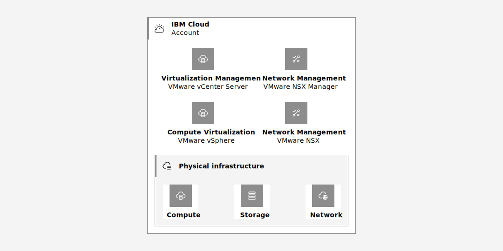

---

copyright:
  years:  2018, 2023
lastupdated: "2023-07-26"

keywords:

subcollection: log-analysis

---

{{site.data.keyword.attribute-definition-list}}

# Logging for VMware vCenter Server deployments
{: #vmware-vcenter}

You can add logging capabilities to VMware vCenter Server deployments by configuring a centralized syslog server that collects logs from your vSphere environment and sends them to {{site.data.keyword.la_full_notm}} by using rsyslog for analysis, troubleshooting, and alerting.
{: shortdesc}

[VMware templates](/docs/log-analysis?topic=log-analysis-templates-vmware) are available to gain insight on your VMware environments.
{: tip}

VMware vCenter Server® is a hosted private cloud that delivers the VMware vSphere® stack as a service. The VMware® environment is built in addition to a minimum of three {{site.data.keyword.cloud}} bare metal servers and it offers shared network-attached storage and dedicated software-defined storage options. It also includes the automatic deployment and configuration of an easy-to-manage logical edge firewall, which VMware NSX® powers. For more information, see [vCenter Server overview](/docs/vmwaresolutions?topic=vmwaresolutions-vc_vcenterserveroverview).

The following graphic depicts the high-level architecture and components of a three node vCenter Server with NSX-T deployment.

{: caption="Figure 1. Architecture of a vCenter Server NSX-T deployment" caption-side="bottom"}


## Sending logs to {{site.data.keyword.la_short}}
{: #vmware-send-to-LA}

For VMware vCenter Server deployments, you can configure the events and alarms subsystem in vCenter, for both vSphere and NSX nodes, to collect information about what is happening in the environment. The data that is collected is stored in log files and the vCenter database.

You can also configure your VMware deployment to send vSphere and NSX logs to a remote centralized syslog server by configuring syslog for each component and host. From this centralized server, you can send the data to {{site.data.keyword.la_full_notm}} where you can analyze it, troubleshoot issues, and be alerted of suspicious activity and anomalous behaviour.

{: caption="Figure 2. Sending logs" caption-side="bottom"}


- Compute data plane logs are available through vSphere Server.
- Network management logs are available through NSX Manager.

Your VMware vCenter Server deployment might include a high number of hosts between vSphere and NSX nodes. When you design your logging solution architecture, you might need to define more than 1 centralized syslog server to collect logs across multiple vCenter hosts. Consider configuring less than 30 hosts to the same centralized syslog server for performance.

However, to get a complete picture of what is happening in your VMware deployment, you should centralized all your logs to an external service such as {{site.data.keyword.la_full_notm}} where you can troubleshoot problems across all components and be alerted of potential issues that need looking into. {{site.data.keyword.la_short}} offers administrators, DevOps teams, and developers advanced features to filter, search, and tail log data, define alerts, and design custom views to monitor application and system logs. For more information, see [{{site.data.keyword.la_short}} getting started](/docs/log-analysis?topic=log-analysis-getting-started).


## Types of logs
{: #vmware-log-types}

A VMware deployment generates multiple types of logs.
- Events
- vCenter logs
- ESXi logs
- NSX logs
- Guest Introspection (GI) logs

### Events
{: #vmware-events}

Events are audit records that report user actions or system actions on objects in the vCenter Server or on a host.

- You can send events that are generated by the vCenter Server Appliance. For example, an event can report when a virtual machine is powered off.
- The maximum length of syslog messages is 1024 characters. Events with a size greater than 1024 characters are split into multiple syslog messages.

An event log record includes information about who made the request, when the event occurred, and what type of event is.

The format of an event is the following.

```text
<syslog-prefix> : Event [eventId] [partInfo] [createdTime] [eventType] [severity] [user] [target] [chainId] [desc]
```
{: codeblock}

Where

- `syslog-prefix`: Displays the syslog prefix that is defined by the remote syslog server.
- `eventId`: Displays the unique ID of the event.
- `partInfo`: Displays whether the message is split into parts. The format is `[1-X]`. For example, `[1-1]` indicates 1 message only.
- `createdTime`: Displays the time when the event is generated.
- `eventType`: Displays the event type.
- `severity`: Displays whether the event is informational, a warning message, or an error.
- `user`: Displays the name of the initiator of the request.
- `target`: Displays the object the event refers to.
- `chainId`: Displays information about the parent ID or the group ID.
- `desc`: Displays the description of the event.


Events that are split into multiple syslog messages have the following format:

```text
<syslog-prefix> : Event [eventId] [1-X] [payload-part-1]
<syslog-prefix> : Event [eventId] [2-X] [payload-part-2]
...
<syslog-prefix> : Event [eventId] [X-X] [payload-part-X]
```
{: codeblock}

Where `X` represents the total number of the event message parts.


For example:

```screen
<14>1 2023-02-07T20:20:15.600724+00:00 vcsobserv-vc vpxd 6757 - - Event [125101] [1-1] [2023-02-07T20:20:15.599975Z] [vim.event.EventEx] [info] [com.vmware.vim.eam] [] [125101] [Successful login by com.vmware.nsx.management.nsxt into vSphere ESX Agent Manager]
<14>1 2023-02-07T20:36:45.158077+00:00 vcsobserv-vc vpxd 6757 - - Event [125120] [1-1] [2023-02-07T20:36:45.157198Z] [vim.event.UserLoginSessionEvent] [info] [VSPHERE.LOCAL\vpxd-extension-xxxxx] [] [125120] [User VSPHERE.LOCAL\vpxd-extension-xxxxxe@xx.xxx.xxx.xxx logged in as VMware vim-java 1.0]
```
{: screen}


### VMware vSphere Logs
{: #vmware-vsphere}

You can collect logs that are generated by different components in the vSphere vCenter deployment.


The following table lists common log files that are generated by vCenter Server deployments.

| Component                     | Description |
|-------------------------------|-------------|
| `applmgmt`                    | Logs that report the health of executable operations for the Appliance REST APIs.
| `applmgmt-audit`          	| Logs that report on authentication requests to the VMware Appliance Management Service. |
| `cloudvm` 	                | Logs that report allotment and distribution of resources between services. |
| `rhttpproxy` 	                | Logs that report on the VMware HTTP Reverse Proxy service. |
| `sca` 	                    | Logs that report on the VMware Service Control Agent service. |
| `vapi` 	                    | Logs that report on the VMware vAPI Endpoint service. |
| `vmafdd` 	                    | Logs that report on the VMware Authentication Framework LDAP service. |
| `vmdird` 	                    | Logs that report on the VMware Directory Service LDAP service. |
| `vmon` 	                    | Logs that report on the VMware Service Lifecycle Manager service. |
{: caption="Table 1. Common log files" caption-side="bottom"}


The following table lists logs that are available if a management node deployment is selected.

| Component                     | Description |
|-------------------------------|-------------|
| `rbd`                         | Logs that report on the VMware vSphere Auto Deploy. |
| `content-library`             | Logs that report on the VMware Content Library Service. |
| `eam`                         | Logs that report on the VMware ESX Agent Manager. |
| `netdumper`                   | Logs that report on the VMware vSphere ESXi Dump Collector. |
| `perfcharts`                  | Logs that report on the VMware Performance Charts Service. |
| `vmcam`                       | Logs that report on the VMware vSphere Authentication Proxy. |
| `vmdird`                      | Logs that report on the VMware Directory Service LDAP. |
| `vmware-sps`                  | Logs that report on the VMware vSphere Profile-Driven Storage Service. |
| `vpxd`                        | Logs that report on the VMware vCenter Server. |
| `vpostgres`                   | Logs that report on the VMware Postgres service. |
| `vcha`                        | Logs that report on the VMware vCenter High Availability service. |
{: caption="Table 2. Log files when mangement node deployment is selected" caption-side="bottom"}


### VMware ESXi logs
{: #vmware-esxi}

You can collect data plane logs that are generated by the ESXi hosts and its components.

To see the list of components per ESXi host, list the `*.conf` files in the `/etc/vmsyslog.conf.d` directory.
{: tip}

The following table lists common logs that are generated by ESXi hosts:

| Component                     | Description |
|-------------------------------|-------------|
| `vpxa`            | Logs that are generated by the agent that communicates with vCenter Server from the ESXi hosts. |
| `hostd`           | Logs that are generated by the agent that manages the ESXi host and its virtual machines. Reports actions such as VM power on, power off. |
| `vmkernel`        | Logs that report activity that is related to virtual machines and ESXi. |
| `vmkwarning`      | Duplicate wmkernel logs with severity warning or higher.|
| `vmksummary`      | Logs that provide information on availability and uptime statistics. |
{: caption="Table 3. ESXi host logs" caption-side="bottom"}


### VMware NSX logs
{: #vmware-nsx}

You can collect management plane logs that are generated by the NSX nodes and its components to gain insight into network traffic and who is logging to a resource.

The following table lists common logs that are generated by NSX nodes services:

| Component                     | Description |
|-------------------------------|-------------|
| `nsx-controller`              | Logs that are generated by the NSX controller cluster. |
| `nsx-opsagent`                | Logs that are generated by the OpsAgent service. |
| `nsx-proxy`                   | Logs that are generated by the NSX Edge servers. |
| `nsx-sfhc`                    | Logs that are generated by the NSX-T Data Center Kernel Modules on ESXi Hypervisors.|
| `nsx-sha`                     | Logs that are generated by the System Health Agent (SHA). |
{: caption="Table 4. NSX logs" caption-side="bottom"}


### Guest Introspection logs
{: #vmware-guest-intro}

When you enable the identity at source firewall functionality of the identity firewall in your VMware deployment, you must enable the Guest Introspection service. This service reports information about the login of users, the directory groups the users are a member of, and sends the IPs of the users to the Service Virtual Machine (SVM). The SVM updates the NSX Manager that uses this information to apply the firewall policies.

The following table lists common logs that are generated by the Guest Introspection service:

| Component                     | Description |
|-------------------------------|-------------|
| `Guest VM Thin Agent` | Logs that report VM file and OS events such as logon details. |
| `Service Virtual Machine (SVM)` | Logs that are generated by the SVM. |
| `ESX Guest VM Module (MUX)` | Logs that are generated by the MUX component. This component passes information from the Thin Agent to the SVM. |
{: caption="Table 5. Guest introspection service logs" caption-side="bottom"}


## Step 1. Configure the centralized syslog server to send logs to an external system
{: #vmware-step1}


You must configure rsyslog to receive logs from the vCenter hosts and components and to send them to a {{site.data.keyword.la_short}} instance.

### Prereqs
{: #vmware-prereq}

- You must have access to a server that has rsyslog installed. For example, you can use a Linux server such as a Red Hat VSI.

- Check that rsyslog traffic on port 514, or a custom port configured for rsyslog, is allowed.

### Configure the centralized syslog server to receive logs from the vCenter hosts and components
{: #vmware-syslog-receive}

Modify the `/etc/rsyslog.conf` file to collect logs from your vCenter hosts and components by using the default port `514`.

Add the following lines:

```text
# Provides TCP syslog reception
module(load="imtcp")
input(type="imtcp" port="514")
```
{: codeblock}

You can also choose a custom port. Make sure the port is enabled to allow traffic through the firewall.
{: note}

Then, restart syslog. Run `systemctl restart rsyslog`.

### Configure a syslog server to send logs to an external system
{: #vmware-syslog-send}

To configure rsyslog to send logs to {{site.data.keyword.la_short}}, you must modify the `/etc/rsyslog.conf` file with the following entries. Add them at the end of the file.

```text
### START LogDNA rsyslog logging directives ###

$template LogDNAFormat,"<%PRI%>%protocol-version% %timestamp:::date-rfc3339% %HOSTNAME% %app-name% %procid% %msgid% [logdna@48950 key=\"<INGESTION_KEY>\" tags=\"<TAGS>\"] %msg%"

# Send messages to LogDNA over TCP using the template.
*.* @@syslog-a.<REGION>.logging.cloud.ibm.com:514;LogDNAFormat

### END LogDNA rsyslog logging directives ###
```
{: codeblock}

Where

- `<INGESTION_KEY>` is an ingestion key of the {{site.data.keyword.la_short}} instance where you plan to send the logs for analysis and troubleshooting.
- `<TAGS>` is a comma separated list of tags that you want to attach to each log entry to enhance searchability. For example, you can add the following set of tags `vmware,rsyslog`.
- `<REGION>` is the region where the {{site.data.keyword.la_short}} instance is provisioned.

Then, restart syslog. Run `systemctl restart rsyslog`.


## Step 2. Configure vCenter Server to send logs to a remote rsyslog server
{: #vmware-step2}
{: step}

By default, sending logs to a remote rsyslog server is not enabled for the vCenter Server.

### Enable vCenter Server to send logs
{: #vmware-enable-sending}

Complete the following steps to enable sending logs to a remote rsyslog server from the vCenter Server:

1. Launch the vSphere Client.
2. Select the vCenter Server instance. Then, select **Configure** > **Settings** > **Advanced System Settings**.

    {: caption="Figure 3. Edit Advanced vCenter Server Sttings" caption-side="bottom"}

3. Click **EDIT SETTINGS** and search for entries that have the prefix `vpxd.event`.

4. Enable the setting `vpxd.event.syslog.enabled`.

5. Click **SAVE**.


### Filter the logs that vCenter Server sends
{: #vmware-filter}

In vCenter, you can change the logging policy for ESXi hosts to reduce the number of logs collected per component. All the logs that are processed by the ESXi host `vmsyslogd` service are impacted.

You can create log filters:
- To reduce the number of repetitive entries in the ESXi logs by stopping logging after a maximum number of log entries is reached.
- To remove specific log events.

Reducing logs helps reduce logging costs. However, you should keep all the logs that you need for operations, troubleshooting and compliance.
{: note}


Complete the following steps to configure filtering in an ESXi host:

1. Launch the vSphere Client.
2. Select the ESXi host that you want to modify. Then, select **Configure** > **System** > **Advanced System Settings**.
3. Click **Edit** and search for entries that have the prefix `Syslog.global.logFilters`.
4. Enable `Syslog.global.logFiltersEnable` to apply log filters.
5. Enter your filtering conditions in `Syslog.global.logFilters`.

    You can specify 1 or more conditions. You separate conditions by using a double vertical bar `||`.

    Use the format `numLogs | ident | logRegexp`.

    `numLogs` defines the number of log entries that are logged and match the expression in logRegexp. Once the number is reached, log lines are dropped. When you set this value to `0`, all the log lines that match the expression defined in logRegexp are dropped.

    `indent` defines the system components where the filter is applied. You can define filters for components listed in the `/etc/vmsyslog.conf.d` directory of your ESXi host.

    `logRegexp` defines the log expression that is applied to filter logs. It is a case-sensitive phrase with Python regular expression syntax.

    For example, see the following condition on log entries in the `vnkernel` component: `2 | vmkernel | bad CDB .* scsi_op=0x9e || 0 | vmkernel | 0x1a.* H:0x0 D:0x2 P:0x0 Valid sense data: 0x5 0x2[04] 0x0`

5. Restart the ESXi host to reload the syslog daemon and activate the log filters.


## Step 3. Verify logs in Log Analysis
{: #vmware-verify}

Complete the following steps:

1. [Launch the UI](/docs/log-analysis?topic=log-analysis-launch).
2. In the search bar, run queries to verify the data.

For example, you can run any of the following queries:

- vCenter Application management logs excluding audit events: `host:<VCENTER-HOSTNAME> app:applmgmt -app:applmgmt-audit`
- Logs from NSX nodes and components: `app:nsx`
- ESXi hostd logs: `app:Hostd`
- ESXi vmkernel logs: `app:vmkernel`

You can check if you have connectivity problems connecting to connect to Vcenter Server via vSphere client. When vSphere vCenter Server is inaccessible through vSphere client, you can search for the following error `"503 Service Unavailable" app:wcpsvc`.

You can look at user's log in logs by running the following query: `app:vpxd Event  -app:vpxd-main -app:vpxd-profiler "logged in"`.


## Appendix 1. Check current logging configuration in your vCenter deployment
{: #vmware-check}


You can configure the amount of detail that vCenter Server collects in log files.


### Check the Log Level in your vCenter deployment
{: #vmware-check-log-level-vcenter}

Complete the following steps to find the log level that is configured for the vCenter deployment across all hosts and components:

1. Launch the vSphere Client.
2. Select the vCenter Server instance. Then, select **Configure**.
3. In the *General* section, check the value **Logging options** and note the log level set.

    By default, it is set to `Log level: info`.


### Check the Log Level on vSphere ESXi hosts
{: #vmware-check-log-level-esxi}

The default log level setting for the ESXi Host Agent is info. If you run into issues during development, you can set the log level to verbose, or to trivia to obtain SOAP message content to use in debugging.

Complete the following steps to find the log level that is configured for an ESXi host, and the components running in that host that generate logs:

1. Launch the vSphere Client.
2. Select the ESXi host that you want to check. Then, select **Configure** > **System** > **Advanced System Settings**.
3. Search for entries that have the prefix `Config.HostAgent.level`.

    You can check by component, for example, looking at `config.HostAgent.level[Vimsvc].logLevel` that defines the level of logging for Virtual infrastructure management services in that host. You cxan also check the log level of the host that is applied across all components by checking `Config.HostAgent.log.level`. This value is set by default ot `info`.


### Check the Log Level on NSX ESXi hosts
{: #vmware-check-log-level-NSX}


Complete the following steps to check whether logging is enabled in an NSX ESXi host and the log level:

1. Launch the vSphere Client.
2. Select the vCenter or NSX host host that you want to modify. Then, select **Actions** > **Edit Settings**.
3. Click **VM Options**.
4. In the *Advanced* section, check the option in *Settings* for **Enable logging** is selected. Then, check the value configured for **Debugging and statistics** that defines the level of logging enabled in the host. Valid values are `Run normally`, `Record debugging information`, and `Record Statistics`.
5. Click **OK**.


## Appendix 2. Set the vCenter log level for each component
{: #vmware-set}


You can control the type of information and the amount of detail that is logged by the vCenter Server. By default, the information level is configured. For example, you might want to increase the log level for the Management agent (hostd) logs, the VirtualCenter Agent Service (vpxa) logs, and the VirtualCenter (vpxd) logs to troubleshoot a problem.

Sometimes, when you are debugging an issue, you might also need to change the log level of an individual host or component within a host to see what is happening in that host or in a specific component. You can change individual components for troubleshooting purposes. You can also change the host log level across components. However, restore the vCenter value that you change as soon as you resolve your problem to avoid extra logging costs and to keep consistency across your vCenter deployment.

Notice that when you enable trivia or verbose logging for a long period of time, you might cause performance degradation on the vCenter Server. Avoid enabling trivia and verbose logging in  production environments.


### Set the Log Level for your vCenter deployment
{: #vmware-set-level-set-vcenter}

Complete the following steps to change the log level that is configured for the vCenter deployment across all hosts and components:

1. Launch the vSphere Client.
2. Select the vCenter Server instance. Then, select **Configure**.
3. In the *General* section, select **Edit**.
4. Change the value for **Logging options**.

    By default, it is set to `Log level: info`.

    Valid values are `info`, `warning`, `error`, `trivia`, `verbose`, and `none`.

    | Value | When to use |
    |-------|-------------|
    | `none` | Use it to turn off logging in your vCenter deployment. |
    | `error` | Use it to log only error logs. |
    | `warning` | Use it to log only warning and error logs. |
    | `info` | Use it to log info, warning, and error logs. |
    | `verbose` | Use it to log info, warning, error, and verbose logs. |
    | `trivia` | Use it to log info, warning, error, verbose, and trivia logs. |
    {: caption="Table 6. Logging option values" caption-side="bottom"}

The change takes effect immediately. You do not have to restart the vCenter Server.


### Set the Log Level on vSphere ESXi hosts
{: #vmware-set-level-set-esxi}


Complete the following steps to change the log level that is configured for an ESXi host, ESXi components in a host or both:

1. Launch the vSphere Client.
2. Select the ESXi host that you want to modify. Then, select **Configure** > **System** > **Advanced System Settings**.
3. Click **Edit** and search for entries that have the prefix `Config.HostAgent.level`.

    You can change one component, for example, `config.HostAgent.level[Vimsvc].logLevel` that defines the level of logging for Virtual infrastructure management services in that host.

    You can change the log level of the host that is applied across all components by checking `Config.HostAgent.log.level`. This value is set by default ot `info`.

4. For each component that you plan to modify, enter the value that you want. Then, click **OK**.

    For each component that you plan to modify, enter the value that you want. Valid values are `none`, `quiet`, `error`, `warning`, `info`, `verbose`, and `trivia`.

    For the host log level setting, , enter the value that you want. Valid values are `debug`, `error`, `warning`, and `info`.

5. Restart the ESXi host to reload the syslog daemon and enable the new log level.


When you set the log level to verbose or to trivia, you add SOAP message content to the log record that you can use when you are debugging a problem.
{: tip}


### Set the Log Level on NSX ESXi hosts
{: #vmware-set-level-set-NSX}

Complete the following steps to change the log level that is configured for NSX ESXi hosts:

1. Launch the vSphere Client.
2. Select the vCenter or NSX host host that you want to modify. Then, select **Actions** > **Edit Settings**.
3. Click **VM Options**.
4. In the *Advanced* section, check the option in *Settings* for **Enable logging** is selected. Then, select for **Debugging and statistics** the level of logging. Valid values are `Run normally`, `Record debugging information`, and `Record Statistics`.
5. Click **OK**.
