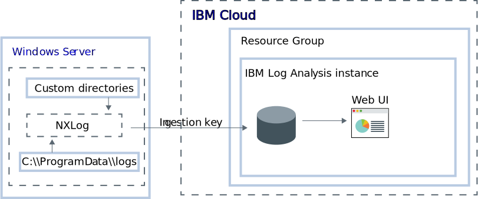

---

copyright:
  years:  2018, 2023
lastupdated: "2022-02-21"

keywords: IBM, Log Analysis, logging, windows, tutorial

subcollection: log-analysis

content-type: tutorial
account-plan: lite
completion-time: 1h

---

{{site.data.keyword.attribute-definition-list}}

# Logging with Windows VPC server instances
{: #windows_vpc_tutorial}
{: toc-content-type="tutorial"}
{: toc-completion-time="1h"}

Use the {{site.data.keyword.la_full}} service to monitor and manage logs from a Windows VPC server instance in a centralized logging system on the {{site.data.keyword.cloud_notm}}.
{: shortdesc}

You can collect and monitor system and application logs.

NXLog is used to provide log files to {{site.data.keyword.la_full}}.

To configure NXLog, you must enable a port to send logs via syslog to your logging instance. If you are using (a) the classic syslog protocol, (b) a custom port in `syslog-ng`, or (c) a custom port in `rsyslog`, there is no authentication available and anyone with knowledge of the endpoint can submit logs to your instance. As a result, depending on your environment, your use of the classic syslog protocol or custom port configurations with `syslog-ng` or `rsyslog` may present a significant security risk.  Use these configurations at your organization's own risk.  Validate with your compliance and security teams whether this security risk is acceptable to your organization.
{: important}

By default, NXLog monitors log files in the `C:\\ProgramData\\logs` directory.

On the {{site.data.keyword.cloud_notm}}, configure an Windows server to forward logs to an {{site.data.keyword.la_full_notm}} instance by completing the following steps:

1. Provision a VPC running Windows.
2. Provision an instance of the {{site.data.keyword.la_full_notm}} service.
3. Configure NXLog on the Windows server.
4. Optionally, add additional directories to be monitored by the agent.

In this tutorial, you will learn how to configure a Windows server to forward logs to an {{site.data.keyword.la_full_notm}} instance.

## Before you begin
{: #windowsvpc_prereqs}

Read about {{site.data.keyword.la_full_notm}}. For more information, see [About](/docs/log-analysis?topic=log-analysis-getting-started#getting-started-ov).

Work in a [supported region](/docs/log-analysis?topic=log-analysis-regions).

You can send data from an Windows instance that is located in the same region as your logging instance, in a different region, or not in the {{site.data.keyword.cloud_notm}}.
{: note}

Use a user ID that is a member, or an owner of, an {{site.data.keyword.cloud_notm}} account. To get an {{site.data.keyword.cloud_notm}} {{site.data.keyword.IBM_notm}}ID, go to: [Create an account](https://cloud.ibm.com/login){: external}.

Your {{site.data.keyword.IBM_notm}}ID must have assigned IAM policies for each of the following resources in the region that your {{site.data.keyword.la_full_notm}} instance is in:

Your {{site.data.keyword.IBM_notm}}ID must have assigned IAM policies for each of the following resources:

| Resource                             | Scope of the access policy | Role    | Region    | Information                  |
|--------------------------------------|----------------------------|---------|-----------|------------------------------|
| Resource group **default**           |  Resource group            | Viewer  | us-south  | This policy is required to allow the user to see service instances in the Default resource group.    |
| {{site.data.keyword.la_full_notm}} service |  Resource group            | Editor  | us-south  | This policy is required to allow the user to provision and administer the {{site.data.keyword.la_full_notm}} service in the default resource group.   |
{: caption="Table 1. List of IAM policies required to complete the tutorial" caption-side="top"}

The {{site.data.keyword.cloud_notm}} CLI must be installed. For more information, see [Installing the {{site.data.keyword.cloud_notm}} CLI](/docs/cli?topic=cli-install-ibmcloud-cli).

## Provision an Windows VPC server instance
{: #windowsvpc_prov}

If you have an existing Windows virtual server instance you want to monitor, you can skip this step.

1. If you don't have a virtual private cloud, [use the {{site.data.keyword.cloud_notm}} console to create VPC resources](/docs/vpc?topic=vpc-creating-a-vpc-using-the-ibm-cloud-console).

2. If you don't have a Windows virtual server instance, [create an Windows virtual server instance by using the UI and selecting **Windows Server** as the **Operating system**](/docs/vpc?topic=vpc-creating-virtual-servers).

## Provision an {{site.data.keyword.la_full_notm}} instance
{: #windowsvpc_provla}

To provision an instance of {{site.data.keyword.la_full_notm}} through the {{site.data.keyword.cloud_notm}} UI, complete the following steps:

1. Log in to your {{site.data.keyword.cloud_notm}} account.

   Click [Log in to {{site.data.keyword.cloud_notm}}](https://cloud.ibm.com/login){: external} to sign in to the {{site.data.keyword.cloud_notm}}.

   After you log in with your user ID and password, the {{site.data.keyword.cloud_notm}} console opens.

2. Click **Catalog**. The list of the services that are available in {{site.data.keyword.cloud_notm}} opens.

3. Select the **Logging and Monitoring** category.

4. Click the **{{site.data.keyword.la_full_notm}}** tile.

5. Select a region for the service instance.

6. Select the **Lite** service plan.

   By default, the **Lite** plan is set.

   For more information about other service plans, see [Pricing plans](/docs/log-analysis?topic=log-analysis-service_plans).

7. Specify a **Service name** for your {{site.data.keyword.la_full_notm}} service instance.

8. Select the **Default** resource group.

   By default, the **Default** resource group is set.

9. To provision the {{site.data.keyword.la_full_notm}} service in the {{site.data.keyword.cloud_notm}} selected resource group, click **Create**.

After you provision an instance, the {{site.data.keyword.la_full_notm}} dashboard opens.

To provision an instance of logging through the CLI, see [Provisioning logging through the {{site.data.keyword.cloud_notm}} CLI](/docs/log-analysis?topic=log-analysis-provision#provision_cli).
{: note}

## Access your Windows instance
{: #windowsvpc_access_vpc}

Use a remote desktop client to [access your Windows instance.](/docs/vpc?topic=vpc-vsi_is_connecting_windows)  To do so you will need to do the following:

1. Make sure the security group that is associated with the instance allows inbound and outbound Remote Desktop Protocol traffic (TCP port 3389).  This is required for the remote desktop client to connect to your Windows instance.

    1. Log in to your {{site.data.keyword.cloud_notm}} account.

       Click [Log in to {{site.data.keyword.cloud_notm}}](https://cloud.ibm.com/login){: external} to sign in to the {{site.data.keyword.cloud_notm}}.

       After you log in with your user ID and password, the {{site.data.keyword.cloud_notm}} console opens.

    2. Click the **Menu** icon  &gt; **VPC Infrastructure**.

    3. Click **Security groups**.

    4. Click the security group you used to create your Windows VPC.  The Security group details opens.

    5. Click **Rules**.

    6. Create an Inbound rule with the following values:

        * **Protocol** = TCP
        * **Port** = Any
        * **Port min** = 3389
        * **Port max** = 3389
        * **Source type** = Any

    7. Create an Outbound rule with the following values:

        * **Protocol** = TCP
        * **Port** = Any
        * **Port min** = 3389
        * **Port max** = 3389
        * **Source type** = Any

2. Obtain the connection information you need to connect to the Windows VPC.

    1. Click **Virtual server instances**.

    2. Click the name of your Windows VPC instance.  The instance details are displayed.

    3. Under **Encrypted password** click **Download RDP file**.  A file that can be used with Windows Remote Desktop will be downloaded.

       If you are using another client to connect to your Windows VPC, you can still use the information contained in the `RDP` file to get the connection information for the VPC.
       {: note}

3. Connect to your Windows VPC using a remote desktop client and the `RDP` file information. Sign in with the **User name** of `.\Administrator` and the decripted `ssh` key as the password.

{{site.data.content.nxlog_install}}

{{site.data.content.nxlog_config}}

{{site.data.content.nxlog_run}}

## Launch the logging Web UI
{: #windowsvpc_launch_ui}

To launch the {{site.data.keyword.la_full_notm}} dashboard from the {{site.data.keyword.cloud_notm}} UI, complete the following steps:

1. Log in to your {{site.data.keyword.cloud_notm}} account.

   Click [{{site.data.keyword.cloud_notm}} dashboard](https://cloud.ibm.com/login){: external} to launch the {{site.data.keyword.cloud_notm}} dashboard.

   After you log in with your user ID and password, the {{site.data.keyword.cloud_notm}} Dashboard opens.

2. In the navigation menu, select **Observability**.

3. Click **Logging**.

   The list of {{site.data.keyword.la_full_notm}} instances that are available on {{site.data.keyword.cloud_notm}} is displayed.

4. Select one instance. Then, click **Open dashboard**.

   The logging Web UI opens and displays your cluster logs.

## View your logs
{: #windowsvpc_view_logs}

From the logging Web UI, you can view your logs as they pass through the system. You view logs by using log tailing.

With the **Free** service plan, you can only tail your latest logs.
{: note}

Due to Windows limitations, when the Windows VPC instance is created, the hostname is truncated to the first 15 characters of the instance name.  The Windows hostname is included as the `Hostname` in the {{site.data.keyword.la_full_notm}} log lines.

For example, if you created a Windows VPC named `my-cloud-windows-vpc-instance` then the hostname created in Windows Server, and displayed in the logs, will be `my-cloud-window`.

You can filter the log lines displayed in {{site.data.keyword.la_full_notm}} by entering queries in the `Search...` box.

| Search for                             | Returns |
|-----------------------------------|-------------|
| `host:<WINDOWS_HOSTNAME> (EventType:INFO OR Severity:INFO)` | All log lines with event type or severity of `INFO` |
| `host:<WINDOWS_HOSTNAME> (EventType:warn OR Severity:WARNING)` | All log lines with an event type of `warn` or severity of `WARNING` |
| `host:<WINDOWS_HOSTNAME> Severity:ERROR` | All log lines with a severity of `ERROR` |
{: caption="Table 2. Example queries" caption-side="top"}

Where `<WINDOWS_HOSTNAME>` is the hostname of your Windows VPC server instance.

For more information, see [Viewing logs](/docs/log-analysis?topic=log-analysis-view_logs#view_logs).

## Next steps
{: #windows_next_steps}

The following additional features are available:

* [Filtering logs](/docs/log-analysis?topic=log-analysis-view_logs#view_logs_step5)
* [Searching logs](/docs/log-analysis?topic=log-analysis-view_logs#view_logs_step6)
* [Defining views](/docs/log-analysis?topic=log-analysis-view_logs#view_logs_step7)
* [Configuring alerts](/docs/log-analysis?topic=log-analysis-alerts).

To use any of these features, you must upgrade the {{site.data.keyword.la_full_notm}} plan to a paid plan.
{: note}
