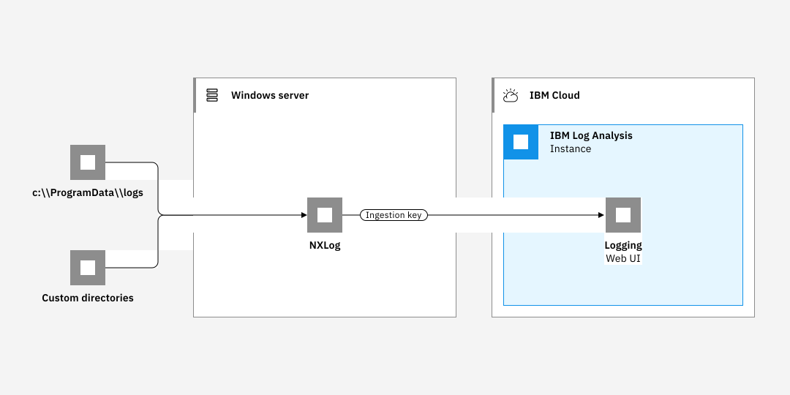

---

copyright:
  years:  2018, 2024
lastupdated: "2024-05-24"

keywords: IBM, Log Analysis, logging, windows, tutorial

subcollection: log-analysis

content-type: tutorial
account-plan: lite
completion-time: 1h

---

{{site.data.keyword.attribute-definition-list}}

# Logging from a Windows client
{: #windows}
{: toc-content-type="tutorial"}
{: toc-completion-time="1h"}

Use the {{site.data.keyword.la_full}} service to monitor and manage logs from Windows client systems.
{: shortdesc}

{{../_include-segments/deprecation_notice.md}}

You will use NXLog to add your Windows logs into {{site.data.keyword.la_full_notm}}.

To configure NXLog, you must enable a port to send logs via syslog to your logging instance. If you are using (a) the classic syslog protocol, (b) a custom port in `syslog-ng`, or (c) a custom port in `rsyslog`, there is no authentication available and anyone with knowledge of the endpoint can submit logs to your instance. As a result, depending on your environment, your use of the classic syslog protocol or custom port configurations with `syslog-ng` or `rsyslog` may present a significant security risk.  Use these configurations at your organization's own risk.  Validate with your compliance and security teams whether this security risk is acceptable to your organization.
{: important}

NXLog is used to provide log files to {{site.data.keyword.la_full}}.

By default, NXLog monitors log files in the `C:\\ProgramData\\logs` directory.

On the {{site.data.keyword.cloud_notm}}, configure your Windows client to forward logs to an {{site.data.keyword.la_full_notm}} instance by completing the following steps:

1. Provision an instance of the {{site.data.keyword.la_full_notm}} service.
2. Configure NXLog on the Windows system.
3. Optionally, add additional directories to be monitored by the agent.

{: caption="Figure 1. Component overview" caption-side="bottom"}

In this tutorial, you will learn how to configure a Windows client system to forward logs to an {{site.data.keyword.la_full_notm}} instance.

{{site.data.content.windows_prereqs}}

{{site.data.content.nxlog_install}}

{{site.data.content.nxlog_config}}

{{site.data.content.nxlog_run}}
