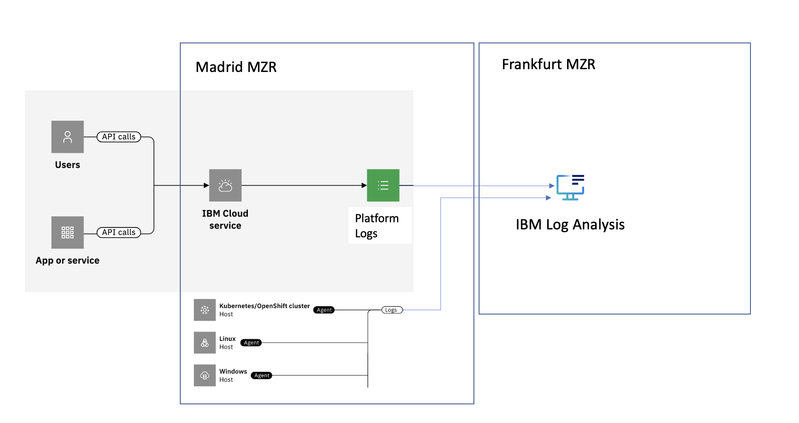

---

copyright:
  years: 2019, 2024
lastupdated: "2024-05-24"

keywords:

subcollection: log-analysis

---

{{site.data.keyword.attribute-definition-list}}

# Working with logs in a region where {{site.data.keyword.la_full_notm}} is not available
{: #manage-logs-for-new-region}

In {{site.data.keyword.cloud_notm}}, platform logs that are generated by {{site.data.keyword.cloud_notm}} services in a region, location, or datacenter where the {{site.data.keyword.la_full_notm}} service is not available are managed through a different region.
{: shortdesc}

{{_include-segments/deprecation_notice.md}}

You can monitor logs in your account for example, for DevOps or troubleshooting. Services that generate platform logs are configured to send them to a different region where the {{site.data.keyword.la_full_notm}} service is available. You can monitor what is happening in the {{site.data.keyword.cloud_notm}} for that service at all times.

{: caption="Figure 1. Platform logs flow that are generated by {{site.data.keyword.cloud_notm}} services in a region, location, or datacenter where the {{site.data.keyword.la_full_notm}} service is not available are managed through a different region" caption-side="bottom"}

## Understanding platform logs
{: #manage-logs-for-new-region-logs}

You can use {{site.data.keyword.la_full_notm}} to manage operating system logs, application logs, and platform logs in the {{site.data.keyword.cloud_notm}}. {{site.data.keyword.la_full_notm}} offers administrators, DevOps teams, and developers advanced features to view, filter, search, and tail log data, define alerts, and design custom views to monitor logs.

Platform logs are logs that are generated by {{site.data.keyword.cloud_notm}} services. These logs are available through the {{site.data.keyword.la_full_notm}} instance that is available in the same region where the service that generates them is available.
{: note}

Each service documents the logs that it sends to {{site.data.keyword.la_full_notm}}.  See [{{site.data.keyword.cloud_notm}} services that generate {{site.data.keyword.la_short}} logs](/docs/log-analysis?topic=log-analysis-cloud_services) for information on the services sending logs and the type of logs that are sent.

Logs are sent to {{site.data.keyword.la_full_notm}} in the region where the service is located. Logs can be routed from a {{site.data.keyword.la_full_notm}} instance to a different {{site.data.keyword.la_full_notm}} by configuring streaming between instances if you want to consolidate all your log information into a single {{site.data.keyword.la_full_notm}} instance. For compliance purposes you might have to maintain your data within a particular country or region.

## Managing platform logs
{: #manage-logs-for-new-region-manage-logs}

To monitor platform logs, you must provision an instance of the {{site.data.keyword.la_full_notm}} service in the region where logs are sent. For more information, see [Getting started](/docs/logs-tracker?topic=logs-tracker-getting-started).

## How can you identify data from the Madrid location?
{: #manage-logs-for-new-region-identify-logs}

Platform logs include the field `logSourceCRN` that specifies the region, location, or datacenter where the resource is available. For example, for Madrid, you can see the location of logs set to `eu-es`.

Logs sent by an agent might include the location if you set a tag to indicate the location.

## Services that operate in new regions
{: #manage-logs-for-new-region-locations-1}

Services that are available in the Madrid region send platform logs to the Frankfurt (EU-DE) region.
