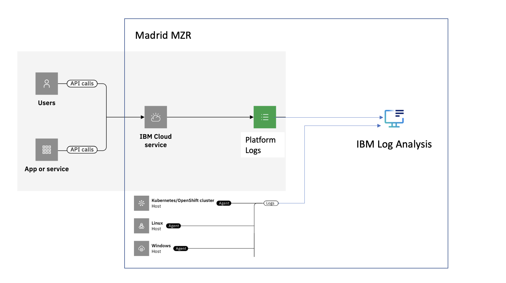

---

copyright:
  years: 2019, 2024
lastupdated: "2024-03-27"

keywords:

subcollection: log-analysis

---

{{site.data.keyword.attribute-definition-list}}

# Managing logs in a new location after {{site.data.keyword.la_short}} is available
{: #manage-logs-to-new-region}

To manage logs from {{site.data.keyword.cloud_notm}} services that generate logs in a new region where the {{site.data.keyword.la_full_notm}} service is not available until a later date, complete these instructions.
{: shortdesc}

<!-- common deprecation notice -->
{{_include-segments/deprecation_notice.md}}

For example, the Madrid region opened for business in June 2023. {{site.data.keyword.cloud_notm}} services that are available and generate logs send currently those logs to the Frankfurt region. You can manage logs from these services in Frankfurt. Platform logs include the field `logSourceCRN` that specifies the region, location, or data center where the resource is available. For example, for Madrid, you can see the location of logs set to `eu-es`.

You cannot control when an {{site.data.keyword.cloud_notm}} service makes the switch to send logs from one region to another one. However, you can provision an instance in the new region to prepare for that switch.

Data is not sent to both locations, complete the steps before that switch is done by a service to mitigate any loss of data.
{: important}

{: caption="Figure 1. Flow of logs in a single region" caption-side="bottom"}

Complete the following steps to enable the service in the new region:

## Step 1. Provision an instance of the service in the new region
{: #manage-logs-to-new-region-1}

As soon as the {{site.data.keyword.la_full_notm}} service is available in the new region, for example, Madrid, complete the following steps:

1. [Create a new {{site.data.keyword.la_full_notm}} hosted event search instance](/docs/log-analysis?topic=log-analysis-provision).

2. [Configure IAM access](/docs/log-analysis?topic=log-analysis-iam) for the new instance.

## Step 2. Configure the new instance
{: #manage-logs-to-new-region-2}

Complete the following steps:

1. Enable platform logs. For more information, see [Configuring IBM Cloud platform logs](/docs/log-analysis?topic=log-analysis-config_svc_logs).

2. Configure any desired streaming.

   * To another [{{site.data.keyword.la_full_notm}} instance.]/docs/log-analysis?topic=log-analysis-streaming-configure-l2l)

   * To an [{{site.data.keyword.messagehub_full}} instance.](/docs/log-analysis?topic=log-analysis-streaming-configure)

3. On the new instance, configure any desired [archiving.](/docs/log-analysis?topic=log-analysis-archiving-ov)

4. Customize the UI for the new instance as needed.

    If you have queries based on location, you must update them. For example, you might need to update the location to `eu-es` for a configuration in the Madrid location.

5. Create any [alerts](/docs/log-analysis?topic=log-analysis-alerts) required for your organization on the new instance.

## Step 3. [Optional] Configure logging agents
{: #manage-logs-to-new-region-3}

If you have logging agents configured to send data from Kubernetes clusters or Openshift clusters, for example, you can update the agents to point to the new instance in the new location (for example, Madrid).

For more information, see:
- [Configuring a Kubernetes agent](/docs/log-analysis?topic=log-analysis-config_agent_kube_cluster).
- [Configuring an Openshift cluster](/docs/log-analysis?topic=log-analysis-config_agent_os_cluster).
- [Configuring a Linux agent](/docs/log-analysis?topic=log-analysis-config_agent_linux).
- [Configuring a Windows agent](/docs/log-analysis?topic=log-analysis-config_agent_windows_v3).

## Step 4. Check the new instance is working
{: #manage-logs-to-new-region-4}

To monitor logs, you must provision an instance of the {{site.data.keyword.la_full_notm}} service in the region where logs are sent. For more information, see [Getting started](/docs/log-analysis?topic=log-analysis-getting-started).
