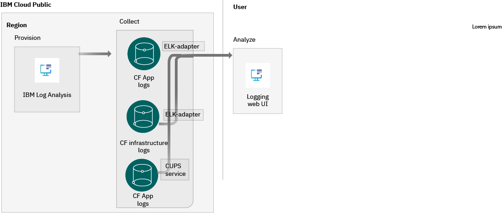
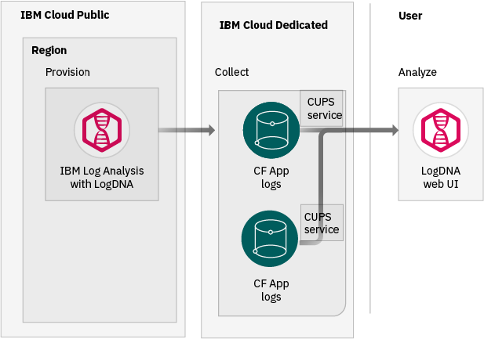
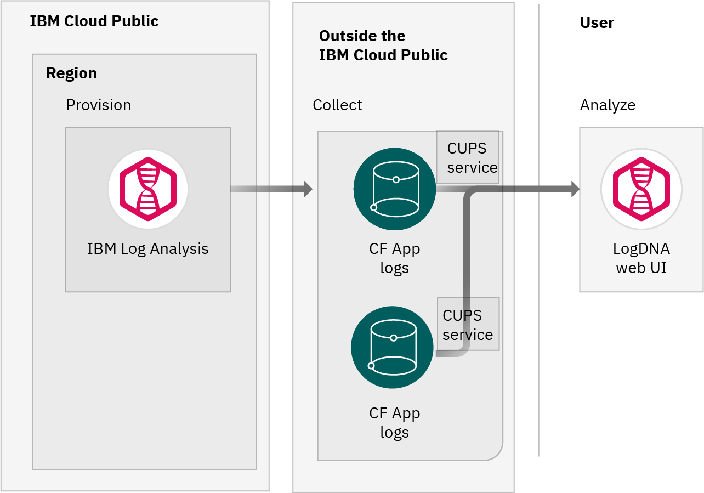

---

copyright:
  years:  2018, 2020
lastupdated: "2020-06-01"

keywords: LogDNA, IBM, Log Analysis, logging, cf

subcollection: Log-Analysis-with-LogDNA


---

{:new_window: target="_blank"}
{:shortdesc: .shortdesc}
{:screen: .screen}
{:pre: .pre}
{:table: .aria-labeledby="caption"}
{:codeblock: .codeblock}
{:tip: .tip}
{:download: .download}
{:important: .important}
{:note: .note}


# Collecting and analyzing logs from CF resources
{: #monitor_cfapp_logs}

In {{site.data.keyword.cloud}} public, you can monitor logs from Cloud Foundry (CF) resources that run in the {{site.data.keyword.cloud_notm}} or outside the {{site.data.keyword.cloud_notm}} by using the {{site.data.keyword.la_full_notm}} service. You can view, filter, search, and analyze these logs through the web UI for a number of days that is determined by the plan of your logging instance. You can also configure archiving, and have access to those logs through the archived files.
{:shortdesc}

If your CF resources run on {{site.data.keyword.cloud_notm}} public, you can choose to automatically collect these logs and monitor them through the {{site.data.keyword.la_full_notm}} instance that is provisioned in the same region, and that is enabled to host service platform logs. Alternatively, you can choose to configure a custom user provided (CUPS) service for your app, so system and application logs are collected and streamed to a custom logging instance. [Learn more](/docs/Log-Analysis-with-LogDNA?topic=Log-Analysis-with-LogDNA-monitor_cfapp_logs#monitor_cfapp_logs_public).

If your CF resources run on {{site.data.keyword.cloud_notm}} dedicated or outside the {{site.data.keyword.cloud_notm}}, you can configure a custom user provided (CUPS) service for your app, so system and application logs are collected and streamed to a custom logging instance.

|                          |
|--------------------------|
|  |
{: caption="Methods that can be adopted to monitor CF resource logs in {{site.data.keyword.cloud_notm}} public" caption-side="top"}
{: #end-api-img-2}
{: tab-title="Monitor CF resources in IBM Cloud Public"}
{: tab-group="cf-img"}
{: class="simple-tab-table"}

|                          |
|--------------------------|
|  |
{: caption="Methods that can be adopted to monitor CF resource logs in {{site.data.keyword.cloud_notm}} dedicated" caption-side="top"}
{: #end-api-img-1}
{: tab-title="Monitor CF resources in IBM Cloud Dedicated"}
{: tab-group="cf-img"}
{: class="simple-tab-table"}

|                          |
|--------------------------|
|  |
{: caption="Methods that can be adopted to monitor CF resource logs outside the {{site.data.keyword.cloud_notm}}" caption-side="top"}
{: #end-api-img-3}
{: tab-title="Monitor CF resources outside the IBM Cloud Public"}
{: tab-group="cf-img"}
{: class="simple-tab-table"}


The following table summarizes the different methods that you can use to collect and monitor CF logs when you use the {{site.data.keyword.la_full_notm}} service in {{site.data.keyword.cloud_notm}}:

| CF resource              | Through the service platform logs logging instance in a region | Through a custom logging instance by using Syslog drains       |
|--------------------------|:--------------------------------------------------:|:--------------------------------------------------:|
| `CF infrastructure logs` |   | `NO`                                               |
| `CF app logs`            |   |   |
{: caption="Table 1. Information about the methods that can be adopted to monitor CF resource logs in {{site.data.keyword.cloud_notm}} public" caption-side="top"}
{: #end-api-table-1}
{: tab-title="Monitor CF resources in IBM Cloud Public"}
{: tab-group="cf-app"}
{: class="simple-tab-table"}
{: row-headers}

| CF resource              | Through the service platform logs logging instance in a region | Through a custom logging instance by using Syslog drains       |
|--------------------------|:--------------------------------------------------:|:--------------------------------------------------:|
| `CF infrastructure logs` | `NO`                                               | `NO`                                               |
| `CF app logs`            | `NO`                                               |   |
{: caption="Table 2. Information about the methods that can be adopted to monitor CF resource logs in {{site.data.keyword.cloud_notm}} dedicated" caption-side="top"}
{: #end-api-table-2}
{: tab-title="Monitor CF resources in IBM Cloud Dedicated"}
{: tab-group="cf-app"}
{: class="simple-tab-table"}
{: row-headers}

| CF resource              | Through the service platform logs logging instance in a region | Through a custom logging instance by using Syslog drains       |                                     
|--------------------------|:--------------------------------------------------:|:--------------------------------------------------:|
| `CF infrastructure logs` | `NO`                                               | `NO`                                               |
| `CF app logs`            | `NO`                                               |   |
{: caption="Table 3. Information about the methods that can be adopted to monitor CF resource logs in {{site.data.keyword.cloud_notm}} on-premisses" caption-side="top"}
{: #end-api-table-1}
{: tab-title="Monitor CF resources outside {{site.data.keyword.cloud_notm}}"}
{: tab-group="cf-app"}
{: class="simple-tab-table"}
{: row-headers}


## Choosing a method to monitor CF resource logs
{: #monitor_cfapp_logs_public_options}

You have different options to collect and forward logs to an instance of the {{site.data.keyword.la_full_notm}} service:
* You can configure 1 instance of the {{site.data.keyword.la_full_notm}} service per region with the flag **service platform logs**. This instance collects infrastructure and application logs for any CF apps that run on that same region.
* You can configure a custom user provided service (CUPS) for each CF app that you want to monitor through a custom {{site.data.keyword.la_full_notm}} instance. The CUPS service sends logs via a syslog link to a LogDNA syslog endpoint and port. This option is only available if the CF app send logs to STDOUT and STDERR. If the CF app is configured to send logs via syslog and not to STDOUT and STDERR, this option is not supported.

| Comparison                                    | Through the logging instance that hosts service platform logs in a region | Through a custom logging instance by using Syslog drains       |
|:----------------------------------------------|:--------------------------------------------------------------:|:--------------------------------------------------:|
| `Automatic collection of infrastructure logs` |               | `NO`                                               |
| `Automatic collection of CF app logs`         |               |   |
| `CF app sends logs to STDOUT and STDERR`      |               |   |
| `CF app sends logs via syslog`                | `NO`                                                           | `NO`                                               |
| `Load balanced ingestion requests`            |               | `NO`                                               |
| `Single point of failure at ingestion`        | `NO`                                                           |   |
| `Higher throughput at ingestion`              |               | `NO`                                               |
{: caption="Table 4. Information about the methods that can be adopted to monitor CF resource logs in {{site.data.keyword.cloud_notm}}" caption-side="top"}

Another consideration is the restriction that you can apply to users to control access to view logs in a logging instance. You can use [IAM to manage users and their access to view logs](/docs/Log-Analysis-with-LogDNA?topic=Log-Analysis-with-LogDNA-iam). 
* When you use the method of a single logging instance to host platform service logs, all logs from CF resources that run on that region are available for view through the instance. Any user with a service role `viewer` can see any log entries. 
* When you use the method of sending CF app logs to a custom logging instance, users with a service role `viewer` can only see logs from CF app logs that are configured to stream logs to this logging instance.
In both cases, users can also view logs from other sources that you might have configured to forward logs to the instance.

## Monitor CF resources that are hosted in {{site.data.keyword.cloud_notm}} public
{: #monitor_cfapp_logs_public}

CF resources are location bound resources in the {{site.data.keyword.cloud_notm}}. For example, you can have a CF app running in the Dallas (us-south) region. 

In the {{site.data.keyword.cloud_notm}}, you can configure 1 logging instance to collect and host platform services logs in a region. After the instance is provisioned and configured in a region, logs that are generated from enabled services in that region such as CF apps or CF infrastructure are automatically collected and forwarded through the ELK-Adatper. You can monitor logs through this logging instance.

To configure an instance from the Observability dashboard in the {{site.data.keyword.cloud_notm}}, see [Configuring IBM Cloud service logs](/docs/Log-Analysis-with-LogDNA?topic=Log-Analysis-with-LogDNA-config_svc_logs).


## Configuring a CF app to forward logs to a custom LogDNA instance by using Syslog drains
{: #monitor_cfapp_logs}

You can configure a Cloud Foundry (CF) application, running in the {{site.data.keyword.cloud_notm}} or outside the {{site.data.keyword.cloud_notm}}, to stream application logs to an instance of the the {{site.data.keyword.la_full_notm}} service. You can configure a secure connection or a TLS connection between the CF app and the logging instance.

To send CF logs to a {{site.data.keyword.la_short}} instance, consider the following information:
* In the {{site.data.keyword.la_short}} instance, you must provision a syslog port in the LogDNA instance where you want to forward logs. 
* In CF, you must define a custom user-provided service (CUPS) instance to deliver the logging instance credentials to the CF app, and to trigger streaming of application logs to the syslog port that you enabled in your {{site.data.keyword.la_short}} instance. 
* In the *Platform Logs* {{site.data.keyword.la_short}} instance, you must configure an exclusion rule. [Learn more](/docs/Log-Analysis-with-LogDNA?topic=Log-Analysis-with-LogDNA-monitor_cfapp_logs#monitor_cfapp_logs_exclude).


### Before you begin
{: #monitor_cfapp_logs_prereqs}

Use a user ID that is a member or an owner of an {{site.data.keyword.cloud_notm}} account. To get an {{site.data.keyword.cloud_notm}} user ID, go to: [Registration ](https://cloud.ibm.com/login){:new_window}.

Your {{site.data.keyword.IBM_notm}}ID must have assigned IAM policies for each of the following resources. For example, to work in the US-south region and in the default resource group, you need the following permissions: 

| Resource                             | Scope of the access policy | Role    | Region    | Information                  |
|--------------------------------------|----------------------------|---------|-----------|------------------------------|
| Resource group **Default**           |  Resource group            | Viewer  | us-south  | This policy is required to allow the user to see service instances in the Default resource group.    |
| {{site.data.keyword.la_full_notm}} service |  Resource group      | Editor  | us-south  | This policy is required to allow the user to provision and administer the {{site.data.keyword.la_full_notm}} service in the Default resource group.   |
{: caption="Table 1. List of IAM policies" caption-side="top"} 

In {{site.data.keyword.IBM_notm}}, your {{site.data.keyword.IBM_notm}}ID must have the **developer** role assigned for the Cloud Foundry space where the CF application is running. Outside the {{site.data.keyword.IBM_notm}}, you must have permissions to configure a CUPS service for the CF app that you want to collect and monitor logs.

You must install the {{site.data.keyword.cloud_notm}} CLI. For more information, see [Installing the {{site.data.keyword.cloud_notm}} CLI](/docs/cli?topic=cloud-cli-ibmcloud-cli#ibmcloud-cli). This CLI includes the CF CLI.

You must have a CF app deployed and running.


### Step1: Provision an {{site.data.keyword.la_full_notm}} instance
{: #monitor_cfapp_logs_step1}

To provision a service instance of {{site.data.keyword.la_full_notm}} through the {{site.data.keyword.cloud_notm}} console, see [Provisioning an instance](/docs/Log-Analysis-with-LogDNA?topic=Log-Analysis-with-LogDNA-provision).

### Step 2: Provision a syslog port in the logging instance
{: #monitor_cfapp_logs_step2}

1. [Launch the LogDNA web UI.](/docs/Log-Analysis-with-LogDNA?topic=Log-Analysis-with-LogDNA-launch)

    You launch the web UI within the context of an {{site.data.keyword.la_full_notm}} instance, from the {{site.data.keyword.cloud_notm}} UI. 

2. Provision a port. From the LogDNA web UI, complete the following steps:

    1. Open the log sources panel on the LogDNA web UI. Select the *Install instructions icon*: 

    2. Select **View Syslog** &gt; **Syslog**.

    3. Click **Provision a Syslog port**.  

    A port is displayed. Copy the port. 


### Step 3: Configure a user-provided service instance for your CF app
{: #monitor_cfapp_logs_step3}

Complete the following steps:

1. Create a custom user-provided service instance (CUPS). Specify the URL of the logging service with the option `-l`.

    To create a CUPS instance without security enabled, run the following command:

    ```
    ibmcloud cf cups SVC_INSTANCE_NAME -l syslog://SYSLOG_ENDPOINT_URL:PORT_NUMBER
    ```
    {: codeblock}

    To create a CUPS instance with TLS enabled, run the following command:

    ```
    ibmcloud cf cups SVC_INSTANCE_NAME -l syslog-tls://SYSLOG_ENDPOINT_URL:PORT_NUMBER
    ```
    {: codeblock}

    Where

    *SVC_INSTANCE_NAME* is the name of the CF service instance.

    *SYSLOG_ENDPOINT_URL* is the endpoint URL in the region where the instance is running. [List of syslog endpoints](/docs/Log-Analysis-with-LogDNA?topic=Log-Analysis-with-LogDNA-endpoints#endpoints_syslog). For example, for us-south, the URL is: `syslog-a.us-south.logging.cloud.ibm.com`

    *PORT_NUMBER* is the port number that you provisioned in your logging instance.

    A sample command looks as follows:

    ```
    ibmcloud cf CUPS MyCFsvcInstance -l syslog://syslog-a.us-south.logging.cloud.ibm.com:49235
    ```
    {: screen}

    Notice that if you do not include `syslog://` or `syslog-tls://` in the URL, you get the following error:  *ERR Invalid syslog drain URL: parse failure*.
    {: important}

2. Bind the service. Run the following command:

    ```
    ibmcloud cf bind-service CF_APP_NAME SVC_INSTANCE_NAME
    ```
    {: codeblock}

    Where

    * *CF_APP_NAME* is the name of the Cloud Foundry application.

    * *SVC_INSTANCE_NAME* is the name of the CF service instance.

    A sample command looks as follows:

    ```
    ibmcloud cf bind-service MyCFapp MyCFsvcInstance
    ```
    {: screen}

3. Restage the CF application. Run the following command:

    ```
    ibmcloud cf restage CF_APP_NAME
    ```
    {: codeblock}

    Where *CF_APP_NAME* is the name of the Cloud Foundry application.

     A sample command looks as follows:

    ```
    ibmcloud cf restage MyCFapp
    ```
    {: screen}


### Step 4: Verify that CF app logs are displayed through the LogDNA web UI
{: #monitor_cfapp_logs_step4}

Launch the LogDNA web UI. Then, search for your CF application logs. For more information, see [Filtering logs](/docs/Log-Analysis-with-LogDNA?topic=Log-Analysis-with-LogDNA-view_logs#view_logs_step5).

Try also some of these tasks:
- [Search logs](/docs/Log-Analysis-with-LogDNA?topic=Log-Analysis-with-LogDNA-view_logs#view_logs_step6)
- [Define views](/docs/Log-Analysis-with-LogDNA?topic=Log-Analysis-with-LogDNA-view_logs#view_logs_step7)
- [Configure alerts](/docs/Log-Analysis-with-LogDNA?topic=Log-Analysis-with-LogDNA-alerts)

**Note:** Some of these features require a plan upgrade.


## Stop viewing CF logs through the LogDNA instance that is configured to collect service platform logs
{: #monitor_cfapp_logs_exclude}

When you configure a LogDNA instance in a region to collect the service platform logs, CF logs are collected automatically and available through that instance. 

For example, you might have configured your CF apps to forward logs to custom LogDNA instances by using Syslog drains because you have a requirement to isolate logs by environment or by line of business. In this use case, you must configure a LogDNA exclusion rule on the *Platform Logs* LogDNA instance.

To hide CF logs in the *Platform Logs* LogDNA instance, you must configure a LogDNA exclusion rule on this instance.
{: important}

Complete the following steps to configure an exclusion rule on the *Platform Logs* LogDNA instance for each region:

You must repeat these steps in any region where you want to stop viewing CF logs through the *Platform Logs* LogDNA instance.
{: note}

You must have **manager** role on that instance to configure exclusion rules.
{: note}

1. [Log in to your {{site.data.keyword.cloud_notm}} account ](https://cloud.ibm.com/login){:new_window}.

2. Click the **Menu** icon  &gt; **Observability**. 

3. Select **Logging**. 

    The list of instances that are available on {{site.data.keyword.cloud_notm}} is displayed.

4. Select the instance that has the *Platform Logs* flag set in the region. Then, click **View LogDNA**.

    The Web UI opens.

5. Select the **Settings** icon .

6. Select **Usage** &gt; **Exclusion rules**.

7. Click **Add a rule**.

8. Enter a description of the rule. For example, you can enter `Remove all CF logs from Service Platform logs`.

9. In the *Sources* section, select **cloudfoundry**.

10. Ensure that the following option is not selected: `Preserve these lines for live-tail and alerting`

    This action ensures that CF logs are not visible to users.
    {: important}

11. Click **Save**.


