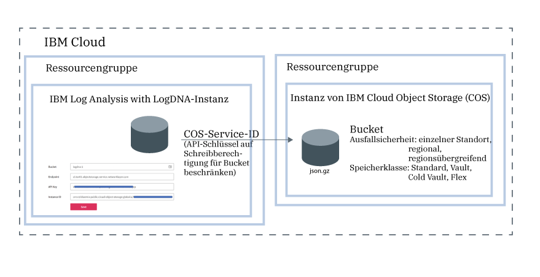

---

copyright:
  years:  2018, 2019
lastupdated: "2019-05-01"

keywords: LogDNA, IBM, Log Analysis, logging, archive logs, COS, cloud object storage

subcollection: LogDNA

---

{:new_window: target="_blank"}
{:shortdesc: .shortdesc}
{:screen: .screen}
{:pre: .pre}
{:table: .aria-labeledby="caption"}
{:codeblock: .codeblock}
{:tip: .tip}
{:download: .download}
{:important: .important}
{:note: .note}

 
# Protokolle in IBM Cloud Object Storage archivieren
{: #archiving}

Sie können Protokolle aus einer Instanz von {{site.data.keyword.la_full_notm}} in einem Bucket in einer Instanz von {{site.data.keyword.cos_full_notm}} (COS) archivieren. 
{:shortdesc}

Damit Sie die Archivierung konfigurieren können, benötigen Sie eine IAM-Richtlinie mit der Plattformrolle **Anzeigeberechtigter** und der Servicerolle **Manager** für den {{site.data.keyword.la_full_notm}}-Service.

Sie archivieren Protokolle aus einer Instanz von {{site.data.keyword.la_full_notm}} in einem Bucket in einer Instanz von {{site.data.keyword.cos_full_notm}} (COS). Jede Instanz von {{site.data.keyword.la_full_notm}} verfügt über eine eigene Archivierungskonfiguration. 

Protokolle werden automatisch einmal täglich in einem komprimierten Format **(.json.gz)** archiviert. Die Metadaten jeder Zeile werden beibehalten.

Protokolle werden innerhalb von 24 bis 48 Stunden nach dem Speichern der Konfiguration archiviert. 

Die {{site.data.keyword.cos_full_notm}}-Instanz wird im Kontext einer Ressourcengruppe bereitgestellt. Auch die {{site.data.keyword.la_full_notm}}-Instanz wird im Kontext einer Ressourcengruppe bereitgestellt. Beide Instanzen können in derselben Ressourcengruppe oder in unterschiedlichen Ressourcengruppen zusammengefasst werden. 

{{site.data.keyword.la_full_notm}} verwendet eine Service-ID für die Kommunikation mit dem {{site.data.keyword.cos_full_notm}}-Service.

* Die Service-ID, die Sie für eine {{site.data.keyword.cos_full_notm}}-Instanz erstellen, verwendet {{site.data.keyword.la_full_notm}} für die Authentifizierung der und für den Zugriff auf die {{site.data.keyword.cos_full_notm}}-Instanz. 
* Sie können der Service-ID spezielle Zugriffsrichtlinien zuordnen, die die Berechtigungen für die {{site.data.keyword.cos_full_notm}}-Instanz beschränken. Beschränken Sie die Service-ID auf Schreibberechtigungen für das Bucket, in dem Sie die Protokolle archivieren wollen.

Die folgende Abbildung zeigt eine allgemeine Darstellung der verschiedenen Komponenten, die beim Archivieren von Protokollen integriert sind:

Führen Sie die folgenden Schritte aus, um eine {{site.data.keyword.la_full_notm}}-Instanz in einem Bucket in einer {{site.data.keyword.cos_full_notm}}-Instanz zu archivieren:

## Schritt 1. Einem Benutzer IAM-Richtlinien für die Arbeit mit {{site.data.keyword.cos_full_notm}} gewähren
{: #archiving_step1}

**Anmerkung:** Dieser Schritt muss vom Kontoeigner oder von einem Administrator des {{site.data.keyword.cos_full_notm}}-Service in {{site.data.keyword.cloud_notm}} ausgeführt werden.

Als Administrator des {{site.data.keyword.cos_full_notm}}-Service müssen Sie in der Lage sein, Instanzen des Service bereitzustellen, anderen Benutzern die Berechtigung zum Arbeiten mit diesen Instanzen zu erteilen und Service-IDs zu erstellen. 

Es gibt verschiedene Möglichkeiten, einem Benutzer die Berechtigung eines Bearbeiters des {{site.data.keyword.cos_full_notm}}-Service zu erteilen:

* Als Administrator des Service in dem Konto muss der Benutzer über eine IAM-Richtlinie für den {{site.data.keyword.cos_full_notm}}-Service mit der Plattformrolle *Administrator* verfügen. Sie müssen diesem Benutzer Zugriff auf eine einzelne Ressource in dem Konto zuweisen. 

* Als Administrator des Service im Kontext einer Ressourcengruppe muss der Benutzer über eine IAM-Richtlinie für den {{site.data.keyword.cos_full_notm}}-Service mit der Plattformrolle *Administrator* im Kontext der Ressourcengruppe verfügen. 

Die folgende Tabelle enthält eine Auflistung der Rollen, über die ein Benutzer verfügen kann, um die aufgeführten Aktionen für den {{site.data.keyword.cos_full_notm}}-Service auszuführen:

| Service                    | Plattformrollen    | Aktion                                                                                        | 
|----------------------------|-------------------|-----------------------------------------------------------------------------------------------|       
| `Cloud Object Storage`     | Administrator     | Der Benutzer kann Benutzern im Konto Richtlinien für die Arbeit mit dem {{site.data.keyword.cos_full_notm}}-Service zuweisen. |
| `Cloud Object Storage`     | Administrator  Bearbeiter | Der Benutzer kann eine Instanz des {{site.data.keyword.cos_full_notm}}-Service bereitstellen.    |
| `Cloud Object Storage`     | Administrator  Bearbeiter  Operator | Der Benutzer kann eine Service-ID erstellen.    | 
{: caption="Tabelle 1. Rollen und Aktionen" caption-side="top"} 

Führen Sie die folgenden Schritte aus, um einem Benutzer die Administratorrolle für den {{site.data.keyword.cos_full_notm}}-Service im Kontext einer Ressourcengruppe zuzuweisen: 

1. Klicken Sie in der Menüleiste auf **Verwalten** &gt; **Zugriff (IAM)** und wählen Sie dann **Benutzer** aus.
2. Wählen Sie in der Zeile des Benutzers, dem Sie Zugriff gewähren wollen, das Menü **Aktionen** aus und klicken Sie dann auf **Zugriff zuweisen**.
3. Wählen Sie **Zugriff in einer Ressourcengruppe zuweisen** aus.
4. Wählen Sie eine Ressourcengruppe aus.
5. Wurde dem Benutzer noch keine Rolle für die ausgewählte Ressourcengruppe erteilt, wählen Sie eine Rolle für das Feld **Zugriff für eine Ressourcengruppe zuweisen** aus. 

    Je nachdem, welche Rolle Sie auswählen, kann der Benutzer die Ressourcengruppe in seinem Dashboard anzeigen, den Namen der Ressourcengruppe bearbeiten oder den Benutzerzugriff auf die Gruppe verwalten. 
    
    Sie können **Kein Zugriff** auswählen, wenn der Benutzer nur Zugriff auf den {{site.data.keyword.la_full_notm}}-Service in der Ressourcengruppe haben soll.

6. Wählen Sie **Cloud Object Storage** aus.
7. Wählen Sie die Plattformrolle **Administrator** aus.
8. Klicken Sie auf **Zuweisen**.

## Schritt 2. Eine Instanz von {{site.data.keyword.cos_full_notm}} bereitstellen
{: #archiving_step2}

**Anmerkung:** Dieser Schritt muss von einem Bearbeiter oder von einem Administrator des {{site.data.keyword.cos_full_notm}}-Service in {{site.data.keyword.cloud_notm}} ausgeführt werden. 

Führen Sie die folgenden Schritte aus, um eine {{site.data.keyword.cos_full_notm}}-Instanz bereitzustellen:

1. Melden Sie sich bei Ihrem {{site.data.keyword.cloud_notm}}-Konto an.

    Klicken Sie auf [{{site.data.keyword.cloud_notm}}-Dashboard ](https://cloud.ibm.com/login){:new_window}, um das {{site.data.keyword.cloud_notm}}-Dashboard zu starten.

	Nach der Anmeldung mit Ihrer Benutzer-ID und Ihrem Kennwort wird die Benutzerschnittstelle von {{site.data.keyword.cloud_notm}} geöffnet.

2. Klicken Sie auf **Katalog**. Die Liste der in {{site.data.keyword.cloud_notm}} verfügbaren Services wird geöffnet.

3. Wählen Sie die Kategorie **Speicher** aus, um die angezeigte Liste der Services zu filtern.

4. Klicken Sie auf die Kachel **Objektspeicher**.

5. Geben Sie einen Namen für die Serviceinstanz ein.

6. Wählen Sie eine Ressourcengruppe aus. 

    Die Ressourcengruppe **Standard** ist standardmäßig festgelegt.

7. Wählen Sie einen Serviceplan aus. 

    Der Plan **Lite** ist standardmäßig festgelegt.

9. Klicken Sie auf **Erstellen**.

## Schritt 3. Bucket erstellen
{: #archiving_step3}

Buckets stellen eine Möglichkeit dar, Ihre Daten in einer {{site.data.keyword.cos_full_notm}}-Instanz zu organisieren. 

Damit ein Benutzer Buckets verwalten kann, müssen ihm Berechtigungen für die Arbeit mit Buckets in der {{site.data.keyword.cos_full_notm}}-Instanz erteilt werden. In der folgenden Tabelle sind die verschiedenen Aktionen und Rollen aufgeführt, über die ein Benutzer verfügen kann, um mit Buckets zu arbeiten:

| Service                    | Rollen                   | Aktion                             | 
|----------------------------|-------------------------|------------------------------------|       
| `Cloud Object Storage`     | Plattformrolle: Anzeigeberechtigter   | Der Benutzer kann über die Benutzerschnittstelle von {{site.data.keyword.cloud_notm}} alle Buckets anzeigen und die darin enthaltenen Objekte auflisten. |
| `Cloud Object Storage`     | Servicerolle: Manager   | Der Benutzer kann Objekte öffentlich zugänglich machen.                                                       |
| `Cloud Object Storage`     | Servicerollen: Manager  Schreibberechtigter | Der Benutzer kann Buckets und Objekte erstellen und löschen.                         | 
| `Cloud Object Storage`     | Servicerolle: Leseberechtigter    | Der Benutzer kann Objekte auflisten und herunterladen.                                                 |
{: caption="Tabelle 2. Rollen und Aktionen für die Arbeit mit Buckets" caption-side="top"} 

**Anmerkung:** Für die Erstellung eines Buckets muss der Benutzer die Berechtigung Manager oder Schreibberechtigter für die {{site.data.keyword.cos_full_notm}}-Instanz haben.

Führen Sie die folgenden Schritte aus, um ein Bucket zu erstellen:

1. Melden Sie sich bei Ihrem {{site.data.keyword.cloud_notm}}-Konto an.

    Klicken Sie auf [{{site.data.keyword.cloud_notm}}-Dashboard ](https://cloud.ibm.com/login){:new_window}, um das {{site.data.keyword.cloud_notm}}-Dashboard zu starten.

	Nach der Anmeldung mit Ihrer Benutzer-ID und Ihrem Kennwort wird das {{site.data.keyword.cloud_notm}}-Dashboard geöffnet.

2. Wählen Sie im Dashboard die {{site.data.keyword.cos_full_notm}}-Instanz aus, in der Sie das Bucket erstellen wollen.

3. Wählen Sie **Buckets** aus. Klicken Sie dann auf **Bucket erstellen**.

4. Geben Sie einen Bucketnamen in das Feld *Eindeutiger Bucketname* ein.

    **Anmerkung:** Alle Buckets in allen Regionen weltweit verwenden gemeinsam einen einzigen Namensbereich. 

    Sie können den Namen Ihrer {{site.data.keyword.la_full_notm}}-Instanz als Bestandteil des Bucketnamens verwenden. Für eine Instanz mit dem Namen *logdna-1* können Sie beispielsweise *accountN-logdna-1* als Bucketnamen verwenden.

    Diesen Namen benötigen Sie für die Konfiguration der Archivierung über die Webbenutzerschnittstelle von {{site.data.keyword.la_full_notm}}.

5. Wählen Sie den Typ der Ausfallsicherheit und einen Standort aus, an dem Ihre Daten physisch gespeichert werden sollen.

    Ausfallsicherheit bezieht sich auf das Ausmaß des geografischen Bereichs, in dem Ihre Daten verteilt sind. 
    
    Bei regionsübergreifender Ausfallsicherheit werden Ihre Daten auf mehrere Ballungsräume verteilt.
    
    Bei regionaler Ausfallsicherheit werden Daten auf einen einzelnen Ballungsraum verteilt. 
    
    Bei einem einzigen Rechenzentrum werden Daten nur auf Geräte an einem einzelnen Standort verteilt.

    Weitere Informationen finden Sie in [Regionen und Endpunkte auswählen](/docs/services/cloud-object-storage?topic=cloud-object-storage-endpoints).

6. Wählen Sie den Typ der *Speicherklasse* aus.

    Sie können Buckets mit unterschiedlichen Speicherklassen erstellen. Treffen Sie die Auswahl der Speicherklasse für Ihr Bucket auf der Basis Ihrer Anforderungen bezüglich des Abrufs von Daten. Weitere Informationen finden Sie in [Speicherklassen verwenden](/docs/services/cloud-object-storage?topic=cloud-object-storage-classes).

    **Anmerkung:** Die Speicherklasse eines Buckets kann nach der Erstellung des Buckets nicht mehr geändert werden. Ist eine Neuklassifizierung von Objekten erforderlich, müssen die Daten in ein Bucket mit der gewünschten Speicherklasse verschoben werden.

7. Fügen Sie wahlweise einen Key Protect-Schlüssel für die Verschlüsselung ruhender Daten hinzu.

    Alle Objekte werden standardmäßig mit nach dem Zufallsprinzip generierten Schlüsseln und einer Alles-oder-nichts-Transformation verschlüsselt. Dieses Standardverschlüsselungsmodell bietet zwar Sicherheit für ruhende Daten, aber einige Workloads müssen im Besitz der verwendeten Verschlüsselungsschlüssel sein. Weitere Informationen finden Sie in [Verschlüsselung verwalten](/docs/services/cloud-object-storage?topic=cloud-object-storage-encryption).

## Schritt 4. Service-ID für die {{site.data.keyword.cos_full_notm}}-Instanz erstellen
{: #archiving_step4}

Eine Service-ID identifiziert einen Service ähnlich wie eine Benutzer-ID einen Benutzer. Service-IDs sind nicht an einen bestimmten Benutzer gebunden. Eine Service-ID bleibt auch dann erhalten, wenn der Benutzer, der sie erstellt, Ihr Unternehmen verlässt und aus dem Konto gelöscht wird.

Sie müssen eine Service-ID für Ihre {{site.data.keyword.cos_full_notm}}-Instanz erstellen. Diese Service-ID verwendet die {{site.data.keyword.la_full_notm}}-Instanz für die Authentifizierung bei Ihrer {{site.data.keyword.cos_full_notm}}-Instanz. 

Sie müssen der Service-ID spezielle Zugriffsrichtlinien zuordnen, die die Berechtigungen für die Verwendung bestimmter Services beschränken oder sogar Berechtigungen für den Zugriff auf verschiedene Services kombinieren. Soll beispielsweise der Zugriff auf ein einzelnes Bucket beschränkt werden, müssen Sie mithilfe der Konsole oder Befehlszeilenschnittstelle (CLI) sicherstellen, dass die Service-ID keine Richtlinien auf Instanzebene aufweist.

Führen Sie die folgenden Schritte aus, um eine Service-ID mit Schreibberechtigung für die {{site.data.keyword.cos_full_notm}}-Instanz zu erstellen:

1. Melden Sie sich bei Ihrem {{site.data.keyword.cloud_notm}}-Konto an.

    Klicken Sie auf [{{site.data.keyword.cloud_notm}}-Dashboard ](https://cloud.ibm.com/login){:new_window}, um das {{site.data.keyword.cloud_notm}}-Dashboard zu starten.

	Nach der Anmeldung mit Ihrer Benutzer-ID und Ihrem Kennwort wird das {{site.data.keyword.cloud_notm}}-Dashboard geöffnet.

2. Wählen Sie im Dashboard die {{site.data.keyword.cos_full_notm}}-Instanz aus, in der Sie das Bucket erstellen wollen.

3. Wählen Sie **Serviceberechtigungsnachweise** aus. Wählen Sie dann **Neuer Berechtigungsnachweis** aus.

4. Geben Sie einen Namen ein. 

5. Wählen Sie die Rolle **Schreibberechtigter** aus.

6. Klicken Sie auf **Hinzufügen**.

    Der Liste wird eine neue Service-ID hinzugefügt. 

Klicken Sie für die gerade erstellte Service-ID auf **Berechtigungsnachweise anzeigen**. Es werden Informationen angezeigt, die sich auf die Service-ID beziehen. 

* Kopieren Sie den API-Schlüssel. Dies ist der für das Feld **apikey** definierte Wert.
* Kopieren Sie die ID der Ressourceninstanz. Dies ist der für das Feld **resource_instance_id** definierte Wert.

## Schritt 5. Service-ID auf Schreibberechtigungen für das Bucket beschränken
{: #archiving_step5}

Führen Sie die folgenden Schritte aus, wenn die Service-ID auf Schreibberechtigungen für ein Bucket beschränkt werden soll:

1. Lesen Sie die Informationen für die Service-ID und notieren Sie den Wert des Felds **iam_apikey_name** und des Felds **iam_apikey_name**. 

2. Wählen Sie im Dashboard **Verwalten** &gt; **Zugriff (IAM)** und dann **Benutzer** aus.

3. Wählen Sie **Service-IDs** aus.

4. Suchen Sie eine Service-ID mit folgendem Namen: **auto-generated-serviceId-<ID, die Teil des iam_apikey_name-Werts ist>.

5. Wählen Sie die Service-ID aus. Klicken Sie dann in **Zugriffsrichtlinien** auf **Schreibberechtigter**.

6. Geben Sie **Bucket** in das Feld *Ressourcentyp* ein.

7. Geben Sie in das Feld *Ressourcen-ID* den Namen Ihres Buckets ein.

8. Klicken Sie auf **Speichern**.

**Anmerkung:** Wenn das Feld für den Ressourcentyp oder für die Ressource leer bleibt, wird eine Richtlinie auf Instanzebene erstellt.

## Schritt 6. Endpunkt auswählen
{: #archiving_step6}

Ein Endpunkt definiert, wo nach einem Bucket zu suchen ist. Es gibt verschiedene Endpunkte, die von der Region und dem Typ der Ausfallsicherheit abhängig sind. Weitere Informationen finden Sie in [Regionen und Endpunkte auswählen](/docs/services/cloud-object-storage?topic=cloud-object-storage-endpoints#endpoints).

Führen Sie die folgenden Schritte aus, um den Endpunkt für Ihr Bucket abzurufen:

1. Melden Sie sich bei Ihrem {{site.data.keyword.cloud_notm}}-Konto an.

    Klicken Sie auf [{{site.data.keyword.cloud_notm}}-Dashboard ](https://cloud.ibm.com/login){:new_window}, um das {{site.data.keyword.cloud_notm}}-Dashboard zu starten.

	Nach der Anmeldung mit Ihrer Benutzer-ID und Ihrem Kennwort wird das {{site.data.keyword.cloud_notm}}-Dashboard geöffnet.

2. Wählen Sie im Dashboard die {{site.data.keyword.cos_full_notm}}-Instanz aus, in der Sie das Bucket erstellen wollen.

3. Wählen Sie **Buckets** aus. Wählen Sie dann das erstellte Bucket aus, in dem Sie Protokolle archivieren wollen.

4. Wählen Sie **Konfiguration** aus.

5. Kopieren Sie einen der privaten Endpunkte. 

## Schritt 7. Einem Benutzer IAM-Richtlinien für die Archivierung von Protokollen gewähren
{: #archiving_step7}

Die folgende Tabelle enthält eine Auflistung der Richtlinien, die ein Benutzer benötigt, um die Protokollarchivierung in einem Bucket in einer {{site.data.keyword.cos_full_notm}}-Instanz über die Webbenutzerschnittstelle von {{site.data.keyword.la_full_notm}} zu konfigurieren:

| Service                        | Rolle                      | Erteilte Berechtigung                  | 
|--------------------------------|---------------------------|-------------------------------------|  
| `{{site.data.keyword.la_full_notm}}` | Plattformrolle: Anzeigeberechtigter     | Der Benutzer kann die Liste der Serviceinstanzen im Dashboard Beobachtbarkeit - Protokollierung anzeigen. |
| `{{site.data.keyword.la_full_notm}}` | Servicerolle: Manager      | Der Benutzer kann die Webbenutzerschnittstelle starten und Protokolle in der Webbenutzerschnittstelle anzeigen.                             |
{: caption="Tabelle 3. IAM-Richtlinien" caption-side="top"} 

Weitere Informationen zur Konfiguration dieser Richtlinien für einen Benutzer finden Sie in [Benutzer Berechtigungen zum Anzeigen von Protokollen in LogDNA erteilen](/docs/services/Log-Analysis-with-LogDNA/work_iam.html#user_logdna).

Führen Sie die folgenden Schritte aus, um einem Benutzer die Berechtigung zum Archivieren von Protokollen zu erteilen: 

1. Klicken Sie in der Menüleiste auf **Verwalten** &gt; **Zugriff (IAM)** und wählen Sie dann **Benutzer** aus.
2. Wählen Sie in der Zeile des Benutzers, dem Sie Zugriff gewähren wollen, das Menü **Aktionen** aus und klicken Sie dann auf **Zugriff zuweisen**.
3. Wählen Sie **Zugriff in einer Ressourcengruppe zuweisen** aus.
4. Wählen Sie eine Ressourcengruppe aus.
5. Wurde dem Benutzer noch keine Rolle für die ausgewählte Ressourcengruppe erteilt, wählen Sie eine Rolle für das Feld **Zugriff für eine Ressourcengruppe zuweisen** aus. 

    Je nachdem, welche Rolle Sie auswählen, kann der Benutzer die Ressourcengruppe in seinem Dashboard anzeigen, den Namen der Ressourcengruppe bearbeiten oder den Benutzerzugriff auf die Gruppe verwalten. 
    
    Sie können **Kein Zugriff** auswählen, wenn der Benutzer nur Zugriff auf den {{site.data.keyword.la_full_notm}}-Service in der Ressourcengruppe haben soll.

6. Wählen Sie **IBM Log Analysis with LogDNA** aus.
7. Wählen Sie die Plattformrolle **Anzeigeberechtigter** aus.
8. Wählen Sie die Servicerolle **Manager** aus.
9. Klicken Sie auf **Zuweisen**.

## Schritt 8. Archivierung für Ihre {{site.data.keyword.la_full_notm}}-Instanz konfigurieren
{: #archiving_step8}

Führen Sie die folgenden Schritte aus, um die Archivierung Ihrer {{site.data.keyword.la_full_notm}}-Instanz in einem COS-Bucket zu konfigurieren:

1. Starten Sie die Webbenutzerschnittstelle von {{site.data.keyword.la_full_notm}}. [Weitere Informationen](/docs/services/Log-Analysis-with-LogDNA/view_logs.html#view_logs_step2).

2. Wählen Sie das Symbol **Konfiguration** aus. Wählen Sie dann **Archivieren** aus. 

3. Wählen Sie **IBM Cloud Object Storage** aus.

4. Legen Sie das Bucket, den Endpunkt, den API-Schlüssel und die Instanz-ID für die Archivierung von Protokollen fest.

    <table>
      <caption>Tabelle 4. COS-Felder</caption>
      <tr>
         <th>Feld</th>
         <th>Wert</th>
      </tr>
      <tr>
         <td>Bucket</td>
         <td>Geben Sie den Namen des COS-Buckets an. </td>
      </tr>
      <tr>
         <td>Endpunkt</td>
         <td>Geben Sie den privaten Endpunkt des COS-Buckets an.</td>
      </tr>
      <tr>
         <td>API-Schlüssel</td>
         <td>Geben Sie den API-Schlüssel an, der der COS-Service-ID zugeordnet ist.</td>
      </tr>
      <tr>
         <td>Instanz-ID</td>
         <td>Geben Sie die ID der COS-Instanz an. </td>
      </tr>
    </table>

5. Klicken Sie auf **Speichern**.

Nach dem Speichern der Konfiguration werden Protokolle täglich einmal archiviert.

