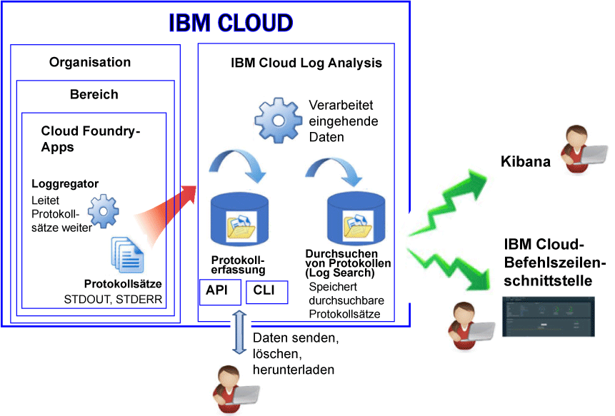

---

copyright:
  years: 2017, 2019

lastupdated: "2019-03-06"

keywords: IBM Cloud, logging

subcollection: cloudloganalysis

---

{:new_window: target="_blank"}
{:shortdesc: .shortdesc}
{:screen: .screen}
{:pre: .pre}
{:table: .aria-labeledby="caption"}
{:codeblock: .codeblock}
{:tip: .tip}
{:download: .download}
{:important: .important}
{:note: .note}

# Cloud Foundry-Apps
{: #logging_cf_apps}

In {{site.data.keyword.Bluemix}} können Sie Cloud Foundry-Protokolle (CF-Protokolle) über das {{site.data.keyword.Bluemix_notm}}-Dashboard, in Kibana und über die Befehlszeilenschnittstelle (CLI) anzeigen, filtern und analysieren. Darüber hinaus können Sie Protokolleinträge durch Streaming an ein externes Protokoll-Management-Tool übertragen. 
{:shortdesc}

{{site.data.keyword.Bluemix_notm}} zeichnet Protokolldaten auf, die von der Cloud Foundry-Plattform und von Cloud Foundry-Anwendungen generiert werden. Die Protokolle enthalten Fehler-, Warn- und Informationsnachrichten, die für Ihre App erzeugt wurden. 

Wenn Sie Ihre Apps in einer als Service bereitgestellten Cloudplattform (Platform-as-a-service, PaaS) wie Cloud Foundry in {{site.data.keyword.Bluemix_notm}} ausführen, können Sie nicht über SSH oder FTP auf die Protokolle in der Infrastruktur zugreifen, in der Ihre Apps ausgeführt werden. Die Plattform wird durch den Cloud-Provider gesteuert. Cloud Foundry-Apps, die in {{site.data.keyword.Bluemix_notm}} ausgeführt werden, verwenden die Komponente 'Loggrerator', um Protokolleinträge aus der Cloud Foundry-Infrastruktur heraus weiterzuleiten. Loggregator erfasst automatisch STDOUT- und STDERR-Daten. Sie können diese Protokolle über das {{site.data.keyword.Bluemix_notm}}-Dashboard, über Kibana und über die Befehlszeilenschnittstelle visualisieren und analysieren.

Die folgende Abbildung zeigt eine Übersicht über die Protokollierung von Cloud Foundry-Apps in {{site.data.keyword.Bluemix_notm}}:

 
Die Protokollierung von Cloud Foundry-Apps ist automatisch aktiviert, wenn Sie die Cloud Foundry-Infrastruktur zur Ausführung Ihrer Apps in {{site.data.keyword.Bluemix_notm}} verwenden. Wenn Sie Cloud Foundry-Laufzeitprotokolle anzeigen möchten, müssen Sie Ihre Protokolle in die Standardausgabe (STDOUT) und Standardfehlerausgabe (STDERR) schreiben. Weitere Informationen finden Sie unter [Laufzeitanwendungsprotokollierung durch CF-Apps](/docs/services/CloudLogAnalysis/cfapps?topic=cloudloganalysis-logging_writing_to_log_from_cf_app#logging_writing_to_log_from_cf_app).

{{site.data.keyword.Bluemix_notm}} bewahrt eine begrenzte Menge an Protokolldaten auf. Bei der Protokollierung von Daten werden die alten Informationen durch die neueren Daten ersetzt. Wenn Sie organisationsbedingte oder branchenspezifische Richtlinien einhalten müssen, die eine Aufbewahrung eines Teils oder aller Protokolldaten zu Prüfzwecken oder aus anderen Gründen vorsehen, können Sie Ihre Protokolle auf einen externen Protokollhost, wie z. B. einen Protokoll-Management-Service eines anderen Anbieters, oder auf einen anderen Host durch Streaming übertragen. Weitere Informationen finden Sie unter [Externe Protokollhosts konfigurieren](/docs/services/CloudLogAnalysis/external?topic=cloudloganalysis-thirdparty_logging#thirdparty_logging).

## Einpflegen von Protokollen (Log Ingestion)
{: #log_ingestion1}

Sie können Protokolle über den Multi-Tenant Logstash Forwarder an {{site.data.keyword.loganalysisshort}} senden. Weitere Informationen finden Sie unter [Protokolldaten mit Multi-Tenant Logstash Forwarder (mt-logstash-forwarder) senden](/docs/services/CloudLogAnalysis/how-to/send-data?topic=cloudloganalysis-send_data_mt#send_data_mt).

Der {{site.data.keyword.loganalysisshort}}-Service bietet verschiedene Pläne. Alle Pläne - mit Ausnahme des *Lite*-Plans - beinhalten die Möglichkeit, Protokolle an 'Log Collection' zu senden. Weitere Informationen zu den Plänen finden Sie unter [Servicepläne](/docs/services/CloudLogAnalysis?topic=cloudloganalysis-log_analysis_ov#plans).

## Erfassen von Protokollen (Log Collection)
{: #log_collection}

Standardmäßig speichert der {{site.data.keyword.loganalysisshort}}-Service Protokolldaten für bis zu drei Tage in 'Log Search':   

* Maximal werden 500 MB pro Datenbereich und Tag gespeichert. Alle Protokolle oberhalb der Kapazitätsgrenze von 500 MB werden nicht berücksichtigt. Die Kapazitätsgrenze wird täglich um 12:30 AM (UTC) zurückgesetzt.
* Bis zu 1,5 GB Daten können für einen Zeitraum von maximal 3 Tagen durchsucht werden. Das Rollover der Protokolldaten (First In, First Out) erfolgt bei 1,5 GB an Daten oder nach drei Tagen.

Der {{site.data.keyword.loganalysisshort}}-Service bietet zusätzliche Pläne, mit denen Sie Protokolle in 'Log Collection' so lange wie erforderlich speichern können. 

* Sie können eine Protokollaufbewahrungsrichtlinie konfigurieren, die die Anzahl Tage definiert, für die Protokolle in 'Log Collection' aufbewahrt werden. Weitere Informationen finden Sie unter [Protokollaufbewahrungsrichtlinie](/docs/services/CloudLogAnalysis?topic=cloudloganalysis-manage_logs#log_retention_policy).
* Sie können die API oder die Befehlszeilenschnittstelle verwenden, um Protokolle manuell zu löschen.

Weitere Informationen zu den Preisen der einzelnen Pläne finden Sie unter [Servicepläne](/docs/services/CloudLogAnalysis?topic=cloudloganalysis-log_analysis_ov#plans).

## Durchsuchen von Protokollen (Log Search)
{: #log_search1}

Standardmäßig können Sie Kibana verwenden, um 500 MB Protokolle pro Tag in {{site.data.keyword.Bluemix_notm}} zu durchsuchen. 

Der {{site.data.keyword.loganalysisshort}}-Service bietet mehrere Pläne. Für jeden Plan gibt es unterschiedliche Protokollsuchfunktionen. Z. B. können Sie beim *Log Collection*-Plan bis zu 1 GB an Daten pro Tag durchsuchen. Weitere Informationen zu den Plänen finden Sie unter [Servicepläne](/docs/services/CloudLogAnalysis?topic=cloudloganalysis-log_analysis_ov#plans).

## Methoden zur Analyse von CF-App-Protokollen
{: #logging_bluemix_cf_apps_log_methods}

Die folgenden Methoden stehen für die Analyse der Protokolle Ihrer Cloud Foundry-Anwendung zur Auswahl:

* Analysieren Sie die Protokolldatei in der {{site.data.keyword.Bluemix_notm}}-Benutzerschnittstelle, um die neueste Aktivität der Anwendung anzuzeigen.
    
    In {{site.data.keyword.Bluemix_notm}} können Sie Protokolle über die Registerkarte **Protokolle** anzeigen, filtern und analysieren, die für jede Cloud Foundry-Anwendung verfügbar ist. Weitere Informationen finden Sie unter [CF-App-Protokolle über das CF-App-Dashboard analysieren](/docs/services/CloudLogAnalysis/cfapps?topic=cloudloganalysis-launch_logs_cloud_ui_cf#cfapp_ui).
    
* Analysieren Sie Protokolle in Kibana, um erweiterte Analysetasks auszuführen.
    
    In {{site.data.keyword.Bluemix_notm}} können Sie Kibana, eine quelloffene Analyse- und Visualisierungsplattform, dazu verwenden, Ihre Daten mit verschiedenen Darstellungsarten (Diagramme, Tabellen usw.) zu überwachen, zu durchsuchen, zu analysieren und zu visualisieren. Weitere Informationen finden Sie unter [CF-App-Protokolle über die {{site.data.keyword.loganalysisshort}}-Benutzerschnittstelle analysieren](/docs/services/CloudLogAnalysis/cfapps?topic=cloudloganalysis-launch_logs_cloud_ui_cf#cfapp_la).
	
	**Tipp:** Informationen zum Starten von Kibana finden Sie unter [Vom Dashboard einer CF-App zu Kibana navigieren](/docs/services/CloudLogAnalysis/kibana?topic=cloudloganalysis-launch#launch_Kibana_from_cf_app).

* Analysieren Sie Protokolle über die Befehlszeilenschnittstelle mit Befehlen zur programmgesteuerten Protokollverwaltung.
    
    In {{site.data.keyword.Bluemix_notm}} können Sie Protokolle über die Befehlszeilenschnittstelle (CLI) mithilfe des Befehls **cf logs** anzeigen, filtern und analysieren. Weitere Informationen finden Sie unter [Cloud Foundry-App-Protokolle über die Befehlszeilenschnittstelle analysieren](/docs/services/CloudLogAnalysis/cfapps?topic=cloudloganalysis-analyzing_logs_cli#analyzing_logs_cli).

## Protokollquellen für CF-Apps, die auf Diego bereitgestellt sind
{: #cf_apps_log_sources_diego}

Für Cloud Foundry-Anwendungen (CF-Anwendungen), die in der auf Diego basierenden Cloud Foundry-Architektur bereitgestellt sind, stehen folgende Protokollquellen zur Verfügung:
    
| Protokollquelle | Komponentenname | Beschreibung | 
|------------|----------------|-------------|
| LGR | Loggregator | Die LGR-Komponente stellt Informationen über den Cloud Foundry Loggregator bereit, der Protokolle aus Cloud Foundry heraus weiterleitet. |
| RTR | Router | Die RTR-Komponente stellt Informationen zu HTTP-Anforderungen an eine Anwendung bereit. | 
| STG | Staging | Die STG-Komponente stellt Informationen zum Staging oder erneuten Staging einer Anwendung bereit. | 
| APP | Anwendung | Die APP-Komponente stellt Protokolle aus der Anwendung bereit. Hier wird die Standardfehlerausgabe (STDERR) und die Standardausgabe (STDOUT) in Ihrem Code angezeigt. | 
| API | Cloud Foundry-API | Die API-Komponente stellt Informationen zu den internen Aktionen bereit, die aus der Anforderung eines Benutzers zum Ändern des Status einer Anwendung resultieren. | 
| CELL | Diego-Zelle | Die CELL-Komponente stellt Informationen zum Start, Stopp oder Ausfall einer Anwendung bereit.|
| SSH | SSH | Die SSH-Komponente stellt jedes Mal Informationen bereit, wenn ein Benutzer auf eine Anwendung mit dem Befehl **cf ssh** zugreift. |
{: caption="Tabelle 1. Die Protokollquellen für CF-Apps, die in einer CF-Architektur bereitgestellt werden, die auf Diego basiert" caption-side="top"}

Die folgende Abbildung zeigt die verschiedenen Komponenten (Protokollquellen) in einer Cloud Foundry-Architektur, die auf Diego basiert: 

 in einer Cloud Foundry-Architektur, die auf Diego basiert.")
	
## Protokollquellen für CF-Apps, die auf DEA bereitgestellt sind
{: #logging_bluemix_cf_apps_log_sources}

Für Cloud Foundry-Anwendungen (CF-Anwendungen), die in einer DEA-Architektur (Droplet Execution Agent) bereitgestellt sind, stehen die folgenden Protokollquellen zur Verfügung:
    
| Protokollquelle | Komponentenname | Beschreibung | 
|------------|----------------|-------------|
| LGR | Loggregator | Die LGR-Komponente stellt Informationen über den Cloud Foundry Loggregator bereit, der Protokolle aus Cloud Foundry heraus weiterleitet. |
| RTR | Router | Die RTR-Komponente stellt Informationen zu HTTP-Anforderungen an eine Anwendung bereit. | 
| STG | Staging | Die STG-Komponente stellt Informationen zum Staging oder erneuten Staging einer Anwendung bereit. | 
| APP | Anwendung | Die APP-Komponente stellt Protokolle aus der Anwendung bereit. Hier wird die Standardfehlerausgabe (STDERR) und die Standardausgabe (STDOUT) in Ihrem Code angezeigt. | 
| API | Cloud Foundry-API | Die API-Komponente stellt Informationen zu den internen Aktionen bereit, die aus der Anforderung eines Benutzers zum Ändern des Status einer Anwendung resultieren. | 
| DEA | Droplet Execution Agent | Die DEA-Komponente stellt Informationen zum Start, Stopp oder Ausfall einer Anwendung bereit.   Diese Komponente ist nur verfügbar, wenn Ihre Anwendung in der Cloud Foundry-Architektur bereitgestellt ist, die auf DEA basiert. | 
{: caption="Tabelle 2. Die Protokollquellen für CF-Apps, die in einer CF-Architektur bereitgestellt sind, die auf DEA basiert" caption-side="top"}

Die folgende Abbildung zeigt die verschiedenen Komponenten (Protokollquellen) in einer Cloud Foundry-Architektur, die auf DEA basiert: 

 in einer Cloud Foundry-Architektur, die auf dem Droplet Execution Agent (DEA) basiert.")

## Über die {{site.data.keyword.Bluemix_notm}}-Benutzerschnittstelle angezeigtes Protokollformat für CF-App-Protokolle
{: #log_format_cf}

Die Protokolle für CF-Apps in {{site.data.keyword.Bluemix_notm}} werden in einem festen Format angezeigt, ähnlich dem folgenden Muster:

<code><var class="keyword varname">Komponente</var>/<var class="keyword varname">Instanz-ID</var>/<var class="keyword varname">Nachricht</var>/<var class="keyword varname">Zeitmarke</var></code>

Jeder Protokolleintrag enthält die folgenden Felder:

| Feld | Beschreibung |
|-------|-------------|
| Zeitmarke | Die Zeit der Protokollanweisung. Die Zeitmarke wird millisekundengenau definiert. |
| Komponente | Die Komponente, die das Protokoll erstellt. Eine Liste der verschiedenen Komponenten finden Sie unter [Protokollquellen für CF-Apps](/docs/services/CloudLogAnalysis/cfapps?topic=cloudloganalysis-logging_cf_apps#logging_bluemix_cf_apps_log_sources).   Auf jeden Komponententyp folgt ein Schrägstrich und eine Ziffer, die die Anwendungsinstanz angibt. Die Ziffer 0 ist der ersten Instanz zugeordnet, die Ziffer 1 der zweiten Instanz usw. |
| Nachricht | Die Nachricht, die von der Komponente ausgegeben wird. Die Nachricht variiert abhängig vom Kontext. |
{: caption="Tabelle 1. CF-App-Protokolleintragsfelder" caption-side="top"}

## Lernprogramm: Protokolle in Kibana für eine Cloud Foundry-App analysieren
{: #tutorial}  

Informationen zur Verwendung von Kibana für die Analyse der Protokolle für eine Cloud Foundry-App finden Sie unter [Protokolle in Kibana für eine Cloud Foundry-App analysieren](https://console.bluemix.net/docs/tutorials/application-log-analysis.html#generate-access-and-analyze-application-logs).
