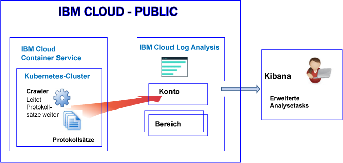
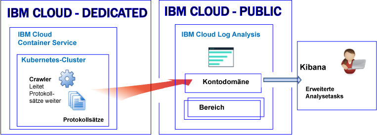

---

copyright:
  years: 2017, 2019

lastupdated: "2019-03-06"

keywords: IBM Cloud, logging

subcollection: cloudloganalysis

---

{:new_window: target="_blank"}
{:shortdesc: .shortdesc}
{:screen: .screen}
{:pre: .pre}
{:table: .aria-labeledby="caption"}
{:codeblock: .codeblock}
{:tip: .tip}
{:download: .download}
{:important: .important}
{:note: .note}


# {{site.data.keyword.containershort_notm}}
{: #containers_kubernetes}

In {{site.data.keyword.Bluemix_notm}} können Sie mit dem {{site.data.keyword.loganalysisshort}}-Service Containerprotokolle und Kubernetes-Clusterprotokolle speichern und analysieren, die automatisch vom {{site.data.keyword.containershort}} in Public und in Dedicated erfasst werden.
{:shortdesc}

In einem Konto können Sie einen oder mehr Kubernetes-Cluster haben. Protokolle werden automatisch vom {{site.data.keyword.containershort}} erfasst, sobald der Cluster bereitgestellt wurde. 

* Anwendungsprotokolle werden erfasst, sobald der Pod bereitgestellt wurde. 
* Informationen, die ein Containerprozess als 'stdout' (Standardausgabe) und als 'stderr' (Standardfehler) ausgibt, werden automatisch vom {{site.data.keyword.containershort}} erfasst.

Damit diese Protokolle zum Analysieren im {{site.data.keyword.loganalysisshort}}-Service zur Verfügung stehen, müssen Sie den Cluster so konfigurieren, dass Protokolle an {{site.data.keyword.loganalysisshort}} weitergeleitet werden. Sie können Protokolle an die {{site.data.keyword.loganalysisshort}}-Kontodomäne oder an eine Bereichsdomäne in Ihrem Konto weiterleiten. Standardmäßig:

* Cluster, die in der Region 'USA (Süden)' aktiv sind, senden Protokolle an den {{site.data.keyword.loganalysisshort}}-Service, der in dieser Region verfügbar ist.
* Cluster, die in der Region 'USA (Osten)' aktiv sind, senden Protokolle an den {{site.data.keyword.loganalysisshort}}-Service, der in dieser Region verfügbar ist.
* Cluster, die in der Region "Deutschland" aktiv sind, senden Protokolle an den {{site.data.keyword.loganalysisshort}}-Service, der in dieser Region verfügbar ist.
* Cluster, die in der Region 'Sydney' aktiv sind, senden Protokolle an den {{site.data.keyword.loganalysisshort}}-Service, der in dieser Region verfügbar ist.
* Cluster, die in der Region 'Vereinigtes Königreich' aktiv sind, senden Protokolle an den {{site.data.keyword.loganalysisshort}}-Service, der in dieser Region verfügbar ist.

Für die Entscheidung, ob Protokolle an eine Bereichsdomäne oder an die Kontodomäne weitergeleitet werden, berücksichtigen Sie die folgenden Informationen:

* Wenn Sie Protokolle an die Kontodomäne senden, beträgt das Suchkontingent 500 MB pro Tag und es ist zudem nicht möglich, Protokolle zur Langzeitspeicherung in 'Log Collection' abzulegen.
* Wenn Sie Protokolle an eine Bereichsdomäne senden, können Sie einen {{site.data.keyword.loganalysisshort}}-Serviceplan auswählen, der das tägliche Suchkontingent definiert, und Sie können Protokolle zur Langzeitspeicherung in 'Log Collection' ablegen.

**Hinweis:** Standardmäßig ist das Senden von Protokollen aus einem Cluster an den {{site.data.keyword.loganalysisshort}}-Service nicht automatisch aktiviert. Sie müssen für das Aktivieren der Protokollierung mindestens eine Protokollierungskonfiguration im Cluster erstellen, damit Protokolle automatisch an den {{site.data.keyword.loganalysisshort}}-Service weitergeleitet werden. Sie können die Protokollierung über die Befehlszeile aktivieren, indem Sie den Befehl `ibmcloud cs logging-config-create` oder das in der {{site.data.keyword.Bluemix_notm}}-Benutzerschnittstelle verfügbare Cluster-Dashboard verwenden. Weitere Informationen finden Sie unter [Automatische Erfassung von Clusterprotokollen aktivieren](/docs/services/CloudLogAnalysis/containers/containers_kube_other_logs.html#containers_kube_other_logs).

Wenn Sie mit einem Kubernetes-Cluster arbeiten, sind die Namensbereiche *ibm-system* und *kube-system* reserviert. Erstellen, löschen oder ändern Sie keine Berechtigungen für Ressourcen, die in diesen Namensbereiche verfügbar sind. Die Protokolle für diese Namensbereiche sind für die Verwendung durch {{site.data.keyword.IBM_notm}} reserviert.


## Protokolle an eine Bereichsdomäne weiterleiten
{: #space}

Berücksichtigen Sie beim Konfigurieren des Clusters zum Weiterleiten von Clusterprotokollen in {{site.data.keyword.loganalysisshort}} die folgenden Informationen:

* Sie müssen eine Cloud Foundry-Organisation und einen Bereich definieren, an die diese Protokolle weitergeleitet werden. 
* Die Organisation und der Bereich können in jeder {{site.data.keyword.IBM_notm}} Public Cloud-Region verfügbar sein.

**Hinweis:** Bei Clustern, die auf **{{site.data.keyword.Bluemix_notm}} Dedicated** bereitgestellt werden, ist es nicht möglich, Ihren Cluster so zu konfigurieren, dass Clusterprotokolle an Cloud Foundry-Bereiche weitergeleitet werden, die in Ihrem dedizierten Konto verfügbar sind.

Wenn Sie Protokolldaten in Kibana für einen Cluster analysieren, der Protokolle an eine Bereichsdomäne weiterleitet, berücksichtigen Sie die folgenden Informationen:

* Sie müssen Kibana in der Public-Region starten, in der die Organisation und der Bereich, die die Clusterprotokolle erfassen, verfügbar sind.
* Um Ihr Kibana-Suchkontingent zu erhöhen und Protokolle in Log Collection für den Langzeitspeicher zu speichern, müssen Sie den {{site.data.keyword.loganalysisshort}}-Service in dem Bereich bereitstellen, in dem Protokolle mit einem Plan weitergeleitet werden, der Ihren Anforderungen entspricht. 
* Ihre Benutzer-ID muss über eine entsprechende Berechtigung zum Anzeigen von Protokollen verfügen. Um Protokolle in der Bereichsdomäne anzuzeigen, muss der Benutzer über eine CF-Rolle verfügen. **Auditor** die Rolle der untersten Ebene, mit der Protokolle angezeigt werden dürfen. Weitere Informationen finden Sie unter [Rollen zum Anzeigen von Protokollen](/docs/services/CloudLogAnalysis/kibana/analyzing_logs_Kibana.html#roles).

Um Clusterprotokolldaten zu verwalten, die im Langzeitspeicher (Log Collection) gespeichert sind, muss Ihre Benutzer-ID über eine IAM-Richtlinie verfügen, damit mit dem {{site.data.keyword.loganalysisshort}}-Service gearbeitet werden kann. Ihre Benutzer-ID muss die Berechtigungen als **Administrator**, **Operator** oder **Editor** besitzen.  Weitere Informationen finden Sie unter [Rollen für die Verwaltung von Protokollen](/docs/services/CloudLogAnalysis/manage_logs.html#roles1).


Die folgende Abbildung zeigt eine Übersicht über die Protokollierung in der öffentlichen Region für den {{site.data.keyword.containershort}}, wenn der Cluster Protokolle an eine Bereichsdomäne weiterleitet:


   

## Protokolle an eine Kontodomäne weiterleiten
{: #acc_public}

Berücksichtigen Sie beim Konfigurieren des Clusters zum Weiterleiten von Clusterprotokollen an die Kontodomäne die folgenden Informationen:

* **Cluster, die auf {{site.data.keyword.Bluemix_notm}} Public** bereitgestellt werden: Protokolle werden an die Kontodomäne in derselben {{site.data.keyword.Bluemix_notm}} Public-Region weitergeleitet, in der der Cluster ausgeführt wird.
* **Cluster, die auf {{site.data.keyword.Bluemix_notm}} Dedicated** bereitgestellt werden: Protokolle werden an die Kontodomäne in derselben {{site.data.keyword.Bluemix_notm}} Public-Region weitergeleitet, in der der Dedicated-Cluster ausgeführt wird.

Wenn Sie Protokolldaten in Kibana für einen Cluster analysieren, der Protokolle an eine Kontodomäne weiterleitet, berücksichtigen Sie die folgenden Informationen:

* Sie müssen Kibana in der Public-Region starten, in der der Cluster Protokolle an den {{site.data.keyword.loganalysisshort}}-Service sendet.

    * Cluster, die in der Region 'USA (Süden)' aktiv sind, senden Protokolle an den {{site.data.keyword.loganalysisshort}}-Service, der in dieser Region verfügbar ist.
    * Cluster, die in der Region 'USA (Osten)' aktiv sind, senden Protokolle an den {{site.data.keyword.loganalysisshort}}-Service, der in dieser Region verfügbar ist.
    * Cluster, die in der Region "Deutschland" aktiv sind, senden Protokolle an den {{site.data.keyword.loganalysisshort}}-Service, der in dieser Region verfügbar ist.
    * Cluster, die in der Region 'Sydney' aktiv sind, senden Protokolle an den {{site.data.keyword.loganalysisshort}}-Service, der in dieser Region verfügbar ist.
    * Cluster, die in der Region 'Vereinigtes Königreich' aktiv sind, senden Protokolle an den {{site.data.keyword.loganalysisshort}}-Service, der in dieser Region verfügbar ist.

* Ihre Benutzer-ID muss über eine entsprechende Berechtigung zum Anzeigen von Protokollen verfügen. Um Protokolle in der Kontodomäne anzeigen zu können, benötigt ein Benutzer eine IAM-Richtlinie für den {{site.data.keyword.loganalysisshort}}-Service. Der Benutzer muss über die Berechtigung **Anzeigeberechtigter** verfügen. 


Die folgende Abbildung zeigt eine Übersicht über die Protokollierung in der öffentlichen Region für den {{site.data.keyword.containershort}}, wenn der Cluster Protokolle an die Kontodomäne weiterleitet:



Die folgende Abbildung zeigt eine Übersicht über die Protokollierung in Dedicated für den {{site.data.keyword.containershort}}:




## Cluster zum Weiterleiten von Protokollen an {{site.data.keyword.loganalysisshort}} weiterleiten
{: #config_forward_logs}

Sie können festlegen, welche Clusterprotokolle an den {{site.data.keyword.loganalysisshort}}-Service weitergeleitet werden sollen. 

Weitere Informationen darüber, wie Sie einen Cluster für die Weiterleitung von Protokolldateien an den {{site.data.keyword.loganalysisshort}}-Service konfigurieren, finden Sie im Abschnitt [Automatische Erfassung von Clusterprotokollen aktivieren](/docs/services/CloudLogAnalysis/containers/containers_kube_other_logs.html#containers_kube_other_logs).

* Informationen zur automatischen Protokollerfassung und Weiterleitung von 'stdout' und 'stderr' finden Sie unter [Automatische Protokollerfassung und Weiterleitung von Containerprotokollen aktivieren](/docs/services/CloudLogAnalysis/containers/containers_kube_other_logs.html#containers).
* Informationen zur automatischen Erfassung von Protokollen und Weiterleitung von Anwendungsprotokollen finden Sie unter [Automatische Erfassung von Protokollen und Weiterleitung von Anwendungsprotokollen aktivieren](/docs/services/CloudLogAnalysis/containers/containers_kube_other_logs.html#apps). 
* Informationen zur automatischen Erfassung von Protokollen und Weiterleitung von Workerprotokollen finden Sie unter [Automatische Erfassung von Protokollen und Weiterleitung von Workerprotokollen aktivieren](/docs/services/CloudLogAnalysis/containers/containers_kube_other_logs.html#workers). 
* Informationen zur automatischen Erfassung von Protokollen und Weiterleitung von Protokollen von Kubernetes-Systemkomponenten finden Sie unter [Automatische Erfassung von Protokollen und Weiterleitung von Protokollen von Kubernetes-Systemkomponenten aktivieren](/docs/services/CloudLogAnalysis/containers/containers_kube_other_logs.html#system). 
* Informationen zur automatischen Erfassung von Protokollen und Weiterleitung von Kubernetes-Ingress-Controllerprotokollen finden Sie unter [Automatische Erfassung von Protokollen und Weiterleitung von Kubernetes-Ingress-Controllerprotokollen aktivieren](/docs/services/CloudLogAnalysis/containers/containers_kube_other_logs.html#controller).


## Netzverkehr für angepasste Firewallkonfigurationen in {{site.data.keyword.Bluemix_notm}} konfigurieren
{: #ports}

Wenn Sie zusätzlich eine Firewall eingerichtet haben oder die Firewalleinstellungen in der {{site.data.keyword.Bluemix_notm}} Infrastructure (SoftLayer) angepasst haben, müssen Sie ausgehenden Netzverkehr vom Workerknoten zum {{site.data.keyword.loganalysisshort}}-Service zulassen. 

Sie müssen den TCP-Port 443 und den TCP-Port 9091 von jedem Workerknoten zum {{site.data.keyword.loganalysisshort}}-Service für die folgenden IP-Adressen in der angepassten Firewall öffnen:

<table>
  <tr>
    <th>Region</th>
    <th>Einpflege-URL</th>
	<th>Öffentliche IP-Adressen</th>
  </tr>
  <tr>
    <td>Deutschland</td>
	<td>ingest-eu-fra.logging.bluemix.net</td>
	<td>158.177.88.43 <br>159.122.87.107</td>
  </tr>
  <tr>
    <td>Vereinigtes Königreich</td>
	<td>ingest.logging.eu-gb.bluemix.net</td>
	<td>169.50.115.113</td>
  </tr>
  <tr>
    <td>USA (Süden)</td>
	<td>ingest.logging.ng.bluemix.net</td>
	<td>169.48.79.236 <br>169.46.186.113</td>
  </tr>
  <tr>
    <td>Sydney</td>
	<td>ingest-au-syd.logging.bluemix.net</td>
	<td>130.198.76.125 <br>168.1.209.20</td>
  </tr>
</table>


## Angepasste Anwendungsprotokolle weiterleiten
{: #forward_app_logs}

Um die Protokollweiterleitung von angepassten Anwendungsprotokollen in einem Cluster zum {{site.data.keyword.loganalysisshort}}-Service zu aktivieren, müssen Sie eine Protokollierungskonfiguration für den Cluster definieren, bei der **Protokollquelle** auf **Anwendung** festgelegt ist. Sie können diese Konfiguration definieren, indem Sie den Befehl `ibmcloud cs logging-config-create` oder die Cluster-Benutzerschnittstelle verwenden.

Wenn Sie den Cluster für die Weiterleitung von angepassten Protokollen konfigurieren, können Sie eine Liste der in Ihrem Cluster ausgeführten Container, von denen Sie angepasste Protokolle weiterleiten möchten, sowie die Pfade in diesen Containern angeben, in denen sich angepasste Dateiprotokolle befinden.

* Sie müssen den Parameter **app-paths** angeben, um die Liste der Pfade in den Containern festzulegen, die Sie überwachen möchten. Protokolle, die sich in diesen Pfaden befinden, werden an den {{site.data.keyword.loganalysisshort}}-Service weitergeleitet. 

    Definieren Sie eine durch Kommas getrennte Liste von Pfaden, die in Ihren Containern verfügbar sind, um diesen Parameter festzulegen. Platzhalterzeichen, wie '/var/log/*.log', werden akzeptiert.

* Sie können auch den Parameter **app-containers** festlegen, um die Liste der Container anzugeben, von denen Protokolle gesammelt und an den {{site.data.keyword.loganalysisshort}}-Service weitergeleitet werden sollen.

    Definieren Sie eine durch Kommas getrennte Liste von Pfaden, um diesen Parameter festzulegen.

**Tipp:** Sie können mehrere Cluster-Protokollierungskonfigurationen definieren, wobei **Protokollquelle** in einem Cluster auf **Anwendung** festgelegt ist. Wenn Container in einem Cluster unterschiedliche Pfade haben, in denen Protokolle gehostet werden, sollten Sie eine Clusterprotokollierungskonfiguration für jede Gruppe von Containern definieren, deren Protokolle sich im demselben Pfad befinden. 


## Protokollquellen
{: #log_sources}


Sie können Ihren Cluster so konfigurieren, dass Protokolle an den {{site.data.keyword.loganalysisshort}}-Service weitergeleitet werden. Die folgende Tabelle listet die verschiedenen Protokollquellen auf, die Sie dafür aktivieren können, Protokolle an den {{site.data.keyword.loganalysisshort}}-Service weiterzuleiten:

<table>
  <caption>Protokollquellen für einen Kuberenetes-Cluster</caption>
  <tr>
    <th>Protokollquelle</th>
	<th>Beschreibung</th>
	<th>Protokollpfade</th>
  </tr>
  <tr>
    <td>Container</td>
	<td>Containerprotokolle.</td>
	<td>Protokolle für 'stdout' (Standardausgabe) und 'stderr' (Standardfehlerausgabe).</td>
  </tr>
  <tr>
    <td>Anwendung</td>
	<td>Protokolle für Ihre eigene Anwendung, die in einem Kubernetes-Cluster ausgeführt wird.</td>
	<td>`/var/log/apps/**/*.log`  </br>`/var/log/apps/**/*.err`</br>**HINWEIS:** Auf einem Pod können Protokolle in `/var/logs/apps/` oder in ein beliebiges Unterverzeichnis unter `/var/logs/apps/` geschrieben werden. Auf dem Worker müssen Sie `/var/log/apps/` in dem Verzeichnis in dem Pod bereitstellen, in dem Ihre App Protokolle in den Pod schreibt.</td>
  </tr>
  <tr>
    <td>Worker</td>
	<td>Protokolle für Workerknoten für virtuelle Maschinen in einem Kubernetes-Cluster. </td>
	<td>`/var/log/syslog` </br>`/var/log/auth.log`</td>
  </tr>
  <tr>
    <td>Kubernetes-Systemkomponente</td>
	<td>Protokolle für die Kubernetes-Systemkomponente.</td>
	<td>*/var/log/kubelet.log* </br>*/var/log/kube-proxy.log*</td>
  </tr>
  <tr>
    <td>Ingress-Controller</td>
	<td>Protokolle für einen Ingress-Controller, der eingehenden Netzverkehr in einem Kubernetes-Cluster verwaltet.</td>
	<td>`/var/log/alb/ids/*.log` </br>`/var/log/alb/ids/*.err` </br>`/var/log/alb/customerlogs/*.log` </br>`/var/log/alb/customerlogs/*.err`</td>
  </tr>
</table>

## Protokolle durchsuchen
{: #log_search}

Standardmäßig können Sie Kibana verwenden, um 500 MB Protokolle pro Tag in {{site.data.keyword.Bluemix_notm}} zu durchsuchen. 

Für die Suche in umfangreicheren Protokollen können Sie den {{site.data.keyword.loganalysisshort}}-Service verwenden. Der Service bietet mehrere Pläne. Für jeden Plan gibt es unterschiedliche Protokollsuchfunktionen. Z. B. können Sie beim *Log Collection*-Plan bis zu 1 GB an Daten pro Tag durchsuchen. Weitere Informationen zu den verfügbaren Plänen finden Sie unter [Servicepläne](/docs/services/CloudLogAnalysis/log_analysis_ov.html#plans).

Berücksichtigen Sie bei der Suche nach den Protokollen die folgenden Felder, die in Kibana verfügbar sind:

Felder, die einheitlich in Protokolleinträgen verwendet werden:

<table>
  <caption>Liste gängiger Felder</caption>
  <tr>
    <th>Feldname</th>
	  <th>Beschreibung</th>
	  <th>Wert</th>
  </tr>
  <tr>
    <td>ibm-containers.region_str</td>
	  <td>Region, in der der Cluster verfügbar ist.</td>
	  <td>Beispielsweise ist `us-south` der Wert für einen Cluster, der in der Region 'USA (Süden)' verfügbar ist.</td>
  </tr>
  <tr>
    <td>ibm-containers.account_id_str</td>
	  <td>Konto-ID.</td>
	  <td></td>
  </tr>
  <tr>
    <td>ibm-containers.cluster_id_str</td>
	  <td>Cluster-ID.</td>
	  <td></td>
	</tr>
  <tr>
    <td>ibm-containers.cluster_name_str</td>
	  <td>Clustername</td>
	  <td></td>
  </tr>
</table>

Felder, die bei der Analyse von 'stdout'- und 'stderr'-Containerprotokollen hilfreich sein könnten:

<table>
  <caption>Liste der Felder für Anwendungen</caption>
  <tr>
    <th>Feldname</th>
	<th>Beschreibung</th>
	<th>Wert</th>
  </tr>
  <tr>
    <td>kubernetes.container_name_str</td>
	<td>Name des Containers.</td>
	<td></td>
  </tr>
  <tr>
    <td>kubernetes.namespace_name_str</td>
	<td>Name des Namensbereichs, in dem die Anwendung im Cluster ausgeführt wird.</td>
	<td></td>
  </tr>
  <tr>
    <td>stream_str</td>
	<td>Protokolltyp.</td>
	<td>*stdout* </br>*stderr *</td>
  </tr>
</table>

Felder, die bei der Analyse von Workerprotokollen hilfreich sein könnten:

<table>
  <caption>Liste der Felder, die für Worker relevant sind</caption>
  <tr>
    <th>Feldname</th>
	<th>Beschreibung</th>
	<th>Wert</th>
  </tr>
  
  <tr>
    <td>filename_str</td>
	<td>Pfad und Name der Datei.</td>
	<td>*/var/log/syslog*  </br>*/var/log/auth.log*</td>
  </tr>
  <tr>
    <td>tag_str</td>
	<td>Protokolltyp.</td>
	<td>*logfiles.worker.var.log.syslog* </br>*logfiles.worker.var.log.auth.log*</td>
  </tr>
  <tr>
    <td>worker_str</td>
	<td>Workername.</td>
	<td>Beispiel: *w1*</td>
  </tr>
</table>

Felder, die bei der Analyse von Protokollen der Kubernetes-Systemkomponente hilfreich sein könnten:

<table>
  <caption>Liste der Felder, die für die Kubernetes-Systemkomponente relevant sind</caption>
  <tr>
    <th>Feldname</th>
	<th>Beschreibung</th>
	<th>Wert</th>
  </tr>
  <tr>
    <td>tag_str</td>
	<td>Protokolltyp.</td>
	<td>*logfiles.kubernetes.var.log.kubelet.log* </br>*logfiles.kubernetes.var.log.kube-proxy.log*</td>
  </tr>
  <tr>
    <td>filename_str</td>
	<td>Pfad und Name der Datei.</td>
	<td>*/var/log/kubelet.log* </br>*/var/log/kube-proxy.log*</td>
  </tr>
 </table>

Felder, die bei der Analyse von Protokollen des Ingress-Controllers hilfreich sein könnten:
 
<table>
  <caption>Liste der Felder, die für den Ingress-Controller relevant sind</caption>
  <tr>
    <th>Feldname</th>
	<th>Beschreibung</th>
	<th>Wert</th>
  </tr>
 <tr>
    <td>tag_str</td>
	<td>Protokolltyp.</td>
	<td></td>
  </tr>
  <tr>
    <td>filename_str</td>
	<td>Pfad und Name der Datei.</td>
	<td>*/var/log/alb/ids/*.log* </br>*/var/log/alb/ids/*.err* </br>*/var/log/alb/customerlogs/*.log* </br>*/var/log/alb/customerlogs/*.err*</td>
  </tr>
</table>


## Protokolle senden, um die Felder in einer Nachricht als Suchfelder in Kibana verwenden zu können
{: #send_data_in_json}

Standardmäßig ist die Protokollierung für Container automatisch aktiviert. Jeder Eintrag in der Container-Laufzeitprotokolldatei wird in Kibana im Feld **message** angezeigt. Wenn Sie Ihre Daten in Kibana mit einem bestimmten Feld, das Teil des Containerprotokolleintrags ist, filtern und analysieren müssen, konfigurieren Sie Ihre Anwendung so, dass sie eine gültige JSON-formatierte Ausgabe sendet. Protokollieren Sie die Nachricht im JSON-Format für 'stdout' (Standardausgabe) und 'stderr' (Standardfehlerausgabe).

Jedes Feld, das in der Nachricht verfügbar ist, wird in den Feldtyp analysiert, der mit dem Wert übereinstimmt. Beispiel: Jedes Feld in der folgenden JSON-Nachricht
    
```
{"field1":"string type",
        "field2":123,
        "field3":false,
        "field4":"4567"
    }
```
{: codeblock}
    
ist als Feld verfügbar, das Sie zum Filtern und Suchen verwenden können:
    
* `field1` wird als `field1_str` mit dem Typ 'Zeichenfolge' analysiert.
* `field2` wird als `field1_int` mit dem Typ 'Integer' analysiert.
* `field3` wird als `field3_bool` mit dem Typ 'Boolesch' analysiert.
* `field4` wird als `field4_str` mit dem Typ 'Zeichenfolge' analysiert.
    


## Sicherheit
{: #security}


Um Clusterprotokolle an {{site.data.keyword.loganalysisshort}} weiterzuleiten, müssen Sie {{site.data.keyword.Bluemix_notm}} Berechtigungen an den {{site.data.keyword.containershort}}-Schlüsseleigner und an die Benutzer-ID gewähren, die die Protokollierung der Clusterkonfigurationen konfiguriert.

Die Benutzer-ID, die die Protokollierung der Clusterkonfigurationen konfiguriert, muss über die folgenden Berechtigungen verfügen:

* IAM-Richtlinie für den {{site.data.keyword.containershort}} mit Berechtigungen als **Anzeigeberechtigter**.
* IAM-Richtlinie für die Cluster-Instanz mit den Berechtigungen als **Administrator** oder **Operator**.

Bei einem Cluster, der Protokolle zu einer {{site.data.keyword.loganalysisshort}}-**Bereichsdomäne** weiterleitet, sind die folgenden Berechtigungen für den {{site.data.keyword.containershort}}-Schlüsseleigner erforderlich:

* IAM-Richtlinie für den {{site.data.keyword.containershort}} mit der Rolle als **Administartor**.
* IAM-Richtlinie für den {{site.data.keyword.loganalysisshort}}-Service mit der Rolle als **Administrator**.
* Cloud Foundry (CF)-Rolle **orgManager** für die Organisation, in der der Bereich verfügbar ist.
* Die CF-Rolle **SpaceManager** oder **Developer** für den Bereich, in dem Protokolle vom Cluster weitergeleitet werden.


Bei einem Cluster, der Protokolle zur {{site.data.keyword.loganalysisshort}}-**Kontodomäne** weiterleitet, sind die folgenden Berechtigungen für den {{site.data.keyword.containershort}}-Schlüsseleigner erforderlich:

* IAM-Richtlinie für den {{site.data.keyword.containershort}} mit der Rolle als **Administartor**.
* IAM-Richtlinie für den {{site.data.keyword.loganalysisshort}}-Service mit der Rolle als **Administrator**.


## Protokolle in 'Log Collection' speichern
{: #log_collection1}

Wenn Sie mit Protokollen arbeiten, berücksichtigen Sie die folgenden Informationen zum Standardverhalten in {{site.data.keyword.Bluemix_notm}}:

* {{site.data.keyword.Bluemix_notm}} speichert Protokolldaten für bis zu drei Tage.
* Maximal werden 500 MB Daten pro Tag gespeichert. Alle Protokolle oberhalb der Kapazitätsgrenze von 500 MB werden nicht berücksichtigt. Die Kapazitätsgrenze wird täglich um 12:30 AM (UTC) zurückgesetzt.
* Bis zu 1,5 GB Daten können für einen Zeitraum von maximal 3 Tagen durchsucht werden. Das Rollover der Protokolldaten (First In, First Out) erfolgt bei 1,5 GB an Daten oder nach drei Tagen.
* Die Protokolle werden nicht in 'Log Collection' für die Langzeitspeicherung abgelegt.

Der {{site.data.keyword.loganalysisshort}}-Service bietet zusätzliche Pläne, mit denen Sie Protokolle so lange wie erforderlich in 'Log Collection' speichern können. Weitere Informationen zu den Preisen der einzelnen Pläne finden Sie unter [Servicepläne](/docs/services/CloudLogAnalysis/log_analysis_ov.html#plans). 

Berücksichtigen Sie bei der Verwaltung von Protokollen in 'Log Collection' die folgenden Informationen:

* Sie können eine Protokollaufbewahrungsrichtlinie konfigurieren, die die Anzahl Tage definiert, für die Protokolle in 'Log Collection' aufbewahrt werden. Weitere Informationen finden Sie unter [Protokollaufbewahrungsrichtlinie](/docs/services/CloudLogAnalysis/manage_logs.html#log_retention_policy).
* Sie können die API oder die Befehlszeilenschnittstelle von 'Log Collection' verwenden, um Protokolle manuell zu löschen. 
* Zum Verwalten von Protokollen in 'Log Collection' benötigt der Benutzer eine IAM-Richtlinie mit Berechtigungen für die Arbeit mit dem {{site.data.keyword.loganalysisshort}}-Service in {{site.data.keyword.Bluemix_notm}}. Weitere Informationen finden Sie unter [IAM-Rollen](/docs/services/CloudLogAnalysis/security_ov.html#iam_roles).

## Protokolle anzeigen und analysieren
{: #logging_containers_ov_methods}

Zum Analysieren von Protokolldaten verwenden Sie Kibana, um erweiterte Analysetasks auszuführen. Kibana ist eine eine quelloffene Analyse- und Visualisierungsplattform, mit der Sie Ihre Daten mit verschiedenen Darstellungsarten (Diagramme, Tabellen usw.) überwachen, durchsuchen, analysieren und visualisieren können. Weitere Informationen finden Sie unter [Protokolle in Kibana analysieren](/docs/services/CloudLogAnalysis/kibana/analyzing_logs_Kibana.html#analyzing_logs_Kibana).

* Sie können Kibana direkt über einen Web-Browser starten. Weitere Informationen finden Sie unter [Zu Kibana über einen Web-Browser navigieren](/docs/services/CloudLogAnalysis/kibana/launch.html#launch_Kibana_from_browser).
* Sie können Kibana über die {{site.data.keyword.Bluemix_notm}}-Benutzerschnittstelle im Kontext eines Clusters starten. Weitere Informationen finden Sie unter [Vom Dashboard eines in einem Kubernetes-Cluster bereitgestellten Containers zu Kibana navigieren](/docs/services/CloudLogAnalysis/kibana/launch.html#launch_Kibana_for_containers_kube).

Wenn Sie die Protokolldaten einer App, die in einem Container ausgeführt wird, im JSON-Format an den Container-Protokollcollector weiterleiten, können Sie in Kibana Protokolldaten suchen und analysieren, indem Sie JSON-Felder verwenden. Weitere Informationen finden Sie in [Protokolle senden, um die Felder in einer Nachricht als Suchfelder in Kibana verwenden zu können](/docs/services/CloudLogAnalysis/containers/containers_kubernetes.html#send_data_in_json).

Berücksichtigen Sie beim Anzeigen von Protokollen in Kibana die folgenden Informationen:

* Um Protokolle in einer Bereichsdomäne anzuzeigen, muss der Benutzer über die Rolle **Prüfer** oder **Entwickler** in dem Bereich verfügen, der dem Cluster zugeordnet ist.
* Um Protokolle in der Kontodomäne anzuzeigen, muss der Benutzer über eine IAM-Richtlinie für die Arbeit mit dem {{site.data.keyword.loganalysisshort}}-Service verfügen. Die zum Anzeigen von Protokolleinträgen erforderlich Mindestrolle ist **Anzeigeberechtigter**.


## Lernprogramm: Protokolle in Kibana für eine App analysieren, die in einem Kubernetes-Cluster bereitgestellt ist
{: #tutorial1}

Informationen dazu, wie Sie mit Kibana die Protokolle eines Containers, der in einem Kubernetes-Cluster implementiert ist, analysieren können, finden Sie unter [Protokolle in Kibana für eine App analysieren, die in einem Kubernetes-Cluster bereitgestellt ist](/docs/services/CloudLogAnalysis/tutorials/container_logs.html#container_logs).
