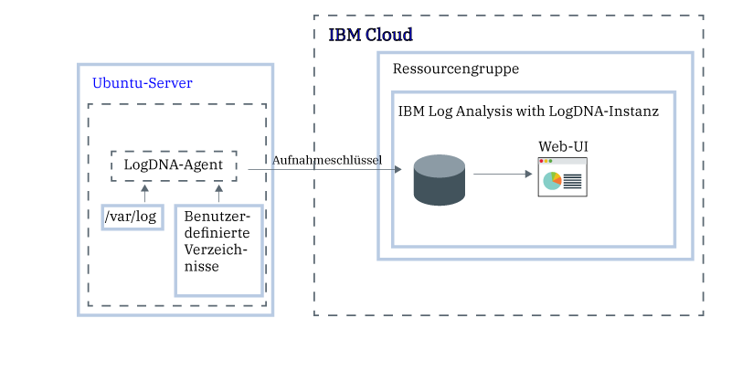

---

copyright:
  years:  2018, 2019
lastupdated: "2019-03-07"

keywords: LogDNA, IBM, Log Analysis, logging, getting started

subcollection: LogDNA

---

{:new_window: target="_blank"}
{:shortdesc: .shortdesc}
{:screen: .screen}
{:pre: .pre}
{:table: .aria-labeledby="caption"}
{:codeblock: .codeblock}
{:tip: .tip}
{:download: .download}
{:important: .important}
{:note: .note}

# Lernprogramm zur Einführung
{: #getting-started}

Mit {{site.data.keyword.la_full}} können Sie Ihre {{site.data.keyword.cloud_notm}}-Architektur um Protokollmanagementfunktionalität erweitern. {{site.data.keyword.la_full_notm}} wird von LogDNA in Kooperation mit {{site.data.keyword.IBM_notm}} betrieben.
{:shortdesc}

## Schritt 1. Vorbereitende Schritte
{: #getting-started_prereqs}

* Informieren Sie sich über {{site.data.keyword.la_full_notm}}. Weitere Informationen finden Sie in [Informationen zu {{site.data.keyword.la_full_notm}}](/docs/services/Log-Analysis-with-LogDNA?topic=LogDNA-about#about).
* Überprüfen Sie, in welchen Regionen der Service verfügbar ist. Weitere Informationen finden Sie unter [Regionen](/docs/services/Log-Analysis-with-LogDNA?topic=LogDNA-about#overview_regions).
* Besorgen Sie eine Benutzer-ID, die Mitglied oder Eigner eines {{site.data.keyword.cloud_notm}}-Kontos ist. 

    Um eine {{site.data.keyword.cloud_notm}}-Benutzer-ID anzufordern, klicken Sie auf [Registrierung](https://cloud.ibm.com/login){:new_window}.

## Schritt 2. Erste Schritte
{: #getting-started_step2}

Wählen Sie eine Cloudressource aus, für die Sie Protokolle verwalten wollen. Anschließend konfigurieren Sie diese Protokollquelle so, dass Sie die Protokolle über den {{site.data.keyword.la_full_notm}}-Service überwachen können. Die Protokollquelle kann sich in derselben Region befinden, in der Sie auch eine {{site.data.keyword.la_full_notm}}-Instanz bereitstellen, oder in einer anderen Region.

Die folgende Tabelle enthält eine Auflistung von Beispielen für Cloudressourcen, die Sie für die Speicherung und Verwaltung von Protokollen mithilfe des {{site.data.keyword.la_full_notm}}-Service konfigurieren können. Führen Sie als Einstieg in den {{site.data.keyword.loganalysisshort}}-Service das Lernprogramm für eine Ressource aus.

<table>
  <caption>Lernprogramme als Einstieg in die Arbeit mit dem {{site.data.keyword.la_full_notm}}-Service </caption>
  <tr>
    <th>Ressource</th>
    <th>Lernprogramm</th>
    <th>Umgebung</th>
    <th>Szenario</th>
  </tr>
  <tr>
    <td>Im {{site.data.keyword.containershort}} ausgeführte Container</td>
    <td>[Kubernetes-Clusterprotokolle mit {{site.data.keyword.la_full_notm}} verwalten](/docs/services/Log-Analysis-with-LogDNA?topic=LogDNA-kube#kube)</td>
    <td>{{site.data.keyword.cloud_notm}} Public </td>
    <td></td>
  </tr>
  <tr>
    <td>Linux Ubuntu, Linux Debian</td>
    <td>[Linux Ubuntu-Protokolle mit {{site.data.keyword.la_full_notm}} verwalten](/docs/services/Log-Analysis-with-LogDNA?topic=LogDNA-ubuntu#ubuntu)</td>
    <td>Lokal</td>
    <td></td>
  </tr>
</table>

## Schritt 3. Upgrade des Plans
{: #getting-started_step3}

Aktivieren Sie weitere Protokollierungsfunktionen.

Führen Sie ein Upgrade des Serviceplans für {{site.data.keyword.la_full_notm}} auf einen kostenpflichtigen Plan durch, damit Sie [Protokolle filtern](/docs/services/Log-Analysis-with-LogDNA?topic=LogDNA-view_logs#view_logs_step5), [Protokolle durchsuchen](/docs/services/Log-Analysis-with-LogDNA?topic=LogDNA-view_logs#view_logs_step6), [Ansichten definieren](/docs/services/Log-Analysis-with-LogDNA?topic=LogDNA-view_logs#view_logs_step7) und [Alerts konfigurieren](https://docs.logdna.com/docs/alerts) können. Weitere Informationen zu {{site.data.keyword.la_full_notm}}-Serviceplänen finden Sie in [Preisstrukturpläne](/docs/services/Log-Analysis-with-LogDNA?topic=LogDNA-about#overview_pricing_plans).

## Schritt 4. Nächste Schritte 
{: #getting-started_iam}

Als Nächstes steuern Sie den Benutzerzugriff mit IAM.

Stellen Sie fest, welche IAM-Richtlinien ein Benutzer für die Arbeit mit dem {{site.data.keyword.la_full_notm}}-Service benötigt.

Weitere Informationen zur Integration von IAM in den {{site.data.keyword.la_full_notm}}-Service finden Sie in [Benutzerzugriff mit IAM verwalten](/docs/services/Log-Analysis-with-LogDNA?topic=LogDNA-iam#iam).

Wählen Sie beispielsweise eine einzelne Benutzerrolle aus, um zu erfahren, wie diesem Benutzer Berechtigungen für die Arbeit mit dem {{site.data.keyword.la_full_notm}}-Service erteilt werden. 

| Benutzerrolle in {{site.data.keyword.cloud_notm}} | Weitere Informationen                     |
|-----------------------------------------------------|------------------------------------------|
| Kontoeigner                                       | [Berechtigungen erteilen, mit denen ein Benutzer Administrator des Service im {{site.data.keyword.cloud_notm}}-Konto werden kann](/docs/services/Log-Analysis-with-LogDNA?topic=LogDNA-work_iam#admin_account) |
| Plattformserviceadministrator im Konto       | [Berechtigungen erteilen, mit denen ein Benutzer Administrator des Service im {{site.data.keyword.cloud_notm}}-Konto werden kann](/docs/services/Log-Analysis-with-LogDNA?topic=LogDNA-work_iam#admin_account) |
| Plattformserviceadministrator in einer Ressourcengruppe  | [Berechtigungen erteilen, mit denen ein Benutzer Administrator des Service in einer Ressourcengruppe werden kann](/docs/services/Log-Analysis-with-LogDNA?topic=LogDNA-work_iam#admin_rg) |
| Plattform-DevOps-Operator im Konto           | [DevOps-Benutzer Berechtigungen zur Verwaltung des Service im {{site.data.keyword.cloud_notm}}-Konto erteilen](/docs/services/Log-Analysis-with-LogDNA?topic=LogDNA-work_iam#devops_account) |
| Plattform-DevOps-Operator in einer Ressourcengruppe        | [DevOps-Benutzer Berechtigungen zur Verwaltung des Service in einer Ressourcengruppe erteilen](/docs/services/Log-Analysis-with-LogDNA?topic=LogDNA-work_iam#devops_rg) |
| Serviceadministrator in LogDNA                     | [Berechtigungen zum Verwalten von Protokollen und zum Konfigurieren von Alerts in LogDNA erteilen](/docs/services/Log-Analysis-with-LogDNA?topic=LogDNA-work_iam#admin_user_logdna)              |
| Benutzer / Entwickler                                    | [Benutzer Berechtigungen zum Anzeigen und Verwalten von Protokollen in LogDNA erteilen](/docs/services/Log-Analysis-with-LogDNA?topic=LogDNA-work_iam#user_logdna)               |
{: caption="Tabelle 2. Cloudrollen in {{site.data.keyword.cloud_notm}}" caption-side="top"}

