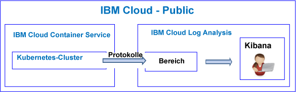
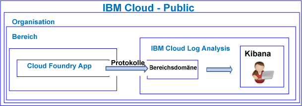

---

copyright:
  years: 2017, 2019

lastupdated: "2019-03-06"

keywords: IBM Cloud, logging

subcollection: cloudloganalysis

---

{:new_window: target="_blank"}
{:shortdesc: .shortdesc}
{:screen: .screen}
{:pre: .pre}
{:table: .aria-labeledby="caption"}
{:codeblock: .codeblock}
{:tip: .tip}
{:download: .download}
{:important: .important}
{:note: .note}

# Lernprogramm 'Einführung'
{: #getting-started-with-cla}

In diesem Lernprogramm werden Ihnen die ersten Schritte für die Arbeit mit dem {{site.data.keyword.loganalysislong}}-Service in {{site.data.keyword.Bluemix}} gezeigt. 
{:shortdesc}

{{site.data.keyword.Bluemix_notm}} bietet standardmäßig integrierte Protokollfunktionen für ausgewählte Services an. Mit dem {{site.data.keyword.loganalysisshort}}-Service können Sie Ihre Erfassungs- und Aufbewahrungsfunktionen beim Arbeiten mit Protokollen erweitern.

## Vorbereitende Schritte
{: #prereqs}

Sie müssen über eine Benutzer-ID verfügen, die ein Mitglied oder Eigner eines {{site.data.keyword.Bluemix_notm}}-Kontos ist. Um eine {{site.data.keyword.Bluemix_notm}}-Benutzer-ID zu erhalten, wechseln Sie zu [Registrierung ](https://console.bluemix.net/registration/){:new_window}

## Schritt 1: Wählen Sie eine Cloud-Ressource aus, für die Sie Protokolle anzeigen möchten.
{: #step1}

In {{site.data.keyword.Bluemix_notm}} (CF-Anwendungen) sammeln Container, die auf {{site.data.keyword.containershort}} ausgeführt werden, und ausgewählte Services automatisch Protokolldaten und leiten sie an den {{site.data.keyword.loganalysisshort}}-Service weiter.

In der folgenden Tabelle sind die verschiedenen Cloudressourcen aufgelistet. Absolvieren Sie das Lernprogramm, um mit der Arbeit mit dem {{site.data.keyword.loganalysisshort}}-Service zu beginnen:

<table>
  <caption>Lernprogramme für die ersten Schritte in der Arbeit mit dem {{site.data.keyword.loganalysisshort}}-Service </caption>
  <tr>
    <th>Ressource</th>
    <th>Lernprogramm</th>
    <th>Cloudumgebung</th>
    <th>Szenario</th>
  </tr>
  <tr>
    <td>Containers, die in {{site.data.keyword.containershort}} ausgeführt werden</td>
    <td>[Protokolle in Kibana für eine App analysieren, die in einem Kubernetes-Cluster bereitgestellt ist](/docs/services/CloudLogAnalysis/tutorials/container_logs.html#container_logs)</td>
    <td>Public </br>Dedicated</td>
    <td></td>
  </tr>
  <tr>
    <td>CF-Apps</td>
    <td>[Protokolle in Kibana für eine Cloud Foundry-App analysieren](https://console.bluemix.net/docs/tutorials/application-log-analysis.html#generate-access-and-analyze-application-logs)</td>
    <td>Public</td>
    <td></td>
  </tr>
</table>


## Schritt 2: Berechtigungen für einen Benutzer einrichten, damit dieser Protokolle anzeigen kann
{: #step24}

Um die Aktionen in {{site.data.keyword.loganalysisshort}} zu steuern, die ein Benutzer ausführen darf, können Sie einem Benutzer Rollen und Richtlinien zuweisen. 

In {{site.data.keyword.Bluemix_notm}} gibt es zwei Typen von Sicherheitsberechtigungen, die die Aktionen steuern, die Benutzer bei der Arbeit mit dem {{site.data.keyword.loganalysisshort}}-Service ausführen können:

* Cloud Foundry (CF)-Rollen: Sie erteilen einem Benutzer eine CF-Rolle, um die Berechtigungen des Benutzers für die Anzeige von Protokollen in einem Bereich zu definieren.
* IAM-Rollen: Sie erteilen einem Benutzer eine IAM-Richtlinie, um die Berechtigungen des Benutzers für die Anzeige von Protokollen in der Kontodomäne zu definieren. 

### Berechtigungen für einen Benutzer einrichten, damit dieser Protokolle in einer Bereichsdomäne anzeigen kann
{: #step42a}

Führen Sie die folgenden Schritte aus, um einem Benutzer Berechtigungen zur Anzeige von Protokollen in einem Bereich zu erteilen:

1. Melden Sie sich bei der {{site.data.keyword.Bluemix_notm}}-Konsole an.

    Öffnen Sie einen Web-Browser und starten Sie das {{site.data.keyword.Bluemix_notm}}-Dashboard: [http://bluemix.net ](http://bluemix.net){:new_window}
	
	Nach der Anmeldung mit Ihrer Benutzer-ID und Ihrem Kennwort wird die {{site.data.keyword.Bluemix_notm}}-Benutzerschnittstelle geöffnet.

2. Klicken Sie in der Menüleiste auf **Verwalten > Konto > Benutzer**. 

    Im Fenster *Benutzer* wird eine Liste mit Benutzern und den entsprechenden E-Mail-Adressen für das aktuell ausgewählte Konto angezeigt.
	
3. Wenn der Benutzer ein Mitglied des Kontos ist, wählen Sie den Benutzernamen aus der Liste aus oder klicken Sie im Menü *Aktionen* auf **Benutzer verwalten**.

    Wenn der Benutzer kein Mitglied des Kontos ist, finden Sie unter [Benutzer einladen](/docs/iam/iamuserinv.html#iamuserinv) Informationen zum entsprechenden Vorgehen in diesem Fall.

4. Wählen Sie **Cloud Foundry-Zugriff** und anschließend die Organisation aus.

    Die in dieser Organisation verfügbaren Bereiche werden aufgelistet.

5. Wählen Sie den Bereich aus, in dem Sie den {{site.data.keyword.loganalysisshort}}-Service bereitgestellt haben. Anschließend wählen Sie aus der Menüaktion **Bereichsrolle bearbeiten** aus.

6. Wählen Sie *Prüfer* aus. 

    Sie können eine oder mehrere Bereichsrollen auswählen. Alle folgenden Rollen ermöglichen einem Benutzer die Anzeige von Protokollen: *Manager*, *Entwickler* und *Prüfer*
	
7. Klicken Sie auf **Rolle speichern**.


### Berechtigungen für einen Benutzer einrichten, damit dieser Protokolle in einer Kontodomäne anzeigen kann
{: #step24b}


Führen Sie die folgenden Schritte aus, um einem Benutzer Berechtigungen zur Anzeige von Kontoprotokollen zu erteilen: 

1. Melden Sie sich bei der {{site.data.keyword.Bluemix_notm}}-Konsole an.

    Öffnen Sie einen Web-Browser und starten Sie das {{site.data.keyword.Bluemix_notm}}-Dashboard: [http://bluemix.net ](http://bluemix.net){:new_window}
	
	Nach der Anmeldung mit Ihrer Benutzer-ID und Ihrem Kennwort wird die {{site.data.keyword.Bluemix_notm}}-Benutzerschnittstelle geöffnet.

2. Klicken Sie in der Menüleiste auf **Verwalten > Konto > Benutzer**. 

    Im Fenster *Benutzer* wird eine Liste mit Benutzern und den entsprechenden E-Mail-Adressen für das aktuell ausgewählte Konto angezeigt.
	
3. Wenn der Benutzer ein Mitglied des Kontos ist, wählen Sie den Benutzernamen aus der Liste aus oder klicken Sie im Menü *Aktionen* auf **Benutzer verwalten**.

    Wenn der Benutzer kein Mitglied des Kontos ist, finden Sie unter [Benutzer einladen](/docs/iam/iamuserinv.html#iamuserinv) Informationen zum entsprechenden Vorgehen in diesem Fall.

4. Klicken Sie im Abschnitt **Zugriffsrichtlinien** auf **Zugriff zuweisen** und wählen Sie anschließend **Zugriff auf Ressourcen zuweisen**.

    Das Fenster *Ressourcenzugriff an Benutzer zuweisen** wird geöffnet.

5. Geben Sie Informationen zu der Richtlinie ein. In der folgenden Tabelle sind die Felder aufgeführt, die zum Definieren einer Richtlinie erforderlich sind: 

    <table>
	  <caption>Liste von Feldern für die Konfiguration einer IAM-Richtlinie.</caption>
	  <tr>
	    <th>Feld</th>
		<th>Wert</th>
	  </tr>
	  <tr>
	    <td>Services</td>
		<td>*IBM Cloud Log Analysis*</td>
	  </tr>	  
	  <tr>
	    <td>Regionen</td>
		<td>Sie können die Regionen angeben, für die der Benutzer Zugriff für die Arbeit mit Protokollen erhält. Wählen Sie nacheinander eine oder mehrere Regionen aus oder wählen Sie **Alle aktuellen Regionen** aus, um Zugriff auf alle Regionen zu erteilen.</td>
	  </tr>
	  <tr>
	    <td>Serviceinstanz</td>
		<td>Wählen Sie *Alle Serviceinstanzen* aus.</td>
	  </tr>
	  <tr>
	    <td>Rollen</td>
		<td>Wählen Sie eine oder mehrere IAM-Rollen aus. <br>Gültige Rollen sind: *Administrator*, *Operator*, *Editor* und *Anzeigeberechtigter*. <br>Weitere Informationen zu den Aktionen, die pro Rolle zulässig sind, finden Sie unter [IAM-Rollen](/docs/services/CloudLogAnalysis/security_ov.html#iam_roles).
		</td>
	  </tr>
     </table>
	
6. Klicken Sie auf **Zuweisen**.
	
Die von Ihnen konfigurierte Richtlinie gilt für die ausgewählten Regionen. 


## Nächste Schritte 
{: #next_steps}

**Hinweis:** Ein Benutzer muss über Zugriff auf Kibana in der Public-Cloud-Region verfügen, in der die Protokolldaten angezeigt und analysiert werden können.  

Um beispielsweise in der Region "USA (Süden)" Kibana zu starten, öffnen Sie einen Web-Browser und geben Sie die folgende URL ein:

```
https://logging.ng.bluemix.net/ 
```
{: codeblock}


Weitere Informationen zum Starten von Kibana in anderen Regionen finden Sie unter [Von einem Web-Browser zu Kibana navigieren](/docs/services/CloudLogAnalysis/kibana/launch.html#launch_Kibana_from_browser).

**Hinweis:** Wenn Sie Kibana starten und die Nachricht *bearer token not valid* (Bearer-Token ungültig) erhalten, überprüfen Sie Ihre Berechtigungen für das Konto. Diese Nachricht weist darauf hin, dass Ihre Benutzer-ID nicht über die Berechtigungen zur Anzeige von Protokollen verfügt.

Passen Sie als nächsten Schritt Kibana an, um Ihre Protokolldaten anzuzeigen und zu analysieren. Weitere Informationen finden Sie unter [Protokolle anzeigen und analysieren](/docs/services/CloudLogAnalysis/kibana/analyzing_logs_Kibana.html#analyzing_logs_Kibana).
    


