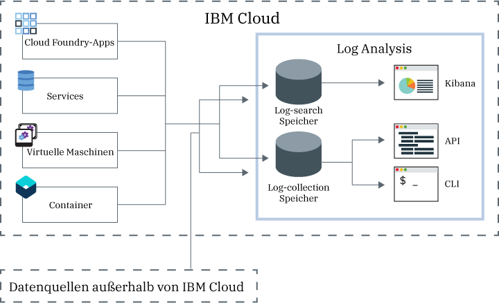

---

copyright:
  years: 2017, 2019

lastupdated: "2019-03-06"

keywords: IBM Cloud, logging

subcollection: cloudloganalysis

---

{:new_window: target="_blank"}
{:shortdesc: .shortdesc}
{:screen: .screen}
{:pre: .pre}
{:table: .aria-labeledby="caption"}
{:codeblock: .codeblock}
{:tip: .tip}
{:download: .download}
{:important: .important}
{:note: .note}

# IBM Cloud Log Analysis
{: #log_analysis_ov}

Verwenden Sie den {{site.data.keyword.loganalysisfull}}-Service, um die Funktionen für die Protokollerfassung (Log Collection), Protokollaufbewahrung (Log Retention) und die Suche in Protokollen (Log Search) in {{site.data.keyword.Bluemix}} zu erweitern. Unterstützen Sie Ihr DevOps-Team mit folgender Funktionalität: Zusammenfassung von Anwendungs- und Umgebungsprotokollen zur Konsolidierung der Anwendungs- und Umgebungsinformationen, Verschlüsselung von Protokollen, Aufbewahrung von Protokolldaten, solange dies erforderlich ist, sowie schnelle Erkennung und Behebung von Problemen. Verwenden Sie Kibana für erweiterte Analysetasks.
{:shortdesc}

Die {{site.data.keyword.Bluemix_notm}}-Protokollierungsfunktionen sind in die Plattform integriert:

* Die Datenerfassung wird automatisch für Cloudressourcen aktiviert. {{site.data.keyword.Bluemix_notm}} ermöglicht die Erfassung und Anzeige von Protokollen für Ihre Apps sowie für die App-Laufzeitumgebungen und Rechenlaufzeitumgebungen, in denen diese Apps ausgeführt werden. 
* Sie können bis zu 500 MB Protokolldaten pro Tag zu durchsuchen. 
* Die Protokolle für die letzten drei Tage werden in 'Log Search' gespeichert, einer Komponente des {{site.data.keyword.loganalysisshort}}-Service.

Mithilfe der Protokollierungsfunktionen in {{site.data.keyword.Bluemix_notm}} können Sie das Verhalten der Cloudplattform und der Ressourcen, die in ihr ausgeführt werden, untersuchen. Es ist keine spezielle Instrumentierung für die Erfassung der STDOUT- und STDERR-Protokolle erforderlich. Beispielsweise können Sie Protokolle verwenden, um Prüfaufzeichnungen (Audit Trail) für eine Anwendung zu erstellen, um Probleme in Ihrem Service zu erkennen, um Sicherheitslücken zu bestimmen, Fehler in den bereitgestellten Apps und im Laufzeitverhalten zu beheben, um Probleme in der Infrastruktur, in der Ihre App ausgeführt wird, zu erkennen, um einen komponentenübergreifenden Trace in der Cloudplattform durchzuführen und um Muster zu erkennen, anhand derer Sie Situationen entgegenwirken können, die Ihr Service-SLA beeinträchtigen könnten.

Der {{site.data.keyword.loganalysisfull}}-Service stellt Protokollerfassungs- und Protokollsuchservices ('Log Collection' und 'Log Search') für die {{site.data.keyword.Bluemix_notm}}-Plattform zur Verfügung. Dabei werden automatisch Daten von Anwendungen und {{site.data.keyword.Bluemix_notm}}-Services aus ausgewählten {{site.data.keyword.Bluemix_notm}}-Services erfasst.

Die folgende Abbildung zeigt eine Übersicht über den {{site.data.keyword.loganalysisshort}}-Service: 

Zum Erfassen und Durchsuchen von Protokollen für Cloudressourcen, die in einem Bereich ausgeführt werden, müssen Sie eine Instanz des {{site.data.keyword.loganalysisshort}}-Service in demselben Bereich einrichten, in dem diese Cloudressourcen ausgeführt werden. Protokolle werden standardmäßig in 'Log Search' erfasst und gespeichert. Wenn Sie einen Serviceplan auswählen, der erweiterte Such- und Erfassungsfunktionen enthält, werden die Protokolle auch in 'Log Collection' erfasst und gespeichert. Die in 'Log Collection' gespeicherten Protokolldaten werden verschlüsselt.

Standardmäßig speichert {{site.data.keyword.Bluemix_notm}} Protokolldaten für bis zu drei Tage in 'Log Search'.   

* Maximal werden 500 MB pro Datenbereich und Tag gespeichert. Alle Protokolle oberhalb der Kapazitätsgrenze von 500 MB werden nicht berücksichtigt. Die Kapazitätsgrenze wird täglich um 12:30 AM (UTC) zurückgesetzt.
* Bis zu 1,5 GB Daten können für einen Zeitraum von maximal 3 Tagen durchsucht werden. Das Rollover der Protokolldaten (First In, First Out) erfolgt bei 1,5 GB an Daten oder nach drei Tagen.

Der {{site.data.keyword.loganalysisshort}}-Service bietet zusätzliche Pläne, mit denen Sie Protokolle so lange wie erforderlich in 'Log Collection' speichern können. Die Größe der Protokolle, die Sie in 'Log Collection' erfassen und speichern können, richtet sich nach dem von Ihnen gewählten Serviceplan. Der Preis für die Datenspeicherung richtet sich nach der Menge der gespeicherten Daten (GB pro Monat). Protokolle werden in 'Log Collection' im JSON-Format gespeichert.

Sie können Kibana 5.1 für erweiterte Tasks zur Log Search-Analyse verwenden:

* Jeder Plan begrenzt die Protokollgröße, die Sie pro Tag durchsuchen können. 
* Es werden nur die Daten der letzten drei Tage durchsucht.

Für den Zugriff auf Protokolle, die älter als drei Tage sind, können Sie die Befehlszeilenschnittstelle oder API von 'Log Collection' verwenden, um Protokolle lokal herunterladen, oder Sie können Protokolle an andere Anwendungen oder an Cloud-Services anderer Anbieter umleiten. 

Sie können Protokolle automatisch durch Festlegen einer Aufbewahrungsrichtlinie oder manuell über die Befehlszeilenschnittstelle von {{site.data.keyword.loganalysisshort}} löschen.

## Zweck des Log Analysis-Service
{: #value}

1. **Investieren Sie weniger Zeit in die Instrumentierung Ihrer Anwendung - konzentrieren Sie sich stattdessen darauf, den Nutzen Ihrer Anwendung zu steigern.**

    {{site.data.keyword.loganalysislong_notm}} erfasst automatisch Daten aus ausgewählten {{site.data.keyword.Bluemix_notm}}-Services - es ist keine Instrumentierung erforderlich.
	
	Sie können die Anzahl der Protokolle festlegen, die Sie pro Tag durchsuchen können.  Zum Durchsuchen von Protokollen bestehend aus 500 MB, 2 GB, 5 GB und 10 GB pro Tag stehen unterschiedliche Pläne zur Verfügung.

2. **Halten Sie die Protokolldaten in der Nähe Ihrer Anwendungen und schützen Sie sie durch wirtschaftliche cloudbasierte Speicherlösungen.**

    Sie können Protokolldaten von traditionellen und microservicegesteuerten Anwendungen, die in {{site.data.keyword.Bluemix_notm}} ausgeführt werden, in einem zentralen Protokoll speichern. Bewahren Sie die Protokolldaten so lange auf wie nötig.
	
	Protokolle werden im {{site.data.keyword.IBM_notm}} Cloud-Speicher gespeichert. Sie können die Protokolle bei Bedarf herunterladen.

3. **Machen Sie sich mit Ihrer Umgebung vertraut, um Probleme schnell erkennen, diagnostizieren und identifizieren zu können.**

    Sie können konfigurierbare Dashboards verwenden, um Ihre Daten zu visualisieren, zu analysieren und mit ihnen zu interagieren. Protokollsuchfunktionen auf der Basis der Elastic Stack-Plattform bieten die Vorteile der Flexibilität und Vertrautheit von Kibana und damit die Möglichkeit, in kürzester Zeit ein Dashboard entsprechend den Anwendungsanforderungen zu erstellen.

4. **Leistungsfähige Integration mit APIs**

    Über die APIs des Service können Sie die Protokolldaten in Ihre Anwendungen und Operationen integrieren. Verwenden Sie die APIs des {{site.data.keyword.loganalysisshort}}-Service zum Verwalten der aufbewahrten Protokolle und zum Senden von Protokolldaten von außerhalb der {{site.data.keyword.IBM_notm}} Cloud.

## Regionen
{: #regions}

Der {{site.data.keyword.loganalysisfull_notm}}-Service ist in den folgenden Regionen verfügbar:

* Deutschland
* Vereinigtes Königreich
* USA (Süden)
* Sydney

## Datenlokalität
{: #data_location}

In der folgenden Tabelle sind die Speicherpositionen von Protokollen nach Region aufgeführt:

<table>
  <caption>Speicherposition von Protokollen nach Region</caption>
  <tr>
    <th>Region</th>
	<th>'Log Search'-Protokolle</th>
	<th>'Log Collection'-Protokolle</th>
  </tr>
  <tr>
    <td>Deutschland</td>
	  <td>Gehostet in Deutschland</td>
	  <td>Gehostet in Deutschland</td>
  </tr>
  <tr>
    <td>Vereinigtes Königreich</td>
	  <td>Gehostet im Vereinigten Königreich</td>
	  <td>Gehostet im Vereinigten Königreich</td>
  </tr>
  <tr>
    <td>USA (Süden)</td>
	  <td>Gehostet in den USA (Süden)</td>
	  <td>Gehostet in den USA (Süden)</td>
  </tr>
  <tr>
    <td>Sydney</td>
	  <td>Gehostet in Sydney</td>
	  <td>Gehostet in den USA (Süden) (*)</td>
  </tr>
</table>

(*) Für Sydney werden 'Log Collection'-Protokolle momentan in der Region 'USA (Süden)' gehostet. Die Datenlokalität von 'Log Collection'-Protokollen in Sydney ist aber in der Planung.

## Servicepläne
{: #plans}

Der {{site.data.keyword.loganalysisshort}}-Service bietet mehrere Pläne. Die Pläne beinhalten unterschiedliche Funktionen von 'Log Collection' und 'Log Search'. 

**HINWEIS:** Die in einem Serviceplan enthaltenen Funktionen werden nur in dem Bereich aktiviert, in dem Sie den {{site.data.keyword.loganalysisshort}}-Service mit diesem Plan bereitgestellt haben.

Sie können einen Plan über die {{site.data.keyword.Bluemix_notm}}-Benutzerschnittstelle oder über die Befehlszeile ändern. Sie können Ihren Plan jederzeit aktualisieren oder reduzieren. Weitere Informationen zu Upgrades für Servicepläne finden Sie unter [Plan ändern](/docs/services/CloudLogAnalysis/how-to/change_plan.html#change_plan). 

In der folgenden Tabelle werden die verfügbaren Pläne beschrieben:

<table>
    <caption>Übersicht über die Funktionen von 'Log Search' und 'Log Collection' nach Plan</caption>
      <tr>
        <th>Plan</th>
        <th>Einpflegen</th>
        <th>Aufbewahren</th>
        <th>Verschlüsseln</th>
        <th>Durchsuchen</th>
      </tr>
      <tr>
        <td>Lite (Standard)</td>
        <td>Nein</td>
        <td>Letzte drei Tage</td>
        <td>Nein</td>
        <td>Suche: Bis 500 MB</td>
      </tr>
      <tr>
        <td>Log Collection</td>
        <td>Ja</td>
        <td>Konfigurierbare Anzahl von Tagen.</td>
        <td>Ja</td>
        <td>Suche: Bis 500 MB pro Tag</td>
      </tr>
      <tr>
        <td>Log Collection mit Suche bis 2GB/Tag</td>
        <td>Ja</td>
        <td>Konfigurierbare Anzahl von Tagen.</td>
        <td>Ja</td>
        <td>Suche: Bis 2 GB pro Tag</td>
      </tr>
      <tr>
        <td>Log Collection mit Suche bis 5GB/Tag</td>
        <td>Ja</td>
        <td>Konfigurierbare Anzahl von Tagen.</td>
        <td>Ja</td>
        <td>Suche: Bis 5 GB pro Tag</td>
      </tr>
       <tr>
        <td>Log Collection mit Suche bis 10GB/Tag</td>
        <td>Ja</td>
        <td>Konfigurierbare Anzahl von Tagen.</td>
        <td>Ja</td>
        <td>Suche: Bis 10 GB pro Tag</td>
      </tr>
</table>

**Hinweis:** Für die Berechnung der monatlichen Kosten des Log Collection-Speichers wird der Durchschnitt des Abrechnungszyklus verwendet.

