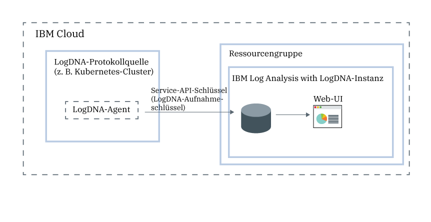

---

copyright:
  years:  2018, 2019
lastupdated: "2019-03-23"

keywords: LogDNA, IBM, Log Analysis, logging, overview

subcollection: LogDNA

---

{:new_window: target="_blank"}
{:shortdesc: .shortdesc}
{:screen: .screen}
{:pre: .pre}
{:table: .aria-labeledby="caption"}
{:codeblock: .codeblock}
{:tip: .tip}
{:download: .download}
{:important: .important}
{:note: .note}

# Informationen zu {{site.data.keyword.la_full_notm}}
{: #about}

{{site.data.keyword.la_full}} ist ein Service eines anderen Anbieters, den Sie in Ihre {{site.data.keyword.cloud_notm}}-Architektur integrieren können, um diese um Protokollmanagementfunktionalität zu erweitern. {{site.data.keyword.la_full_notm}} wird von LogDNA in Kooperation mit {{site.data.keyword.IBM_notm}} betrieben.
{:shortdesc}

Mit {{site.data.keyword.la_full_notm}} können Sie System- und Anwendungsprotokolle in {{site.data.keyword.cloud_notm}} verwalten.

{{site.data.keyword.la_full_notm}} bietet Administratoren, DevOps-Teams und Entwicklern erweiterte Features zum Filtern, Durchsuchen und Protokoll-Tailing (Liveanzeige der aktuellen letzten Protokollzeilen), zum Definieren von Alerts und zum Entwerfen von angepassten Ansichten für die Überwachung von Anwendungs- und Systemprotokollen.

## Übersicht
{: #ov}

Um Protokollierungsfunktionen mit LogDNA in {{site.data.keyword.cloud_notm}} hinzuzufügen, müssen Sie eine Instanz von {{site.data.keyword.la_full_notm}} bereitstellen.

Bevor Sie eine {{site.data.keyword.la_full_notm}}-Instanz bereitstellen, müssen Sie die folgenden Informationen berücksichtigen:
* Protokolldaten werden in {{site.data.keyword.cloud_notm}} gehostet.
* Protokolldaten werden an einen Drittanbieter gesendet.
* Ihre Benutzer müssen über Plattformberechtigungen für die Erstellung, das Anzeigen und das Löschen einer Serviceinstanz in {{site.data.keyword.cloud_notm}} verfügen.
* Ihre Benutzer müssen über Plattformberechtigungen für die Erstellung von Ressourcen im Kontext der Ressourcengruppe verfügen, in der Sie die LogDNA-Instanz bereitstellen wollen.

Sie stellen eine {{site.data.keyword.la_full_notm}}-Instanz im Kontext einer Ressourcengruppe bereit. Sie verwenden Ressourcengruppen zur Verwaltung Ihrer Services für Zugriffssteuerungs- und Abrechnungszwecke. Sie können die Instanz in der Ressourcengruppe *Standard* oder in einer benutzerdefinierten Ressourcengruppe bereitstellen.

Nachdem Sie eine Instanz von {{site.data.keyword.la_full_notm}} bereitgestellt haben, wird ein Konto in LogDNA erstellt und Sie erhalten den Aufnahmeschlüssel für Ihr Konto. 

Anschließend müssen Sie einen LogDNA-Agenten für jede Protokollquelle konfigurieren. Eine Protokollquelle ist eine Cloudressource oder eine lokale Ressource, die Protokolle generiert. Eine Protokollquelle kann z. B. ein Kubernetes-Cluster sein. Mit dem Aufnahmeschlüssel konfigurieren Sie den LogDNA-Agenten, der für die Erfassung und Weiterleitung von Protokollen an Ihre {{site.data.keyword.la_full_notm}}-Instanz zuständig ist.

Nach der Implementierung des LogDNA-Agenten in einer Protokollquelle finden Erfassung und Weiterleitung von Protokollen an die {{site.data.keyword.la_full_notm}}-Instanz automatisch statt.

Sie können die Webbenutzerschnittstelle von {{site.data.keyword.la_full_notm}} starten, um Ihre Protokolle anzuzeigen, zu überwachen und zu verwalten.

Die folgende Abbildung zeigt die Komponentenübersicht für den in {{site.data.keyword.cloud_notm}} ausgeführten {{site.data.keyword.la_full_notm}}-Service.

## Protokolldaten
{: #overview_data}

Protokolle werden von {{site.data.keyword.la_full_notm}} in einem einzigen zentralen Protokollierungssystem gesammelt und zusammengefasst.

* Protokolldaten werden in {{site.data.keyword.cloud_notm}} gehostet.
* Daten werden in der Region zusammengefasst, in der die {{site.data.keyword.la_full_notm}}-Instanz bereitgestellt wird. Beispielsweise werden Protokolldaten für eine in US South bereitgestellte Instanz in der Region US South gehostet.

Der Serviceplan, den Sie für eine {{site.data.keyword.la_full_notm}}-Instanz auswählen, legt den Zeitraum (Tage) fest, über den Daten in LogDNA gespeichert und aufbewahrt werden. Wenn Sie z. B. den Plan *Kostenfrei* auswählen, werden Daten überhaupt nicht gespeichert. Wenn Sie jedoch den 7-Tage-Plan auswählen, werden die Daten für 7 Tage gespeichert und Sie können über die LogDNA-Webbenutzerschnittstelle darauf zugreifen.

Wenn Sie eine {{site.data.keyword.la_full_notm}}-Instanz aus {{site.data.keyword.cloud_notm}} löschen, werden alle Daten gelöscht.

## Features
{: #overview_features}

**Protokollfehlerbehebung in Echtzeit zur Diagnose von Fehlern und Ermittlung von Problemen. **

Mithilfe des Features *Tailing-Feature für Live-Streaming* können Entwickler und DevOps-Teams über eine einzelne Ansicht Probleme diagnostizieren, Stack-Traces und Ausnahmen analysieren, Fehlerursachen identifizieren und verschiedene Protokollquellen überwachen. Dieses Feature steht über die Befehlszeile und über die Webschnittstelle zur Verfügung.

**Ausgabe von Alerts zur Benachrichtigung über wichtige Aktionen. **
Damit eine schnelle Reaktion auf Anwendungs- und Serviceereignisse, die Sie als kritische Ereignisse oder Warnungen identifizieren, möglich ist, können DevOps-Teams die Integration der Alertbenachrichtigung in den folgenden Systemen konfigurieren: E-Mail, Slack, HipChat, webHook, PagerDuty und OpsGenie.

**Export von Protokollen in eine lokale Datei zur Analyse oder in einen Archivservice zur Einhaltung von Prüfvorschriften. **

Exportieren Sie bestimmte Protokollzeilen in eine lokale Kopie oder archivieren Sie Protokolle aus {{site.data.keyword.la_full_notm}} in IBM Cloud Object Storage.
Protokollzeilen werden im JSON-Zeilenformat exportiert. Protokolle werden im JSON-Formatierung archiviert und die Metadaten, die jeder Zeile zugeordnet sind, bleiben erhalten.

**Steuerung der Infrastrukturkosten für die Protokollierung durch Festlegung der Protokolle, die durch {{site.data.keyword.la_full_notm}} verwaltet werden sollen. **

Steuern Sie die Kosten für Ihre Protokollierungsinfrastruktur in IBM Cloud durch eine Konfiguration der Protokollquellen, für die Protokolle erfasst und verwaltet werden sollen.

## Preisstrukturpläne
{: #overview_pricing_plans}

Es stehen verschiedene Preisstrukturpläne zur Verfügung, die Sie für eine {{site.data.keyword.la_full_notm}}-Instanz auswählen können. Jeder Plan legt den Zeitraum in Tagen fest, über den Daten für Suchvorgänge aufbewahrt werden, sowie die Anzahl der Benutzer, die die Daten verwalten dürfen, und die aktivierten LogDNA-Features.

| Plan                     | 
|--------------------------|
| `Protokollsuche für einen Zeitraum von 30 Tagen`  |
| `Protokollsuche für einen Zeitraum von 14 Tagen`  |
| `Protokollsuche für einen Zeitraum von 7 Tagen`   |
| `Lite`                  |
{: caption="Tabelle 1. Liste der Servicepläne" caption-side="top"} 

{{site.data.keyword.la_full_notm}} bietet einen Plan `Lite` an, mit dem Sie Ihre Protokolle beim Durchlaufen des Systems anzeigen können. Sie können Protokolle mithilfe des Protokoll-Tailings (Liveanzeige der aktuellen letzten Protokollzeilen) anzeigen. Darüber hinaus können Sie zur Vorbereitung auf ein Upgrade auf einen Plan mit einem längeren Aufbewahrungszeitraum Filter entwerfen. Dieser Plan hat einen Aufbewahrungszeitraum von 0 Tagen.

In den folgenden Tabellen werden die verschiedenen Features beschrieben, die die jeweiligen Servicepläne enthalten.

| Feature                          | Plan mit `Protokollsuche für einen Zeitraum von 30 Tagen` | Plan mit `Protokollsuche für einen Zeitraum von 14 Tagen`    | Plan mit `Protokollsuche für einen Zeitraum von 7 Tagen`  | Plan Lite | 
|----------------------------------|-------------------------|-------------------------------|-----------------------------|--------------|
| `Protokolle werden gespeichert und können durchsucht werden` | Ja - 30 Tage lang       | Ja - 14 Tage lang             | Ja - 7 Tage lang            | Nein           |
| `Tailing-Feature für Live-Streaming`            | Ja                     | Ja                           | Ja                         | Ja          |
| `Archivierung`                      | Ja                     | Ja                           | Ja                         | Nein           |
| `Mehrkanal-Alerting`         | Ja                     | Ja                           | Ja                         | Nein           | 
{: caption="Tabelle 2. Liste der für jeden Serviceplan verfügbaren Features" caption-side="top"} 

## Regionen
{: #overview_regions}

Die Protokollierung mit {{site.data.keyword.la_full_notm}} ist in den folgenden Regionen verfügbar:

| Region                | Standort  |
|-----------------------|-----------|
| **US South**          | Dallas    |
| **EU-DE**             | Frankfurt | 
{: caption="Tabelle 3. Liste der Regionen, in denen der Service verfügbar ist" caption-side="top"} 

Derzeit gibt es für den Standort **Frankfurt** **keine** EU-bezogene Verwaltung. Weitere Informationen finden Sie in [Einstellung 'Unterstützung in der EU' aktivieren](/docs/account?topic=account-eu-hipaa-supported#bill_eusupported).
{: important}

