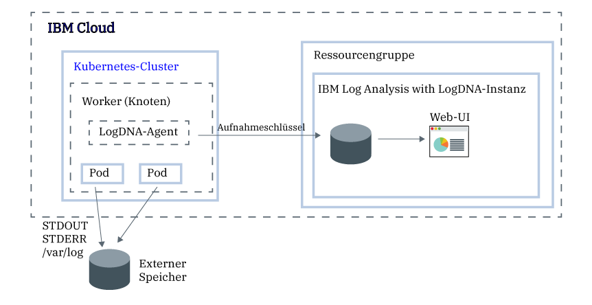

---

copyright:
  years:  2018, 2019
lastupdated: "2019-05-01"

keywords: LogDNA, IBM, Log Analysis, logging, kubernetes, tutorial

subcollection: LogDNA

---

{:new_window: target="_blank"}
{:shortdesc: .shortdesc}
{:screen: .screen}
{:pre: .pre}
{:table: .aria-labeledby="caption"}
{:codeblock: .codeblock}
{:tip: .tip}
{:download: .download}
{:important: .important}
{:note: .note}


# Kubernetes-Clusterprotokolle mit {{site.data.keyword.la_full_notm}} verwalten
{: #kube}

Verwenden Sie den {{site.data.keyword.la_full_notm}}-Service, um die Protokollierung auf Clusterebene in {{site.data.keyword.containerlong}} zu konfigurieren. 
{:shortdesc}

Sofort nach der Bereitstellung eines Clusters mit {{site.data.keyword.containerlong_notm}} müssen Sie wissen, was in dem Cluster passiert. Sie müssen auf Protokolle zugreifen, um Fehler zu beheben und Probleme zu vermeiden. Sie müssen jederzeit Zugriff auf verschiedene Protokolltypen haben, z. B. Worker-Protokolle, App-Protokolle und Netzprotokolle. Außerdem wollen Sie verschiedene Protokolldatenquellen in Ihrem Kubernetes-Cluster überwachen. Daher ist es von entscheidender Bedeutung, dass Sie in der Lage sind, auf Protokollsätze aus allen diesen Quellen zuzugreifen und diese zu verwalten. Ihr Erfolg bei der Verwaltung und Überwachung von Protokollen ist davon abhängig, wie Sie die Protokollierungsfunktionen für Ihre Kubernetes-Plattform konfigurieren.

Bei der Konfiguration der Protokollierung auf Clusterebene für einen Kubernetes-Cluster sind die folgenden Informationen zu berücksichtigen:

* Sie müssen Protokolldaten, Systemprotokolle und containerisierte Anwendungsprotokolle außerhab der Kubernetes-Systemkomponenten in separatem Speicher speichern können.
* Sie müssen einen Protokollierungsagenten auf jedem Workerknoten in Ihrem Cluster implementieren. Dieser Agent erfasst Protokolle und leitet sie an ein externes Protokollierungs-Back-End weiter.
* Sie müssen in der Lage sein, Protokolldaten zur Analyse in einem externen Protokollierungs-Back-End zentral zusammenzufassen.


Führen Sie in {{site.data.keyword.cloud_notm}} die folgenden Schritte aus, um die Protokollierung auf Clusterebene für einen Kubernetes-Cluster zu konfigurieren:

1. Stellen Sie eine Instanz des {{site.data.keyword.la_full_notm}}-Service bereit. Mit diesem Schritt konfigurieren Sie ein zentrales Protokollmanagementsystem, in dem Protokolldaten in {{site.data.keyword.cloud_notm}} gehostet werden.
2. Stellen Sie einen Cluster im {{site.data.keyword.containerlong_notm}} bereit. Kubernetes v1.9+-Cluster werden unterstützt.
3. Konfigurieren Sie den LogDNA-Agenten auf jedem Worker (Knoten) in einem Cluster.



In diesem Lernprogramm erfahren Sie, wie die Protokollierung auf Clusterebene konfiguriert wird.

## Vorbereitende Schritte
{: #kube_prereqs}

Arbeiten Sie in einer [unterstützten Region](/docs/services/Log-Analysis-with-LogDNA/tutorials?topic=LogDNA-about#overview_regions). **Anmerkung:** Sie können Daten aus einem Kubernetes-Cluster senden, der sich in derselben Region oder in einer anderen Region befindet. 

Informieren Sie sich über {{site.data.keyword.la_full_notm}}. Weitere Informationen finden Sie in [Informationen zu ](/docs/services/Log-Analysis-with-LogDNA?topic=LogDNA-about#about).

Verwenden Sie eine Benutzer-ID, die Mitglied oder Eigner eines {{site.data.keyword.cloud_notm}}-Kontos ist. Um eine {{site.data.keyword.cloud_notm}}-Benutzer-ID anzufordern, rufen Sie [Registrierung](https://cloud.ibm.com/login){:new_window} auf.

Ihrer {{site.data.keyword.IBM_notm}} ID müssen IAM-Richtlinien für jede der folgenden Ressourcen in der Region zugeordnet sein, in der sich Ihre {{site.data.keyword.la_full_notm}}-Instanz befindet:  

| Ressource                             | Geltungsbereich der Zugriffsrichtlinie | Rolle    | Informationen                  |
|--------------------------------------|----------------------------|---------|------------------------------|
| Ressourcengruppe **Standard**           |  Ressourcengruppe            | Anzeigeberechtigter  | Diese Richtlinie ist erforderlich, damit der Benutzer Serviceinstanzen in der Ressourcengruppe Standard anzeigen kann.    |
| {{site.data.keyword.la_full_notm}}-Service |  Ressourcengruppe            | Bearbeiter  | Diese Richtlinie ist erforderlich, damit der Benutzer den {{site.data.keyword.la_full_notm}}-Service in der Ressourcengruppe Standard bereitstellen und verwalten kann.   |
| Kubernetes-Clusterinstanz          |  Ressource                 | Bearbeiter  | Diese Richtlinie ist erforderlich, um den geheimen Schlüssel und den LogDNA-Agenten im Kubernetes-Cluster konfigurieren zu können. |
{: caption="Tabelle 1. Liste der für das Lernprogramm erforderlichen IAM-Richtlinien" caption-side="top"} 

Weitere Informationen zu den IAM-Rollen von {{site.data.keyword.containerlong}} finden Sie in [Benutzerzugriffsberechtigungen](/docs/containers?topic=containers-access_reference#access_reference).

Installieren Sie die Befehlszeilenschnittstelle (CLI) von {{site.data.keyword.cloud_notm}} und das Kubernetes-CLI-Plug-in. Weitere Informationen finden Sie in [{{site.data.keyword.cloud_notm}}-CLI installieren](/docs/cli?topic=cloud-cli-ibmcloud-cli#ibmcloud-cli).


## Lernziele
{: #kube_objectives}

In diesem Lernprogramm konfigurieren Sie die Protokollierung mit LogDNA für Ihren {{site.data.keyword.containerlong_notm}}-Cluster. Insbesondere werden Sie Folgendes ausführen:

- Eine Instanz des {{site.data.keyword.la_full_notm}}-Service bereitstellen. 
- Den LogDNA-Agenten in Ihrem Cluster konfigurieren, damit Protokolle an LogDNA gesendet werden können. 
- Das LogDNA-Dashboard öffnen, um Ihre Protokolle anzuzeigen. 


## Schritt 1. Eine Instanz des {{site.data.keyword.la_full_notm}}-Service bereitstellen
{: #kube_step1}

Führen Sie die folgenden Schritte aus, um eine Serviceinstanz von {{site.data.keyword.la_full_notm}} über die {{site.data.keyword.cloud_notm}}-Konsole bereitzustellen:

1. Melden Sie sich bei dem [{{site.data.keyword.cloud_notm}}-Konto ](https://cloud.ibm.com/login) an, in dem Sie Ihren Kubernetes-Cluster erstellt haben.

2. Klicken Sie auf **Katalog**. Eine Liste der {{site.data.keyword.cloud_notm}}-Services wird angezeigt.

3. Wählen Sie die Kategorie **Entwicklertools** aus, um die angezeigte Liste der Services zu filtern.

4. Klicken Sie auf **{{site.data.keyword.la_full_notm}}**. Das Dashboard **Beobachtbarkeit** wird geöffnet.

5. Wählen Sie **Instanz erstellen** aus. 

6. Geben Sie einen Namen für die Serviceinstanz ein.

7. Wählen Sie die Ressourcengruppe aus, in der sich Ihr Cluster befindet. Die Ressourcengruppe **Standard** ist standardmäßig voreingestellt. 

8. Wählen Sie einen Serviceplan für Ihre Serviceinstanz aus. Der Plan **Lite** ist standardmäßig bereits ausgewählt. Weitere Informationen zu anderen Serviceplänen finden Sie in [Preisstrukturpläne](/docs/services/Log-Analysis-with-LogDNA?topic=LogDNA-about#overview_pricing_plans).

9. Klicken Sie auf **Erstellen**, um den {{site.data.keyword.la_full_notm}}-Service in der {{site.data.keyword.cloud_notm}}-Ressourcengruppe bereitzustellen, in der Sie angemeldet sind. Das Dashboard **Beobachtbarkeit** wird geöffnet, in dem die Details für Ihren Service angezeigt werden. 

Informationen zum Bereitstellen einer Instanz über die Befehlszeilenschnittstelle finden Sie unter [Instanz über die {{site.data.keyword.cloud_notm}}-Befehlszeilenschnittstelle bereitstellen](/docs/services/Log-Analysis-with-LogDNA?topic=LogDNA-provision#provision_cli).
{: tip}

## Schritt 2. Aufnahmeschlüssel abrufen
{: #kube_step2}

Führen Sie die folgenden Schritte aus, um den Aufnahmeschlüssel abzurufen:

1. Melden Sie sich bei Ihrem {{site.data.keyword.cloud_notm}}-Konto an.

    Klicken Sie auf [{{site.data.keyword.cloud_notm}}-Dashboard ](https://cloud.ibm.com/login){:new_window}, um das {{site.data.keyword.cloud_notm}}-Dashboard zu starten.

	Nach der Anmeldung mit Ihrer Benutzer-ID und Ihrem Kennwort wird die Benutzerschnittstelle von {{site.data.keyword.cloud_notm}} geöffnet.

2. Wählen Sie im Navigationsmenü **Beobachtbarkeit** aus. 

3. Wählen Sie **Protokollierung** aus. Das {{site.data.keyword.la_full_notm}}-Dashboard wird geöffnet. Die Liste der in {{site.data.keyword.cloud_notm}} verfügbaren Protokollierungsinstanzen wird angezeigt.

3. Geben Sie die Instanz an, für die Sie den Aufnahmeschlüssel abrufen wollen, und klicken Sie auf **Aufnahmeschlüssel anzeigen**.

4. In dem daraufhin geöffneten Fenster können Sie auf **Anzeigen** klicken, um den Aufnahmeschlüssel anzuzeigen.


## Schritt 3: Kubernetes-Cluster so konfigurieren, dass Protokolle an Ihre LogDNA-Instanz gesendet werden
{: #kube_step3}

Wenn Sie Ihren Kubernetes-Cluster so konfigurieren möchten, dass Protokolle an Ihre {{site.data.keyword.la_full_notm}}-Instanz gesendet werden, müssen Sie auf jedem Knoten des Clusters einen `logdna-agent`-Pod installieren. Der LogDNA-Agent liest Protokolldateien aus dem Pod, in dem er installiert ist, und leitet die Protokolldaten an Ihre LogDNA-Instanz weiter.

Führen Sie die folgenden Schritte über die Befehlszeile aus, wenn Sie Ihren Kubernetes-Cluster so konfigurieren möchten, dass Protokolle an Ihre LogDNA-Instanz weitergeleitet werden:

1. Öffnen Sie ein Terminal für die Anmeldung bei {{site.data.keyword.cloud_notm}}.

   ```
   ibmcloud login -a cloud.ibm.com
   ```
   {: pre}

   Wählen Sie das Konto aus, in dem Sie die {{site.data.keyword.la_full_notm}}-Instanz bereitgestellt haben.

2. Legen Sie den Cluster fest, in dem Sie die Protokollierung als Kontext für diese Sitzung konfigurieren wollen.

   ```
   ibmcloud ks cluster-config <Clustername_oder_-ID>
   ```
   {: pre}

   Sobald der Download der Konfigurationsdateien beendet ist, wird ein Befehl angezeigt, mit dem Sie den Pfad zur lokalen Kubernetes-Konfigurationsdatei als Umgebungsvariable festlegen können. Kopieren Sie den Befehl, der in Ihrem Terminal angezeigt wird, und fügen Sie ihn ein, um die Umgebungsvariable `KUBECONFIG` zu definieren.

   Sie müssen diesen Schritt, in dem der Pfad zur Konfigurationsdatei des Clusters als Sitzungsvariable definiert wird, bei jeder Anmeldung bei der Befehlszeilenschnittstelle von {{site.data.keyword.containerlong_notm}} für die Arbeit mit Ihrem Cluster ausführen. {{site.data.keyword.containerlong_notm}} verwendet diese Variable, um eine lokale Konfigurationsdatei und Zertifikate zu finden, die für die Verbindung zu Ihrem Cluster erforderlich sind.
   {: tip}

3. Erstellen Sie einen geheimen Kubernetes-Schlüssel, um den logDNA-Aufnahmeschlüssel für Ihre Serviceinstanz speichern zu können. Mit dem LogDNA-Aufnahmeschlüssel wird ein sicheres Web-Socket für den logDNA-Aufnahmeserver geöffnet und der Protokollierungsagent im {{site.data.keyword.la_full_notm}}-Service authentifiziert.

    ```
    kubectl create secret generic logdna-agent-key --from-literal=logdna-agent-key=<logDNA-Aufnahmeschlüssel>
    ```
    {: pre}

4. Erstellen Sie einen Kubernetes-Dämon, um den LogDNA-Agenten auf jedem Workerknoten Ihres Kubernetes-Clusters zu implementieren. Der LogDNA-Agent sammelt Protokolle mit der Erweiterung `*.log` und Dateien ohne Erweiterung, die im Verzeichnis `/var/log` Ihres Pods gespeichert sind. Protokolle werden standardmäßig aus allen Namensbereichen erfasst, einschließlich `Kube-System`, und automatisch an den {{site.data.keyword.la_full_notm}}-Service weitergeleitet.

   ```
   kubectl create -f https://repo.logdna.com/ibm/prod/logdna-agent-ds-us-south.yaml
   ```
   {: pre}

5. Überprüfen Sie, ob der LogDNA-Agent erfolgreich implementiert wurde. 

   ```
   kubectl get pods
   ```
   {: pre}
   
   Die Implementierung ist erfolgreich, wenn mindestens ein LogDNA-Pod angezeigt wird. Die Anzahl der LogDNA-Pods entspricht der Anzahl Workerknoten in Ihrem Cluster. Alle Pods müssen sich im Status `Aktiv` befinden.


## Schritt 4: LogDNA-Dashboard starten und Protokolle anzeigen
{: #kube_step4}

Führen Sie die folgenden Schritte aus, um das LogDNA-Dashboard über die {{site.data.keyword.cloud_notm}}-Konsole zu starten:

1. Melden Sie sich bei Ihrem [{{site.data.keyword.cloud_notm}}-Konto ](https://cloud.ibm.com/login) an.

2. Wählen Sie im Menü  **Beobachtbarkeit** aus.

3. Wählen Sie **Protokollierung** aus. Die Liste der in {{site.data.keyword.cloud_notm}} verfügbaren {{site.data.keyword.la_full_notm}}-Serviceinstanzen wird angezeigt.

4. Wählen Sie eine Instanz aus und klicken Sie dann auf **LogDNA anzeigen**. Das LogDNA-Dashboard wird geöffnet. **Anmerkung:** Mit dem Serviceplan **Kostenfrei** können Sie nur Ihre neuesten Protokolle per Protokoll-Tailing (Liveanzeige der aktuellen letzten Protokollzeilen) anzeigen. Weitere Informationen finden Sie unter [Protokolle anzeigen](/docs/services/Log-Analysis-with-LogDNA?topic=LogDNA-view_logs#view_logs).

## Nächste Schritte
{: #kube_next_steps}

- [Protokolle filtern](/docs/services/Log-Analysis-with-LogDNA?topic=LogDNA-view_logs#view_logs_step5)
- [Protokolle durchsuchen](/docs/services/Log-Analysis-with-LogDNA?topic=LogDNA-view_logs#view_logs_step6)
- [Ansichten definieren](/docs/services/Log-Analysis-with-LogDNA?topic=LogDNA-view_logs#view_logs_step7)
- [Alerts konfigurieren](https://docs.logdna.com/docs/alerts) 

**Anmerkung:** Für einige dieser Features ist eine Planaktualisierung erforderlich.


