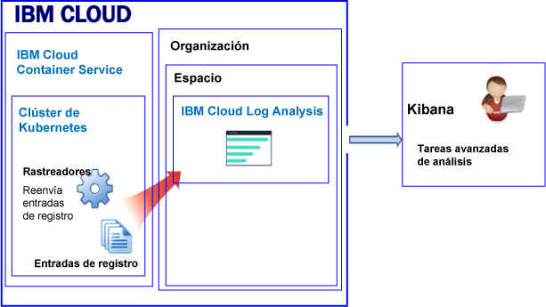
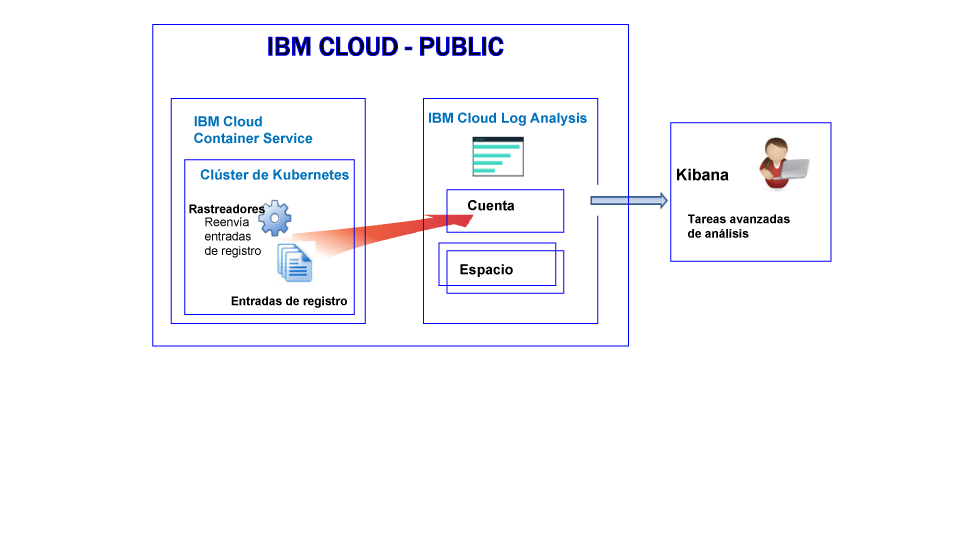
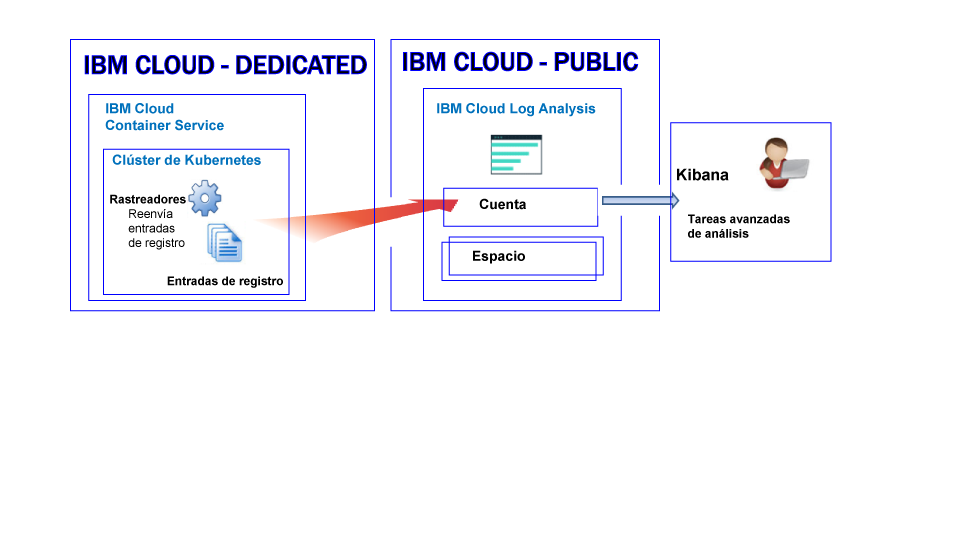

---

copyright:
  years: 2017, 2019

lastupdated: "2019-03-06"

keywords: IBM Cloud, logging

subcollection: cloudloganalysis

---

{:new_window: target="_blank"}
{:shortdesc: .shortdesc}
{:screen: .screen}
{:pre: .pre}
{:table: .aria-labeledby="caption"}
{:codeblock: .codeblock}
{:tip: .tip}
{:download: .download}
{:important: .important}
{:note: .note}


# {{site.data.keyword.containershort_notm}}
{: #containers_kubernetes}

En {{site.data.keyword.cloud_notm}}, puede utilizar el servicio {{site.data.keyword.loganalysisshort}} para almacenar y analizar registros de contenedor y registros de clúster de Kubernetes recopilados automáticamente por {{site.data.keyword.containershort}} en el entorno público y dedicado.
{:shortdesc}

Puede tener uno o varios clústeres de Kubernetes en una cuenta. {{site.data.keyword.containershort}} recupera los registros automáticamente en cuanto se suministra el clúster. 

Para reenviar registros a {{site.data.keyword.loganalysisshort}} desde {{site.data.keyword.containershort}}, debe crear una configuración de registro. Puede habilitar el registro mediante la [línea de mandatos](/docs/containers/cs_health.html#logging) o mediante la página de visión general del clúster en el panel de control de {{site.data.keyword.containershort}}. Con una configuración establecida, {{site.data.keyword.containershort}} recopila registros cuando se suministra el clúster o cuando se despliega un pod. También se recopila automáticamente la información que un contenedor imprime en `stdout` (salida estándar) o `stderr` (error estándar). De forma predeterminada, los registros se reenvían a regiones específicas en función de la ubicación del clúster.

* Los registros de la aplicación se recopilan en cuanto se despliega el pod. 
* {{site.data.keyword.containershort}} recopila automáticamente la información que un proceso de contenedor imprime en stdout (salida estándar) y stderr (error estándar).

Consulte la siguiente tabla para ver las regiones a las que {{site.data.keyword.loganalysisshort}} envía registros en función de dónde está desplegado el clúster.
 * {{site.data.keyword.containershort}} recopila automáticamente la información que un proceso de contenedor imprime en stdout (salida estándar) y stderr (error estándar).
 
 <table>
   <tr>
     <th>Región del clúster</th>
     <th>Región del servicio</th>
   </tr>
   <tr>
     <td>EE.UU. sur</td>
     <td>EE.UU. sur</td>
   </tr>
   <tr>
     <td>EE.UU. este</td>
     <td>EE.UU. sur</td>
   </tr>
   <tr>
     <td>Alemania</td>
     <td>Alemania</td>
   </tr>
   <tr>
     <td>Sídney</td>
     <td>Sídney</td>
   </tr>
   <tr>
     <td>Reino Unido</td>
     <td>Alemania</td>
   </tr>
 </table>
 
 Asegúrese de establecer como destino la región, organización y espacio correctos al intentar ver los registros. También puede comprobar que está estableciendo como destino la organización y el espacio correctos mediante la GUI de {{site.data.keyword.loganalysisshort}}.
 {: tip}

Puede reenviar registros a la cuenta de {{site.data.keyword.loganalysisshort}} o a un dominio de espacio de su cuenta. Tenga en cuenta la siguiente información al decidir dónde reenviar registros:

* Al enviar registros al dominio de la cuenta, la cuota de búsqueda es de 500 MB al día, y no se pueden almacenar registros en la Recopilación de registros para su almacenamiento a largo plazo.
* Al enviar registros a un dominio de espacio, puede elegir un plan de servicio de {{site.data.keyword.loganalysisshort}} que defina la cuota de búsqueda por día, y puede almacenar registros de almacenamiento en la Recopilación de registros para el almacenamiento a largo plazo.

**Nota:** De forma predeterminada, el envío de registros de un clúster al servicio de {{site.data.keyword.loganalysisshort}} no está habilitado automáticamente. Para habilitar el registro, debe crear una o varias configuraciones de registro en el clúster para reenviar automáticamente registros al servicio de {{site.data.keyword.loganalysisshort}}. Puede habilitar el registro mediante la línea de mandatos, mediante el mandato `ibmcloud cs logging-config-create` o mediante el panel de control del clúster disponible en la IU de {{site.data.keyword.cloud_notm}}. Para obtener más información, consulte [Habilitación de la recopilación automática de registros de clúster](/docs/services/CloudLogAnalysis/containers?topic=cloudloganalysis-containers_kube_other_logs#containers_kube_other_logs).

Cuando trabaja con un clúster de Kubernetes, se reservan los espacios de nombres *ibm-system* y *kube-system*. No cree, suprima, modifique ni cambie permisos de recursos que estén disponibles en dichos espacios de nombres. Los registros para estos espacios de nombres están para que {{site.data.keyword.IBM_notm}} los utilice.
{: tip}


### Reenvío de registros a un dominio del espacio
{: #space}

Cuando configure el clúster para que reenvíe los registros a {{site.data.keyword.loganalysisshort}}, tenga en cuenta la siguiente información:

* Debe definir una organización y un espacio de Cloud Foundry donde se reenviarán estos registros. 
* La organización y el espacio pueden estar disponibles en cualquier región de la nube pública de {{site.data.keyword.IBM_notm}}.

**Nota:** Para los clústeres que se suministran en **{{site.data.keyword.cloud_notm}} dedicado**, no se puede configurar el clúster para que reenvíe los registros del clúster a espacios de Cloud Foundry que están disponibles en su cuenta dedicada.

Para analizar datos de registro en Kibana para un clúster que reenvía registros a un dominio del espacio, tenga en cuenta la siguiente información:

* Debe iniciar Kibana en la región pública en la que están disponibles la organización y el espacio que recopilan los registros del clúster.
* Para aumentar la cuota de búsqueda de Kibana y almacenar los registros en la recopilación de registros para su almacenamiento a largo plazo, debe suministrar el servicio {{site.data.keyword.loganalysisshort}} en el espacio donde se reenviarán los registros con un plan que se ajuste a sus necesidades. 
* El ID de usuario debe tener permisos para ver registros. Para ver registros en el dominio del espacio, el usuario necesita un rol de CF. **Auditor** es el rol de nivel inferior que se puede otorgar para ver registros. Para obtener más información, consulte [Roles que necesita un usuario a ver registros](/docs/services/CloudLogAnalysis/kibana?topic=cloudloganalysis-analyzing_logs_Kibana#roles).

Para gestionar los datos de registro del clúster que se guardan en el almacenamiento a largo plazo (recopilación de registros), el ID de usuario debe tener una política de IAM para poder trabajar con el servicio {{site.data.keyword.loganalysisshort}}. El ID de usuario debe tener los permisos de **administrador**, **operador** o **editor**.  Para obtener más información, consulte [Roles que necesita un usuario para gestionar registros](/docs/services/CloudLogAnalysis?topic=cloudloganalysis-manage_logs#roles1).


En la figura siguiente se muestra una vista general del registro en un entorno público para {{site.data.keyword.containershort}} cuando el clúster reenvía registros a un dominio de espacio:



   

### Reenvío de registros al dominio de la cuenta
{: #acc_public}

Puede configurar el clúster para reenviar registros a dominio de la cuenta si la cuenta está en el entorno tanto público como dedicado de {{site.data.keyword.cloud_notm}}.
{: shortdesc}


Para analizar datos de registro en Kibana para un clúster que reenvía registros a un dominio de la cuenta, tenga en cuenta la siguiente información:

* Debe iniciar Kibana en la región en la que el clúster envía registros al servicio {{site.data.keyword.loganalysisshort}}.
* Para gestionar los datos de registro del clúster que se almacenan en la recopilación de registros, debe tener un rol de IAM que le permita trabajar con el servicio {{site.data.keyword.loganalysisshort}}. El ID de usuario debe tener los permisos de **administrador**, **operador** o **editor**. Para ver los registros, necesita permisos de **visor**.


En la siguiente imagen, puede ver una vista de alto nivel de cómo funciona el reenvío de registros a una cuenta en un entorno público.



En la siguiente imagen, puede ver una vista de alto nivel de cómo funciona el reenvío de registros a una cuenta en un entorno privado.




## Configuración de un clúster para que reenvíe registros a {{site.data.keyword.loganalysisshort}}
{: #config_forward_logs}

Puede elegir los registros del clúster que desea reenviar al servicio {{site.data.keyword.loganalysisshort}}. 

Para obtener más información sobre cómo configurar el clúster para reenviar archivos de registro al servicio de {{site.data.keyword.loganalysisshort}}, consulte la sección [Habilitación de la recopilación automática de registros de clúster](/docs/services/CloudLogAnalysis/containers?topic=cloudloganalysis-containers_kube_other_logs#containers_kube_other_logs).

* Para habilitar la recopilación automática de registros y el reenvío de stdout y stderr, consulte [Habilitación de la recopilación automática de registros y del reenvío de registros de contenedor](/docs/services/CloudLogAnalysis/containers?topic=cloudloganalysis-containers_kube_other_logs#containers).
* Para habilitar la recopilación automática y el reenvío de registros de registros de la aplicación, consulte [Habilitación de la recopilación automática de registros y del reenvío de registro de aplicación](/docs/services/CloudLogAnalysis/containers?topic=cloudloganalysis-containers_kube_other_logs#apps). 
* Para habilitar la recopilación automática de registros y el reenvío de registro de trabajo, consulte [Habilitación de la recopilación automática de registros y del reenvío de registros de trabajo](/docs/services/CloudLogAnalysis/containers?topic=cloudloganalysis-containers_kube_other_logs#workers). 
* Para habilitar la recopilación automática de registros y el reenvío de registros de componentes del sistema Kubernetes, consulte [Habilitación de la recopilación automática de registros y del reenvío de registros de componentes del sistema Kubernetes](/docs/services/CloudLogAnalysis/containers?topic=cloudloganalysis-containers_kube_other_logs#system). 
* Para habilitar la recopilación automática de registros y el reenvío de registros del controlador de Ingress de Kubernetes, consulte [Habilitación de la recopilación automática de registros y del reenvío de registros del controlador de Ingress de Kubernetes](/docs/services/CloudLogAnalysis/containers?topic=cloudloganalysis-containers_kube_other_logs#controller).


## Configuración del tráfico de red para configuraciones personalizadas de cortafuegos en {{site.data.keyword.cloud_notm}}
{: #ports}

Si tiene configurado un cortafuegos adicional, o si ha personalizado los valores de cortafuegos en la infraestructura de {{site.data.keyword.cloud_notm}} (SoftLayer), debe permitir el tráfico de red de salida entre el nodo trabajador y el servicio {{site.data.keyword.loganalysisshort}}.

Debe abrir el puerto TCP 443 y el puerto TCP 9091 entre cada trabajador y el servicio {{site.data.keyword.loganalysisshort}} para las siguientes direcciones IP en el cortafuegos personalizado:

<table>
  <tr>
    <th>Región</th>
    <th>URL de ingestión</th>
	<th>Direcciones IP públicas</th>
  </tr>
  <tr>
    <td>Alemania</td>
	<td>ingest-eu-fra.logging.bluemix.net</td>
	<td>158.177.88.43 <br>159.122.87.107</td>
  </tr>
  <tr>
    <td>Reino Unido</td>
	<td>ingest.logging.eu-gb.bluemix.net</td>
	<td>169.50.115.113</td>
  </tr>
  <tr>
    <td>EE.UU. sur</td>
	<td>ingest.logging.ng.bluemix.net</td>
	<td>169.48.79.236 <br>169.46.186.113</td>
  </tr>
  <tr>
    <td>Sídney</td>
	<td>ingest-au-syd.logging.bluemix.net</td>
	<td>130.198.76.125 <br>168.1.209.20</td>
  </tr>
</table>


## Reenvío de registros de aplicaciones personalizadas
{: #forward_app_logs}

Para habilitar el reenvío de registros de aplicaciones personalizadas de un clúster al servicio {{site.data.keyword.loganalysisshort}}, debe definir una configuración de registro de clúster con **Origen de registro** establecido en **aplicación**. Puede definir esta configuración mediante el mandato `ibmcloud cs logging-config-create` o mediante la IU del clúster.

Cuando configure el clúster para que reenvíe registros personalizados, puede especificar una lista de los contenedores que se ejecutan en el clúster desde los que desea reenviar registros personalizados y las vías de acceso de estos contenedores en las que se encuentran los registros de archivos personalizados.

* Debe especificar el parámetro **app-paths** para definir la lista de vías de acceso de los contenedores que desea examinar. Los registros situados en estas vías de acceso se reenvía al servicio {{site.data.keyword.loganalysisshort}}. 

    Para establecer este parámetro, defina una lista separada por comas de vías de acceso disponibles en los contenedores. Se aceptan caracteres comodín como '/var/log/*.log'.

* Si lo desea, puede establecer el parámetro **app-containers** para especificar la lista de contenedores desde donde recopilar y reenviar registros al servicio {{site.data.keyword.loganalysisshort}}.

    Para establecer este parámetro, defina una lista de contenedores separados por comas.

**Consejo:** Puede definir varias configuraciones de registro de clúster con **Origen de registro** establecido en **aplicación** en un clúster. Si los contenedores de un clúster tienen diferentes vías de acceso donde se alojan registros, tenga en cuenta la posibilidad de definir una configuración de registro de clúster para cada grupo de contenedores cuyos registros se encuentran en la misma vía de acceso. 


## Orígenes de registro
{: #log_sources}


Puede configurar el clúster para reenviar registros al servicio {{site.data.keyword.loganalysisshort}}. La tabla siguiente lista los distintos orígenes de registro que puede habilitar para reenviar registros al servicio {{site.data.keyword.loganalysisshort}}:

<table>
  <caption>Orígenes de registros para un clúster de Kubernetes</caption>
  <tr>
    <th>Origen reg.</th>
	<th>Descripción</th>
	<th>Vías de acceso de registro</th>
  </tr>
  <tr>
    <td>Contenedor</td>
	<td>Registros de contenedor.</td>
	<td>Registros de salida estándar (stdout) y de error estándar (stderr).</td>
  </tr>
  <tr>
    <td>Aplicación</td>
	<td>Registra la aplicación que se ejecuta en un clúster de Kubernetes.</td>
	<td>`/var/log/apps/**/*.log`  </br>`/var/log/apps/**/*.err`</br>**NOTA:** En un pod, los registros se pueden grabar en `/var/logs/apps/` o en cualquier subdirectorio bajo `/var/logs/apps/`. En el trabajador, debe montar `/var/log/apps/` al directorio del pod donde la app está grabando registros en el pod.</td>
  </tr>
  <tr>
    <td>Trabajador</td>
	<td>Registra nodos trabajadores de máquinas virtuales dentro de un clúster de Kubernetes. </td>
	<td>`/var/log/syslog` </br>`/var/log/auth.log`</td>
  </tr>
  <tr>
    <td>Componente del sistema Kubernetes</td>
	<td>Registra el componente del sistema de Kubernetes.</td>
	<td>*/var/log/kubelet.log* </br>*/var/log/kube-proxy.log*</td>
  </tr>
  <tr>
    <td>Controlador de Ingress</td>
	<td>Registra un controlador de Ingress que gestiona el tráfico de red entrante en un clúster de Kubernetes.</td>
	<td>`/var/log/alb/ids/*.log` </br>`/var/log/alb/ids/*.err` </br>`/var/log/alb/customerlogs/*.log` </br>`/var/log/alb/customerlogs/*.err`</td>
  </tr>
</table>

## Búsquedas en los registros
{: #log_search}

De forma predeterminada, puede utilizar Kibana para buscar un máximo de 500 MB de registros al día en {{site.data.keyword.cloud_notm}}. 

Para buscar registros de mayor tamaño, puede utilizar el servicio {{site.data.keyword.loganalysisshort}}. El servicio proporciona varios planes. Cada plan tiene distintas funciones de búsqueda de registros; por ejemplo, el plan *Recopilación de registros* le permite buscar un máximo de 1 GB de datos al día. Para obtener más información sobre los planes disponibles, consulte [Planes de servicio](/docs/services/CloudLogAnalysis?topic=cloudloganalysis-log_analysis_ov#plans).

Cuando busque registros, tenga en cuenta los siguientes campos disponibles en Kibana:

Campos comunes a cualquier entrada de registro:

<table>
  <caption>Lista de campos comunes</caption>
  <tr>
    <th>Nombre del campo</th>
	  <th>Descripción</th>
	  <th>Valor</th>
  </tr>
  <tr>
    <td>ibm-containers.region_str</td>
	  <td>Región en la que está disponible el clúster</td>
	  <td>Por ejemplo, `us-south` es el valor correspondiente a un clúster que está disponible en la región EE.UU. sur.</td>
  </tr>
  <tr>
    <td>ibm-containers.account_id_str</td>
	  <td>ID de cuenta</td>
	  <td></td>
  </tr>
  <tr>
    <td>ibm-containers.cluster_id_str</td>
	  <td>ID de clúster</td>
	  <td></td>
	</tr>
  <tr>
    <td>ibm-containers.cluster_name_str</td>
	  <td>Nombre de clúster</td>
	  <td></td>
  </tr>
</table>

Campos que pueden resultar útiles al analizar los registros stdout y stderr de contenedor:

<table>
  <caption>Lista de campos para aplicaciones</caption>
  <tr>
    <th>Nombre del campo</th>
	<th>Descripción</th>
	<th>Valor</th>
  </tr>
  <tr>
    <td>kubernetes.container_name_str</td>
	<td>Nombre del contenedor</td>
	<td></td>
  </tr>
  <tr>
    <td>kubernetes.namespace_name_str</td>
	<td>Nombre del espacio de nombres en el que se ejecuta la aplicación en el clúster</td>
	<td></td>
  </tr>
  <tr>
    <td>stream_str</td>
	<td>Tipo de registro</td>
	<td>*stdout* </br>*stderr*</td>
  </tr>
</table>

Campos que pueden resultar útiles al analizar registros de trabajo:

<table>
  <caption>Lista de campos que son relevantes para nodos trabajadores</caption>
  <tr>
    <th>Nombre del campo</th>
	<th>Descripción</th>
	<th>Valor</th>
  </tr>
  
  <tr>
    <td>filename_str</td>
	<td>Vía de acceso y nombre del archivo</td>
	<td>*/var/log/syslog*  </br>*/var/log/auth.log*</td>
  </tr>
  <tr>
    <td>tag_str</td>
	<td>Tipo de registro</td>
	<td>*logfiles.worker.var.log.syslog* </br>*logfiles.worker.var.log.auth.log*</td>
  </tr>
  <tr>
    <td>worker_str</td>
	<td>Nombre de nodo trabajador</td>
	<td>Por ejemplo, *w1*</td>
  </tr>
</table>

Campos que pueden resultar útiles al analizar registros de componentes del sistema Kubernetes:

<table>
  <caption>Lista de campos que son relevantes para el componente del sistema Kubernetes</caption>
  <tr>
    <th>Nombre del campo</th>
	<th>Descripción</th>
	<th>Valor</th>
  </tr>
  <tr>
    <td>tag_str</td>
	<td>Tipo de registro</td>
	<td>*logfiles.kubernetes.var.log.kubelet.log* </br>*logfiles.kubernetes.var.log.kube-proxy.log*</td>
  </tr>
  <tr>
    <td>filename_str</td>
	<td>Vía de acceso y nombre del archivo</td>
	<td>*/var/log/kubelet.log* </br>*/var/log/kube-proxy.log*</td>
  </tr>
 </table>

Campos que pueden resultar útiles al analizar registros del controlador de Ingress:
 
<table>
  <caption>Lista de campos que son relevantes para el controlador de Ingress</caption>
  <tr>
    <th>Nombre del campo</th>
	<th>Descripción</th>
	<th>Valor</th>
  </tr>
 <tr>
    <td>tag_str</td>
	<td>Tipo de registro</td>
	<td></td>
  </tr>
  <tr>
    <td>filename_str</td>
	<td>Vía de acceso y nombre del archivo</td>
	<td>*/var/log/alb/ids/*.log* </br>*/var/log/alb/ids/*.err* </br>*/var/log/alb/customerlogs/*.log* </br>*/var/log/alb/customerlogs/*.err*</td>
  </tr>
</table>


## Envío de registros para poder utilizar los campos en un mensaje como campos de búsqueda de Kibana
{: #send_data_in_json}

De forma predeterminada, la creación de registros se habilita de forma automática para los contenedores. Cada entrada en el archivo de registro Docker se visualiza en Kibana en el campo **message**. Si necesita filtrar y analizar sus datos en Kibana mediante un campo específico que sea parte de la entrada de registro del contenedor, configure su aplicación para enviar la salida en un formato JSON que sea válido. Por ejemplo, registre el mensaje en formato JSON en `stdout` (salida estándar) y `stderr` (error estándar).
 
Cada campo disponible en el mensaje se analiza para el tipo de campo que coincide con su valor.
 
Por ejemplo, cada campo en el siguiente mensaje JSON está disponible como un campo que se puede utilizar para filtrar y realizar búsquedas.
Cada campo disponible en el mensaje se analiza para el tipo de campo que coincide con su valor. Por ejemplo, cada campo en el siguiente mensaje JSON:
    
```
{"field1":"string type",
        "field2":123,
        "field3":false,
        "field4":"4567"
    }
```
{: codeblock}
    
está disponible como un campo que se puede utilizar para filtrar y realizar búsquedas:
    
* `field1` se analiza como `field1_str` de tipo serie.
* `field2` se analiza como `field1_int` de tipo entero.
* `field3` se analiza como `field3_bool` de tipo booleano.
* `field4` se analiza como `field4_str` de tipo serie.
    


## Seguridad
{: #security}


Para reenviar registros de clúster a {{site.data.keyword.loganalysisshort}}, debe otorgar permisos de {{site.data.keyword.cloud_notm}} al propietario de la clave de {{site.data.keyword.containershort}} y al ID de usuario que realiza las configuraciones de registros del clúster.

El ID de usuario que realiza las configuraciones de registros del clúster debe tener los permisos siguientes:

* Política de IAM para el servicio {{site.data.keyword.containershort}} con permisos de **visor**.
* Política de IAM para la instancia del clúster con permisos de **administrador** o de **operador**.

Para un clúster que reenvía registros a un **dominio de espacio** de {{site.data.keyword.loganalysisshort}}, se necesitan los permisos siguientes para el propietario de la clave de {{site.data.keyword.containershort}}:

* Política de IAM para el servicio {{site.data.keyword.containershort}} con el rol de **administrador**.
* Política de IAM para el servicio {{site.data.keyword.loganalysisshort}} con el rol de **administrador**.
* Rol **orgManager** de Cloud Foundry (CF) para la organización en la que está disponible el espacio.
* El rol **SpaceManager** o **Developer** de CF para el espacio al que se reenvían registros desde el clúster.


Para un clúster que reenvía registros al **dominio de la cuenta** de {{site.data.keyword.loganalysisshort}}, se necesitan los permisos siguientes para el propietario de la clave de {{site.data.keyword.containershort}}:

* Política de IAM para el servicio {{site.data.keyword.containershort}} con el rol de **administrador**.
* Política de IAM para el servicio {{site.data.keyword.loganalysisshort}} con el rol de **administrador**.


## Almacenamiento de registros en el componente de recopilación de registros
{: #log_collection1}

Tenga en cuenta la siguiente información sobre el comportamiento predeterminado de {{site.data.keyword.cloud_notm}} al trabajar con los registros:

* Los datos del registro se guardan durante un máximo de 3 días.
* Se almacena un máximo de 500 MB de datos al día. Cualquier registro que supere dicha capacidad de 500 MB se descartará. Las asignaciones de capacidades se restablecen todos los días a las 12:30 AM UTC.
* Se pueden buscar hasta 1,5 GB de datos para un máximo de 3 días. Los datos de registro se renuevan (Primero en entrar, primero en salir) una vez que se ha alcanzado 1,5 GB de datos o después de 3 días.
* Los registros no se almacenan en la Recopilación de registros para el almacenamiento a largo plazo.

El servicio {{site.data.keyword.loganalysisshort}} proporciona planes adicionales que le permiten almacenar registros en la recopilación de registros tanto tiempo como desee. Para obtener más información sobre el precio de cada plan, consulte [Planes de servicio](/docs/services/CloudLogAnalysis?topic=cloudloganalysis-log_analysis_ov#plans). 

Para gestionar registros en la Recopilación de registros, tenga en cuenta la siguiente información:

* Puede configurar una política de retención de registros que puede utilizar para definir el número de días que desea conservar los registros en la recopilación de registros. Para obtener más información, consulte [Política de retención de registros](/docs/services/CloudLogAnalysis?topic=cloudloganalysis-manage_logs#log_retention_policy).
* Puede suprimir los registros manualmente utilizando la CLI o la API de recopilación de registros. 
* Para gestionar registros en la recopilación de registros, un usuario necesita una política de IAM con permisos para trabajar con el servicio de {{site.data.keyword.loganalysisshort}} en {{site.data.keyword.cloud_notm}}. Para obtener más información, consulte [Roles de IAM](/docs/services/CloudLogAnalysis?topic=cloudloganalysis-security_ov#iam_roles).

## Visualización y análisis de registros
{: #logging_containers_ov_methods}

Para analizar los datos de registro, utilice Kibana para realizar tareas de análisis avanzado. Kibana es una plataforma de visualización y análisis de código abierto que puede utilizar para supervisar, buscar, analizar y visualizar datos en diversos gráficos, como diagramas y tablas. Para obtener más información, consulte [Análisis de registros en Kibana](/docs/services/CloudLogAnalysis/kibana?topic=cloudloganalysis-analyzing_logs_Kibana#analyzing_logs_Kibana).

* Puede iniciar Kibana directamente desde un navegador web. Para obtener más información, consulte [Navegación a Kibana desde un navegador web](/docs/services/CloudLogAnalysis/kibana/launch.html#launch_Kibana_from_browser).
* Puede iniciar Kibana desde la IU de {{site.data.keyword.cloud_notm}} dentro del contexto de un clúster. Para obtener más información, consulte [Navegación a Kibana desde el panel de control de un contenedor desplegado en un clúster de Kubernetes](/docs/services/CloudLogAnalysis/kibana?topic=cloudloganalysis-launch#launch_Kibana_for_containers_kube).

Si reenvía los datos de registro de una app que se ejecuta en contenedor al recopilador de registros de tiempo de ejecución del contenedor en un formato JSON, podrá buscar y analizar datos de registro en Kibana utilizando los campos JSON. Para obtener más información, consulte [Envío de registros para poder utilizar los campos en un mensaje como campos de búsqueda de Kibana](/docs/services/CloudLogAnalysis/containers?topic=cloudloganalysis-containers_kubernetes#send_data_in_json).

Para ver registros en Kibana, tenga en cuenta la siguiente información:

* Para ver los registros en un dominio de espacio, el usuario debe tener el rol **auditor** o el rol **desarrollador** en el espacio asociado con el clúster.
* Para ver registros en el dominio de la cuenta, el usuario debe tener una política de IAM para trabajar con el servicio de {{site.data.keyword.loganalysisshort}}. El rol mínimo que permite ver entradas de registro es **Visor**.


## Guía de aprendizaje: Análisis de registros en Kibana para una app desplegada en un clúster de Kubernetes
{: #tutorial1}

Para aprender a utilizar Kibana para analizar los registros de un contenedor desplegado en un clúster de Kubernetes, consulte [Análisis de registros en Kibana para una app desplegada en un clúster de Kubernetes](/docs/services/CloudLogAnalysis/tutorials?topic=cloudloganalysis-container_logs#container_logs).
