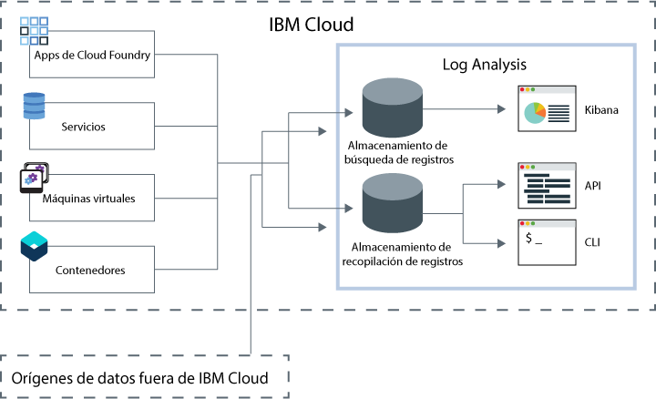

---

copyright:
  years: 2017, 2019

lastupdated: "2019-03-06"

keywords: IBM Cloud, logging

subcollection: cloudloganalysis

---

{:new_window: target="_blank"}
{:shortdesc: .shortdesc}
{:screen: .screen}
{:pre: .pre}
{:table: .aria-labeledby="caption"}
{:codeblock: .codeblock}
{:tip: .tip}
{:download: .download}
{:important: .important}
{:note: .note}

# IBM Cloud Log Analysis
{: #log_analysis_ov}

Utilice el servicio {{site.data.keyword.loganalysisfull}} para ampliar la capacidad de recopilación de registros, de retención de registros y de búsqueda de registros en {{site.data.keyword.Bluemix}}. Autorice a su equipo de DevOps a utilizar características como la agregación de registros de aplicaciones y de entorno para consolidar aplicaciones o ver detalles del entorno, cifrar registros, retener datos de registro tanto como sea necesario y detectar y solucionar problemas con rapidez. Utilice Kibana para las tareas avanzadas de análisis.
{:shortdesc}

Las funciones de registro de {{site.data.keyword.Bluemix_notm}} están integradas en la plataforma:

* La recopilación de datos se habilita automáticamente para los recursos de la nube. De forma predeterminada, {{site.data.keyword.Bluemix_notm}} recopila y muestra los registros correspondientes a sus apps, tiempos de ejecución de apps y tiempos de ejecución del sistema en el que se ejecutan dichas apps. 
* Puede buscar hasta 500 MB de datos por día. 
* Los registros correspondientes a los 3 últimos días se guardan en la búsqueda de registros, un componente del servicio {{site.data.keyword.loganalysisshort}}.

Puede utilizar las funciones de registro de {{site.data.keyword.Bluemix_notm}} para comprender el comportamiento de la plataforma de nube y los recursos que se ejecutan la misma. No se requiere ninguna instrumentación especial para recopilar la salida estándar y los registros de error estándares. Por ejemplo, puede utilizar registros para proporcionar un seguimiento de auditoría para una aplicación, detectar problemas en un servicio, identificar vulnerabilidades, resolver problemas de despliegues de app y de comportamiento del tiempo de ejecución, detectar problemas en la infraestructura en la que se ejecuta la app, realizar un rastreo de la app entre los componentes de la plataforma de nube y detectar patrones que puede utilizar para tomar el control de acciones que podrían afectar al SLA del servicio.

El servicio de {{site.data.keyword.loganalysisfull}} proporciona los servicios de recopilación y de búsqueda de registros para la plataforma de {{site.data.keyword.Bluemix_notm}}, recopilando automáticamente los datos de servicios de {{site.data.keyword.Bluemix_notm}} y de aplicaciones desde los servicios de selección de {{site.data.keyword.Bluemix_notm}}.

En la siguiente figura se muestra una vista de alto nivel del servicio {{site.data.keyword.loganalysisshort}}: 

Para recopilar y buscar registros de los recursos de nube que se ejecutan en un espacio, debe suministrar una instancia del servicio {{site.data.keyword.loganalysisshort}} en el mismo espacio en el que se ejecutan dichos recursos de nube. Los registros se recopilan y se almacenan de forma predeterminada en el componente de búsqueda de registros. Cuando seleccione un plan de servicio que incluya funciones ampliadas de búsqueda y recopilación, los registros también se recopilan y se almacenan en el componente de recopilación de registros. Los datos de registro que se almacenan en la recopilación de registros están cifrados.

De forma predeterminada, {{site.data.keyword.Bluemix_notm}} almacena datos correspondientes a un máximo de 3 días en el componente de búsqueda de registros:   

* Se almacena un máximo de 500 MB por espacio de datos al día. Cualquier registro que supere dicha capacidad de 500 MB se descartará. Las asignaciones de capacidades se restablecen todos los días a las 12:30 AM UTC.
* Se pueden buscar hasta 1,5 GB de datos para un máximo de 3 días. Los datos de registro se renuevan (Primero en entrar, primero en salir) una vez que se ha alcanzado 1,5 GB de datos o después de 3 días.

El servicio {{site.data.keyword.loganalysisshort}} proporciona planes adicionales que le permiten almacenar registros en la recopilación de registros tanto tiempo como desee. El tamaño del registro que puede recopilar y almacenar en la recopilación de registros viene determinado por el plan de servicio que elija. Se paga por GB de datos al mes por los datos que se almacenan. Los registros se almacenan en el componente de recopilación de registros como JSON.

Puede utilizar 5.1 Kibana para las tareas avanzadas de análisis de búsqueda de registros:

* Cada plan limita el tamaño de registro puede buscar por día. 
* Las búsquedas solo cubren datos correspondiente a los 3 últimos días.

Para acceder a los registros de más de 3 días, puede utilizar la CLI del componente de recopilación de registros o la API de recopilación de registros para descargar registros localmente o bien puede direccionar los registros a otras aplicaciones o servicios de nube de otros proveedores. 

Puede suprimir registros automáticamente definiendo una política de retención o manualmente mediante la CLI de {{site.data.keyword.loganalysisshort}}.

## Por qué utilizar el servicio de análisis de registros
{: #value}

1. **Dedique menos tiempo a instrumentar la aplicación y más tiempo a mejorar su valor**

    {{site.data.keyword.loganalysislong_notm}} recopila automáticamente datos de servicios de {{site.data.keyword.Bluemix_notm}} seleccionados, sin necesidad de instrumentación.
	
	Puede elegir la cantidad de registros que puede buscar por día.  Hay diferentes planes disponibles que puede utilizar para buscar hasta 500 MB, 2 GB, 5 GB y 10 GB de registros por día.

2. **Mantenga los datos de registro cerca de sus cargas de trabajo de aplicaciones y bien protegidos en soluciones de almacenamiento económicas en la nube**

    Recopile y almacene datos de registro de aplicaciones tradicionales y controladas por microservicios que se ejecuten en {{site.data.keyword.Bluemix_notm}} en un registro centralizado. Puede conservar los datos de registro tanto como desee.
	
	Los registros se almacenan en el almacenamiento de {{site.data.keyword.IBM_notm}}. Puede descargar registros cuando los necesite.

3. **Obtenga información detallada de su entorno para detectar, diagnosticar e identificar problemas con rapidez**

    Visualice, analice e interactúe con los datos mediante paneles de control que puede personalizar. Basadas en la plataforma Elastic Stack, las funciones de búsqueda de registros le ofrecen la flexibilidad y familiaridad de Kibana para adaptar rápidamente su panel de control a sus necesidades.

4. **Integración potente con las API**

    Integre los datos de registro en sus aplicaciones y operaciones mediante las API del servicio. Utilice las API de servicio {{site.data.keyword.loganalysisshort}} para gestionar los registros retenidos y enviar datos de registro desde fuera de {{site.data.keyword.IBM_notm}} Cloud.

## Regiones
{: #regions}

El servicio de {{site.data.keyword.loganalysisfull_notm}} está disponible en las regiones siguientes:

* Alemania
* Reino Unido
* EE.UU. sur
* Sídney

## Datos locales
{: #data_location}

En la tabla siguiente se muestra la ubicación de los registros por región:

<table>
  <caption>Ubicación de registros por región</caption>
  <tr>
    <th>Región</th>
	<th>Registros de búsqueda de registros</th>
	<th>Registros de recopilación de registros</th>
  </tr>
  <tr>
    <td>Alemania</td>
	  <td>Alojado en Alemania</td>
	  <td>Alojado en Alemania</td>
  </tr>
  <tr>
    <td>Reino Unido</td>
	  <td>Alojado en Reino Unido</td>
	  <td>Alojado en Reino Unido</td>
  </tr>
  <tr>
    <td>EE.UU. sur</td>
	  <td>Alojado en EE.UU. sur</td>
	  <td>Alojado en EE.UU. sur</td>
  </tr>
  <tr>
    <td>Sídney</td>
	  <td>Alojado en Sídney</td>
	  <td>Alojado en EE.UU. sur (*)</td>
  </tr>
</table>

(*) Para Sídney, los registros del componente de recopilación de registros están alojados actualmente en EE.UU. sur. Está planificado situar los datos de los registros del componente de recopilación de registros en Sídney.

## Planes de servicio
{: #plans}

El servicio {{site.data.keyword.loganalysisshort}} proporciona varios planes. Cada plan tiene distinta capacidad de recopilación de registros y de búsqueda de registros. 

**NOTA:** Las características incluidas en un plan de servicio solo se habilitan en el espacio en el que se suministra el servicio {{site.data.keyword.loganalysisshort}} con dicho plan.

Puede cambiar un plan mediante la interfaz de usuario de {{site.data.keyword.Bluemix_notm}} o a través de la línea de mandatos. Puede actualizar o reducir el plan siempre que lo desee. Para obtener más información sobre actualizaciones del plan de servicio, consulte [Cambio del plan](/docs/services/CloudLogAnalysis/how-to/change_plan.html#change_plan). 

En la tabla siguiente se muestran los planes disponibles:

<table>
    <caption>Resumen de la capacidad de búsqueda de registros y de recopilación de registros por plan</caption>
      <tr>
        <th>Plan</th>
        <th>Ingestión de registros</th>
        <th>Retención de anotaciones</th>
        <th>Cifrado de datos</th>
        <th>Búsqueda de registros</th>
      </tr>
      <tr>
        <td>Lite (predeterminado)</td>
        <td>No</td>
        <td>Últimos 3 días</td>
        <td>No</td>
        <td>Búsqueda de hasta 500 MB</td>
      </tr>
      <tr>
        <td>Recopilación de registros</td>
        <td>Sí</td>
        <td>Número de días que se puede configurar</td>
        <td>Sí</td>
        <td>Búsqueda de hasta 500 MB al día</td>
      </tr>
      <tr>
        <td>Recopilación de registros con búsqueda de 2 GB/día</td>
        <td>Sí</td>
        <td>Número de días que se puede configurar</td>
        <td>Sí</td>
        <td>Búsqueda de hasta 2 GB al día</td>
      </tr>
      <tr>
        <td>Recopilación de registros con búsqueda de 5 GB/día</td>
        <td>Sí</td>
        <td>Número de días que se puede configurar</td>
        <td>Sí</td>
        <td>Búsqueda de hasta 5 GB al día</td>
      </tr>
       <tr>
        <td>Recopilación de registros con búsqueda de 10 GB/día</td>
        <td>Sí</td>
        <td>Número de días que se puede configurar</td>
        <td>Sí</td>
        <td>Búsqueda de hasta 10 GB al día</td>
      </tr>
</table>

**Nota:** el coste mensual del almacenamiento en la recopilación de registros se calcula como promedio del ciclo de facturación.

