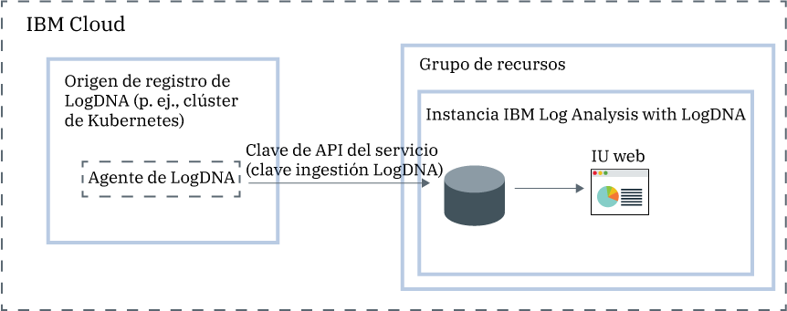

---

copyright:
  years:  2018, 2019
lastupdated: "2019-03-23"

keywords: LogDNA, IBM, Log Analysis, logging, overview

subcollection: LogDNA

---

{:new_window: target="_blank"}
{:shortdesc: .shortdesc}
{:screen: .screen}
{:pre: .pre}
{:table: .aria-labeledby="caption"}
{:codeblock: .codeblock}
{:tip: .tip}
{:download: .download}
{:important: .important}
{:note: .note}

# Acerca de {{site.data.keyword.la_full_notm}}
{: #about}

{{site.data.keyword.la_full}} es un servicio de terceros que puede incluir como parte de la arquitectura de {{site.data.keyword.cloud_notm}} para añadir prestaciones de gestión de registros. Se trabaja con {{site.data.keyword.la_full_notm}} mediante LogDNA en asociación con {{site.data.keyword.IBM_notm}}.
{:shortdesc}

Puede utilizar {{site.data.keyword.la_full_notm}} para gestionar registros del sistema y de aplicaciones en {{site.data.keyword.cloud_notm}}.

{{site.data.keyword.la_full_notm}} ofrece a los administradores, equipos de DevOps y desarrolladores, características avanzadas para filtrar, buscar y realizar el seguimiento de datos de registro, así como definir alertas y diseñar vistas personalizadas para supervisar los registros de aplicaciones y del sistema.

## Visión general
{: #ov}

Para añadir características de registro con LogDNA en {{site.data.keyword.cloud_notm}}, debe suministrar una instancia de {{site.data.keyword.la_full_notm}}.

Antes de suministrar una instancia de {{site.data.keyword.la_full_notm}}, tenga en cuenta la información siguiente:
* Los datos de registro se alojan en {{site.data.keyword.cloud_notm}}.
* Los datos de registro se envían a un tercero.
* Los usuarios deben tener permisos de plataforma para crear, ver y suprimir una instancia de un servicio en {{site.data.keyword.cloud_notm}}.
* Los usuarios deben tener permisos de plataforma para crear recursos dentro del contexto del grupo de recursos donde tenga pensado suministrar la instancia de LogDNA.

Suministre una instancia de {{site.data.keyword.la_full_notm}} dentro del contexto de un grupo de recursos. Organice los servicios para fines de control de acceso y facturación utilizando grupos de recursos. Puede suministrar la instancia en el grupo de recursos *predeterminado* o en un grupo de recursos personalizado.

Después de suministrar una instancia de {{site.data.keyword.la_full_notm}}, se creará una cuenta en LogDNA y recibirá la clave de ingestión para la cuenta.

A continuación, debe configurar un agente LogDNA para cada origen de registro. Un origen de registro es un recurso de nube o local que genera registros. Por ejemplo, un origen de registro puede ser un clúster de Kubernetes. Utilice la clave de ingestión para configurar el agente LogDNA que es el responsable de recopilar y reenviar registros a la instancia de {{site.data.keyword.la_full_notm}}.

Después de que se haya desplegado el agente LogDNA en un origen de registro, la recopilación y el reenvío de registros a la instancia de {{site.data.keyword.la_full_notm}} se realizan de forma automática.

Puede iniciar la interfaz de usuario web de {{site.data.keyword.la_full_notm}} para ver, supervisar y gestionar los registros.

En la figura siguiente se muestra una visión general de los componentes del servicio {{site.data.keyword.la_full_notm}} que se ejecuta en {{site.data.keyword.cloud_notm}}:

## Datos de registro
{: #overview_data}

{{site.data.keyword.la_full_notm}} recopila y agrega registros en un sistema de registro centralizado.

* Los datos de registro se alojan en {{site.data.keyword.cloud_notm}}.
* Los datos se coubican en la región donde se ha suministrado la instancia de {{site.data.keyword.la_full_notm}}. Por ejemplo, los datos de registro de una instancia suministrada en el sur de EE.UU. se alojarán en la región del sur de EE.UU.

El plan de servicio que elija para una instancia de {{site.data.keyword.la_full_notm}} definirá el número de días que los datos se almacenan y conservan en LogDNA. Por ejemplo, si elige el plan *Gratuito*, los datos no se almacenan. No obstante, si elige el plan de 7 días, los datos se almacenan durante 7 días y tendrá acceso a ellos a través de la interfaz de usuario web de LogDNA.

Al suprimir una instancia de {{site.data.keyword.la_full_notm}} de {{site.data.keyword.cloud_notm}}, se suprimen todos los datos.

## Características
{: #overview_features}

**Resolver problemas de registro en tiempo real para diagnosticar e identificar problemas.**

Mediante el uso de la característica de *seguimiento de transmisión en directo*, los desarrolladores y equipos de DevOps pueden diagnosticar problemas, analizar rastreos de pila y excepciones, identificar el origen de los errores y supervisar distintos orígenes de registro a través de una única vista.  Esta característica está disponible a través de la línea de mandatos y a través de la interfaz web. 

**Emitir alertas para que se notifiquen acciones importantes.**
 
Para actuar con prontitud ante sucesos de aplicaciones y servicios que identifique como críticos o de aviso, los equipos de DevOps pueden configurar integraciones de notificación de alertas con los sistemas siguientes: correo electrónico, Slack, HipChat, webHook, PagerDuty y OpsGenie.

**Exportar registros en un archivo local para su análisis o en un servicio de archivado para cumplir los requisitos de auditoría.**

Exporte líneas de registro específicas en una copia local o en registros de archivado de {{site.data.keyword.la_full_notm}} a IBM Cloud Object Storage.
Las líneas de registro se exportan en formato de línea JSON. Los registros se archivan en formato JSON y conservan los metadatos asociados con cada línea. 

**Controlar los costes de la infraestructura de registro personalizando qué registros gestionar a través de {{site.data.keyword.la_full_notm}}.**

Controle el coste de su infraestructura de registro en IBM Cloud configurando los orígenes de registro para los cuales desea recopilar y gestionar registros. 

## Planes de tarifas
{: #overview_pricing_plans}

Hay disponibles distintos planes de tarifas que puede elegir para una instancia de {{site.data.keyword.la_full_notm}}. Cada plan define el número de días que se conservan los datos para la búsqueda, el número de usuarios que tienen permitido gestionar los datos y las características de LogDNA que se habilitan.

| Plan                     | 
|--------------------------|
| `Búsqueda de registros de 30 días`  |
| `Búsqueda de registros de 14 días`  |
| `Búsqueda de registros de 7 días`   |
| `Lite`                  |
{: caption="Tabla 1. Lista de planes de servicio" caption-side="top"} 

{{site.data.keyword.la_full_notm}} ofrece un plan `Lite` que puede utilizar para ver los registros a medida que pasan a través del sistema. Puede visualizar registros utilizando el seguimiento de registros. También puede diseñar filtros para preparar la actualización a un plan con un periodo de retención más largo. Este plan tiene un periodo de retención de 0 días.

En las tablas siguientes se describen las distintas características que se incluyen en cada plan de servicio:

| Característica                          | Plan `Búsqueda de registros de 30 días` | Plan `Búsqueda de registros de 14 días`    | Plan `Búsqueda de registros de 7 días     | `Plan Lite | 
|----------------------------------|-------------------------|-------------------------------|-----------------------------|--------------|
| `Los registros se almacenan y se pueden hacer búsquedas en ellos` | Sí, durante 30 días       | Sí, durante 14 días             | Sí, durante 7 días            | No           |
| `Seguimiento de transmisión en directo`            | Sí                     | Sí                           | Sí                         | Sí          |
| `Archivado`                      | Sí                     | Sí                           | Sí                         | No           |
| `Alertas multicanal`         | Sí                     | Sí                           | Sí                         | No           | 
{: caption="Tabla 2. Lista de características disponibles para cada plan de servicio" caption-side="top"} 

## Regiones
{: #overview_regions}

El registro con {{site.data.keyword.la_full_notm}} está disponible en las regiones siguientes:

| Región                | Ubicación  |
|-----------------------|-----------|
| **EE. UU. sur**          | Dallas    |
| **UE-DE**             | Frankfurt | 
{: caption="Tabla 3. Lista de regiones donde el servicio está disponible" caption-side="top"} 

Actualmente, la ubicación **Frankfurt** **no** es una región gestionada por la UE. Para obtener más información, consulte [Habilitación del valor Soporte en la UE](/docs/account?topic=account-eu-hipaa-supported#bill_eusupported).
{: important}

