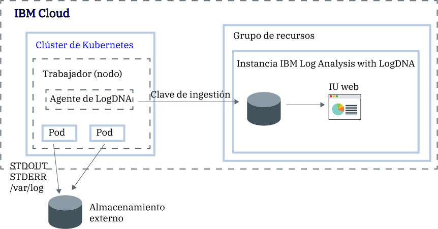

---

copyright:
  years:  2018, 2019
lastupdated: "2019-03-06"

keywords: LogDNA, IBM, Log Analysis, logging, kubernetes, tutorial

subcollection: LogDNA

---

{:new_window: target="_blank"}
{:shortdesc: .shortdesc}
{:screen: .screen}
{:pre: .pre}
{:table: .aria-labeledby="caption"}
{:codeblock: .codeblock}
{:tip: .tip}
{:download: .download}
{:important: .important}
{:note: .note}


# Gestión de registros de clúster de Kubernetes con {{site.data.keyword.la_full_notm}}
{: #kube}

Utilice el servicio {{site.data.keyword.la_full_notm}} para configurar registros a nivel de clúster en {{site.data.keyword.containerlong}}. 
{:shortdesc}

Desde el momento en que suministre {{site.data.keyword.containerlong_notm}} a un clúster, deseará saber qué ocurre dentro del clúster. Necesita tener acceso a los registros para resolver problemas y anticiparse a ellos. En cualquier momento, deseará tener acceso a distintos tipos de registros como los registros de trabajador, registros de pod, registros de app o registros de red. Además, deseará supervisar distintos orígenes de datos de registro y el clúster de Kubernetes. Por lo tanto, la capacidad de gestionar y acceder a los registros desde cualquiera de estos orígenes es vital. El éxito en la gestión y supervisión de los registros dependerá de cómo configure las funcionalidades de registro de la plataforma Kubernetes.

Para configurar el registro a nivel de clúster para un clúster de Kubernetes, tenga en cuenta la información siguiente:

* Debe poder almacenar datos de registro, registros del sistema y registros de aplicaciones contenerizadas en almacenamiento independiente de los componentes del sistema de Kubernetes.
* Debe desplegar un agente de registro para cada nodo de trabajador del clúster. Este agente recopila y reenvía registros a un sistema de fondo de registro externo.
* Debe poder centralizar datos de registro para su análisis en un programa de fondo de registro externo.


En {{site.data.keyword.cloud_notm}}, para configurar el registro a nivel de clúster para un clúster de Kubernetes, debe realizar los pasos siguientes:

1. Suministrar una instancia del servicio {{site.data.keyword.la_full_notm}}. Con este paso, puede configurar un sistema de gestión de registros centralizado, donde los datos de registro se encuentran en {{site.data.keyword.cloud_notm}}.
2. Suministrar un clúster en {{site.data.keyword.containerlong_notm}}. Se admiten clústeres de Kubernetes v1.9+.
3. Configurar el agente LogDNA en cada trabajador (nodo) de un clúster.



En esta guía de aprendizaje, aprenderá a configurar el registro a nivel de clúster.

## Antes de empezar
{: #kube_prereqs}

Trabaje en la región EE. UU. sur. {{site.data.keyword.la_full_notm}} está disponible actualmente en la región del sur de EE.UU. **Nota:** puede enviar datos desde un clúster de Kubernetes que se encuentre en la misma región o en una región distinta. 

Obtenga más información sobre {{site.data.keyword.la_full_notm}}. Encontrará detalles en la sección [Acerca de](/docs/services/Log-Analysis-with-LogDNA?topic=LogDNA-about#about).

Utilice un ID de usuario que sea miembro o propietario de una cuenta de {{site.data.keyword.cloud_notm}}. Para obtener un ID de usuario de {{site.data.keyword.cloud_notm}}, vaya a: [Registro ](https://cloud.ibm.com/login){:new_window}.

El ID de {{site.data.keyword.IBM_notm}} debe tener asignadas políticas de IAM para cada uno de los siguientes recursos: 

| Recurso                             | Ámbito de la política de acceso | Rol    | Región    | Información                  |
|--------------------------------------|----------------------------|---------|-----------|------------------------------|
| Grupo de recursos **predeterminado**           |  Grupo de recursos            | Visor  | us-south  | Esta política es necesaria para permitir que el usuario vea las instancias de servicio en el grupo de recursos predeterminado.    |
| Servicio {{site.data.keyword.la_full_notm}} |  Grupo de recursos            | Editor  | us-south  | Esta política es necesaria para permitir que el usuario suministre y administre el servicio {{site.data.keyword.la_full_notm}} en el grupo de recursos predeterminado.   |
| Instancia de clúster de Kubernetes          |  Recurso                 | Editor  | us-south  | Esta política es necesaria para poder configurar el secreto y el agente LogDNA en el clúster de Kubernetes. |
{: caption="Tabla 1. Lista de políticas de IAM necesarias para completar la guía de aprendizaje" caption-side="top"} 

Para obtener más información sobre los roles de IAM de {{site.data.keyword.containerlong}}, consulte [Permisos de acceso de usuario](/docs/containers?topic=containers-access_reference#access_reference).

Instale la CLI de {{site.data.keyword.cloud_notm}} y el plugin de CLI de Kubernetes. Para obtener más información, consulte [Instalación de la CLI de {{site.data.keyword.cloud_notm}}](/docs/cli?topic=cloud-cli-ibmcloud-cli#ibmcloud-cli).


## Objetivos
{: #kube_objectives}

En esta guía de aprendizaje, configurará el registro con LogDNA para su clúster de {{site.data.keyword.containerlong_notm}}. Concretamente:

- Suministrará {{site.data.keyword.la_full_notm}}. 
- Configurará el agente LogDNA en el clúster para empezar a enviar registros a LogDNA. 
- Abrirá el panel de control de LogDNA para encontrar los registros. 


## Paso 1. Suministrar una instancia de servicio de {{site.data.keyword.la_full_notm}}
{: #kube_step1}

Para suministrar una instancia de servicio de {{site.data.keyword.la_full_notm}} a través de la consola de {{site.data.keyword.cloud_notm}}, realice los pasos siguientes:

1. Inicie sesión en la [cuenta de {{site.data.keyword.cloud_notm}} ](https://cloud.ibm.com/login) donde haya creado el clúster de Kubernetes.

2. Pulse **Catálogo**. Se abrirá una lista de servicios de {{site.data.keyword.cloud_notm}}.

3. Para filtrar la lista de servicios que se visualiza, seleccione la categoría **Herramientas de desarrollador**.

4. Pulse **{{site.data.keyword.la_full_notm}}**. Se abre el panel de control **Observabilidad**.

5. Seleccione **Crear instancia**. 

6. Especifique un nombre para la instancia de servicio.

7. Seleccione el grupo de recursos en el que se encuentre el clúster. De forma predeterminada, se seleccionará automáticamente el grupo de recursos **Default** (predeterminado). 

8. Elija un plan de servicio para su instancia de servicio. De forma predeterminada, se seleccionará automáticamente el plan **Lite**. Para obtener más información acerca de los otros planes de servicio, consulte [Planes de servicio](/docs/services/Log-Analysis-with-LogDNA?topic=LogDNA-about#overview_pricing_plans).

9. Para suministrar el servicio {{site.data.keyword.la_full_notm}} en el grupo de recursos de {{site.data.keyword.cloud_notm}} en el que ha iniciado la sesión, pulse **Crear**. Se abrirá el panel de control **Observabilidad** y mostrará los detalles del servicio. 

Para suministrar una instancia a través de la CLI, consulte [Suministro de una instancia a través de la CLI de {{site.data.keyword.cloud_notm}}](/docs/services/Log-Analysis-with-LogDNA?topic=LogDNA-provision#provision_cli).
{: tip}

## Paso 2. Obtener la clave de ingestión
{: #kube_step2}

Realice los pasos siguientes para obtener la clave de ingestión:

1. Inicie una sesión en su cuenta de {{site.data.keyword.cloud_notm}}.

    Pulse el [panel de control de {{site.data.keyword.cloud_notm}} ](https://cloud.ibm.com/login){:new_window} para iniciar el panel de control de {{site.data.keyword.cloud_notm}}.

	Cuando inicia una sesión con su ID de usuario y su contraseña, se abre la interfaz de usuario de {{site.data.keyword.cloud_notm}}.

2. En el menú de navegación, seleccione **Observabilidad**. 

3. Seleccione **Registro**. Se abre el panel de control de {{site.data.keyword.la_full_notm}}. Puede ver la lista de instancias de registro que están disponibles en {{site.data.keyword.cloud_notm}}.

3. Identifique la instancia para la que desea obtener la clave de ingestión y pulse **Ver clave de ingestión**.

4. Se abrirá una ventana donde puede pulsar **Mostrar** para ver la clave de ingestión.


## Paso 3: Configurar el clúster de Kubernetes para enviar registros a la instancia de LogDNA
{: #kube_step3}

Para configurar el clúster de Kubernetes para enviar registros a la instancia de {{site.data.keyword.la_full_notm}}, debe instalar un pod `logdna-agent` en cada nodo del clúster. El agente LogDNA lee archivos de registro del pod donde está instalado y reenvía los datos de registro a la instancia de LogDNA.

Para configurar el clúster de Kubernetes para reenviar registros a su instancia de LogDNA, realice los pasos siguientes desde la línea de mandatos:

1. Abra un terminal para iniciar sesión en {{site.data.keyword.cloud_notm}}.

   ```
   ibmcloud login -a api.ng.bluemix.net
   ```
   {: pre}

   Seleccione la cuenta en la que ha suministrado la instancia de {{site.data.keyword.la_full_notm}}.

2. Establezca el clúster donde desee configurar el registro como contexto para esta sesión.

   ```
   ibmcloud ks cluster-config <cluster_name_or_ID>
   ```
   {: pre}

   Cuando termine la descarga de los archivos de configuración, se muestra un mandato que puede utilizar para establecer la vía de acceso al archivo de configuración de Kubernetes local como variable de entorno. Copie y pegue el mandato que se muestra en el terminal para definir la variable de entorno `KUBECONFIG`.

   Cada vez que inicie sesión en la CLI de {{site.data.keyword.containerlong_notm}} para trabajar con el clúster, debe ejecutar esta configuración para establecer la vía de acceso al archivo de configuración del clúster como una variable de sesión. {{site.data.keyword.containerlong_notm}} utiliza esta variable para encontrar un archivo de configuración local y los certificados necesarios para conectarse al clúster.
   {: tip}

3. Cree un secreto de Kubernetes para almacenar la clave de ingestión de logDNA para la instancia de servicio. La clave de ingestión de LogDNA se utiliza para abrir un socket web seguro al servidor de ingestión de LogDNA y para autenticar el agente de registro con el servicio {{site.data.keyword.la_full_notm}}.

    ```
    kubectl create secret generic logdna-agent-key --from-literal=logdna-agent-key=<logDNA_ingestion_key>
    ```
    {: pre}

4. Cree un conjunto de daemons de Kubernetes para desplegar el agente LogDNA en cada nodo de trabajador del clúster de Kubernetes. El agente LogDNA recopila registros con la extensión `*.log` y archivos sin extensión que se almacenan en el directorio `/var/log` del pod. De forma predeterminada, se recopilan los registros de todos los espacios de nombres, incluyendo `kube-system`, y se reenvían automáticamente al servicio {{site.data.keyword.la_full_notm}}.

   ```
   kubectl create -f https://repo.logdna.com/ibm/prod/logdna-agent-ds-us-south.yaml
   ```
   {: pre}

5. Compruebe que el agente LogDNA se ha desplegado correctamente. 

   ```
   kubectl get pods
   ```
   {: pre}
   
   El despliegue se habrá realizado de forma correcta cuando vea uno o más pods de LogDNA. El número de pods de LogDNA es igual al número de nodos de trabajador del clúster. Todos los pods deben estar en un estado `Running`.


## Paso 4: Iniciar el panel de control de LogDNA y visualizar registros
{: #kube_step4}

Para iniciar el panel de control de LogDNA a través de la consola de {{site.data.keyword.cloud_notm}}, realice los pasos siguientes:

1. Inicie sesión en su [cuenta de {{site.data.keyword.cloud_notm}} ](https://cloud.ibm.com/login).

2. Desde el menú , seleccione **Observabilidad**.

3. Seleccione **Registro**. Aparecerá la lista de instancias de servicio de {{site.data.keyword.la_full_notm}} que están disponibles en {{site.data.keyword.cloud_notm}}.

4. Seleccione una instancia y pulse **Ver LogDNA**. Se abrirá el panel de control de LogDNA. **Nota:** con el plan de servicio **gratuito**, solo puede realizar el seguimiento de los registros más recientes. Para obtener más información, consulte [Visualización de registros](/docs/services/Log-Analysis-with-LogDNA?topic=LogDNA-view_logs#view_logs).

## Pasos siguientes
{: #kube_next_steps}

- [Filtrar registros](/docs/services/Log-Analysis-with-LogDNA?topic=LogDNA-view_logs#view_logs_step5)
- [Buscar en registros](/docs/services/Log-Analysis-with-LogDNA?topic=LogDNA-view_logs#view_logs_step6)
- [Definir vistas](/docs/services/Log-Analysis-with-LogDNA?topic=LogDNA-view_logs#view_logs_step7)
- [Configurar alertas](https://docs.logdna.com/docs/alerts). 

**Nota:** algunas de estas características requieren una actualización del plan.


