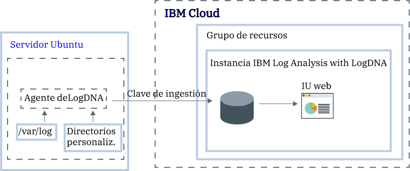

---

copyright:
  years:  2018, 2019
lastupdated: "2019-03-06"

keywords: LogDNA, IBM, Log Analysis, logging, ubuntu, tutorial

subcollection: LogDNA

---

{:new_window: target="_blank"}
{:shortdesc: .shortdesc}
{:screen: .screen}
{:pre: .pre}
{:table: .aria-labeledby="caption"}
{:codeblock: .codeblock}
{:tip: .tip}
{:download: .download}
{:important: .important}
{:note: .note}


# Gestión de registros de Ubuntu con {{site.data.keyword.la_full_notm}}
{: #ubuntu}

Utilice el servicio {{site.data.keyword.la_full}} para supervisar y gestionar registros de Ubuntu en un sistema de registros centralizado en {{site.data.keyword.cloud_notm}}. 
{:shortdesc}

Puede recopilar y supervisar registros del sistema y de aplicaciones. 

De forma predeterminada, el agente LogDNA para Ubuntu supervisa archivos de registro en el directorio **/var/log**. Por ejemplo, el registro del sistema de Ubuntu (*/var/log/syslog*) se supervisa de forma predeterminada.

En {{site.data.keyword.cloud_notm}}, para configurar un servidor Ubuntu para reenviar registros a una instancia de {{site.data.keyword.la_full_notm}}, debe realizar los pasos siguientes:

1. Suministrar una instancia del servicio {{site.data.keyword.la_full_notm}}. 
2. Configurar el agente LogDNA en el servidor Ubuntu.
3. De manera opcional, añadir más directorios a supervisar por el agente.



En esta guía de aprendizaje, aprenderá a configurar un servidor Ubuntu para reenviar registros a una instancia de {{site.data.keyword.la_full_notm}}.

## Antes de empezar
{: #ubuntu_prereqs}

Obtenga más información sobre {{site.data.keyword.la_full_notm}}. Para obtener más información, consulte [Acerca de LogDNA](/docs/services/Log-Analysis-with-LogDNA?topic=LogDNA-about#about).

Trabaje en la región EE. UU. sur. {{site.data.keyword.la_full_notm}} está disponible actualmente en la región EE. UU. sur. **Nota:** puede enviar datos desde un servidor Ubuntu que se encuentre en la misma región o en una región distinta. 

Utilice un ID de usuario que sea miembro o propietario de una cuenta de {{site.data.keyword.cloud_notm}}. Para obtener un ID de usuario de {{site.data.keyword.cloud_notm}}, vaya a: [Registro ](https://cloud.ibm.com/login){:new_window}.

El ID de {{site.data.keyword.IBM_notm}} debe tener asignadas políticas de IAM para cada uno de los siguientes recursos: 

| Recurso                             | Ámbito de la política de acceso | Rol    | Región    | Información                  |
|--------------------------------------|----------------------------|---------|-----------|------------------------------|
| Grupo de recursos **predeterminado**           |  Grupo de recursos            | Visor  | us-south  | Esta política es necesaria para permitir que el usuario vea las instancias de servicio en el grupo de recursos predeterminado.    |
| Servicio {{site.data.keyword.la_full_notm}} |  Grupo de recursos            | Editor  | us-south  | Esta política es necesaria para permitir que el usuario suministre y administre el servicio {{site.data.keyword.la_full_notm}} en el grupo de recursos predeterminado.   |
{: caption="Tabla 1. Lista de políticas de IAM necesarias para completar la guía de aprendizaje" caption-side="top"} 

Instale la CLI de {{site.data.keyword.cloud_notm}}. Para obtener más información, consulte [Instalación de la CLI de {{site.data.keyword.cloud_notm}}](/docs/cli/index.html#overview).


## Paso 1. Suministrar una instancia de {{site.data.keyword.la_full_notm}}
{: #ubuntu_step1}

Para suministrar una instancia de {{site.data.keyword.la_full_notm}} mediante la interfaz de usuario de {{site.data.keyword.cloud_notm}}, siga los pasos siguientes:

1. Inicie una sesión en su cuenta de {{site.data.keyword.cloud_notm}}.

    Pulse el [panel de control de {{site.data.keyword.cloud_notm}} ](https://cloud.ibm.com/login){:new_window} para iniciar el panel de control de {{site.data.keyword.cloud_notm}}.

	Cuando inicia una sesión con su ID de usuario y su contraseña, se abre la interfaz de usuario de {{site.data.keyword.cloud_notm}}.

2. Pulse **Catálogo**. Se abrirá la lista de servicios disponibles en {{site.data.keyword.cloud_notm}}.

3. Para filtrar la lista de servicios que se visualiza, seleccione la categoría **Herramientas de desarrollador**.

4. Pulse el mosaico **{{site.data.keyword.la_full_notm}}**.

5. Especifique un nombre para la instancia de servicio.

6. Seleccione el grupo de recursos **predeterminado**. 

    De forma predeterminada, se selecciona el grupo de recursos **predeterminado**.

7. Seleccione el plan de servicio **Lite**. 

    De forma predeterminada, se establece el plan **Lite**.

    Para obtener más información acerca de los otros planes de servicio, consulte [Planes de servicio](/docs/services/Log-Analysis-with-LogDNA?topic=LogDNA-about#overview_pricing_plans).

8. Para suministrar el servicio {{site.data.keyword.la_full_notm}} en el grupo de recursos de {{site.data.keyword.cloud_notm}} en el que ha iniciado la sesión, pulse **Crear**.

Tras suministrar una instancia, se abrirá el panel de control de {{site.data.keyword.la_full_notm}}. 


**Nota:** para suministrar una instancia de LogDNA a través de la CLI, consulte [Suministro de LogDNA a través de la CLI de {{site.data.keyword.cloud_notm}}](/docs/services/Log-Analysis-with-LogDNA?topic=LogDNA-provision#provision_cli).


## Paso 2. Configurar el servidor Ubuntu para enviar registros a la instancia
{: #ubuntu_step2}

Para configurar el servidor Ubuntu para enviar registros a la instancia de {{site.data.keyword.la_full_notm}}, debe instalar un `logdna-agent`. El agente LogDNA lee archivos de registro de */var/log* y reenvía los datos de registro a la instancia de LogDNA.

Para configurar el servidor Ubuntu para reenviar registros a la instancia de LogDNA, realice los pasos siguientes desde un terminal de Ubuntu:

1. Instale el agente LogDNA. Ejecute los mandatos siguientes:

    ```
    echo "deb https://repo.logdna.com stable main" | sudo tee /etc/apt/sources.list.d/logdna.list 
    ```
    {: codeblock}

    ```
    wget -O- https://repo.logdna.com/logdna.gpg | sudo apt-key add - 
    ```
    {: codeblock}

    ```
    sudo apt-get update
    ```
    {: codeblock}

    ```
    sudo apt-get install logdna-agent < "/dev/null"
    ```
    {: codeblock}

2. Establezca la clave de ingestión que debe utilizar el agente LogDNA para reenviar registros a la instancia de {{site.data.keyword.la_full_notm}}.  

    ```
    sudo logdna-agent -k INGESTION_KEY
    ```
    {: codeblock}

    donde INGESTION_KEY contiene la clave de ingestión activa para la instancia de {{site.data.keyword.la_full_notm}} donde va a configurar el reenvío de registros.

3. Establezca el punto final de autenticación. El agente LogDNA utiliza este host para autenticarse y obtener la señal para reenviar registros.

    ```
    sudo logdna-agent -s LOGDNA_APIHOST=api.us-south.logging.cloud.ibm.com
    ```
    {: codeblock}

4. Establezca el punto final de ingestión.

    ```
    sudo logdna-agent -s LOGDNA_LOGHOST=logs.us-south.logging.cloud.ibm.com
    ```
    {: codeblock}

5. Defina más vías de acceso de registro a supervisar. Ejecute el mandato siguiente: 

    ```
    sudo logdna-agent -d /path/to/log/folders
    ```
    {: codeblock}

    De forma predeterminada, se supervisa **/var/log**.

6. De manera opcional, configure el agente LogDNA para etiquetar los hosts. Ejecute los mandatos siguientes:

    ```
    sudo logdna-agent -t TAG1,TAG2 
    ```
    {: codeblock}

    ```
    sudo update-rc.d logdna-agent defaults
    ```
    {: codeblock}

    ``` 
    sudo /etc/init.d/logdna-agent start
    ```
    {: codeblock}


## Paso 3. Iniciar la interfaz de usuario web de LogDNA
{: #ubuntu_step3}

Para iniciar el panel de control de IBM Log Analysis with LogDNA a través de la interfaz de usuario de {{site.data.keyword.cloud_notm}}, realice los pasos siguientes:

1. Inicie una sesión en su cuenta de {{site.data.keyword.cloud_notm}}.

    Pulse el [panel de control de {{site.data.keyword.cloud_notm}} ](https://cloud.ibm.com/login){:new_window} para iniciar el panel de control de {{site.data.keyword.cloud_notm}}.

	Cuando inicia una sesión con su ID de usuario y su contraseña, se abre el panel de control de {{site.data.keyword.cloud_notm}}.

2. En el menú de navegación, seleccione **Observabilidad**. 

3. Seleccione **Registro**. 

    Aparecerá la lista de instancias de {{site.data.keyword.la_full_notm}} que están disponibles en {{site.data.keyword.cloud_notm}}.

3. Seleccione una instancia. A continuación, pulse **Ver LogDNA**.

    Se abrirá la interfaz de usuario web de LogDNA y mostrará los registros de clúster.


## Paso 4. Visualizar los registros
{: #ubuntu_step4}

Desde la interfaz de usuario web de LogDNA, puede ver los registros a medida que pasan a través del sistema. Puede visualizar registros utilizando el seguimiento de registros. 

**Nota:** con el plan de servicio **gratuito**, solo puede realizar el seguimiento de los registros más recientes.

Para obtener más información, consulte [Visualización de registros](/docs/services/Log-Analysis-with-LogDNA?topic=LogDNA-view_logs#view_logs).


## Pasos siguientes
{: #ubuntu_next_steps}

[Filtrar registros](/docs/services/Log-Analysis-with-LogDNA?topic=LogDNA-view_logs#view_logs_step5), [buscar en registros](/docs/services/Log-Analysis-with-LogDNA?topic=LogDNA-view_logs#view_logs_step6), [definir vistas](/docs/services/Log-Analysis-with-LogDNA?topic=LogDNA-view_logs#view_logs_step7) y [configurar alertas](https://docs.logdna.com/docs/alerts). 

**Nota:** para utilizar cualquiera de estas características, debe actualizar el plan de {{site.data.keyword.la_full_notm}} a un plan de pago.

