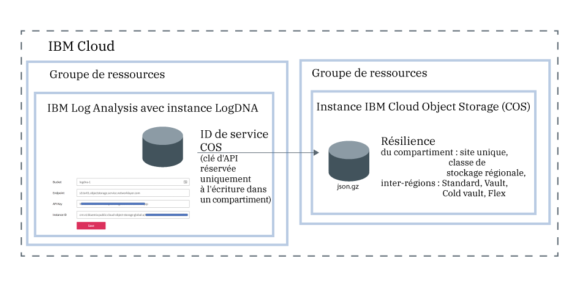

---

copyright:
  years:  2018, 2019
lastupdated: "2019-05-01"

keywords: LogDNA, IBM, Log Analysis, logging, archive logs, COS, cloud object storage

subcollection: LogDNA

---

{:new_window: target="_blank"}
{:shortdesc: .shortdesc}
{:screen: .screen}
{:pre: .pre}
{:table: .aria-labeledby="caption"}
{:codeblock: .codeblock}
{:tip: .tip}
{:download: .download}
{:important: .important}
{:note: .note}

 
# Archivage de journaux dans le stockage d'objets IBM Cloud Object Storage
{: #archiving}

Vous pouvez archiver des journaux à partir d'une instance {{site.data.keyword.la_full_notm}} dans un compartiment d'une instance {{site.data.keyword.cos_full_notm}} (COS). 
{:shortdesc}

Pour configurer l'archivage, vous devez disposer d'une règle IAM avec le rôle de plateforme **Afficheur** et le rôle de service **Responsable** pour le service {{site.data.keyword.la_full_notm}}.

Vous archivez les journaux à partir d'une instance {{site.data.keyword.la_full_notm}} dans un compartiment d'une instance {{site.data.keyword.cos_full_notm}} (COS). Chaque instance {{site.data.keyword.la_full_notm}} a sa propre configuration d'archivage. 

Les journaux sont automatiquement archivés une fois par jour en format compressé **(.json.gz)**. Chaque ligne conserve ses métadonnées.

Les journaux sont archivés dans les 24 à 48 heures après la sauvegarde de la configuration. 

L'instance {{site.data.keyword.cos_full_notm}} est mise à disposition dans le contexte d'un groupe de ressources. L'instance {{site.data.keyword.la_full_notm}} est également mise à disposition dans le contexte d'un groupe de ressources. Les deux instances peuvent être regroupées dans le même groupe de ressources ou se trouver dans des groupes différents. 

{{site.data.keyword.la_full_notm}} utilise un ID de service pour communiquer avec le service {{site.data.keyword.cos_full_notm}}.

* {{site.data.keyword.la_full_notm}} utilise l'ID de service que vous créez pour une instance {{site.data.keyword.cos_full_notm}} pour authentifier et accéder à l'instance {{site.data.keyword.cos_full_notm}}. 
* Vous pouvez affecter à l'ID de service des règles d'accès spécifiques qui limitent les droits sur l'instance {{site.data.keyword.cos_full_notm}}. L'imitez l'ID de service au seul droit d'écriture sur le compartiment dans lequel vous prévoyez d'archiver les journaux.

La figure suivante présente une vue détaillée des différents composants impliqués lors de l'archivage de journaux :

Pour archiver une instance {{site.data.keyword.la_full_notm}} dans un compartiment d'une instance {{site.data.keyword.cos_full_notm}}, procédez comme suit :

## Etape 1. Accord à un utilisateur de règles IAM pour l'utilisation de {{site.data.keyword.cos_full_notm}}
{: #archiving_step1}

**Remarque :** cette étape doit être effectuée par le propriétaire de compte ou un administrateur du service {{site.data.keyword.cos_full_notm}} sur {{site.data.keyword.cloud_notm}}.

En tant qu'administrateur du service {{site.data.keyword.cos_full_notm}}, vous devez être en mesure de mettre à disposition des instances du service, d'accorder à d'autres utilisateurs des droits d'utilisation de ces instances et de créer des ID de service. 

Il existe différentes façons d'accorder à un utilisateur le droit d'éditeur du service {{site.data.keyword.cos_full_notm}} :

* En tant qu'administrateur du service dans le compte, une règle IAM pour le service {{site.data.keyword.cos_full_notm}} doit être affectée à l'utilisateur avec le rôle de plateforme *Administrateur*. Vous devez accorder à cet utilisateur un accès à une ressource individuelle du compte. 

* En tant qu'administrateur du service dans le contexte d'un groupe de ressources, une règle IAM pour le service {{site.data.keyword.cos_full_notm}} avec le rôle de plateforme *Administrateur* doit être affectée à l'utilisateur dans le contexte du groupe de ressources. 

Le tableau suivant répertorie les rôles que peut avoir un utilisateur pour exécuter les actions indiquées pour le service {{site.data.keyword.cos_full_notm}} :

| Service                    | Rôles de plateforme    | Action                                                                                        | 
|----------------------------|-------------------|-----------------------------------------------------------------------------------------------|       
| `Cloud Object Storage`     | Administrateur     | Autorise l'utilisateur à affecter à d'autres utilisateurs dans le compte des règles d'utilisation du service {{site.data.keyword.cos_full_notm}}. |
| `Cloud Object Storage`     | Administrateur  Editeur | Autorise l'utilisateur à mettre à disposition une instance du service {{site.data.keyword.cos_full_notm}}.    |
| `Cloud Object Storage`     | Administrateur  Editeur  Opérateur | Autorise l'utilisateur à créer un ID de service.    | 
{: caption="Tableau 1. Rôles et actions" caption-side="top"} 

Pour affecter à un utilisateur le rôle d'administrateur sur le service {{site.data.keyword.cos_full_notm}} dans le contexte d'un groupe de ressources, procédez comme suit : 

1. Dans la barre de menus, cliquez sur **Gérer** &gt; **Accès (IAM)** puis sélectionnez **Utilisateurs**.
2. Sur la ligne de l'utilisateur auquel vous voulez affecter un accès, sélectionnez le menu **Actions**, puis cliquez sur **Affecter un accès**.
3. Sélectionnez **Affecter l'accès au sein d'un groupe de ressources**.
4. Sélectionnez un groupe de ressources.
5. Si aucun rôle n'a encore été accordé à l'utilisateur pour le groupe de ressources concerné, sélectionnez un rôle pour la zone **Affecter l'accès à un groupe de ressources**. 

    En fonction du rôle sélectionné, l'utilisateur peut afficher le groupe de ressources sur son tableau de bord, modifier le nom du groupe de ressources ou gérer les accès utilisateur au groupe. 
    
    Vous pouvez sélectionner **Aucun accès** si vous voulez que l'utilisateur puisse uniquement accéder au service {{site.data.keyword.la_full_notm}} dans le groupe de ressources.

6. Sélectionnez **Cloud Object Storage**.
7. Sélectionnez le rôle de plateforme **Administrateur**.
8. Cliquez sur **Affecter**.

## Etape 2. Mise à disposition d'une instance {{site.data.keyword.cos_full_notm}}
{: #archiving_step2}

**Remarque :** cette étape doit être effectuée par un éditeur ou un administrateur du service {{site.data.keyword.cos_full_notm}} sur {{site.data.keyword.cloud_notm}}. 

Pour mettre à disposition une instance {{site.data.keyword.cos_full_notm}}, procédez comme suit :

1. Connectez-vous à votre compte {{site.data.keyword.cloud_notm}}.

    Cliquez sur le [tableau de bord {{site.data.keyword.cloud_notm}}](https://cloud.ibm.com/login){:new_window} pour ouvrir le tableau de bord {{site.data.keyword.cloud_notm}}.

	Une fois connecté avec votre ID utilisateur et votre mot de passe, l'interface utilisateur {{site.data.keyword.cloud_notm}} s'ouvre.

2. Cliquez sur **Catalogue**. La liste des services disponibles dans {{site.data.keyword.cloud_notm}} s'affiche.

3. Pour filtrer la liste des services affichés, sélectionnez la catégorie **Stockage**.

4. Cliquez sur la vignette **Stockage d'objets**.

5. Entrez un nom pour l'instance de service.

6. Sélectionnez un groupe de ressources. 

    Le groupe de ressources **Default** est sélectionné par défaut.

7. Sélectionnez un plan de service. 

    Le plan **Lite** est sélectionné par défaut.

9. Cliquez sur **Créer**.

## Etape 3. Création d'un compartiment
{: #archiving_step3}

Les compartiments vous permettent d'organiser vos données dans une instance {{site.data.keyword.cos_full_notm}}. 

Pour gérer les compartiments, l'utilisateur doit disposer de droits d'utilisation des compartiments dans l'instance {{site.data.keyword.cos_full_notm}}. Le tableau suivant répertorie les différents rôles et actions que peut avoir un utilisateur pour exploiter des compartiments :

| Service                    | Rôles                   | Action                             | 
|----------------------------|-------------------------|------------------------------------|       
| `Cloud Object Storage`     | Rôle de plateforme : Afficheur   | Autorise l'utilisateur à afficher tous les compartiments et à répertorier les objets qu'ils contiennent via l'interface utilisateur {{site.data.keyword.cloud_notm}}. |
| `Cloud Object Storage`     | Rôle de service : Responsable   | Autorise l'utilisateur à rendre des objets publics.                                                       |
| `Cloud Object Storage`     | Rôles de service : Responsable  Auteur | Autorise l'utilisateur à créer et à détruire des compartiments et des objets.                         | 
| `Cloud Object Storage`     | Rôle de service : Lecteur    | Autorise l'utilisateur à répertorier et télécharger des objets.                                                 |
{: caption="Tableau 1. Rôles et actions pour utiliser des compartiments" caption-side="top"} 

**Remarque :** pour créer un compartiment, vous devez disposer du rôle de responsable ou de lecteur sur l'instance {{site.data.keyword.cos_full_notm}}.

Pour créer un compartiment, procédez comme suit :

1. Connectez-vous à votre compte {{site.data.keyword.cloud_notm}}.

    Cliquez sur le [tableau de bord {{site.data.keyword.cloud_notm}}](https://cloud.ibm.com/login){:new_window} pour ouvrir le tableau de bord {{site.data.keyword.cloud_notm}}.

	Une fois connecté avec votre ID utilisateur et votre mot de passe, le tableau de bord {{site.data.keyword.cloud_notm}} s'ouvre.

2. Depuis le tableau de bord, sélectionnez l'instance {{site.data.keyword.cos_full_notm}} dans laquelle vous prévoyez de créer le compartiment.

3. Sélectionnez **Compartiments**. Ensuite, cliquez sur **Créer un compartiment**.

4. Entrez un nom de compartiment dans la zone *Nom de compartiment unique*.

    **Remarque :** tous les compartiments de toutes les régions du monde se partagent le même espace de nom. 

    Vous pouvez intégrer le nom de votre instance {{site.data.keyword.la_full_notm}} dans le nom du compartiment. Par exemple, pour une instance nommée *logdna-1*, vous pouvez utiliser *accountN-logdna-1* comme nom de compartiment.

    Vous aurez besoin de ce nom pour configurer l'archivage via l'interface utilisateur Web {{site.data.keyword.la_full_notm}}.

5. Sélectionnez le type de résilience et de l'emplacement où vous voulez que vos données soient physiquement stockées.

    La résilience fait référence à la portée et à la dimension de la zone géographique dans laquelle vos données sont distribuées. 
    
    Une résilience inter-région répartit vos données dans plusieurs zones métropolitaines.
    
    Une résilience régionale répartit vos données dans une seule zone métropolitaine. 
    
    Un centre de données unique distribue les données uniquement aux périphériques d'un seul site.

    Pour plus d'informations, voir [Select regions and endpoints](/docs/services/cloud-object-storage?topic=cloud-object-storage-endpoints).

6. Sélectionnez le type de *Classe de stockage*.

    Vous pouvez créer des compartiments ayant différentes classes de stockage. Sélectionnez la classe de stockage de votre compartiment en fonction de vos besoins en matière d'extraction des données. Pour plus d'informations, voir [Use storage classes](/docs/services/cloud-object-storage?topic=cloud-object-storage-classes).

    **Remarque :** une fois le compartiment créé, vous ne pouvez plus modifier la classe de stockage. Si vous avez besoin de reclassifier des objets, vous devez déplacer les données vers un autre compartiment ayant la classe de stockage requise.

7. Vous pouvez éventuellement ajouter une clé Key Protect pour chiffrer les données au repos.

    Tous les objets sont chiffrés par défaut à l'aide de clés générées de manière aléatoire et d'une transformation en tout ou rien. Même si ce modèle de chiffrement par défaut fournit une sécurité au repos, certaines charges de travail doivent posséder les clés de chiffrement utilisées. Pour plus d'informations, voir [Manage encryption](/docs/services/cloud-object-storage?topic=cloud-object-storage-encryption).

## Etape 4. Création d'un ID de service pour l'instance {{site.data.keyword.cos_full_notm}}
{: #archiving_step4}

Un ID de service identifie un service tout comme un ID utilisateur identifie un utilisateur. Les ID de service ne sont pas liés à un utilisateur spécifique. Si l'utilisateur qui a créé l'ID de service quitte votre organisation et est supprimé du compte, l'ID de service est conservé.

Vous devez créer un ID de service pour votre instance {{site.data.keyword.cos_full_notm}}. L'instance {{site.data.keyword.la_full_notm}} utilise cet ID de service pour s'authentifier auprès de votre instance {{site.data.keyword.cos_full_notm}}. 

Vous devez affecter des règles d'accès spécifiques à l'ID de service pour l'utilisation de services spécifiques, voire même combiner des droits d'accès à différents services. Par exemple, pour limiter l'accès à un seul compartiment, assurez-vous à l'aide de la console ou de l'interface de ligne de commande que l'ID de service ne dispose d'aucune règle de niveau instance.

Pour créer un ID de service disposant de droits d'écriture pour l'instance {{site.data.keyword.cos_full_notm}}, procédez comme suit :

1. Connectez-vous à votre compte {{site.data.keyword.cloud_notm}}.

    Cliquez sur le [tableau de bord {{site.data.keyword.cloud_notm}}](https://cloud.ibm.com/login){:new_window} pour ouvrir le tableau de bord {{site.data.keyword.cloud_notm}}.

	Une fois connecté avec votre ID utilisateur et votre mot de passe, le tableau de bord {{site.data.keyword.cloud_notm}} s'ouvre.

2. Depuis le tableau de bord, sélectionnez l'instance {{site.data.keyword.cos_full_notm}} dans laquelle vous prévoyez de créer le compartiment.

3. Sélectionnez **Données d'identification pour le service**. Puis sélectionnez **Nouvelles données d'identification**.

4. Entrez un nom. 

5. Sélectionnez le rôle **Auteur**.

6. Cliquez sur **Ajouter**.

    Un nouvel ID de service est ajouté à la liste. 

Pour l'ID de service que vous venez de créer, cliquez sur **Afficher les données d'identification**. Les informations concernant l'ID de service s'affichent. 

* Copiez la clé d'API. Il s'agit de la valeur définie dans la zone **apikey**.
* Copiez l'ID d'instance de ressource. Il s'agit de la valeur définie dans la zone **resource_instance_id**.

## Etape 5. Limitation de l'ID de service au seul droit d'écriture pour le compartiment
{: #archiving_step5}

Pour accorder à l'ID de service uniquement le droit d'écriture pour un compartiment, procédez comme suit :

1. Lisez les informations relatives à l'ID de service et notez la valeur des zones **iam_apikey_name** et **iam_apikey_name**. 

2. Depuis le tableau de bord, sélectionnez **Gérer** &gt; **Accès (IAM)**, puis **Utilisateurs**.

3. Sélectionnez **ID de service**.

4. Recherchez un ID de service nommé **auto-generated-serviceId-<ID qui fait partie de la valeur iam_apikey_name>.

5. Sélectionnez l'ID de service. Puis, dans **Règles d'accès**, cliquez sur **Auteur**.

6. Dans la zone *Type de ressource*, entrez **compartiment**.

7. Dans la zone *ID de ressource*, entrez le nom de votre compartiment.

8. Cliquez sur **Sauvegarder**.

**Remarque :** si vous ne renseignez pas la zone Type de ressource ou la zone Ressource, la règle créée est une règle de niveau instance.

## Etape 6. Sélection du noeud final
{: #archiving_step6}

Un noeud final définit à quel endroit rechercher un compartiment. Il existe différents noeuds finaux selon la région et le type de résilience. Pour plus d'informations, voir [Select regions and endpoints](/docs/services/cloud-object-storage?topic=cloud-object-storage-endpoints#endpoints).

Pour obtenir le noeud final de votre compartiment, procédez comme suit :

1. Connectez-vous à votre compte {{site.data.keyword.cloud_notm}}.

    Cliquez sur le [tableau de bord {{site.data.keyword.cloud_notm}}](https://cloud.ibm.com/login){:new_window} pour ouvrir le tableau de bord {{site.data.keyword.cloud_notm}}.

	Une fois connecté avec votre ID utilisateur et votre mot de passe, le tableau de bord {{site.data.keyword.cloud_notm}} s'ouvre.

2. Depuis le tableau de bord, sélectionnez l'instance {{site.data.keyword.cos_full_notm}} dans laquelle vous prévoyez de créer le compartiment.

3. Sélectionnez **Compartiments**. Ensuite, sélectionnez le compartiment que vous avez créé et dans lequel vous voulez archiver des journaux.

4. Sélectionnez **Configuration**.

5. Copiez l'un des noeuds finaux privés. 

## Etape 7. Accord à un utilisateur de règles IAM pour l'archivage de journaux
{: #archiving_step7}

Le tableau suivant répertorie les règles que doit détenir un utilisateur pour configurer l'archivage de journaux depuis l'interface utilisateur Web {{site.data.keyword.la_full_notm}} vers un compartiment d'une instance {{site.data.keyword.cos_full_notm}} :

| Service                        | Rôle                      | Droits accordés                  | 
|--------------------------------|---------------------------|-------------------------------------|  
| `{{site.data.keyword.la_full_notm}}` | Rôle de plateforme : Afficheur     | Autorise l'utilisateur à afficher la liste des instances de service dans le tableau de bord de journalisation d’observabilité. |
| `{{site.data.keyword.la_full_notm}}` | Rôle de service : Responsable      | Autorise l'utilisateur à démarrer l'interface utilisateur Web et à afficher des journaux dans cette interface.                             |
{: caption="Tableau 2. Règles IAM" caption-side="top"} 

Pour plus d'informations sur la manière de configurer ces règles pour un utilisateur, voir [Octroi à un utilisateur du droit d'afficher des journaux dans LogDNA](/docs/services/Log-Analysis-with-LogDNA/work_iam.html#user_logdna).

Pour accorder à un utilisateur le droit d'archiver des journaux, procédez comme suit : 

1. Dans la barre de menus, cliquez sur **Gérer** &gt; **Accès (IAM)** puis sélectionnez **Utilisateurs**.
2. Sur la ligne de l'utilisateur auquel vous voulez affecter un accès, sélectionnez le menu **Actions**, puis cliquez sur **Affecter un accès**.
3. Sélectionnez **Affecter l'accès au sein d'un groupe de ressources**.
4. Sélectionnez un groupe de ressources.
5. Si aucun rôle n'a encore été accordé à l'utilisateur pour le groupe de ressources concerné, sélectionnez un rôle pour la zone **Affecter l'accès à un groupe de ressources**. 

    En fonction du rôle sélectionné, l'utilisateur peut afficher le groupe de ressources sur son tableau de bord, modifier le nom du groupe de ressources ou gérer les accès utilisateur au groupe. 
    
    Vous pouvez sélectionner **Aucun accès** si vous voulez que l'utilisateur puisse uniquement accéder au service {{site.data.keyword.la_full_notm}} dans le groupe de ressources.

6. Sélectionnez **IBM Log Analysis avec LogDNA**.
7. Sélectionnez le rôle de plateforme **Afficheur**.
8. Sélectionnez le rôle de service **Responsable**.
9. Cliquez sur **Affecter**.

## Etape 8. Configuration de l'archivage pour votre instance {{site.data.keyword.la_full_notm}}
{: #archiving_step8}

Pour configurer l'archivage de votre instance {{site.data.keyword.la_full_notm}} dans un compartiment COS, procédez comme suit :

1. Ouvrez l'interface utilisateur Web {{site.data.keyword.la_full_notm}}. [En savoir plus](/docs/services/Log-Analysis-with-LogDNA/view_logs.html#view_logs_step2).

2. Cliquez sur l'icône **Configuration**. Puis sélectionnez **Archivage**. 

3. Sélectionnez **IBM Cloud Object Storage**.

4. Définissez le compartiment, le noeud final, la clé d'API et l'ID instance où vous voulez archiver les journaux.

    <table>
      <caption>Tableau 3. Zones de Cloud Object Storage</caption>
      <tr>
         <th>Zone</th>
         <th>Valeur</th>
      </tr>
      <tr>
         <td>Compartiment</td>
         <td>Défini sur le nom du compartiment COS. </td>
      </tr>
      <tr>
         <td>Noeud final</td>
         <td>Défini sur le noeud final privé du compartiment COS.</td>
      </tr>
      <tr>
         <td>Clé d'API</td>
         <td>Définie sur la clé d'API associée à l'ID de service COS.</td>
      </tr>
      <tr>
         <td>ID d'instance</td>
         <td>Défini sur l'ID d'instance COS. </td>
      </tr>
    </table>

5. Cliquez sur **Sauvegarder**.

Une fois la configuration sauvegardée, les journaux sont archivés une fois par jour.

