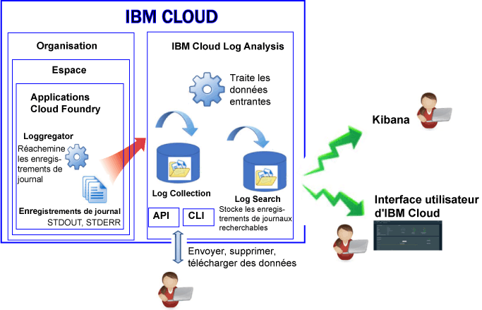

---

copyright:
  years: 2017, 2019

lastupdated: "2019-03-06"

keywords: IBM Cloud, logging

subcollection: cloudloganalysis

---

{:new_window: target="_blank"}
{:shortdesc: .shortdesc}
{:screen: .screen}
{:pre: .pre}
{:table: .aria-labeledby="caption"}
{:codeblock: .codeblock}
{:tip: .tip}
{:download: .download}
{:important: .important}
{:note: .note}

# Applications Cloud Foundry
{: #logging_cf_apps}

Dans {{site.data.keyword.Bluemix}}, vous pouvez afficher, filtrer et analyser les journaux Cloud Foundry (CF) depuis le tableau de bord {{site.data.keyword.Bluemix_notm}}, Kibana et l'interface de ligne de commande. De plus, vous pouvez compacter des enregistrements de journal dans un outil de gestion de journal externe. 
{:shortdesc}

{{site.data.keyword.Bluemix_notm}} enregistre les données de journal générées par la plateforme Cloud Foundry et par les applications Cloud Foundry. Ces journaux comportent les erreurs, les avertissements et les messages d'information qui sont générés pour votre application. 

Lorsque vous exécutez vos applications sur une plateforme cloud sous forme de services (Paas) telle que Cloud Foundry dans {{site.data.keyword.Bluemix_notm}}, vous ne pouvez pas ouvrir de session SSH ou FTP dans l'infrastructure dans laquelle s'exécutent vos applications pour accéder aux journaux. La plateforme est contrôlée par le fournisseur de cloud. Les applications Cloud Foundry qui s'exécutent dans {{site.data.keyword.Bluemix_notm}} utilisent le composant Loggregator pour transmettre les enregistrements de journal depuis l'infrastructure Cloud Foundry. Le composant Loggregator prélève automatiquement des données de sortie standard et d'erreur standard. Vous pouvez afficher et analyser ces journaux via le tableau de bord {{site.data.keyword.Bluemix_notm}}, la plateforme Kibana et l'interface de ligne de commande.

Le diagramme suivant présente une vue d'ensemble de la journalisation des applications Cloud Foundry dans {{site.data.keyword.Bluemix_notm}} :

 
La journalisation des applications Cloud Foundry est activée automatiquement lorsque vous utilisez l'infrastructure Cloud Foundry pour exécuter vos applications dans {{site.data.keyword.Bluemix_notm}}. Pour consulter les journaux d'exécution de Cloud Foundry, vous devez consigner vos journaux dans la sortie standard (STDOUT) et l'erreur standard (STDERR). Pour plus d'informations, voir [Journalisation d'application d'exécution via des applications CF](/docs/services/CloudLogAnalysis/cfapps?topic=cloudloganalysis-logging_writing_to_log_from_cf_app#logging_writing_to_log_from_cf_app).

{{site.data.keyword.Bluemix_notm}} conserve une quantité limitée d'informations de journal. Lorsque des informations sont journalisées, les anciennes informations sont remplacées par les informations plus récentes. Si vous devez vous mettre en conformité avec des politiques d'organisation ou d'industrie qui nécessitent de conserver une partie ou la totalité des informations de journal à des fins d'audit ou autres, vous pouvez compacter vos journaux sur un hôte de journaux externe, par exemple un service de gestion des
journaux tiers ou sur un autre hôte. Pour plus d'informations, voir [Configuration d'hôtes de journaux externes](/docs/services/CloudLogAnalysis/external?topic=cloudloganalysis-thirdparty_logging#thirdparty_logging).

## Ingestion de journaux
{: #log_ingestion1}

Vous pouvez envoyer des journaux dans {{site.data.keyword.loganalysisshort}} à l'aide du réexpéditeur Logstash à service partagé. Pour plus d'informations, voir [Envoyer des données de journaux à l'aide d'un réexpéditeur Logstash à service partagé (mt-logstash-forwarder).](/docs/services/CloudLogAnalysis/how-to/send-data?topic=cloudloganalysis-send_data_mt#send_data_mt).

Le service {{site.data.keyword.loganalysisshort}} propose différents plans. Tous les
plans, à l'exception du plan *Lite*, permettent d'envoyer des journaux au composant Log Collection. Pour plus d'informations sur les plans, voir
[Plans de service](/docs/services/CloudLogAnalysis?topic=cloudloganalysis-log_analysis_ov#plans).

## Collecte de journaux
{: #log_collection}

Par défaut, le service {{site.data.keyword.loganalysisshort}} stocke les données de journal dans Log Search jusqu'à 3 jours :   

* Un maximum de 500 Mo par espace de données est stocké par jour. Les journaux dépassant le plafond de 500 Mo sont rejetés. Les allocations de plafond sont réinitialisées chaque jour à
00h30 (temps universel coordonné).
* Il est possible de rechercher jusqu'à 1,5 Go de données sur un maximum de 3 jours. Les données de journal sont écrasées (sur la base Premier entré, premier sorti) une fois que la
limite de 1,5 Go de données est atteinte ou au bout de 3 jours.

Le service {{site.data.keyword.loganalysisshort}} fournit des plans additionnels qui vous permettent de stocker des journaux dans Log Collection aussi longtemps que vous
en avez besoin. 

* Vous pouvez configurer une règle de conservation des journaux pour définir le nombre de jours pendant lequel vous souhaitez conserver les journaux dans Log Collection. Pour plus d'informations, voir [Règle de conservation des journaux](/docs/services/CloudLogAnalysis?topic=cloudloganalysis-manage_logs#log_retention_policy).
* Vous pouvez supprimer les journaux manuellement via l'interface de ligne de commande ou l'API.

Pour obtenir plus d'informations sur le tarif de chaque plan, voir [Plans de service](/docs/services/CloudLogAnalysis?topic=cloudloganalysis-log_analysis_ov#plans).

## Recherche de journaux
{: #log_search1}

Par défaut, vous pouvez utiliser Kibana pour rechercher jusqu'à 500 Mo de journaux par jour dans {{site.data.keyword.Bluemix_notm}}. 

Le service {{site.data.keyword.loganalysisshort}} offre plusieurs plans. Chaque plan offre des fonctions de recherche de journaux différentes. Par exemple, le plan *Collecte
de journaux* vous permet de rechercher jusqu'à 1 Go de données par jour. Pour plus d'informations sur les plans, voir
[Plans de service](/docs/services/CloudLogAnalysis?topic=cloudloganalysis-log_analysis_ov#plans).

## Méthodes d'analyse de journaux d'application CF
{: #logging_bluemix_cf_apps_log_methods}

Vous pouvez choisir l'une des méthodes suivantes pour analyser les journaux de votre application Cloud Foundry :

* Analyser le journal dans l'interface utilisateur {{site.data.keyword.Bluemix_notm}} pour afficher la dernière activité de l'application.
    
    Dans {{site.data.keyword.Bluemix_notm}}, vous pouvez afficher, filtrer et analyser des journaux depuis l'onglet **Journal** disponible pour chaque application Cloud Foundry. Pour plus d'informations, voir [Analyse des journaux de l'application CF via le tableau de bord de l'application CF](/docs/services/CloudLogAnalysis/cfapps?topic=cloudloganalysis-launch_logs_cloud_ui_cf#cfapp_ui).
    
* Analyser les journaux dans Kibana pour effectuer des tâches analytiques avancées.
    
    Dans {{site.data.keyword.Bluemix_notm}}, vous pouvez utiliser la plateforme de visualisation et d'analyse open source Kibana pour surveiller, rechercher, analyser et afficher des données dans différents graphiques, par exemple des diagrammes et des tableaux. Pour plus d'informations, voir [Analyse des journaux de l'application CF via l'interface utilisateur {{site.data.keyword.loganalysisshort}}](/docs/services/CloudLogAnalysis/cfapps?topic=cloudloganalysis-launch_logs_cloud_ui_cf#cfapp_la).
	
	**Astuce :** pour lancer Kibana, voir [Accès à Kibana depuis le
tableau de bord d'une application CF](/docs/services/CloudLogAnalysis/kibana?topic=cloudloganalysis-launch#launch_Kibana_from_cf_app).

* Analyser des journaux via l'interface de ligne de commande pour utiliser des commandes permettant de gérer des journaux à l'aide d'un programme.
    
    Dans {{site.data.keyword.Bluemix_notm}}, vous pouvez afficher, filtrer et analyser des journaux via l'interface de ligne de commande avec la commande **cf logs**. Pour plus d'informations, voir [Analyse des journaux d'application Cloud Foundry depuis l'interface de ligne de commande](/docs/services/CloudLogAnalysis/cfapps?topic=cloudloganalysis-analyzing_logs_cli#analyzing_logs_cli).

## Sources de journal pour applications CF déployées sur Diego
{: #cf_apps_log_sources_diego}

Les sources de journal suivantes sont disponibles pour les applications Cloud Foundry (CF) qui sont déployées dans l'architecture Cloud Foundry reposant sur Diego :
    
| Source de journal | Nom du composant | Description | 
|------------|----------------|-------------|
| LGR | Loggregator | Le composant LGR fournit des informations sur Cloud Foundry Loggregator, lequel réachemine des journaux depuis Cloud Foundry. |
| RTR | Router | Le composant RTR fournit des informations sur les requêtes HTTP adressées à une application. | 
| STG | Staging | Le composant STG fournit des informations sur la manière dont une application est constituée ou reconstituée en préproduction. | 
| APP | Application | Le composant APP fournit des journaux issus de l'application. C'est là que la sortie standard et l'erreur standard de votre code apparaîtront. | 
| API | Cloud Foundry API | Le composant API fournit des informations sur les actions en interne résultant d'une demande utilisateur pour modifier l'état d'une application. | 
| CELL | Diego cell | Le composant CELL fournit des informations sur le démarrage, l'arrêt ou la panne d'une application.|
| SSH | SSH | Le composant SSH fournit des informations chaque fois qu'un utilisateur accède à une application via la commande **cf ssh**. |
{: caption="Tableau 1. Sources de journal des applications CF déployées dans une architecture CF basée sur Diego" caption-side="top"}

La figure suivante présente les différents composants (sources de journal) dans une architecture Cloud Foundry basée sur Diego : 

 dans une architecture Cloud Foundry basée sur Diego.")
	
## Sources de journal des applications CF déployées sur DEA
{: #logging_bluemix_cf_apps_log_sources}

Les sources de journal suivantes sont disponibles pour les applications Cloud Foundry (CF) qui sont déployées sur une architecture Droplet Execution Agent (DEA) :
    
| Source de journal | Nom du composant | Description | 
|------------|----------------|-------------|
| LGR | Loggregator | Le composant LGR fournit des informations sur Cloud Foundry Loggregator, lequel réachemine des journaux depuis Cloud Foundry. |
| RTR | Router | Le composant RTR fournit des informations sur les requêtes HTTP adressées à une application. | 
| STG | Staging | Le composant STG fournit des informations sur la manière dont une application est constituée ou reconstituée en préproduction. | 
| APP | Application | Le composant APP fournit des journaux issus de l'application. C'est là que la sortie standard et l'erreur standard de votre code apparaîtront. | 
| API | Cloud Foundry API | Le composant API fournit des informations sur les actions en interne résultant d'une demande utilisateur pour modifier l'état d'une application. | 
| DEA | Droplet Execution Agent | Le composant DEA fournit des informations sur le démarrage, l'arrêt ou la panne d'une application.   Ce composant est disponible uniquement si votre application est déployée dans l'architecture Cloud Foundry qui est basée sur DEA. | 
{: caption="Tableau 2. Sources de journal pour les applications CF qui sont déployées dans une architecture CF basée sur DEA" caption-side="top"}

La figure suivante présente les différents composants (sources de journal) dans une architecture Cloud Foundry basée sur DEA : 

 dans une architecture Cloud Foundry basée sur Droplet Execution Agent (DEA).")

## Format de journal pour les journaux d'application CF affichés dans l'interface utilisateur {{site.data.keyword.Bluemix_notm}}
{: #log_format_cf}

Les journaux pour les applications {{site.data.keyword.Bluemix_notm}} CF sont affichés dans un format fixe, similaire au modèle suivant :

<code><var class="keyword varname">Composant</var>/<var class="keyword varname">ID_instance</var>/<var class="keyword varname">message</var>/<var class="keyword varname">horodatage</var></code>

Chaque entrée de journal comporte les zones suivantes :

| Zone | Description |
|-------|-------------|
| Horodatage | Date et heure de l'instruction de journal. L'horodatage est défini à la milliseconde près. |
| Composant | Composant qui génère le journal. Pour la liste des différents composants, voir [Sources de journal pour les applications CF](/docs/services/CloudLogAnalysis/cfapps?topic=cloudloganalysis-logging_cf_apps#logging_bluemix_cf_apps_log_sources).   Chaque type de composant est suivi d'une barre oblique et d'un chiffre qui indique l'instance d'application. 0 est le chiffre attribué à la première instance, 1 est le chiffre attribué à la deuxième instance, etc. |
| Message | Message émis par le composant. Il varie selon le contexte. |
{: caption="Tableau 1. Zones d'entrée de journal d'une application CF" caption-side="top"}

## Tutoriel : Analyse des journaux dans Kibana pour une application Cloud Foundry
{: #tutorial}  

Pour apprendre à utiliser Kibana afin d'analyser les journaux pour une application Cloud Foundry, voir [Analyse des journaux dans Kibana pour une application Cloud Foundry](https://console.bluemix.net/docs/tutorials/application-log-analysis.html#generate-access-and-analyze-application-logs).
