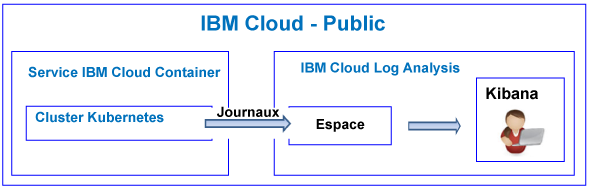
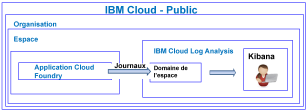

---

copyright:
  years: 2017, 2019

lastupdated: "2019-03-22"

keywords: IBM Cloud, logging

subcollection: cloudloganalysis

---

{:new_window: target="_blank"}
{:shortdesc: .shortdesc}
{:screen: .screen}
{:pre: .pre}
{:table: .aria-labeledby="caption"}
{:codeblock: .codeblock}
{:tip: .tip}
{:download: .download}
{:important: .important}
{:note: .note}

# Tutoriel d'initiation
{: #getting-started}

Suivez ce tutoriel pour commencer à utiliser le service {{site.data.keyword.loganalysislong}} dans {{site.data.keyword.Bluemix}}. 
{:shortdesc}

Par défaut, {{site.data.keyword.Bluemix_notm}} offre des fonctions de journalisation intégrées pour certains services. Vous pouvez utiliser le service {{site.data.keyword.loganalysisshort}} pour étendre vos fonctions de collecte et de conservation de journaux.

## Avant de commencer
{: #gs_prereqs}

Vous devez disposer d'un ID utilisateur membre ou propriétaire d'un compte {{site.data.keyword.Bluemix_notm}}. Pour obtenir un ID utilisateur {{site.data.keyword.Bluemix_notm}}, accédez à : [Page d'inscription ](https://console.bluemix.net/registration/){:new_window}

## Etape 1 : Choix de la ressource de cloud dont sous souhaitez afficher les journaux
{: #gs_step1}

Dans {{site.data.keyword.Bluemix_notm}}, les applications CF, les conteneurs qui s'exécutent sur le {{site.data.keyword.containershort}} et les services sélectionnés collectent automatiquement des données de journal et les transmettent au service {{site.data.keyword.loganalysisshort}}.

Le tableau suivant répertorie les différentes ressources de cloud. Suivez le tutoriel d'une ressource pour commencer à utiliser le service {{site.data.keyword.loganalysisshort}} :

<table>
  <caption>Tutoriels pour commencer à utiliser le service {{site.data.keyword.loganalysisshort}} </caption>
  <tr>
    <th>Ressource</th>
    <th>Tutoriel</th>
    <th>Environnement de cloud</th>
    <th>Scénario</th>
  </tr>
  <tr>
    <td>Conteneurs exécutés sur le {{site.data.keyword.containershort}}</td>
    <td>[Analyse dans Kibana des journaux d'une application déployée dans un cluster Kubernetes](/docs/services/CloudLogAnalysis/tutorials?topic=cloudloganalysis-container_logs#container_logs)</td>
    <td>Public </br>Dedicated</td>
    <td></td>

  </tr>
  <tr>
    <td>Applications CF</td>
    <td>[Analyse des journaux dans Kibana pour une application Cloud Foundry](https://console.bluemix.net/docs/tutorials/application-log-analysis.html#generate-access-and-analyze-application-logs)</td>
    <td>Public</td>
    <td></td>
  </tr>
</table>


## Etape 2 : Définition des droits d'un utilisateur pour l'affichage des journaux
{: #gs_step2}

Pour contrôler les actions {{site.data.keyword.loganalysisshort}} qu'un utilisateur peut effectuer, vous pouvez affecter des rôles et des règles à un utilisateur. 

Dans {{site.data.keyword.Bluemix_notm}}, il existe deux types de droits de sécurité qui contrôlent les actions que les utilisateurs peuvent effectuer lorsqu'ils utilisent le service {{site.data.keyword.loganalysisshort}} :

* Les rôles Cloud Foundry (CF) : vous attribuez un rôle CF à un utilisateur pour définir les droits dont cet utilisateur dispose pour afficher les journaux dans un espace.
* Les rôles IAM : vous affectez une règle IAM à un utilisateur pour définir les droits dont cet utilisateur dispose pour afficher les journaux dans le domaine de compte.

### Définition des droits d'un utilisateur pour l'affichage des journaux dans un domaine d'espace
{: #gs_step2a}

Procédez comme suit pour accorder à un utilisateur des droits permettant d'afficher les journaux dans un espace :

1. Connectez vous à la console {{site.data.keyword.Bluemix_notm}}.

    Ouvrez un navigateur Web et lancez le tableau de bord {{site.data.keyword.Bluemix_notm}} : [http://bluemix.net ](http://bluemix.net){:new_window}
	
	Une fois que vous êtes connecté avec votre ID utilisateur et votre mot de passe, l'interface utilisateur {{site.data.keyword.Bluemix_notm}} s'ouvre.

2. Dans la barre de menus, cliquez sur **Gérer > Compte > Utilisateurs**. 

    La fenêtre *Utilisateurs* affiche une liste d'utilisateurs avec leur adresse électronique et leur statut sur le compte actuellement sélectionné.
	
3. Si l'utilisateur est membre du compte, sélectionnez le nom de l'utilisateur dans la liste ou cliquez sur **Gérer un utilisateur** dans le menu *Actions*.

    Si l'utilisateur n'est pas membre du compte, voir [Invitation d'utilisateurs](/docs/iam?topic=iam-iamuserinv#iamuserinv).

4. Sélectionnez **Accès Cloud Foundry**, puis sélectionnez l'organisation.

    La liste des espaces disponibles dans cette organisation est affichée.

5. Choisissez l'espace dans lequel vous avez mis à disposition le service {{site.data.keyword.loganalysisshort}}. Ensuite, dans le menu d'actions, sélectionnez **Editer un rôle d'espace**.

6. Sélectionnez *Auditeur*. 

    Vous pouvez sélectionner un ou plusieurs rôles d'espace. Les rôles suivants autorisent tous un utilisateur à afficher les journaux : *Responsable*, *Développeur* et *Auditeur*.
	
7. Cliquez sur **Sauvegarder le rôle**.


### Définition des droits d'un utilisateur pour l'affichage des journaux dans un domaine de compte
{: #gs_step2b}


Procédez comme suit pour accorder à un utilisateur des droits permettant d'afficher des journaux de compte :

1. Connectez vous à la console {{site.data.keyword.Bluemix_notm}}.

    Ouvrez un navigateur Web et lancez le tableau de bord {{site.data.keyword.Bluemix_notm}} : [http://bluemix.net ](http://bluemix.net){:new_window}
	
	Une fois que vous êtes connecté avec votre ID utilisateur et votre mot de passe, l'interface utilisateur {{site.data.keyword.Bluemix_notm}} s'ouvre.

2. Dans la barre de menus, cliquez sur **Gérer > Compte > Utilisateurs**. 

    La fenêtre *Utilisateurs* affiche une liste d'utilisateurs avec leur adresse électronique et leur statut sur le compte actuellement sélectionné.
	
3. Si l'utilisateur est membre du compte, sélectionnez le nom de l'utilisateur dans la liste ou cliquez sur **Gérer un utilisateur** dans le menu *Actions*.

    Si l'utilisateur n'est pas membre du compte, voir [Invitation d'utilisateurs](/docs/iam?topic=iam-iamuserinv#iamuserinv).

4. Dans la section **Règles d'accès**, cliquez sur **Affecter un accès**, puis cliquez sur **Affecter l'accès aux ressources**.

    La fenêtre *Affecter l'accès à la ressource à** s'ouvre.

5. Entrez les informations concernant la règle. Le tableau ci-dessous répertorie les zones requises pour définir une règle. 

    <table>
	  <caption>Liste des zones de configuration d'une règle IAM.</caption>
	  <tr>
	    <th>Zone</th>
		<th>Valeur</th>
	  </tr>
	  <tr>
	    <td>Services</td>
		<td>*IBM Cloud Log Analysis*</td>
	  </tr>	  
	  <tr>
	    <td>Régions</td>
		<td>Vous pouvez spécifier les régions dans lesquelles l'utilisateur disposera des droits permettant d'utiliser les journaux. Sélectionnez ou une plusieurs régions individuellement, ou sélectionnez **Toutes les régions en cours** pour accorder l'accès à toutes les régions.</td>
	  </tr>
	  <tr>
	    <td>Instance de service</td>
		<td>Sélectionnez *Toutes les instances de service*.</td>
	  </tr>
	  <tr>
	    <td>Rôles</td>
		<td>Sélectionnez un ou plusieurs rôles IAM. <br>Les rôles valides sont *administrateur*, *opérateur*, *éditeur* et *afficheur*. <br>Pour plus d'informations sur les actions autorisées pour chaque rôle, voir [Rôle IAM](/docs/services/CloudLogAnalysis?topic=cloudloganalysis-security_ov#iam_roles).
		</td>
	  </tr>
     </table>
	
6. Cliquez sur **Affecter**.
	
La règle que vous configurez est applicable aux régions sélectionnées. 


## Etapes suivantes 
{: #gs_next_steps}

**Remarque :** un utilisateur doit accéder à Kibana dans la région de cloud publique dans laquelle les données de journal sont disponibles pour afficher et analyser les données de journal. 

Par exemple, pour lancer Kibana dans la région Sud des Etats-Unis, ouvrez un navigateur Web et entrez l'URL suivante :

```
https://logging.ng.bluemix.net/ 
```
{: codeblock}


Pour plus d'informations sur le lancement de Kibana dans d'autres régions, voir [Accès à Kibana depuis un navigateur Web](/docs/services/CloudLogAnalysis/kibana?topic=cloudloganalysis-launch#launch_Kibana_from_browser).

**Remarque :** lorsque vous lancez Kibana, si un message signale que le *jeton bearer n'est pas valide* ; vérifiez vos droits dans le compte. Ce message indique que votre ID utilisateur ne dispose pas des droits permettant d'afficher les journaux.

Ensuite, personnalisez Kibana pour afficher et analyser vos données de journal. Pour plus d'informations, voir [Affichage et analyse des journaux](/docs/services/CloudLogAnalysis/kibana?topic=cloudloganalysis-analyzing_logs_Kibana#analyzing_logs_Kibana).
    


