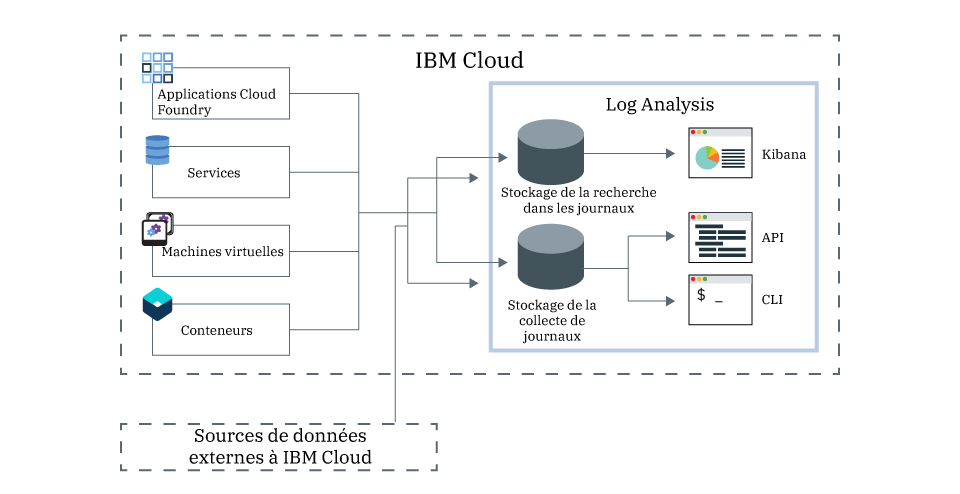

---

copyright:
  years: 2017, 2019

lastupdated: "2019-03-06"

keywords: IBM Cloud, logging

subcollection: cloudloganalysis

---

{:new_window: target="_blank"}
{:shortdesc: .shortdesc}
{:screen: .screen}
{:pre: .pre}
{:table: .aria-labeledby="caption"}
{:codeblock: .codeblock}
{:tip: .tip}
{:download: .download}
{:important: .important}
{:note: .note}

# IBM Cloud Log Analysis
{: #log_analysis_ov}

Utilisez le service {{site.data.keyword.loganalysisfull}} pour étendre votre collecte de journaux, la durée de conservation des journaux et les fonctions de recherche dans les journaux dans {{site.data.keyword.Bluemix}}. Optimisez les performances de votre équipe DevOps en mettant à sa disposition des fonctions telles que l'ajout de journaux d'environnement et d'application pour obtenir un meilleur aperçu de l'application et de l'environnement, pour chiffrer
les journaux et conserver les données de journaux aussi longtemps que nécessaire ainsi que pour une détection et une résolution des problèmes rapides. Utilisez Kibana pour les tâches d'analyse
avancées.
{:shortdesc}

Les fonctions de journalisation {{site.data.keyword.Bluemix_notm}} sont intégrées à la plateforme :

* La collecte des données est automatiquement activée pour les ressources de cloud. Par défaut, {{site.data.keyword.Bluemix_notm}} collecte et affiche des journaux pour vos applications, vos contextes d'exécution d'application et vos contexte d'exécution de traitement dans lesquels ces applications s'exécutent. 
* Vous pouvez rechercher jusqu'à 500 Mo de journaux par jour. 
* Les journaux des 3 derniers jours sont stockés dans Log Search, un composant du service {{site.data.keyword.loganalysisshort}}.

Vous pouvez utiliser les fonctions de journalisation dans {{site.data.keyword.Bluemix_notm}} pour comprendre le comportement de la plateforme cloud et des ressources qui s'exécutent sur la plateforme. Aucune instrumentation spéciale n'est requise pour collecter les journaux de sortie standard et d'erreur standard. Par exemple, vous pouvez utiliser des journaux pour fournir une analyse rétrospective relative à une application, détecter des problèmes dans votre service, identifier des vulnérabilités, dépanner vos déploiements d'application et le comportement d'exécution, détecter des problèmes dans l'infrastructure où vos applications s'exécutent, suivre votre application parmi les composants de la plateforme cloud et détecter des modèles que vous pouvez utiliser pour préempter des actions qui pourraient affecter votre accord sur les niveaux de service.

{{site.data.keyword.loganalysisfull}} fournit des services de collecte de journaux et de recherche dans les journaux ci pour la plateforme {{site.data.keyword.Bluemix_notm}}, en collectant automatiquement des données d'application et de services {{site.data.keyword.Bluemix_notm}} depuis divers services {{site.data.keyword.Bluemix_notm}}.

Le diagramme suivant présente une vue d'ensemble du service {{site.data.keyword.loganalysisshort}} : 

Pour collecter les journaux des ressources de cloud qui s'exécutent dans un espace et y effectuer des recherches, vous devez mettre à disposition une instance du service {{site.data.keyword.loganalysisshort}} dans l'espace dans lequel ces ressources de cloud s'exécutent. Les journaux sont collectés et stockés par défaut dans Log Search. Lorsque vous sélectionnez un plan de service incluant des fonctions de recherche et de collecte étendues, les
journaux sont également collectés et stockés dans le composant Log Collection. Les données de journal qui sont stockées dans Log Collection sont chiffrées.

Par défaut, {{site.data.keyword.Bluemix_notm}} stocke les données de journal jusqu'à 3 jours dans Log Search :   

* Un maximum de 500 Mo par espace de données est stocké par jour. Les journaux dépassant le plafond de 500 Mo sont rejetés. Les allocations de plafond sont réinitialisées chaque jour à
00h30 (temps universel coordonné).
* Il est possible de rechercher jusqu'à 1,5 Go de données sur un maximum de 3 jours. Les données de journal sont écrasées (sur la base Premier entré, premier sorti) une fois que la
limite de 1,5 Go de données est atteinte ou au bout de 3 jours.

Le service {{site.data.keyword.loganalysisshort}} fournit des plans additionnels qui vous permettent de stocker des journaux dans Log Collection aussi longtemps que vous
en avez besoin. La taille du journal que vous pouvez collecter et stocker dans Log Collection est déterminée par le plan de service que vous choisissez. Vous payez par gigaoctet de données par
mois pour les données qui sont stockées. Les journaux sont stockés dans Log Collection au format JSON.

Vous pouvez utiliser Kibana 5.1 pour les tâches d'analyse pour la recherche dans les journaux avancées :

* Chaque plan limite la taille du journal de recherche par jour. 
* Les recherches couvrent uniquement les données des 3 derniers jours.

Pour accéder aux journaux antérieurs à 3 jours, vous pouvez utiliser l'interface de ligne de commande Log Collection ou l'API Log Collection afin de
télécharger les journaux localement, ou vous pouvez diriger les journaux vers d'autres applications ou des services de cloud tiers. 

Vous pouvez supprimer les journaux automatiquement en définissant une règle de conservation ou manuellement à l'aide de l'interface de ligne de commande
{{site.data.keyword.loganalysisshort}}.

## Pourquoi utiliser le service Log Analysis ?
{: #value}

1. **Passez moins de temps à instrumenter votre application et davantage de temps à développer sa valeur ajoutée.**

    {{site.data.keyword.loganalysislong_notm}} collecte automatiquement les données depuis les services {{site.data.keyword.Bluemix_notm}} sélectionnés ; par conséquent, aucune instrumentation n'est nécessaire.
	
	Vous pouvez choisir la quantité de journaux dans lesquels effectuer la recherche par jour.  Différents plans sont disponibles, mais vous pouvez choisir d'effectuer une recherche dans des journaux dont la taille peut aller jusqu'à 500 Mo, 2 Go, 5 Go et 10 Go par jour.

2. **Conservez vos données de journal près de vos charges de travail d'application et en sécurité grâce à des solutions de stockage économiques basées sur le cloud.**

    Collectez et stockez les données de journal depuis des applications classiques et de microservice s'exécutant dans {{site.data.keyword.Bluemix_notm}} dans un journal centralisé. Conservez les données
de journal aussi longtemps que nécessaire.
	
	Les journaux sont stockés dans le stockage en cloud {{site.data.keyword.IBM_notm}}. Vous pouvez télécharger des journaux lorsque vous en avez besoin.

3. **Obtenez une meilleure vision de votre environnement afin de détecter, de diagnostiquer et d'identifier les problèmes. **

    Affichez, analysez et interagissez avec vos données à l'aide de tableaux de bord personnalisables. Les fonctions de recherche dans les journaux, qui reposent sur la plateforme Elastic Stack, vous offrent la flexibilité et la familiarité de Kibana pour que vous puissiez générer rapidement votre tableau de bord en fonction des besoins de vos applications.

4. **Solide intégration aux API**

    Intégrez vos données de journal à vos applications et à vos opérations via les API du service. Utilisez les API du service {{site.data.keyword.loganalysisshort}} pour gérer vos journaux conservés et envoyer des données de journal à partir d'un emplacement hors d'{{site.data.keyword.IBM_notm}} Cloud.

## Régions
{: #regions}

Le service {{site.data.keyword.loganalysisfull_notm}} est disponible dans les régions suivantes :

* Allemagne
* Royaume-Uni
* Sud des Etats-Unis
* Sydney

## Emplacement des données
{: #data_location}

Le tableau suivant répertorie l'emplacement des journaux par région :

<table>
  <caption>Emplacement des journaux par région</caption>
  <tr>
    <th>Région</th>
	<th>Journaux de Log Search</th>
	<th>Journaux de Log Collection</th>
  </tr>
  <tr>
    <td>Allemagne</td>
	  <td>Hébergés en Allemagne</td>
	  <td>Hébergés en Allemagne</td>
  </tr>
  <tr>
    <td>Royaume-Uni</td>
	  <td>Hébergé au Royaume-Uni</td>
	  <td>Hébergé au Royaume-Uni</td>
  </tr>
  <tr>
    <td>Sud des Etats-Unis</td>
	  <td>Hébergés dans le Sud des Etats-Unis</td>
	  <td>Hébergés dans le Sud des Etats-Unis</td>
  </tr>
  <tr>
    <td>Sydney</td>
	  <td>Hébergés à Sydney</td>
	  <td>Hébergés dans le Sud des Etats-Unis (*)</td>
  </tr>
</table>

(*) Pour Sydney, les journaux de Log Collection sont actuellement hébergés dans le Sud des Etats-Unis. Leur hébergement à Sydney est prévu.

## Plans de service
{: #plans}

Le service {{site.data.keyword.loganalysisshort}} propose plusieurs plans. Chaque plan possède des fonctions différentes de recherche et de collecte des journaux. 

**REMARQUE :** les fonctions qui sont incluses dans un plan de service sont activées uniquement dans l'espace dans lequel vous mettez à disposition le service {{site.data.keyword.loganalysisshort}} avec le plan en question.

Vous pouvez modifier un plan via l'interface utilisateur {{site.data.keyword.Bluemix_notm}} ou via la ligne de commande. Vous pouvez passer à un plan de niveau inférieur ou supérieur à tout moment. Pour plus d'informations sur la sélection d'un plan de service de niveau supérieur, voir [Changement de plan](/docs/services/CloudLogAnalysis/how-to?topic=cloudloganalysis-change_plan#change_plan). 

Le tableau suivant présente les plans disponibles :

<table>
    <caption>Récapitulatif des fonctions Log Search et Log Collection par plan</caption>
      <tr>
        <th>Plan</th>
        <th>Ingestion de journaux</th>
        <th>Conservation des journaux</th>
        <th>Chiffrement des données</th>
        <th>Recherche de journaux</th>
      </tr>
      <tr>
        <td>Lite (valeur par défaut)</td>
        <td>Non</td>
        <td>3 derniers jours</td>
        <td>Non</td>
        <td>Recherche jusqu'à 500 Mo</td>
      </tr>
      <tr>
        <td>Collecte de journaux</td>
        <td>Oui</td>
        <td>Nombre de jours configurable.</td>
        <td>Oui</td>
        <td>Recherche jusqu'à 500 Mo par jour</td>
      </tr>
      <tr>
        <td>Collecte de journaux avec recherche de 2 Go/jour</td>
        <td>Oui</td>
        <td>Nombre de jours configurable.</td>
        <td>Oui</td>
        <td>Recherche jusqu'à 2 Go par jour</td>
      </tr>
      <tr>
        <td>Collecte de journaux avec recherche de 5 Go/jour</td>
        <td>Oui</td>
        <td>Nombre de jours configurable.</td>
        <td>Oui</td>
        <td>Recherche jusqu'à 5 Go par jour</td>
      </tr>
       <tr>
        <td>Collecte de journaux avec recherche de 10 Go/jour</td>
        <td>Oui</td>
        <td>Nombre de jours configurable.</td>
        <td>Oui</td>
        <td>Recherche jusqu'à 10 Go par jour</td>
      </tr>
</table>

**Remarque :** le coût mensuel du stockage Log Collection est calculé comme moyenne du cycle de facturation.

