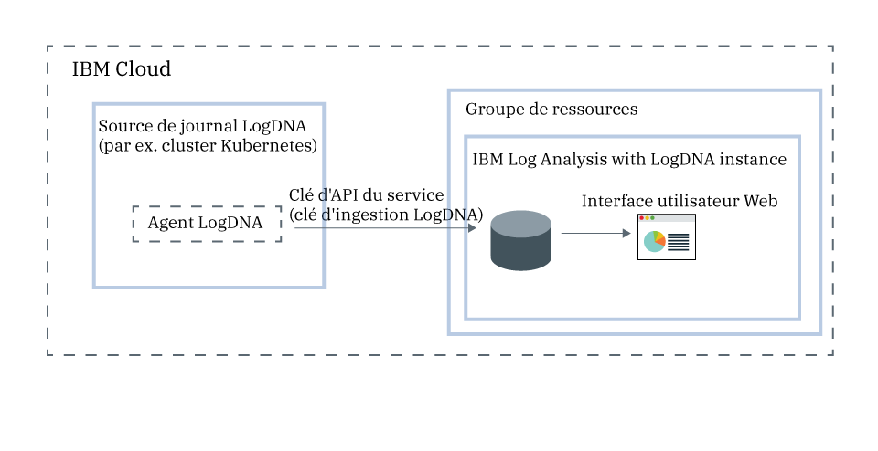

---

copyright:
  years:  2018, 2019
lastupdated: "2019-03-23"

keywords: LogDNA, IBM, Log Analysis, logging, overview

subcollection: LogDNA

---

{:new_window: target="_blank"}
{:shortdesc: .shortdesc}
{:screen: .screen}
{:pre: .pre}
{:table: .aria-labeledby="caption"}
{:codeblock: .codeblock}
{:tip: .tip}
{:download: .download}
{:important: .important}
{:note: .note}

# A propos de {{site.data.keyword.la_full_notm}}
{: #about}

{{site.data.keyword.la_full}} est un service tiers que vous pouvez inclure au sein de votre de architecture {{site.data.keyword.cloud_notm}} afin d'y ajouter des fonctions de gestion de la journalisation. {{site.data.keyword.la_full_notm}} est exploité par LogDNA en partenariat avec {{site.data.keyword.IBM_notm}}.
{:shortdesc}

Vous pouvez utiliser {{site.data.keyword.la_full_notm}} pour gérer les journaux système et d'application dans {{site.data.keyword.cloud_notm}}.

{{site.data.keyword.la_full_notm}} offre aux administrateurs, aux équipes DevOps et aux développeurs des fonctions avancées de filtrage, recherche et mise à la queue de données de journal, de définition d'alertes et de conception de vues personnalisées afin de surveiller les journaux système et d'application.

## Présentation
{: #ov}

Pour ajouter des fonctions de journalisation avec LogDNA dans {{site.data.keyword.cloud_notm}}, vous devez mettre à disposition une instance {{site.data.keyword.la_full_notm}}.

Avant de mettre une instance {{site.data.keyword.la_full_notm}} à disposition, prenez en compte les informations suivantes :
* Les données de journal sont hébergées sur {{site.data.keyword.cloud_notm}}.
* Les données de journal sont envoyées à un tiers.
* Vos utilisateurs doivent disposer de droits de plateforme pour créer, afficher et supprimer une instance d'un service dans {{site.data.keyword.cloud_notm}}.
* Vos utilisateurs doivent disposer de droits de plateforme pour créer des ressources dans le contexte du groupe de ressources dans lequel vous prévoyez de mettre l'instance LogDNA à disposition.

Vous mettez une instance {{site.data.keyword.la_full_notm}} à disposition dans le contexte d'un groupe de ressources. Vous organisez vos services à des fins de contrôle d'accès et de facturation en utilisant des groupes de ressources. Vous pouvez mettre l'instance à disposition dans le groupe de ressources *default* ou dans un groupe de ressources personnalisé.

Une fois que vous avez mis une instance {{site.data.keyword.la_full_notm}} à disposition, un compte est créé dans LogDNA et vous recevez la clé d'ingestion pour votre compte.

Ensuite, vous devez configurer un agent LogDNA pour chaque source de journal. Une source de journal est une ressource sur le cloud ou sur site qui génère des journaux. Un cluster Kubernetes, par exemple, peut être une source de journal. Vous devez utiliser la clé d'ingestion pour configurer l'agent LogDNA chargé de la collecte et du transfert des journaux vers votre instance {{site.data.keyword.la_full_notm}}.

Une fois que l'agent LogDNA a été déployé, la collecte et le transfert des journaux vers l'instance {{site.data.keyword.la_full_notm}} s'effectuent automatiquement.

Vous pouvez démarrer l'interface utilisateur Web {{site.data.keyword.la_full_notm}} pour afficher, surveiller et gérer vos journaux.

La figure suivante présente les composants du service {{site.data.keyword.la_full_notm}} qui s'exécute sur {{site.data.keyword.cloud_notm}}:

## Données de journal
{: #overview_data}

{{site.data.keyword.la_full_notm}} collecte et regroupe les journaux dans un système de journalisation centralisé.

* Les données de journal sont hébergées sur {{site.data.keyword.cloud_notm}}.
* Les données sont colocalisées dans la région où l'instance {{site.data.keyword.la_full_notm}} est à disposition. Par exemple, les données de journal d'une instance mise à disposition dans la région Sud des Etats-Unis sont hébergées dans la région Sud des Etats-Unis.

Le plan de service que vous sélectionnez pour une instance {{site.data.keyword.la_full_notm}} définit le nombre de jours de stockage et de conservation des données dans LogDNA. Par exemple, si vous sélectionnez le plan *Free*, les données ne sont pas du tout stockées. En revanche, si vous sélectionnez le plan de 7 jours (7-day), les données sont stockées pendant 7 jours et vous pouvez y accéder via l'interface utilisateur Web LogDNA.

Lorsque vous supprimez une instance {{site.data.keyword.la_full_notm}} d'{{site.data.keyword.cloud_notm}}, toutes les données sont supprimées.

## Fonctionnalités
{: #overview_features}

**Traitement des incidents liés aux journaux en temps réel afin de diagnostiquer et d'identifier les problèmes**

La fonction *Diffusion en flux avec Live Tail* permet aux développeurs et aux équipes DevOps de diagnostiquer des problèmes, d'analyser des traces de pile et des exceptions, d'identifier la source des erreurs et de surveiller différentes sources de journal par le biais d'une seule vue. Cette fonction est disponible via la ligne de commande et via l'interface Web. 

**Emission d'alertes de notification des actions importantes**
 
Afin d'agir rapidement sur les événements associés aux applications et services que vous identifiez comme étant critiques ou d'avertissement, les équipes DevOps peuvent configurer des intégrations de notification d'alerte pour les systèmes suivants : email, Slack, HipChat, webHook, PagerDuty et OpsGenie.

**Exportation de journaux vers un fichier local pour analyse ou vers un service d'archivage à des fins d'audit**

Exportez des lignes de journal spécifiques vers une copie locale ou des journaux d'archivage depuis {{site.data.keyword.la_full_notm}} vers IBM Cloud Object Storage.
Les lignes de journal sont exportées au format de ligne JSON. Les journaux sont archivés au format JSON et conservent les métadonnées associées à chaque ligne. 

**Contrôle des coûts de l'infrastructure de journalisation en personnalisant quels journaux gérer via {{site.data.keyword.la_full_notm}}**

Contrôlez le coût de votre infrastructure de journalisation dans IBM en configurant les sources de journal de manière à définir les journaux à collecter et gérer. 

## Plans de tarification
{: #overview_pricing_plans}

Différents plans de tarification sont à votre disposition pour une instance {{site.data.keyword.la_full_notm}}. Chaque plan définit le nombre de jours pendant lesquels les données sont conservées pour des recherches, le nombre d'utilisateurs autorisés à gérer les données et les fonctions LogDNA qui sont activées.

| Plan                     | 
|--------------------------|
| `30 days log search`  |
| `14 days log search`  |
| `7-day log search`   |
| `Lite`                  |
{: caption="Tableau 1. Liste des plans de service" caption-side="top"} 

{{site.data.keyword.la_full_notm}} propose un plan `Lite` qui vous permet d'afficher vos journaux lorsqu'ils passent par le système. Vous pouvez afficher les journaux à l'aide du processus mise à la queue (tailing) des journaux. Vous pouvez également concevoir des filtres afin de préparer une mise à niveau vers un plan avec une durée de conservation plus longue. Ce plan a une durée de conservation de 0 jour.

Les tableaux suivants présentent les différentes fonctionnalités incluses dans chaque plan de service :

| Fonction                          | Plan avec `recherche dans les journaux pendant 30 jours` | Plan avec `recherche dans les journaux pendant 14 jours`    | Plan avec `recherche dans les journaux pendant 7 jours     | Plan `Lite` | 
|----------------------------------|-------------------------|-------------------------------|-----------------------------|--------------|
| `Les journaux sont stockés et des recherches peuvent y être effectuées.` | Oui - pendant 30 jours       | Oui - pendant 14 jours             | Oui - pendant 7 jours            | Non           |
| `Diffusion en flux avec Live Tail`            | Oui                     | Oui                           | Oui                         | Oui          |
| `Archivage`                      | Oui                     | Oui                           | Oui                         | Non           |
| `Création d'alertes multicanal`         | Oui                     | Oui                           | Oui                         | Non           | 
{: caption="Tableau 2. Liste des fonctionnalités disponibles pour chaque plan de service" caption-side="top"} 

## Régions
{: #overview_regions}

La journalisation avec {{site.data.keyword.la_full_notm}} est disponible dans les régions suivantes :

| Région                | Emplacement  |
|-----------------------|-----------|
| **US South**          | Dallas    |
| **EU-DE**             | Frankfort | 
{: caption="Tableau 3. Liste des régions où le service est disponible" caption-side="top"} 

Actuellement, l'emplacement **Frankfort** n'est **pas** géré dans l'Union européenne. Pour plus d'informations, voir [Activation du paramètre Support dans l'Union européenne](/docs/account?topic=account-eu-hipaa-supported#bill_eusupported).
{: important}

