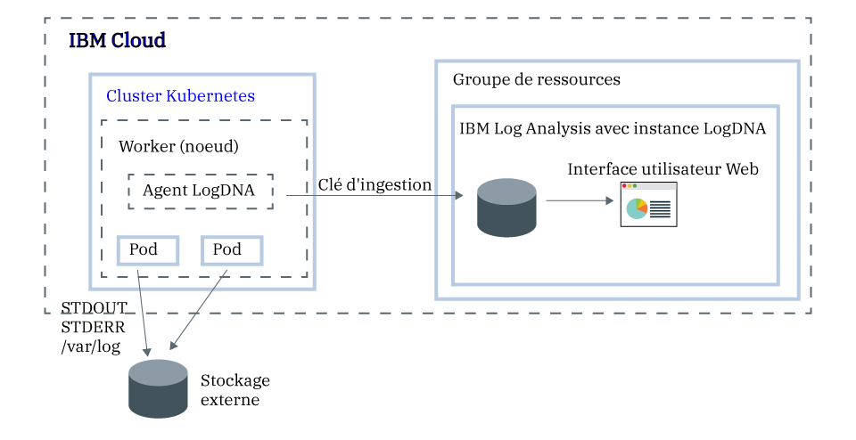

---

copyright:
  years:  2018, 2019
lastupdated: "2019-03-06"

keywords: LogDNA, IBM, Log Analysis, logging, kubernetes, tutorial

subcollection: LogDNA

---

{:new_window: target="_blank"}
{:shortdesc: .shortdesc}
{:screen: .screen}
{:pre: .pre}
{:table: .aria-labeledby="caption"}
{:codeblock: .codeblock}
{:tip: .tip}
{:download: .download}
{:important: .important}
{:note: .note}


# Gestion des journaux de cluster Kubernetes avec {{site.data.keyword.la_full_notm}}
{: #kube}

Le service {{site.data.keyword.la_full_notm}} permet de configurer la journalisation au niveau du cluster dans {{site.data.keyword.containerlong}}. 
{:shortdesc}

Dès que vous mettez un cluster à disposition avec {{site.data.keyword.containerlong_notm}}, vous voulez savoir ce qui se passe dans le cluster. Vous avez besoin d'accéder aux journaux pour anticiper, identifier et résoudre les problèmes. Vous voulez pouvoir, à tout moment, accéder aux différents types de journaux tels que les journaux d'agent, les journaux d'application ou les journaux réseau. De plus, vous voulez surveiller différentes sources de données de journal dans votre cluster Kubernetes. Par conséquent, il est essentiel que vous puissiez gérer les enregistrements de journal et y accéder à partir de n'importe laquelle de ces sources. Une gestion et une surveillance efficaces des journaux dépendent de la manière dont vous configurez les fonctions de journalisation pour votre plateforme Kubernetes.

Pour configurer la journalisation au niveau cluster pour un cluster Kubernetes, tenez compte des informations suivantes :

* Vous devez être en mesure de stocker les données de journal, les journaux système et les journaux d'application conteneurisée sur un stockage séparé des composants système Kubernetes.
* Vous devez déployer un agent de journalisation sur chaque noeud worker de votre cluster. Cet agent collecte et transfère les journaux vers un back end de journalisation externe.
* Vous devez être en mesure de centraliser les données de journal pour analyse sur un back end de journalisation externe.


Sur {{site.data.keyword.cloud_notm}}, pour configurer la journalisation au niveau cluster pour un cluster Kubernetes, procédez comme suit :

1. Mettez à disposition une instance du service {{site.data.keyword.la_full_notm}}. Au cours de cette étape, vous configurez un système de gestion des journaux centralisé dans lequel les données de journal sont hébergées sur {{site.data.keyword.cloud_notm}}.
2. Mettez un cluster à disposition sur {{site.data.keyword.containerlong_notm}}. Les clusters Kubernetes v1.9+ sont pris en charge.
3. Configurez l'agent LogDNA sur chaque noeud worker d'un cluster.



Dans ce tutoriel, vous apprendrez à configurer la journalisation au niveau cluster.

## Avant de commencer
{: #kube_prereqs}

Opérez dans la région Sud des Etats-Unis. {{site.data.keyword.la_full_notm}} est actuellement disponible dans la région Sud des Etats-Unis. **Remarque :** vous pouvez envoyer des données à partir d'un cluster Kubernetes situé dans la même région ou dans une autre région. 

Documentez-vous sur {{site.data.keyword.la_full_notm}}. Pour plus d'informations, voir [A propos du service](/docs/services/Log-Analysis-with-LogDNA?topic=LogDNA-about#about).

Utilisez un ID utilisateur qui est membre ou propriétaire d'un compte {{site.data.keyword.cloud_notm}}. Pour obtenir un ID utilisateur {{site.data.keyword.cloud_notm}}, accédez à [Inscription](https://cloud.ibm.com/login){:new_window}.

Des règles IAM doivent avoir été affectées à votre {{site.data.keyword.IBM_notm}}ID pour chacune des ressources suivantes : 

| Ressource                             | Portée de la règle d'accès | Rôle    | Région    | Informations                  |
|--------------------------------------|----------------------------|---------|-----------|------------------------------|
| Groupe de ressources **Default**           |  Groupe de ressources            | Afficheur  | us-south  | Cette règle est requise pour autoriser l'utilisateur à visualiser des instances de service dans le groupe de ressources par défaut.    |
| Service {{site.data.keyword.la_full_notm}} |  Groupe de ressources            | Editeur  | us-south  | Cette règle est requise pour autoriser l'utilisateur à mettre à disposition et à administrer le service {{site.data.keyword.la_full_notm}} dans le groupe de ressources par défaut.   |
| Instance de cluster Kubernetes          |  Ressource                 | Editeur  | us-south  | Cette règle est requise pour configurer la valeur confidentielle (secret) et l'agent LogDNA dans le cluster Kubernetes. |
{: caption="Tableau 1. Liste des règles IAM requises pour suivre ce tutoriel" caption-side="top"} 

Pour plus d'informations sur les rôles IAM d'{{site.data.keyword.containerlong}}, voir [User access permissions](/docs/containers?topic=containers-access_reference#access_reference).

Installez l'interface de ligne de commande {{site.data.keyword.cloud_notm}} et le plug-in d'interface de ligne de commande Kubernetes. Pour plus d'informations, voir [Installation de l'interface de ligne de commande {{site.data.keyword.cloud_notm}}.](/docs/cli?topic=cloud-cli-ibmcloud-cli#ibmcloud-cli)


## Objectifs
{: #kube_objectives}

Dans ce tutoriel, vous configurez la journalisation avec LogDNA pour votre cluster {{site.data.keyword.containerlong_notm}}. Vous effectuez notamment les opérations suivantes :

- Mise à disposition d'une instance de service {{site.data.keyword.la_full_notm}}. 
- Configuration de l'agent LogDNA dans votre cluster pour commencer à envoyer des journaux à LogDNA. 
- Ouverture du tableau de bord LogDNA afin de rechercher vos journaux. 


## Etape 1. Mise à disposition d'une instance de service {{site.data.keyword.la_full_notm}}
{: #kube_step1}

Pour mettre à disposition une instance de service {{site.data.keyword.la_full_notm}} via la console {{site.data.keyword.cloud_notm}}, procédez comme suit :

1. Connectez-vous au [compte {{site.data.keyword.cloud_notm}}](https://cloud.ibm.com/login) où vous avez créé votre cluster Kubernetes.

2. Cliquez sur **Catalogue**. Une liste des services {{site.data.keyword.cloud_notm}} s'affiche.

3. Pour filtrer la liste des services affichés, sélectionnez la catégorie **Developer Tools**.

4. Cliquez sur **{{site.data.keyword.la_full_notm}}**. Le tableau de bord **Observabilité** s'ouvre.

5. Sélectionnez **Create instance**. 

6. Entrez un nom pour l'instance de service.

7. Sélectionnez le groupe de ressources dans lequel se trouve votre cluster. Le groupe de ressources **Default** est sélectionné par défaut. 

8. Sélectionnez un plan de service pour votre instance de service. Le plan **Lite** est sélectionné par défaut. Pour plus d'informations sur les autres plans de service, voir [Plans de tarification](/docs/services/Log-Analysis-with-LogDNA?topic=LogDNA-about#overview_pricing_plans).

9. Pour mettre le service {{site.data.keyword.la_full_notm}} à disposition dans le groupe de ressources {{site.data.keyword.cloud_notm}} auquel vous êtes connecté, cliquez sur **Créer**. Le tableau de bord **Observabilité** s'ouvre et affiche les détails de votre service. 

Pour mettre une instance à disposition via l'interface de ligne de commande, voir [Mise à disposition d'une instance via l'interface de ligne de commande {{site.data.keyword.cloud_notm}}](/docs/services/Log-Analysis-with-LogDNA?topic=LogDNA-provision#provision_cli).
{: tip}

## Etape 2. Obtention de la clé d'ingestion
{: #kube_step2}

Pour obtenir la clé d'ingestion, procédez comme suit :

1. Connectez-vous à votre compte {{site.data.keyword.cloud_notm}}.

    Cliquez sur le [tableau de bord {{site.data.keyword.cloud_notm}}](https://cloud.ibm.com/login){:new_window} pour ouvrir le tableau de bord {{site.data.keyword.cloud_notm}}.

	Une fois connecté avec votre ID utilisateur et votre mot de passe, l'interface utilisateur {{site.data.keyword.cloud_notm}} s'ouvre.

2. Dans le menu de navigation, sélectionnez **Observabilité**. 

3. Sélectionnez **Journalisation**. Le tableau de bord {{site.data.keyword.la_full_notm}} s'ouvre. Il affiche la liste des instances de journalisation disponibles sur {{site.data.keyword.cloud_notm}}.

3. Identifiez l'instance pour laquelle vous voulez obtenir la clé d'ingestion, puis cliquez sur **Afficher la clé d'ingestion**.

4. Une fenêtre dans laquelle vous pouvez cliquer sur **Afficher** pour afficher la clé d'ingestion s'ouvre.


## Etape 3 : Configuration de votre cluster Kubernetes pour l'envoi des journaux à votre instance LogDNA
{: #kube_step3}

Pour configurer votre cluster Kubernetes de manière à envoyer des journaux à votre instance {{site.data.keyword.la_full_notm}}, vous devez installer un pod `logdna-agent` sur chaque noeud de votre cluster. L'agent LogDNA lit les fichiers journaux depuis le pod où il est installé et envoie les données des journaux à votre instance LogDNA.

Pour configure votre cluster Kubernetes de manière à envoyer les journaux à votre instance LogDNA, procédez comme suit à partir de la ligne de commande :

1. Ouvrez un terminal pour vous connecter à {{site.data.keyword.cloud_notm}}.

   ```
   ibmcloud login -a api.ng.bluemix.net
   ```
   {: pre}

   Sélectionnez le compte où vous avez mis l'instance {{site.data.keyword.la_full_notm}} à disposition.

2. Définissez le cluster où vous voulez configurer la journalisation en tant que contexte pour cette session.

   ```
   ibmcloud ks cluster-config <cluster_name_or_ID>
   ```
   {: pre}

   Une fois les fichiers de configuration téléchargés, une commande, qui permet de définir le chemin vers le fichier de configuration Kubernetes local en tant que variable d'environnement s'affiche. Copiez et collez la commande qui s'affiche sur votre terminal pour définir la variable d'environnement `KUBECONFIG`.

   Chaque fois que vous vous connectez à l'interface de ligne de commande {{site.data.keyword.containerlong_notm}} pour travailler avec votre cluster, vous devez effectuer cette configuration afin de définir le chemin d'accès au fichier de configuration du cluster sous forme de variable de session. {{site.data.keyword.containerlong_notm}} utilise cette variable pour trouver un fichier de configuration local et les certificats nécessaires pour la connexion à votre cluster.
   {: tip}

3. Créez une valeur confidentielle (secret) Kubernetes pour stocker votre clé d'ingestion logDNA pour votre instance de service. La clé d'ingestion LogDNA permet d'ouvrir un socket Web sécurisé sur le serveur d'ingestion logDNA et d'authentifier l'agent de journalisation auprès du service {{site.data.keyword.la_full_notm}}.

    ```
    kubectl create secret generic logdna-agent-key --from-literal=logdna-agent-key=<logDNA_ingestion_key>
    ```
    {: pre}

4. Créez un ensemble de démons Kubernetes pour déployer l'agent LogDNA sur chaque noeud worker de votre cluster Kubernetes. L'agent LogDNA collecte les journaux ayant l'extension `*.log` et les fichiers sans extension stockés dans le répertoire `/var/log` de votre pod. Par défaut, les journaux sont collectés à partir de tous les espaces de nom, y compris `kube-system`, et automatiquement envoyés au service {{site.data.keyword.la_full_notm}}.

   ```
   kubectl create -f https://repo.logdna.com/ibm/prod/logdna-agent-ds-us-south.yaml
   ```
   {: pre}

5. Vérifiez que l'agent LogDNA est correctement déployé. 

   ```
   kubectl get pods
   ```
   {: pre}
   
   Le déploiement a abouti si vous voyez un ou plusieurs pods LogDNA. Le nombre de pods LogDNA est égal au nombre de noeuds worker dans votre cluster. Tous les pods doivent être à l'état `Running`.


## Etape 4 : Lancement du tableau de bord LogDNA et affichage des journaux
{: #kube_step4}

Pour démarrer le tableau de bord LogDNA via la console {{site.data.keyword.cloud_notm}}, procédez comme suit :

1. Connectez-vous à votre compte [{{site.data.keyword.cloud_notm}} ](https://cloud.ibm.com/login).

2. Dans le menu , sélectionnez **Observabilité**.

3. Sélectionnez **Journalisation**. La liste des instances de service {{site.data.keyword.la_full_notm}} disponibles sur {{site.data.keyword.cloud_notm}} d'affiche.

4. Sélectionnez une instance, puis cliquez sur **Afficher LogDNA**. Le tableau de bord LogDNA s'ouvre. **Remarque :** avec le plan de service **Free**, vous ne pouvez mettre à la queue (tailing) que vos journaux les plus récents. Pour plus d'informations, voir [Affichage des journaux](/docs/services/Log-Analysis-with-LogDNA?topic=LogDNA-view_logs#view_logs).

## Etapes suivantes
{: #kube_next_steps}

- [Filtrer des journaux](/docs/services/Log-Analysis-with-LogDNA?topic=LogDNA-view_logs#view_logs_step5)
- [Rechercher dans les journaux](/docs/services/Log-Analysis-with-LogDNA?topic=LogDNA-view_logs#view_logs_step6)
- [Définir des vues](/docs/services/Log-Analysis-with-LogDNA?topic=LogDNA-view_logs#view_logs_step7)
- [Configurer des alertes](https://docs.logdna.com/docs/alerts). 

**Remarque :** certaines de ces fonctions nécessitent une mise à niveau de plan.


