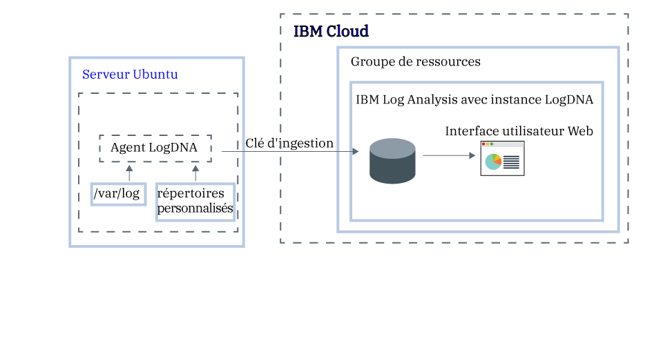

---

copyright:
  years:  2018, 2019
lastupdated: "2019-03-06"

keywords: LogDNA, IBM, Log Analysis, logging, ubuntu, tutorial

subcollection: LogDNA

---

{:new_window: target="_blank"}
{:shortdesc: .shortdesc}
{:screen: .screen}
{:pre: .pre}
{:table: .aria-labeledby="caption"}
{:codeblock: .codeblock}
{:tip: .tip}
{:download: .download}
{:important: .important}
{:note: .note}


# Gestion des journaux Ubuntu avec {{site.data.keyword.la_full_notm}}
{: #ubuntu}

Utilisez le service {{site.data.keyword.la_full}} pour gérer et surveiller les journaux Ubuntu dans un système de journalisation centralisé sur {{site.data.keyword.cloud_notm}}. 
{:shortdesc}

Vous pouvez collecter et surveiller les journaux système et d'application. 

Par défaut, l'agent LogDNA pour Ubuntu surveille les fichiers journaux dans le répertoire **/var/log**. Par exemple, le journal système Ubuntu (*/var/log/syslog*) est surveillé par défaut.

Sur {{site.data.keyword.cloud_notm}}, pour configurer un serveur Ubuntu de manière à envoyer les journaux à une instance {{site.data.keyword.la_full_notm}}, procédez comme suit :

1. Mettez à disposition une instance du service {{site.data.keyword.la_full_notm}}. 
2. Configurez l'agent LogDNA sur le serveur Ubuntu.
3. Vous pouvez éventuellement ajouter d'autres répertoires à surveiller par l'agent.



Dans ce tutoriel, vous apprendrez à configurer un serveur Ubuntu de manière à envoyer les journaux à une instance {{site.data.keyword.la_full_notm}}.

## Avant de commencer
{: #ubuntu_prereqs}

Documentez-vous sur {{site.data.keyword.la_full_notm}}. Pour plus d'informations, voir [A propos de LogDNA](/docs/services/Log-Analysis-with-LogDNA?topic=LogDNA-about#about).

Opérez dans la région Sud des Etats-Unis. {{site.data.keyword.la_full_notm}} est actuellement disponible dans la région Sud des Etats-Unis. **Remarque :** vous pouvez envoyer des données à partir d'un serveur Ubuntu situé dans la même région ou dans une autre région. 

Utilisez un ID utilisateur qui est membre ou propriétaire d'un compte {{site.data.keyword.cloud_notm}}. Pour obtenir un ID utilisateur {{site.data.keyword.cloud_notm}}, accédez à [Inscription](https://cloud.ibm.com/login){:new_window}.

Des règles IAM doivent avoir été affectées à votre {{site.data.keyword.IBM_notm}}ID pour chacune des ressources suivantes : 

| Ressource                             | Portée de la règle d'accès | Rôle    | Région    | Informations                  |
|--------------------------------------|----------------------------|---------|-----------|------------------------------|
| Groupe de ressources **Default**           |  Groupe de ressources            | Afficheur  | us-south  | Cette règle est requise pour autoriser l'utilisateur à visualiser des instances de service dans le groupe de ressources par défaut.    |
| Service {{site.data.keyword.la_full_notm}} |  Groupe de ressources            | Editeur  | us-south  | Cette règle est requise pour autoriser l'utilisateur à mettre à disposition et à administrer le service {{site.data.keyword.la_full_notm}} dans le groupe de ressources par défaut.   |
{: caption="Tableau 1. Liste des règles IAM requises pour suivre ce tutoriel" caption-side="top"} 

Installez l'interface de ligne de commande {{site.data.keyword.cloud_notm}}. Pour plus d'informations, voir [Installation de l'interface de ligne de commande {{site.data.keyword.cloud_notm}}.](/docs/cli/index.html#overview)


## Etape 1. Mise à disposition d'une instance {{site.data.keyword.la_full_notm}}
{: #ubuntu_step1}

Pour mettre à disposition une instance {{site.data.keyword.la_full_notm}} via l'interface utilisateur {{site.data.keyword.cloud_notm}}, procédez comme suit :

1. Connectez-vous à votre compte {{site.data.keyword.cloud_notm}}.

    Cliquez sur le [tableau de bord {{site.data.keyword.cloud_notm}}](https://cloud.ibm.com/login){:new_window} pour ouvrir le tableau de bord {{site.data.keyword.cloud_notm}}.

	Une fois connecté avec votre ID utilisateur et votre mot de passe, l'interface utilisateur {{site.data.keyword.cloud_notm}} s'ouvre.

2. Cliquez sur **Catalogue**. La liste des services disponibles dans {{site.data.keyword.cloud_notm}} s'affiche.

3. Pour filtrer la liste des services affichés, sélectionnez la catégorie **Developer Tools**.

4. Cliquez sur la vignette **{{site.data.keyword.la_full_notm}}**.

5. Entrez un nom pour l'instance de service.

6. Sélectionnez le groupe de ressources **Default**. 

    Le groupe de ressources **Default** est sélectionné par défaut.

7. Sélectionnez le plan de service **Lite**. 

    Le plan **Lite** est sélectionné par défaut.

    Pour plus d'informations sur les autres plans de service, voir [Plans de tarification](/docs/services/Log-Analysis-with-LogDNA?topic=LogDNA-about#overview_pricing_plans).

8. Pour mettre le service {{site.data.keyword.la_full_notm}} à disposition dans le groupe de ressources {{site.data.keyword.cloud_notm}} auquel vous êtes connecté, cliquez sur **Créer**.

Une fois l'instance mise à disposition, le tableau de bord {{site.data.keyword.la_full_notm}} s'ouvre. 


**Remarque :** pour mettre à disposition une instance de LogDNA via l'interface de ligne de commande, voir [Mise à disposition de LogDNA via l'interface de ligne de commande {{site.data.keyword.cloud_notm}}](/docs/services/Log-Analysis-with-LogDNA?topic=LogDNA-provision#provision_cli).


## Etape 2. Configuration de votre serveur Ubuntu de manière à envoyer des journaux à votre instance
{: #ubuntu_step2}

Pour configurer votre serveur Ubuntu de manière à envoyer des journaux à votre instance {{site.data.keyword.la_full_notm}}, vous devez installer un agent `logdna-agent`. L'agent LogDNA lit les fichiers journaux depuis */var/log* et envoie les données des journaux à votre instance LogDNA.

Pour configurer votre serveur Ubuntu de manière à envoyer des journaux à votre instance LogDNA, procédez comme suit à partir d'un terminal Ubuntu :

1. Installez l'agent LogDNA. Exécutez les commandes suivantes :

    ```
    echo "deb https://repo.logdna.com stable main" | sudo tee /etc/apt/sources.list.d/logdna.list 
    ```
    {: codeblock}

    ```
    wget -O- https://repo.logdna.com/logdna.gpg | sudo apt-key add - 
    ```
    {: codeblock}

    ```
    sudo apt-get update
    ```
    {: codeblock}

    ```
    sudo apt-get install logdna-agent < "/dev/null"
    ```
    {: codeblock}

2. Définissez la clé d'ingestion que doit utiliser l'agent LogDNA pour envoyer les journaux à l'instance {{site.data.keyword.la_full_notm}}.  

    ```
    sudo logdna-agent -k INGESTION_KEY
    ```
    {: codeblock}

    Où INGESTION_KEY contient la clé d'ingestion active pour l'instance {{site.data.keyword.la_full_notm}} où vous configurez le réacheminement des journaux.

3. Définissez le noeud final d'authentification. L'agent LogDNA utilise cet hôte pour s'authentifier et obtenir le jeton pour réacheminer les journaux.

    ```
    sudo logdna-agent -s LOGDNA_APIHOST=api.us-south.logging.cloud.ibm.com
    ```
    {: codeblock}

4. Définissez le noeud final d'ingestion.

    ```
    sudo logdna-agent -s LOGDNA_LOGHOST=logs.us-south.logging.cloud.ibm.com
    ```
    {: codeblock}

5. Définissez d'autre chemin d'accès aux journaux à surveiller. Exécutez la commande suivante : 

    ```
    sudo logdna-agent -d /path/to/log/folders
    ```
    {: codeblock}

    Par défaut, **/var/log** est surveillé.

6. Configurez éventuellement l'agent LogDNA pour marquer vos hôtes. Exécutez les commandes suivantes :

    ```
    sudo logdna-agent -t TAG1,TAG2 
    ```
    {: codeblock}

    ```
    sudo update-rc.d logdna-agent defaults
    ```
    {: codeblock}

    ``` 
    sudo /etc/init.d/logdna-agent start
    ```
    {: codeblock}


## Etape 3. Démarrage de l'interface utilisateur Web LogDNA
{: #ubuntu_step3}

Pour ouvrir le tableau de bord IBM Log Analysis avec LogDNA via l'interface utilisateur {{site.data.keyword.cloud_notm}}, procédez comme suit :

1. Connectez-vous à votre compte {{site.data.keyword.cloud_notm}}.

    Cliquez sur le [tableau de bord {{site.data.keyword.cloud_notm}}](https://cloud.ibm.com/login){:new_window} pour ouvrir le tableau de bord {{site.data.keyword.cloud_notm}}.

	Une fois connecté avec votre ID utilisateur et votre mot de passe, le tableau de bord {{site.data.keyword.cloud_notm}} s'ouvre.

2. Dans le menu de navigation, sélectionnez **Observabilité**. 

3. Sélectionnez **Journalisation**. 

    La liste des instances {{site.data.keyword.la_full_notm}} disponibles sur {{site.data.keyword.cloud_notm}} s'affiche.

3. Sélectionnez une instance. Ensuite, cliquez sur **Afficher LogDNA**.

    L'interface utilisateur Web LogDNA qui affiche les journaux de votre cluster s'ouvre.


## Etape 4. Affichage de vos journaux
{: #ubuntu_step4}

Depuis l'interface utilisateur Web LogDNA, vous pouvez afficher vos journaux lorsqu'ils passent par le système. Vous affichez les journaux selon un processus de mise à la queue (tailing) des journaux. 

**Remarque :** avec le plan de service **Free**, vous ne pouvez mettre à la queue (tailing) que vos journaux les plus récents.

Pour plus d'informations, voir [Affichage des journaux](/docs/services/Log-Analysis-with-LogDNA?topic=LogDNA-view_logs#view_logs).


## Etapes suivantes
{: #ubuntu_next_steps}

[Filtrer les journaux](/docs/services/Log-Analysis-with-LogDNA?topic=LogDNA-view_logs#view_logs_step5), [rechercher dans les journaux](/docs/services/Log-Analysis-with-LogDNA?topic=LogDNA-view_logs#view_logs_step6), [définir des vues](/docs/services/Log-Analysis-with-LogDNA?topic=LogDNA-view_logs#view_logs_step7) et [configurer des alertes](https://docs.logdna.com/docs/alerts). 

**Remarque :** pour utiliser l'une de ces fonctions, vous devez effectuer une mise à niveau du plan {{site.data.keyword.la_full_notm}} vers un plan payant.

