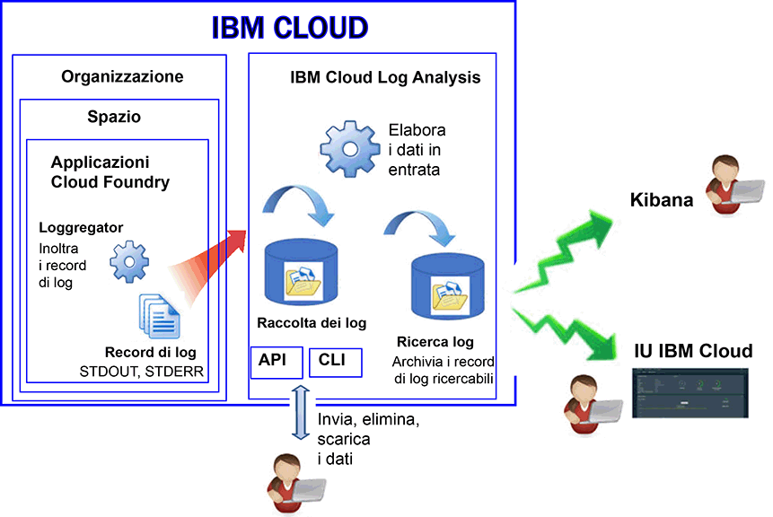

---

copyright:
  years: 2017, 2019

lastupdated: "2019-03-06"

keywords: IBM Cloud, logging

subcollection: cloudloganalysis

---

{:new_window: target="_blank"}
{:shortdesc: .shortdesc}
{:screen: .screen}
{:pre: .pre}
{:table: .aria-labeledby="caption"}
{:codeblock: .codeblock}
{:tip: .tip}
{:download: .download}
{:important: .important}
{:note: .note}

# Applicazioni Cloud Foundry
{: #logging_cf_apps}

In {{site.data.keyword.Bluemix}}, puoi visualizzare, filtrare e analizzare i log CF (Cloud Foundry) tramite il dashboard {{site.data.keyword.Bluemix_notm}}, Kibana e l'interfaccia riga di comando (CLI). Inoltre, puoi trasmettere i record dei log a uno strumento di gestione log esterno. 
{:shortdesc}

{{site.data.keyword.Bluemix_notm}} registra i dati di log generati dalla piattaforma Cloud Foundry e dalle applicazioni Cloud Foundry. Nei log, puoi visualizzare gli errori, le avvertenze e i messaggi informativi che vengono generati per la tua applicazione. 

Quando esegui le tue applicazioni in un PaaS (platform-as-a-service) cloud come Cloud Foundry su {{site.data.keyword.Bluemix_notm}}, non puoi eseguire SSH o FTP nell'infrastruttura in cui sono in esecuzione le tue applicazioni per accedere ai log. La piattaforma è controllata dal provider del cloud. Le applicazioni Cloud Foundry in esecuzione su {{site.data.keyword.Bluemix_notm}} utilizzano il componente Loggerator per inoltrare i record di log dall'interno dell'infrastruttura Cloud Foundry. Loggregator raccoglie automaticamente i dati STDOUT e STDERR. Puoi visualizzare e analizzare questi log attraverso il dashboard {{site.data.keyword.Bluemix_notm}}, Kibana e l'interfaccia riga di comando.

La seguente figura mostra una visualizzazione di alto livello della registrazione per {{site.data.keyword.Bluemix_notm}}:

 
La registrazione delle applicazioni Cloud Foundry viene abilitata automaticamente quando utilizzi l'infrastruttura Cloud Foundry per eseguire le tue applicazioni su {{site.data.keyword.Bluemix_notm}}. Per visualizzare i log del runtime Cloud Foundry, devi scrivere i tuoi log in STDOUT e STDERR. Per maggiori informazioni, vedi [Registrazione delle applicazioni di runtime attraverso le applicazioni CF](/docs/services/CloudLogAnalysis/cfapps?topic=cloudloganalysis-logging_writing_to_log_from_cf_app#logging_writing_to_log_from_cf_app).

{{site.data.keyword.Bluemix_notm}} conserva una quantità limitata di informazioni di log. Quando si registrano le informazioni, i dati precedenti vengono sostituiti con le informazioni più recenti. Se devi rispettare le politiche organizzative o di settore che richiedono di mantenere una parte o tutte le informazioni di log per scopi di controllo o altro, puoi trasmettere i tuoi log a un host di log esterno, quale un servizio di gestione log di terze parti o un altro host. Per maggiori informazioni, vedi [Configurazione di host log esterno](/docs/services/CloudLogAnalysis/external?topic=cloudloganalysis-thirdparty_logging#thirdparty_logging).

## Inserimento log
{: #log_ingestion1}

Puoi inviare log in {{site.data.keyword.loganalysisshort}} utilizzando il logstash forwarder a più tenant. Per maggiori informazioni, vedi [Invia dati di log utilizzando un logstash forwarder a più tenant (mt-logstash-forwarder)](/docs/services/CloudLogAnalysis/how-to/send-data?topic=cloudloganalysis-send_data_mt#send_data_mt).

Il servizio {{site.data.keyword.loganalysisshort}} offre diversi piani. Tutti i piani, con l'eccezione del piano *Lite*, includono la capacità di inviare log alla raccolta di log. Per ulteriori informazioni sui piani, vedi [Piani di servizio](/docs/services/CloudLogAnalysis?topic=cloudloganalysis-log_analysis_ov#plans).

## Raccolta di log
{: #log_collection}

Per impostazione predefinita, il servizio {{site.data.keyword.loganalysisshort}} archivia i dati dei log in Ricerca dei log per un massimo di 3 giorni:   

* Viene archiviato un massimo di 500MB per spazio di dati al giorno. Tutti i log che superano i 500 MB vengono scartati. Le assegnazioni dei limiti vengono
reimpostate ogni giorno alle ore 12:30 UTC.
* Sono ricercabili fino a 1,5 GB di dati per una massimo di 3 giorni. Viene eseguito il rollover (la prima voce inserita è la prima a essere eliminata) dei dati di log quando vengono raggiunti i 1,5 GB di dati o vengono superati i 3 giorni.

Il servizio {{site.data.keyword.loganalysisshort}} fornisce ulteriori piani che ti consentono di archiviare i log nella raccolta di log per quanto tempo desideri. 

* Puoi configurare una politica di conservazione log per definire il numero di giorni in cui desideri conservare i log nella raccolta di log. Per maggiori informazioni, vedi [Politica di conservazione log](/docs/services/CloudLogAnalysis?topic=cloudloganalysis-manage_logs#log_retention_policy).
* Puoi eliminare i log manualmente utilizzando la riga di comando o la API.

Per ulteriori informazioni sul prezzo di ogni piano, vedi [Piani di servizio](/docs/services/CloudLogAnalysis?topic=cloudloganalysis-log_analysis_ov#plans).

## Ricerca log
{: #log_search1}

Per impostazione predefinita, puoi utilizzare Kibana per ricercare fino a 500 MB di log al giorno in {{site.data.keyword.Bluemix_notm}}. 

Il servizio {{site.data.keyword.loganalysisshort}} fornisce più piani. Ogni piano ha diverse capacità di ricerca log, ad esempio, il piano *Raccolta di log* ti consente di ricercare fino a 1 GB di dati al giorno. Per ulteriori informazioni sui piani, vedi [Piani di servizio](/docs/services/CloudLogAnalysis?topic=cloudloganalysis-log_analysis_ov#plans).

## Metodi per analizzare i log dell'applicazione CF
{: #logging_bluemix_cf_apps_log_methods}

Puoi scegliere uno dei seguenti metodi per analizzare i log della tua applicazione Cloud Foundry:

* Analizza il log nella IU {{site.data.keyword.Bluemix_notm}} per visualizzare l'attività più recente dell'applicazione.
    
    In {{site.data.keyword.Bluemix_notm}}, puoi visualizzare, filtrare e analizzare i log attraverso la scheda **Log** disponibile per ogni applicazione Cloud Foundry. Per ulteriori informazioni, vedi [Analisi dei log dell'applicazione CF tramite il dashboard dell'applicazione CF](/docs/services/CloudLogAnalysis/cfapps?topic=cloudloganalysis-launch_logs_cloud_ui_cf#cfapp_ui).
    
* Analizza i log in Kibana per eseguire attività di analisi avanzate.
    
    In {{site.data.keyword.Bluemix_notm}}, puoi utilizzare Kibana, una piattaforma di analisi e visualizzazione open source, per monitorare, ricercare, analizzare e visualizzare i tuoi dati in una varietà di grafici, ad esempio, diagrammi e tabelle. Per ulteriori informazioni, vedi [Analisi dei log dell'applicazione CF tramite la IU {{site.data.keyword.loganalysisshort}}](/docs/services/CloudLogAnalysis/cfapps?topic=cloudloganalysis-launch_logs_cloud_ui_cf#cfapp_la).
	
	**Suggerimento:** Per avviare Kibana, vedi [Passaggio a Kibana dal dashboard di un'applicazione CF](/docs/services/CloudLogAnalysis/kibana?topic=cloudloganalysis-launch#launch_Kibana_from_cf_app).

* Analizza i log attraverso la CLI per utilizzare i comandi per la gestione dei log a livello di programmazione.
    
    In {{site.data.keyword.Bluemix_notm}}, puoi visualizzare, filtrare e analizzare i log tramite l'interfaccia riga di comando utilizzando il comando **cf logs**. Per maggiori informazioni, vedi [Analisi dei log dell'applicazione Cloud Foundry dall'interfaccia riga di comando](/docs/services/CloudLogAnalysis/cfapps?topic=cloudloganalysis-analyzing_logs_cli#analyzing_logs_cli).

## Origini log per le applicazioni CF distribuite a Diego
{: #cf_apps_log_sources_diego}

Per le applicazioni CF (Cloud Foundry) distribuite nell'architettura Cloud Foundry basata su Diego, sono disponibili le seguenti origini log:
    
| Origine log | Nome componente | Descrizione | 
|------------|----------------|-------------|
| LGR | Loggregator | Il componente LGR fornisce informazioni relative al Loggregator Cloud Foundry, che inoltra i log dall'interno di Cloud Foundry. |
| RTR | Router | Il componente RTR fornisce informazioni sulle richieste HTTP a un'applicazione. | 
| STG | In fase di preparazione | Il componente STG fornisce informazioni su come viene preparata o ripreparata un'applicazione. | 
| APP | Applicazione | Il componente APP fornisce i log dall'applicazione. Qui è dove vengono mostrati i stderr e stdout nel tuo codice. | 
| API | API Cloud Foundry | Il componente API fornisce informazioni sulle azioni interne che derivano dalla richiesta di un utente di modificare lo stato di un'applicazione. | 
| CELL | Cella Diego | Il componente CELL fornisce informazioni sull'avvio, l'interruzione o l'arresto anomalo di un'applicazione.|
| SSH | SSH | Il componente SSH fornisce informazioni ogni volta che un utente accede a un'applicazione utilizzando il comando **cf ssh**. |
{: caption="Tabella 1. Origini log per le applicazioni CF distribuite in un'architettura CF basata su Diego" caption-side="top"}

La seguente figura illustra i diversi componenti (origini log) in un'architettura Cloud Foundry basata su Diego: 

 in un'architettura Cloud Foundry basata su Diego.")
	
## Origini log per le applicazioni CF distribuite a DEA
{: #logging_bluemix_cf_apps_log_sources}

Per le applicazioni CF (Cloud Foundry) distribuite in un'architettura DEA (Droplet Execution Agent), sono disponibili le seguenti origini log:
    
| Origine log | Nome componente | Descrizione | 
|------------|----------------|-------------|
| LGR | Loggregator | Il componente LGR fornisce informazioni relative al Loggregator Cloud Foundry, che inoltra i log dall'interno di Cloud Foundry. |
| RTR | Router | Il componente RTR fornisce informazioni sulle richieste HTTP a un'applicazione. | 
| STG | In fase di preparazione | Il componente STG fornisce informazioni su come viene preparata o ripreparata un'applicazione. | 
| APP | Applicazione | Il componente APP fornisce i log dall'applicazione. Qui è dove vengono mostrati i stderr e stdout nel tuo codice. | 
| API | API Cloud Foundry | Il componente API fornisce informazioni sulle azioni interne che derivano dalla richiesta di un utente di modificare lo stato di un'applicazione. | 
| DEA | Droplet Execution Agent | Il componente DEA fornisce informazioni sull'avvio, l'interruzione o l'arresto anomalo di un'applicazione.   Questo componente è disponibile solo se la tua applicazione viene distribuita nell'architettura Cloud Foundry basata su DEA. | 
{: caption="Tabella 2. Origini log per le applicazioni CF distribuite in un'architettura CF basata su DEA" caption-side="top"}

La seguente figura illustra i diversi componenti (origini log) in un'architettura Cloud Foundry basata su DEA: 

 in un'architettura Cloud Foundry basata su DEA (Droplet Execution Agent).")

## Formato di log per i log dell'applicazione CF visualizzati tramite la IU {{site.data.keyword.Bluemix_notm}}
{: #log_format_cf}

I log per le applicazioni CF {{site.data.keyword.Bluemix_notm}} sono visualizzati in un formato fisso, simile al seguente modello:

<code><var class="keyword varname">Componente</var>/<var class="keyword varname">IDistanza</var>/<var class="keyword varname">messaggio</var>/<var class="keyword varname">data/ora</var></code>

Ogni voce di log contiene i seguenti campi:

| Campo | Descrizione |
|-------|-------------|
| Data/ora | L'ora dell'istruzione di log. La data e ora è definita fino al millisecondo. |
| Componente | Il componente che produce il log. Per l'elenco dei diversi componenti, vedi [Origini log per le applicazioni CF](/docs/services/CloudLogAnalysis/cfapps?topic=cloudloganalysis-logging_cf_apps#logging_bluemix_cf_apps_log_sources).   Ogni tipo di componente è seguito da una barra e da un numero che indica l'istanza dell'applicazione. 0 è il numero assegnato alla prima istanza, 1 è il numero assegnato alla seconda e così via. |
| Messaggio | Il messaggio che viene emesso dal componente. Il messaggio varia a seconda dal contesto. |
{: caption="Tabella 1. Campi per le voci di log dell'applicazione CF" caption-side="top"}

## Esercitazione: Analizza i log in Kibana per un'applicazione Cloud Foundry
{: #tutorial}  

Per ulteriori informazioni sull'utilizzo di Kibana per analizzare i log per un'applicazione Cloud Foundry, consulta [Analizza i log in Kibana per un'applicazione Cloud Foundry](https://console.bluemix.net/docs/tutorials/application-log-analysis.html#generate-access-and-analyze-application-logs).
