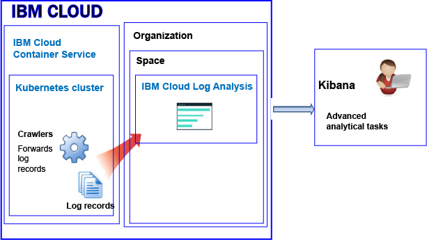
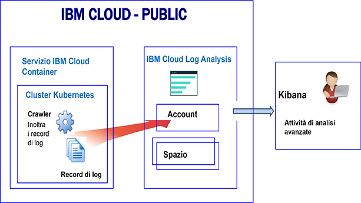
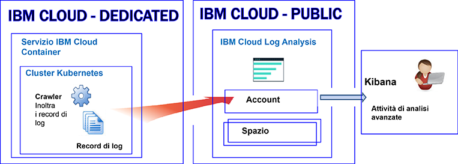

---

copyright:
  years: 2017, 2019

lastupdated: "2019-03-06"

keywords: IBM Cloud, logging

subcollection: cloudloganalysis

---

{:new_window: target="_blank"}
{:shortdesc: .shortdesc}
{:screen: .screen}
{:pre: .pre}
{:table: .aria-labeledby="caption"}
{:codeblock: .codeblock}
{:tip: .tip}
{:download: .download}
{:important: .important}
{:note: .note}


# {{site.data.keyword.containershort_notm}}
{: #containers_kubernetes}

In {{site.data.keyword.cloud_notm}}, puoi usare il servizio {{site.data.keyword.loganalysisshort}} per archiviare e analizzare log di contenitore e log di cluster Kubernetes raccolti automaticamente da {{site.data.keyword.containershort}} in Pubblico e in Dedicato.
{:shortdesc}

Puoi avere 1 o più cluster Kubernetes in un account. I log vengono raccolti automaticamente da {{site.data.keyword.containershort}} non appena viene eseguito il provisioning del cluster. 

Per inoltrare i log a {{site.data.keyword.loganalysisshort}} da {{site.data.keyword.containershort}} devi creare una configurazione di registrazione. Puoi abilitare la registrazione tramite la [riga di comando](/docs/containers/cs_health.html#logging) o tramite la pagina di panoramica del cluster nel tuo dashboard {{site.data.keyword.containershort}}. Con una configurazione in atto, i log vengono ravvolti da {{site.data.keyword.containershort}} quando viene eseguito il provisioning del cluster o non appena viene distribuito un pod. Vengono inoltre raccolte automaticamente le informazioni che un contenitore inserisce in `stdout` o `stderr`. Per impostazione predefinita, i log vengono inoltrati a regioni specifiche in base all'ubicazione del cluster.

* I log vengono raccolti non appena il pod viene distribuito. 
* Le informazioni che un processo del contenitore inserisce in stdout (output standard) e stderr (errore standard), vengono raccolte automaticamente dal {{site.data.keyword.containershort}}.

Consulta la seguente tabella per vedere a quali regioni {{site.data.keyword.loganalysisshort}} invia i log a seconda di dove viene distribuito il cluster.
 * Le informazioni che un processo del contenitore inserisce in stdout (output standard) e stderr (errore standard), vengono raccolte automaticamente dal {{site.data.keyword.containershort}}.
 
 <table>
   <tr>
     <th>Regione cluster</th>
     <th>Regione servizio</th>
   </tr>
   <tr>
     <td>Stati Uniti Sud</td>
     <td>Stati Uniti Sud</td>
   </tr>
   <tr>
     <td>Stati Uniti Est</td>
     <td>Stati Uniti Sud</td>
   </tr>
   <tr>
     <td>Germania</td>
     <td>Germania</td>
   </tr>
   <tr>
     <td>Sydney</td>
     <td>Sydney</td>
   </tr>
   <tr>
     <td>Regno Unito</td>
     <td>Germania</td>
   </tr>
 </table>
 
 Assicurati di selezionare la regione, l'organizzazione e lo spazio corretti quando tenti di visualizzare i log. Potresti anche controllare di stare selezionando l'organizzazione e lo spazio corretti tramite la GUI {{site.data.keyword.loganalysisshort}}.
 {: tip}

Puoi inoltrare i log all'account {{site.data.keyword.loganalysisshort}} oppure al dominio dello spazio nel tuo account. Tieni conto delle seguenti informazioni quando decidi dove inoltrare i log:

* Quando invii i log al dominio dell'account, la quota di ricerca è 500MB al giorno e non puoi memorizzare i log in Raccolta dei log per l'archiviazione a lungo termine.
* Quando invii i log a un dominio dello spazio, puoi scegliere un piano di servizio {{site.data.keyword.loganalysisshort}} che definisce la quota di ricerca al giorno e puoi memorizzare i log in Raccolta dei log per l'archiviazione a lungo termine.

**Nota:** per impostazione predefinita, l'invio dei log da un cluster al servizio {{site.data.keyword.loganalysisshort}} non è abilitato automaticamente. Per abilitare la registrazione, devi creare una o più configurazioni della registrazione nel cluster per inoltrare automaticamente i log nel servizio {{site.data.keyword.loganalysisshort}}. Puoi abilitare la registrazione tramite la riga di comando, utilizzando il comando `ibmcloud cs logging-config-create`, o tramite il dashboard del cluster disponibile nella IU {{site.data.keyword.cloud_notm}}. Per ulteriori informazioni, vedi [Abilitazione della raccolta automatica dei log di cluster](/docs/services/CloudLogAnalysis/containers?topic=cloudloganalysis-containers_kube_other_logs#containers_kube_other_logs).

Quando lavori con un cluster Kubernetes, gli spazi dei nomi *ibm-system* e *kube-system* sono riservati. Non creare, eliminare, modificare o cambiare le autorizzazioni delle risorse disponibili in tali spazi dei nomi. L'uso dei log per questi spazi dei nomi è riservato a {{site.data.keyword.IBM_notm}}.
{: tip}


### Inoltro dei log a un dominio dello spazio
{: #space}

Quando configuri il tuo cluster per inoltrare i log a {{site.data.keyword.loganalysisshort}}, tieni conto delle seguenti informazioni:

* Devi definire un'organizzazione e uno spazio Cloud Foundry in cui questi log saranno inoltrati. 
* L'organizzazione e lo spazio possono essere disponibili in qualsiasi regione cloud pubblica di {{site.data.keyword.IBM_notm}}.

**Nota:** per i cluster forniti a **{{site.data.keyword.cloud_notm}} Dedicato**, non è possibile configurare il tuo cluster per inoltrare i log agli spazi Cloud Foundry disponibili nel tuo account dedicato.

Per analizzare i dati di log in Kibana di un cluster che inoltra i log a un dominio dello spazio, tieni conto delle seguenti informazioni:

* Devi avviare Kibana nella regione pubblica in cui sono disponibili l'organizzazione e lo spazio che raccolgono i log di cluster.
* Per aumentare la tua quota di ricerca Kibana e archiviare i log nella Raccolta dei log per l'archiviazione a lungo termine, devi eseguire il provisioning del servizio {{site.data.keyword.loganalysisshort}} nello spazio in cui i log stanno venendo inoltrati con un piano che soddisfa i tuoi requisiti. 
* Il tuo ID utente deve disporre delle autorizzazioni per visualizzare i log. Per visualizzare i log nel dominio dello spazio, un utente ha bisogno di un ruolo CF. **Revisore** è il ruolo più basso che può essere concesso per visualizzare i log. Per ulteriori informazioni, vedi [Ruoli di cui un utente ha bisogno per visualizzare i log](/docs/services/CloudLogAnalysis/kibana?topic=cloudloganalysis-analyzing_logs_Kibana#roles).

Per gestire i dati di log di cluster che si trovano nell'archivio a lungo termine (Raccolta dei log), il tuo ID utente deve disporre di una politica IAM per lavorare con il servizio {{site.data.keyword.loganalysisshort}}. Il tuo ID utente deve disporre delle autorizzazioni di **Amministratore**, **Operatore** o **Editor**.  Per ulteriori informazioni, vedi [Ruoli di cui un utente ha bisogno per gestire i log](/docs/services/CloudLogAnalysis?topic=cloudloganalysis-manage_logs#roles1).


La seguente figura mostra una vista di alto livello di registrazione in Pubblico per {{site.data.keyword.containershort}} quando il cluster inoltra i log a uno dominio di spazio:



   

### Inoltro dei log al dominio dell'account
{: #acc_public}

Puoi configurare il tuo cluster per inoltrare i log al dominio dell'account se il tuo account è nell'ambiente {{site.data.keyword.cloud_notm}} pubblico o dedicato.
{: shortdesc}


Per analizzare i dati di log in Kibana di un cluster che inoltra i log al dominio dell'account, tieni conto delle seguenti informazioni:

* Devi avviare Kibana nella regione in cui il cluster sta inviando i log al servizio {{site.data.keyword.loganalysisshort}}.
* Per gestire i dati di log di cluster archiviati a lungo termine nella raccolta dei log, devi avere un ruolo IAM che ti consente di utilizzare il servizio {{site.data.keyword.loganalysisshort}}. Il tuo ID utente deve disporre delle autorizzazioni di **Amministratore**, **Operatore** o **Editor**. Per visualizzare i log, hai bisogno delle autorizzazioni di **Visualizzatore**.


Nella seguente immagine, puoi vedere una vista di alto livello di come inoltrare i log a un account utilizzato in un ambiente pubblico.



Nella seguente immagine, puoi vedere una vista di alto livello di come inoltrare i log a un account utilizzato in un ambiente dedicato.




## Configurazione di un cluster per inoltrare i log a {{site.data.keyword.loganalysisshort}}
{: #config_forward_logs}

Puoi scegliere quali log di cluster inoltrare al servizio {{site.data.keyword.loganalysisshort}}. 

Per ulteriori informazioni su come configurare il tuo cluster per inoltrare i file di log al servizio {{site.data.keyword.loganalysisshort}}, vedi la sezione [Abilitazione della raccolta automatica dei log di cluster](/docs/services/CloudLogAnalysis/containers?topic=cloudloganalysis-containers_kube_other_logs#containers_kube_other_logs).

* Per abilitare la raccolta di log automatica e l'inoltro di stdout e stderr, vedi [Abilitazione della raccolta di log automatica e dell'inoltro dei log del contenitore](/docs/services/CloudLogAnalysis/containers?topic=cloudloganalysis-containers_kube_other_logs#containers).
* Per abilitare la raccolta di log automatica e l'inoltro dei log di applicazione, vedi [Abilitazione della raccolta di log automatica e inoltro di log di applicazione](/docs/services/CloudLogAnalysis/containers?topic=cloudloganalysis-containers_kube_other_logs#apps). 
* Per abilitare la raccolta di log automatica e l'inoltro di log di lavoro, vedi [Abilitazione della raccolta di log automatica e inoltro di log di lavoro](/docs/services/CloudLogAnalysis/containers?topic=cloudloganalysis-containers_kube_other_logs#workers). 
* Per abilitare la raccolta di log automatica e l'inoltro dei log di componente di sistema Kubernetes, vedi [Abilitazione della raccolta di log automatica e inoltro dei log di componente di sistema Kubernetes](/docs/services/CloudLogAnalysis/containers?topic=cloudloganalysis-containers_kube_other_logs#system). 
* Per abilitare la raccolta di log automatica e l'inoltro dei log di controller Ingress Kubernetes, vedi [Abilitazione della raccolta di log automatica e inoltro dei log di controller Ingress Kubernetes](/docs/services/CloudLogAnalysis/containers?topic=cloudloganalysis-containers_kube_other_logs#controller).


## Configurazione del traffico di rete per le configurazioni firewall personalizzate in {{site.data.keyword.cloud_notm}}
{: #ports}

Quando disponi di un firewall configurato aggiuntivo, o hai personalizzato le impostazioni firewall nella tua infrastruttura {{site.data.keyword.cloud_notm}} (SoftLayer), devi consentire il traffico di rete in uscita dal nodo di lavoro al servizio {{site.data.keyword.loganalysisshort}}.

Devi aprire la porta TCP 443 e la porta TCP 9091 da ciascun lavoro al servizio {{site.data.keyword.loganalysisshort}} per i seguenti indirizzi IP nel tuo firewall personalizzato:

<table>
  <tr>
    <th>Regione</th>
    <th>URL di inserimento</th>
	<th>Indirizzi IP pubblici</th>
  </tr>
  <tr>
    <td>Germania</td>
	<td>ingest-eu-fra.logging.bluemix.net</td>
	<td>158.177.88.43 <br>159.122.87.107</td>
  </tr>
  <tr>
    <td>Regno Unito</td>
	<td>ingest.logging.eu-gb.bluemix.net</td>
	<td>169.50.115.113</td>
  </tr>
  <tr>
    <td>Stati Uniti Sud</td>
	<td>ingest.logging.ng.bluemix.net</td>
	<td>169.48.79.236 <br>169.46.186.113</td>
  </tr>
  <tr>
    <td>Sydney</td>
	<td>ingest-au-syd.logging.bluemix.net</td>
	<td>130.198.76.125 <br>168.1.209.20</td>
  </tr>
</table>


## Inoltro dei log dell'applicazione personalizzati
{: #forward_app_logs}

Per abilitare l'inoltro dei log dell'applicazione personalizzati in un cluster al servizio {{site.data.keyword.loganalysisshort}}, devi definire una configurazione della registrazione del cluster con **Origine log** impostata su **application**. Puoi definire questa configurazione utilizzando il comando `ibmcloud cs logging-config-create` o tramite la IU del cluster.

Quando configuri il cluster per inoltrare i log personalizzati, puoi specificare un elenco di contenitori in esecuzione nel tuo cluster, da cui vuoi inoltrare i log personalizzati e i percorsi all'interno di questi contenitori in cui sono ubicati i log del file.

* Devi specificare il parametro **app-paths** per impostare l'elenco di percorsi all'interno dei contenitori che vuoi visualizzare. I log ubicati in questi percorsi vengono inoltrati al servizio {{site.data.keyword.loganalysisshort}}. 

    Per impostare questo parametro, definisci un elenco separato da virgole dei percorsi disponibili nei tuoi contenitori. I caratteri jolly come '/var/log/*.log' sono accettati.

* Facoltativamente, puoi impostare il parametro **app-containers** per specificare l'elenco dei contenitori da cui raccogliere e inoltrare i log al servizio {{site.data.keyword.loganalysisshort}}.

    Per impostare questo parametro, definisci un elenco separato da virgole dei contenitori.

**Suggerimento:** puoi definire più configurazioni di registrazione del cluster con **Origine log** impostato su **application** in un cluster. Se i contenitori in un cluster hanno percorsi diversi in cui sono ospitati i log, considera di definire una configurazione di registrazione del cluster per ogni gruppo di contenitori i cui log sono ubicati nello stesso percorso. 


## Origini log
{: #log_sources}


Puoi configurare il tuo cluster per inoltrare i log al servizio {{site.data.keyword.loganalysisshort}}. La seguente tabella elenca le diverse origini log che puoi abilitare per inoltrare i log nel servizio {{site.data.keyword.loganalysisshort}}:

<table>
  <caption>Origini di log per un cluster Kubernetes</caption>
  <tr>
    <th>Origine log</th>
	<th>Descrizione</th>
	<th>Percorsi dei log</th>
  </tr>
  <tr>
    <td>Contenitore</td>
	<td>I log del contenitore.</td>
	<td>Log di output standard (stdout) e di errore standard (stderr).</td>
  </tr>
  <tr>
    <td>Applicazione</td>
	<td>I log per la tua applicazione che viene eseguita in un cluster Kubernetes.</td>
	<td>`/var/log/apps/**/*.log`  </br>`/var/log/apps/**/*.err`</br>**NOTA:** su un pod, i log possono essere scritti in `/var/logs/apps/` o in qualsiasi sottodirectory in `/var/logs/apps/`. Sul worker, devi montare `/var/log/apps/` alla directory nel pod in cui la tua applicazione sta scrivendo i log nel pod.</td>
  </tr>
  <tr>
    <td>Lavoro</td>
	<td>I log per i nodi di lavoro di macchina virtuale in un cluster Kubernetes. </td>
	<td>`/var/log/syslog` </br>`/var/log/auth.log`</td>
  </tr>
  <tr>
    <td>Componente di sistema Kubernetes</td>
	<td>I log per il componente di sistema Kubernetes.</td>
	<td>*/var/log/kubelet.log* </br>*/var/log/kube-proxy.log*</td>
  </tr>
  <tr>
    <td>Controller Ingress</td>
	<td>I log per un controller Ingress che gestisce il traffico di rete in entrata in un cluster Kubernetes.</td>
	<td>`/var/log/alb/ids/*.log` </br>`/var/log/alb/ids/*.err` </br>`/var/log/alb/customerlogs/*.log` </br>`/var/log/alb/customerlogs/*.err`</td>
  </tr>
</table>

## Ricerca dei log
{: #log_search}

Per impostazione predefinita, puoi utilizzare Kibana per ricercare fino a 500 MB di log al giorno in {{site.data.keyword.cloud_notm}}. 

Per ricercare dei log di grandi dimensioni, puoi usare il servizio {{site.data.keyword.loganalysisshort}}. Il servizio fornisce più piani. Ogni piano ha diverse capacità di ricerca log, ad esempio, il piano *Raccolta di log* ti consente di ricercare fino a 1 GB di dati al giorno. Per ulteriori informazioni sui piani disponibili, vedi [Piani di servizio](/docs/services/CloudLogAnalysis?topic=cloudloganalysis-log_analysis_ov#plans).

Quando cerchi nei tuoi log, tieni conto dei seguenti campi disponibili in Kibana:

Campi comuni a qualsiasi voce di log:

<table>
  <caption>Elenco di campi comuni</caption>
  <tr>
    <th>Nome del campo</th>
	  <th>Descrizione</th>
	  <th>Valore</th>
  </tr>
  <tr>
    <td>ibm-containers.region_str</td>
	  <td>Regione in cui è disponibile il cluster</td>
	  <td>Ad esempio, `us-south` è il valore per un cluster disponibile nella regione Stati Uniti Sud.</td>
  </tr>
  <tr>
    <td>ibm-containers.account_id_str</td>
	  <td>ID account</td>
	  <td></td>
  </tr>
  <tr>
    <td>ibm-containers.cluster_id_str</td>
	  <td>ID cluster</td>
	  <td></td>
	</tr>
  <tr>
    <td>ibm-containers.cluster_name_str</td>
	  <td>Nome cluster</td>
	  <td></td>
  </tr>
</table>

Campi che potrebbero essere utili quando si analizzano i log stdout e stderr del contenitore:

<table>
  <caption>Elenco di campi per le applicazioni</caption>
  <tr>
    <th>Nome del campo</th>
	<th>Descrizione</th>
	<th>Valore</th>
  </tr>
  <tr>
    <td>kubernetes.container_name_str</td>
	<td>Nome del contenitore</td>
	<td></td>
  </tr>
  <tr>
    <td>kubernetes.namespace_name_str</td>
	<td>Nome dello spazio dei nomi in cui è in esecuzione l'applicazione nel cluster</td>
	<td></td>
  </tr>
  <tr>
    <td>stream_str</td>
	<td>Tipo di log</td>
	<td>*stdout* </br>*stderr *</td>
  </tr>
</table>

Campi che potrebbero essere utili quando si analizzano i log di lavoro:

<table>
  <caption>Elenco di campi pertinenti per i lavori</caption>
  <tr>
    <th>Nome del campo</th>
	<th>Descrizione</th>
	<th>Valore</th>
  </tr>
  
  <tr>
    <td>filename_str</td>
	<td>Percorso e nome del file</td>
	<td>*/var/log/syslog*  </br>*/var/log/auth.log*</td>
  </tr>
  <tr>
    <td>tag_str</td>
	<td>Tipo di log</td>
	<td>*logfiles.worker.var.log.syslog* </br>*logfiles.worker.var.log.auth.log*</td>
  </tr>
  <tr>
    <td>worker_str</td>
	<td>Nome del nodo lavoro</td>
	<td>Ad esempio, *w1*</td>
  </tr>
</table>

Campi che potrebbero essere utili quando si analizzano i log di componente di sistema Kubernetes:

<table>
  <caption>Elenco di campi pertinenti per il componente di sistema Kubernetes</caption>
  <tr>
    <th>Nome del campo</th>
	<th>Descrizione</th>
	<th>Valore</th>
  </tr>
  <tr>
    <td>tag_str</td>
	<td>Tipo di log</td>
	<td>*logfiles.kubernetes.var.log.kubelet.log* </br>*logfiles.kubernetes.var.log.kube-proxy.log*</td>
  </tr>
  <tr>
    <td>filename_str</td>
	<td>Percorso e nome del file</td>
	<td>*/var/log/kubelet.log* </br>*/var/log/kube-proxy.log*</td>
  </tr>
 </table>

Campi che potrebbero essere utili quando si analizzano i log di controller Ingress:
 
<table>
  <caption>Elenco di campi pertinenti per il controller Ingress</caption>
  <tr>
    <th>Nome del campo</th>
	<th>Descrizione</th>
	<th>Valore</th>
  </tr>
 <tr>
    <td>tag_str</td>
	<td>Tipo di log</td>
	<td></td>
  </tr>
  <tr>
    <td>filename_str</td>
	<td>Percorso e nome del file</td>
	<td>*/var/log/alb/ids/*.log* </br>*/var/log/alb/ids/*.err* </br>*/var/log/alb/customerlogs/*.log* </br>*/var/log/alb/customerlogs/*.err*</td>
  </tr>
</table>


## Invio dei log in modo che tu possa utilizzare i campi in un messaggio come campi di ricerca Kibana
{: #send_data_in_json}

Per impostazione predefinita, la registrazione è abilitata automaticamente per i contenitori. Ogni voce nel file di log Docker viene visualizzata in Kibana nel campo **message**. Se hai bisogno di filtrare e analizzare i tuoi dati in Kibana utilizzando uno specifico campo che fa parte della voce di log del contenitore, configura la tua applicazione per inviare un output in formato JSON valido. Ad esempio, registra il messaggio in formato JSON in `stdout` e `stderr`.
 
Ciascun campo disponibile nel messaggio viene analizzato al tipo di campo che corrisponde al suo valore. 
 
Ad esempio, ciascun campo nel seguente messaggio JSON è disponibile come un campo che puoi utilizzare per attività di filtro e ricerca:
Ciascun campo disponibile nel messaggio viene analizzato al tipo di campo che corrisponde al suo valore. Ad esempio, ciascun campo nel seguente messaggio JSON:
    
```
{"field1":"string type",
        "field2":123,
        "field3":false,
        "field4":"4567"
    }
```
{: codeblock}
    
è disponibile come un campo che puoi utilizzare per attività di filtro e ricerca:
    
* `field1` viene analizzato come `field1_str` di tipo stringa.
* `field2` viene analizzato come `field1_int` di tipo numero intero.
* `field3` viene analizzato come `field3_bool` di tipo booleano.
* `field4` viene analizzato come `field4_str` di tipo stringa.
    


## Sicurezza
{: #security}


Per inoltrare i log di cluster a {{site.data.keyword.loganalysisshort}}, devi concedere le autorizzazioni {{site.data.keyword.cloud_notm}} al proprietario della chiave {{site.data.keyword.containershort}} e all'ID utente che sta impostando le configurazioni del cluster di registrazione.

L'ID utente che imposta le configurazioni del cluster di registrazione deve avere le seguenti autorizzazioni:

* Politica IAM per {{site.data.keyword.containershort}} con le autorizzazioni di **Visualizzatore**.
* Politica IAM per l'istanza del cluster con le autorizzazioni di **Amministratore** o **Operatore**.

Perché un cluster inoltri i log a un **dominio dello spazio** {{site.data.keyword.loganalysisshort}}, il proprietario della chiave {{site.data.keyword.containershort}} ha bisogno delle seguenti autorizzazioni:

* Politica IAM per {{site.data.keyword.containershort}} con il ruolo di **Amministratore**.
* Politica IAM per il servizio {{site.data.keyword.loganalysisshort}} con il ruolo di **Amministratore**.
* Il ruolo **orgManager** Cloud Foundry (CF) dell'organizzazione in cui è disponibile lo spazio.
* Il ruolo **SpaceManager** o **Developer** CF dello spazio in cui i log vengono inoltrati dal cluster.


Perché un cluster inoltri i log al **dominio dell'account** {{site.data.keyword.loganalysisshort}}, il proprietario della chiave {{site.data.keyword.containershort}} ha bisogno delle seguenti autorizzazioni:

* Politica IAM per {{site.data.keyword.containershort}} con il ruolo di **Amministratore**.
* Politica IAM per il servizio {{site.data.keyword.loganalysisshort}} con il ruolo di **Amministratore**.


## Archiviazione dei log in Raccolta dei log
{: #log_collection1}

Tieni conto delle seguenti informazioni sulla modalità di funzionamento predefinita in {{site.data.keyword.cloud_notm}} quando gestisci i log:

* I dati di log sono conservati per un massimo di 3 giorni. 
* Viene memorizzato un massimo di 500MB di dati al giorno. Tutti i log che superano i 500 MB vengono scartati. Le assegnazioni dei limiti vengono
reimpostate ogni giorno alle ore 12:30 UTC.
* Sono ricercabili fino a 1,5 GB di dati per una massimo di 3 giorni. Viene eseguito il rollover (la prima voce inserita è la prima a essere eliminata) dei dati di log quando vengono raggiunti i 1,5 GB di dati o vengono superati i 3 giorni.
* I log non vengono memorizzati in Raccolta dei log per l'archiviazione a lungo termine.

Il servizio {{site.data.keyword.loganalysisshort}} fornisce ulteriori piani che ti consentono di archiviare i log nella raccolta di log per quanto tempo desideri. Per ulteriori informazioni sul prezzo di ogni piano, vedi [Piani di servizio](/docs/services/CloudLogAnalysis?topic=cloudloganalysis-log_analysis_ov#plans). 

Per gestire i log in Raccolta dei log, tieni presente le seguenti informazioni:

* Puoi configurare una politica di conservazione log che puoi utilizzare per definire il numero di giorni in cui desideri conservare i log nella raccolta di log. Per maggiori informazioni, vedi [Politica di conservazione log](/docs/services/CloudLogAnalysis?topic=cloudloganalysis-manage_logs#log_retention_policy).
* Puoi eliminare i log manualmente utilizzando la API o la CLI di Raccolta dei log. 
* Per gestire i log in Raccolta dei log, un utente ha bisogno di una politica IAM con le autorizzazioni per gestire il servizio {{site.data.keyword.loganalysisshort}} in {{site.data.keyword.cloud_notm}}. Per ulteriori informazioni, vedi [Ruoli IAM](/docs/services/CloudLogAnalysis?topic=cloudloganalysis-security_ov#iam_roles).

## Visualizzazione e analisi dei log
{: #logging_containers_ov_methods}

Per analizzare i dati dei log, usa Kibana per eseguire delle attività di analisi avanzate. Kibana è una piattaforma di analisi e visualizzazione open source per monitorare, ricercare, analizzare e visualizzare i tuoi dati in una varietà di grafici, ad esempio, diagrammi e tabelle. Per maggiori informazioni, vedi [Analisi dei log in Kibana](/docs/services/CloudLogAnalysis/kibana?topic=cloudloganalysis-analyzing_logs_Kibana#analyzing_logs_Kibana).

* Puoi avviare Kibana direttamente da un browser web. Per ulteriori informazioni, vedi [Passaggio a Kibana da un browser web](/docs/services/CloudLogAnalysis/kibana/launch.html#launch_Kibana_from_browser).
* Puoi avviare Kibana dalla IU {{site.data.keyword.cloud_notm}} nel contesto di un cluster. Per ulteriori informazioni, vedi [Passaggio a Kibana da un dashboard di un contenitore distribuito in un cluster Kubernetes](/docs/services/CloudLogAnalysis/kibana?topic=cloudloganalysis-launch#launch_Kibana_for_containers_kube).

Se inoltri i dati di log di un'applicazione che viene eseguita in un contenitore al raccoglitore di log di runtime del contenitore in formato JSON, puoi cercare nei dati di log e analizzarli in Kibana utilizzando campi JSON. Per ulteriori informazioni, vedi [Invio dei log in modo che tu possa utilizzare i campi in un messaggio come campi di ricerca Kibana](/docs/services/CloudLogAnalysis/containers?topic=cloudloganalysis-containers_kubernetes#send_data_in_json).

Per visualizzare i log in Kibana, considera le seguenti informazioni:

* Per visualizzare i log in un dominio dello spazio, l'utente deve disporre del ruolo **revisore** o del ruolo **sviluppatore** nello spazio associato al cluster.
* Per visualizzare i log nel dominio dell'account, l'utente deve disporre di una politica IAM per gestire il servizio {{site.data.keyword.loganalysisshort}}. Il ruolo minimo che consente di visualizzare le voci di log è **Visualizzatore**.


## Esercitazione: analizza i log in Kibana per un'applicazione distribuita in un cluster Kubernetes
{: #tutorial1}

Per informazioni su come utilizzare Kibana per analizzare i log di un contenitore distribuito in un cluster Kibana, vedi [Analizza i log in Kibana per un'applicazione distribuita in un cluster Kubernetes](/docs/services/CloudLogAnalysis/tutorials?topic=cloudloganalysis-container_logs#container_logs).
