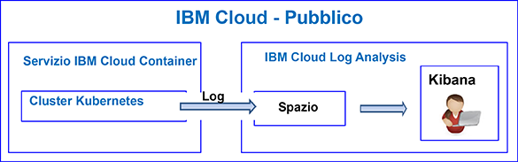
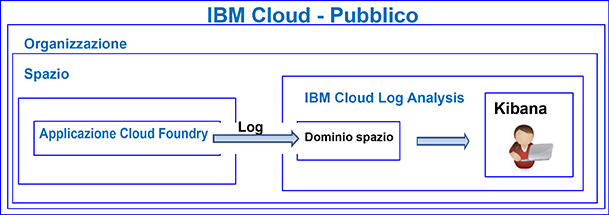

---

copyright:
  years: 2017, 2019

lastupdated: "2019-03-06"

keywords: IBM Cloud, logging

subcollection: cloudloganalysis

---

{:new_window: target="_blank"}
{:shortdesc: .shortdesc}
{:screen: .screen}
{:pre: .pre}
{:table: .aria-labeledby="caption"}
{:codeblock: .codeblock}
{:tip: .tip}
{:download: .download}
{:important: .important}
{:note: .note}

# Esercitazione introduttiva
{: #getting-started-with-cla}

Utilizza questa esercitazione per informazioni su come iniziare a lavorare con il servizio {{site.data.keyword.loganalysislong}} in {{site.data.keyword.Bluemix}}. 
{:shortdesc}

Per impostazione predefinita, {{site.data.keyword.Bluemix_notm}} offre funzionalità di registrazione integrate per servizi selezionati. Puoi utilizzare il servizio {{site.data.keyword.loganalysisshort}} per espandere le tue funzionalità di conservazione e di raccolta quando utilizzi i log.

## Prima di cominciare
{: #prereqs}

Devi disporre di un ID utente che sia un membro o un proprietario di un account {{site.data.keyword.Bluemix_notm}}. Per ottenere un ID utente {{site.data.keyword.Bluemix_notm}}, vai a: [Registrazione ](https://console.bluemix.net/registration/){:new_window}

## Passo 1: scegli una risorsa cloud di cui vuoi visualizzare i log
{: #step1}

In {{site.data.keyword.Bluemix_notm}}, i contenitori, le applicazioni CF in esecuzione in {{site.data.keyword.containershort}} e i servizi selezionati raccolgono i dati di log automaticamente e li inoltrano al servizio {{site.data.keyword.loganalysisshort}}.

La seguente tabella elenca le differenti risorse cloud. Completa l'esercitazione di una risorsa per iniziare ad utilizzare il servizio {{site.data.keyword.loganalysisshort}}:

<table>
  <caption>Esercitazioni per iniziare ad utilizzare il servizio {{site.data.keyword.loganalysisshort}} </caption>
  <tr>
    <th>Risorsa</th>
    <th>Esercitazione</th>
    <th>Ambiente cloud</th>
    <th>Scenario</th>
  </tr>
  <tr>
    <td>Contenitori in esecuzione in {{site.data.keyword.containershort}}</td>
    <td>[Analizza i log in Kibana per un'applicazione distribuita in un cluster Kubernetes ](/docs/services/CloudLogAnalysis/tutorials?topic=cloudloganalysis-container_logs#container_logs)</td>
    <td>Pubblico </br>Dedicato</td>
    <td></td>
  </tr>
  <tr>
    <td>Applicazioni CF</td>
    <td>[Analizza i log in Kibana per un'applicazione Cloud Foundry](https://console.bluemix.net/docs/tutorials/application-log-analysis.html#generate-access-and-analyze-application-logs)</td>
    <td>Pubblico</td>
    <td></td>
  </tr>
</table>


## Passo 2: imposta le autorizzazioni per un utente per visualizzare i log
{: #step24}

Per controllare le azioni {{site.data.keyword.loganalysisshort}} che un utente è autorizzato a eseguire, puoi assegnare ruoli e politiche a un utente. 

Ci sono due tipi di autorizzazioni di sicurezza in {{site.data.keyword.Bluemix_notm}} che controllano le azioni che gli utenti possono eseguire quando gestiscono il servizio {{site.data.keyword.loganalysisshort}}:

* Ruoli CF (Cloud Foundry): concedi a un utente un ruolo CF per definire le autorizzazioni di cui dispone per visualizzare i log in uno spazio.
* Ruoli IAM: concedi a un utente una politica IAM per definire le autorizzazioni di cui dispone per visualizzare i log nel dominio dell'account.

### Imposta le autorizzazioni per un utente per visualizzare i log in un dominio dello spazio
{: #step42a}

Completa la seguente procedura per concedere a un utente le autorizzazioni a visualizzare i log in uno spazio:

1. Accedi alla console {{site.data.keyword.Bluemix_notm}}.

    Apri un browser web e avvia il dashboard {{site.data.keyword.Bluemix_notm}}: [http://bluemix.net ](http://bluemix.net){:new_window}
	
	Dopo che hai eseguito l'accesso con il tuo ID utente e la tua password, viene aperta la IU {{site.data.keyword.Bluemix_notm}}.

2. Dalla barra dei menu, fai clic su **Gestisci > Account > Utenti**. 

    La finestra *Utenti* visualizza un elenco di utenti con i loro indirizzi email per l'account attualmente selezionato.
	
3. Se l'utente è un membro dell'account, seleziona il suo nome dall'elenco o fai clic su **Gestisci utente** dal menu *Azioni*.

    Se l'utente non è un membro dell'account, vedi [Invito di utenti](/docs/iam?topic=iam-iamuserinv#iamuserinv).

4. Seleziona **Accesso Cloud Foundry** e seleziona quindi l'organizzazione.

    Viene presentato l'elenco di spazi disponibili in tale organizzazione.

5. Scegli lo spazio in cui hai eseguito il provisioning del servizio {{site.data.keyword.loganalysisshort}}. Quindi, dal menu delle azioni, seleziona **Modifica ruolo spazio**.

6. Seleziona *Revisore*. 

    Puoi selezionare 1 o più ruoli spazio. Tutti i seguenti ruoli consentono a un utente di visualizzare i log: *Gestore*, *Sviluppatore* e *Revisore*
	
7. Fai clic su **Salva ruolo**.


### Imposta le autorizzazioni per un utente per visualizzare i log in un dominio dell'account
{: #step24b}


Completa la seguente procedura per concedere a un utente le autorizzazioni per visualizzare i log dell'account:

1. Accedi alla console {{site.data.keyword.Bluemix_notm}}.

    Apri un browser web e avvia il dashboard {{site.data.keyword.Bluemix_notm}}: [http://bluemix.net ](http://bluemix.net){:new_window}
	
	Dopo che hai eseguito l'accesso con il tuo ID utente e la tua password, viene aperta la IU {{site.data.keyword.Bluemix_notm}}.

2. Dalla barra dei menu, fai clic su **Gestisci > Account > Utenti**. 

    La finestra *Utenti* visualizza un elenco di utenti con i loro indirizzi email per l'account attualmente selezionato.
	
3. Se l'utente è un membro dell'account, seleziona il suo nome dall'elenco o fai clic su **Gestisci utente** dal menu *Azioni*.

    Se l'utente non è un membro dell'account, vedi [Invito di utenti](/docs/iam?topic=iam-iamuserinv#iamuserinv).

4. Nella sezione **Politiche di accesso**, fai clic su **Assegna accesso** e seleziona quindi **Assegna l'accesso alle risorse**.

    Viene visualizzata la finestra *Assegna l'accesso alla risorsa a (utente)**.

5. Immetti le informazioni sulla politica. La seguente tabella elenca i campi obbligatori per definire una politica: 

    <table>
	  <caption>Elenco di campi per configurare una politica IAM.</caption>
	  <tr>
	    <th>Campo</th>
		<th>Valore</th>
	  </tr>
	  <tr>
	    <td>Servizi</td>
		<td>*IBM Cloud Log Analysis*</td>
	  </tr>	  
	  <tr>
	    <td>Regioni</td>
		<td>Puoi specificare le regioni a cui all'utente verrà concesso l'accesso per lavorare con i log. Seleziona una o più regioni singolarmente oppure seleziona **Tutte le regioni correnti** per concedere l'accesso a tutte le regioni.</td>
	  </tr>
	  <tr>
	    <td>Istanza di servizio</td>
		<td>Seleziona *Tutte le istanze del servizio*.</td>
	  </tr>
	  <tr>
	    <td>Ruoli</td>
		<td>Seleziona uno o più ruoli IAM. <br>I ruoli validi sono: *amministratore*, *operatore*, *editor* e *visualizzatore*. <br>Per ulteriori informazioni sulle azioni consentite per ogni ruolo, vedi [Ruoli IAM](/docs/services/CloudLogAnalysis?topic=cloudloganalysis-security_ov#iam_roles).
		</td>
	  </tr>
     </table>
	
6. Fai clic su **Assegna**.
	
La politica che configuri è applicabile alle regioni selezionate. 


## Passi successivi 
{: #next_steps}

**Nota:** un utente deve accedere a Kibana nella regione cloud pubblica in cui sono disponibili i dati di log per visualizzarli e analizzarli. 

Ad esempio, per avviare Kibana nella regione Stati Uniti Sud, apri un browser web e immetti il seguente URL:

```
https://logging.ng.bluemix.net/ 
```
{: codeblock}


Per ulteriori informazioni su come avviare Kibana in altre regioni, vedi [Passaggio a Kibana da un browser web](/docs/services/CloudLogAnalysis/kibana?topic=cloudloganalysis-launch#launch_Kibana_from_browser).

**Nota:** quando avvii Kibana, se ricevi un messaggio che indica una condizione di *token di connessione non valido*, controlla le tue autorizzazioni nell'account. Questo messaggio è un'indicazione che il tuo ID utente non dispone delle autorizzazioni a visualizzare i log.

Successivamente, personalizza Kibana per visualizzare ed analizzare i tuoi dati di log. Per maggiori informazioni, vedi [Visualizzazione e analisi dei log](/docs/services/CloudLogAnalysis/kibana?topic=cloudloganalysis-analyzing_logs_Kibana#analyzing_logs_Kibana)
    


