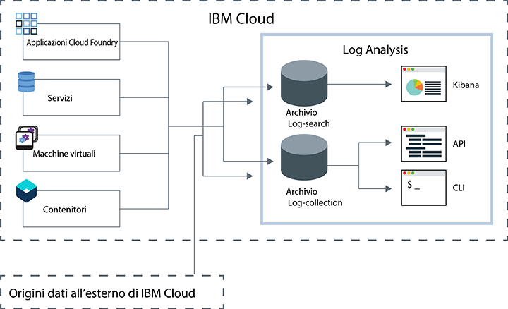

---

copyright:
  years: 2017, 2019

lastupdated: "2019-03-06"

keywords: IBM Cloud, logging

subcollection: cloudloganalysis

---

{:new_window: target="_blank"}
{:shortdesc: .shortdesc}
{:screen: .screen}
{:pre: .pre}
{:table: .aria-labeledby="caption"}
{:codeblock: .codeblock}
{:tip: .tip}
{:download: .download}
{:important: .important}
{:note: .note}

# IBM Cloud Log Analysis
{: #log_analysis_ov}

Utilizza il servizio {{site.data.keyword.loganalysisfull}} per espandere le tue funzionalità di raccolta dei log, conservazione dei log e ricerca dei log in {{site.data.keyword.Bluemix}}. Aggiungi al tuo team DevOps funzioni come l'aggregazione dell'applicazione e dei log dell'ambiente per l'applicazione consolidata o le informazioni approfondite sull'ambiente, la codifica dei log, la conservazione dei dati di log per il tempo necessario e il rapido rilevamento e risoluzione dei problemi. Utilizza Kibana per le attività di analisi avanzata.
{:shortdesc}

Le funzionalità di registrazione di {{site.data.keyword.Bluemix_notm}} sono integrate nella piattaforma:

* La raccolta dei dati è abilitata automaticamente per le risorse cloud. Per impostazione predefinita, {{site.data.keyword.Bluemix_notm}}, raccoglie e visualizza i log per le tue applicazioni, i runtime delle applicazioni e i runtime di calcolo in cui queste applicazioni vengono eseguite. 
* Puoi ricercare fino a 500 MB di dati al giorno. 
* I log vengono archiviati per gli ultimi 3 giorni nella Ricerca dei log, un componente del servizio {{site.data.keyword.loganalysisshort}}.

Puoi utilizzare le funzionalità di registrazione in {{site.data.keyword.Bluemix_notm}} per comprendere il funzionamento della piattaforma cloud e delle risorse in esecuzione al suo interno. Non è richiesta alcuna strumentazione speciale per raccogliere i log di output standard e di errore standard. Ad esempio, puoi utilizzare i log per fornire un audit trail per un'applicazione, rilevare problemi nel tuo servizio, identificare vulnerabilità, risolvere problemi relativi alle distribuzioni delle applicazioni e al funzionamento del runtime, rilevare problemi nell'infrastruttura in cui è in esecuzione l'applicazione, tracciare la tua applicazione tra i componenti della piattaforma cloud e individuare dei modelli da utilizzare per prevenire azioni che potrebbero compromettere il tuo servizio SLA.

Il servizio {{site.data.keyword.loganalysisfull}} fornisce i servizi di raccolta dei log e di ricerca nei log per la piattaforma {{site.data.keyword.Bluemix_notm}}, raccogliendo automaticamente i dati dei servizi {{site.data.keyword.Bluemix_notm}} e delle applicazioni da servizi {{site.data.keyword.Bluemix_notm}} selezionati.

La seguente figura mostra una vista di alto livello del servizio {{site.data.keyword.loganalysisshort}}: 

Per raccogliere e ricercare nei log di risorse cloud eseguite in uno spazio, devi eseguire il provisioning di un'istanza del servizio {{site.data.keyword.loganalysisshort}} nello stesso spazio dove sono in esecuzione tali risorse cloud. I log vengono raccolti e archiviati nella Ricerca dei log per impostazione predefinita. Quando selezioni un piano di servizio che include le funzionalità di raccolta e ricerca estese, i log vengono inoltre raccolti e archiviati nel componente Raccolta dei log. I dati dei log che vengono archiviati nella Raccolta dei log sono crittografati.

Per impostazione predefinita, {{site.data.keyword.Bluemix_notm}} archivia i dati di log per un massimo di 3 giorni in Ricerca dei log:   

* Viene archiviato un massimo di 500MB per spazio di dati al giorno. Tutti i log che superano i 500 MB vengono scartati. Le assegnazioni dei limiti vengono
reimpostate ogni giorno alle ore 12:30 UTC.
* Sono ricercabili fino a 1,5 GB di dati per una massimo di 3 giorni. Viene eseguito il rollover (la prima voce inserita è la prima a essere eliminata) dei dati di log quando vengono raggiunti i 1,5 GB di dati o vengono superati i 3 giorni.

Il servizio {{site.data.keyword.loganalysisshort}} fornisce ulteriori piani che ti consentono di archiviare i log nella raccolta di log per quanto tempo desideri. La dimensione dei log che puoi raccogliere e archiviare nella Raccolta dei log è determinata dal piano di servizio che hai scelto. Paghi per GB di dati al mese per i dati che archivi. I log sono archiviati in Raccolta dei log come JSON.

Puoi utilizzare Kibana 5.1 per le attività di analisi della ricerca dei log avanzate:

* Ogni piano limita la dimensione dei log che puoi ricercare al giorno. 
* Le ricerche coprono soltanto i dati degli ultimi 3 giorni.

Per accedere ai log più vecchi di 3 giorni, puoi utilizzare la CLI o l'API della raccolta dei log per scaricare i log localmente o puoi inviare i log a un'altra applicazione o a servizi cloud di terze parti. 

Puoi eliminare i log automaticamente configurando una politica di conservazione o manualmente utilizzando la CLI {{site.data.keyword.loganalysisshort}}.

## Perché utilizzare il servizio Analisi dei log
{: #value}

1. **Impieghi meno tempo a strumentare la tua applicazione e più tempo a migliorarne la qualità**

    {{site.data.keyword.loganalysislong_notm}} raccoglie automaticamente i dati da servizi {{site.data.keyword.Bluemix_notm}} selezionati; non è necessaria alcuna strumentazione.
	
	Puoi scegliere la quantità di log su cui puoi eseguire ricerche al giorno.  Sono disponibili diversi piani che puoi usare per eseguire ricerche su un massimo di 500MB, 2GB, 5GB e 10GB di log al giorno.

2. **Conservi i tuoi dati di log vicino ai tuoi carichi di lavoro dell'applicazione e proteggi le soluzioni di archiviazione economiche della classe cloud**

    Raccogli e archivia i dati di log da applicazioni guidate da microservizi e tradizionali in esecuzione in {{site.data.keyword.Bluemix_notm}} in un log centralizzato. Conserva i dati di log per tutto il tempo necessario.
	
	I log sono archiviati nell'archiviazione cloud {{site.data.keyword.IBM_notm}}. Puoi scaricare i log, quando ne hai bisogno.

3. **Ottieni informazioni approfondite sul tuo ambiente per individuare, diagnosticare e identificare velocemente i problemi**

    Visualizzi, analizzi e interagisci con i tuoi dati tramite dashboard personalizzabili. Basate sulla piattaforma stack Elastic, le funzioni di ricerca dei log ti offrono la flessibilità e la familiarità di Kibana per creare velocemente i tuoi dashboard per i bisogni della tua applicazione.

4. **Integrazione solida con le API**

    Integra i tuoi dati di log nelle tue applicazioni e operazioni tramite le API del servizio. Utilizza le API del servizio {{site.data.keyword.loganalysisshort}} per gestire i tuoi log conservati e inviare i dati di log dall'esterno del cloud {{site.data.keyword.IBM_notm}}.

## Regioni
{: #regions}

Il servizio {{site.data.keyword.loganalysisfull_notm}} è disponibile nelle seguenti regioni:

* Germania
* Regno Unito
* Stati Uniti Sud
* Sydney

## Località dei dati
{: #data_location}

La seguente tabella elenca l'ubicazione dei log per ogni regione:

<table>
  <caption>Ubicazione dei log per ogni regione</caption>
  <tr>
    <th>Regione</th>
	<th>Log di Ricerca log</th>
	<th>Log di Raccolta dei log</th>
  </tr>
  <tr>
    <td>Germania</td>
	  <td>Ospitati in Germania</td>
	  <td>Ospitati in Germania</td>
  </tr>
  <tr>
    <td>Regno Unito</td>
	  <td>Ospitati nel Regno Unito</td>
	  <td>Ospitati nel Regno Unito</td>
  </tr>
  <tr>
    <td>Stati Uniti Sud</td>
	  <td>Ospitati negli Stati Uniti Sud</td>
	  <td>Ospitati negli Stati Uniti Sud</td>
  </tr>
  <tr>
    <td>Sydney</td>
	  <td>Ospitati a Sydney</td>
	  <td>Ospitati negli Stati Uniti Sud (*)</td>
  </tr>
</table>

(*) Per Sydney, i log di Raccolta dei log sono attualmente ospitate negli Stati Uniti Sud. I piani prevedono che Sydney diventerà la località dei dati dei log di Raccolta dei dati.

## Piani di servizio
{: #plans}

Il servizio {{site.data.keyword.loganalysisshort}} fornisce più piani. Ogni piano ha diverse funzionalità di ricerca e raccolta dei log. 

**NOTA:** le funzioni incluse in un piano di servizio sono abilitate solo nello spazio dove si esegue il provisioning del servizio {{site.data.keyword.loganalysisshort}} con tale piano.

Puoi modificare un piano tramite la IU {{site.data.keyword.Bluemix_notm}} o la riga di comando. Puoi aggiornare o ridurre il tuo piano in qualsiasi momento. Per ulteriori informazioni sugli upgrade di piano di servizio, vedi [Modifica del piano](/docs/services/CloudLogAnalysis/how-to/change_plan.html#change_plan). 

La seguente tabella illustra i piani disponibili:

<table>
    <caption>Riepilogo delle funzionalità di ricerca e raccolta dei log per ogni piano</caption>
      <tr>
        <th>Piano</th>
        <th>Inserimento log</th>
        <th>Conservazione dei log</th>
        <th>Codifica dati</th>
        <th>Ricerca dei log</th>
      </tr>
      <tr>
        <td>Lite (predefinito)</td>
        <td>No</td>
        <td>Ultimi 3 giorni</td>
        <td>No</td>
        <td>Ricerca fino a 500 MB</td>
      </tr>
      <tr>
        <td>Raccolta dei log</td>
        <td>Sì</td>
        <td>Numero configurabile di giorni.</td>
        <td>Sì</td>
        <td>Ricerca fino a 500 MB al giorno</td>
      </tr>
      <tr>
        <td>Raccolta dei log con 2GB/Ricerca al giorno</td>
        <td>Sì</td>
        <td>Numero configurabile di giorni.</td>
        <td>Sì</td>
        <td>Ricerca fino a 2 GB al giorno</td>
      </tr>
      <tr>
        <td>Raccolta dei log con 5GB/Ricerca al giorno</td>
        <td>Sì</td>
        <td>Numero configurabile di giorni.</td>
        <td>Sì</td>
        <td>Ricerca fino a 5 GB al giorno</td>
      </tr>
       <tr>
        <td>Raccolta dei log con 10GB/Ricerca al giorno</td>
        <td>Sì</td>
        <td>Numero configurabile di giorni.</td>
        <td>Sì</td>
        <td>Ricerca fino a 10 GB al giorno</td>
      </tr>
</table>

**Nota:** il costo mensile dell'archiviazione di raccolta dei log viene calcolato come una media del ciclo di fatturazione.

