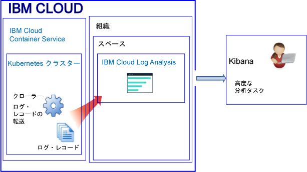
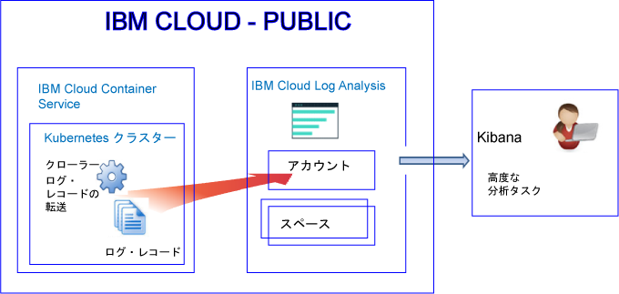
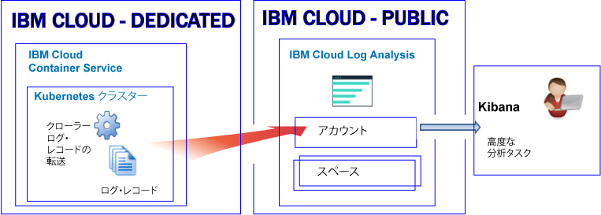

---

copyright:
  years: 2017, 2019

lastupdated: "2019-03-06"

keywords: IBM Cloud, logging

subcollection: cloudloganalysis

---

{:new_window: target="_blank"}
{:shortdesc: .shortdesc}
{:screen: .screen}
{:pre: .pre}
{:table: .aria-labeledby="caption"}
{:codeblock: .codeblock}
{:tip: .tip}
{:download: .download}
{:important: .important}
{:note: .note}


# {{site.data.keyword.containershort_notm}}
{: #containers_kubernetes}

{{site.data.keyword.Bluemix_notm}} では、Public および Dedicated において {{site.data.keyword.containershort}} によって自動的に収集されるコンテナー・ログおよび Kubernetes クラスター・ログを、{{site.data.keyword.loganalysisshort}} サービスを使用して保管および分析できます。
{:shortdesc}

1 つのアカウント内に 1 つ以上の Kubernetes クラスターを持つことができます。 クラスターがプロビジョンされるとすぐに、{{site.data.keyword.containershort}} によってログが自動的に収集されます。 

* アプリケーション・ログの収集は、ポッドがデプロイされるとすぐに行われます。 
* コンテナー・プロセスが STDOUT (標準出力) および STDERR (標準エラー) に出力する情報は {{site.data.keyword.containershort}} によって自動的に収集されます。

{{site.data.keyword.loganalysisshort}} サービスでの分析にそれらのログを使用できるようにするには、{{site.data.keyword.loganalysisshort}} にログを転送するようにクラスターを構成する必要があります。 ログは、{{site.data.keyword.loganalysisshort}} アカウント・ドメインまたはアカウント内のスペース・ドメインに転送できます。 デフォルトでは次のようになります。

* 米国南部地域で使用可能なクラスターは、米国南部地域で使用可能な {{site.data.keyword.loganalysisshort}} サービスにログを送信します。
* 米国東部地域で使用可能なクラスターは、米国南部地域で使用可能な {{site.data.keyword.loganalysisshort}} サービスにログを送信します。
* ドイツ地域で使用可能なクラスターは、ドイツ地域で使用可能な {{site.data.keyword.loganalysisshort}} サービスにログを送信します。
* シドニー地域で使用可能なクラスターは、シドニー地域で使用可能な {{site.data.keyword.loganalysisshort}} サービスにログを送信します。
* 英国地域で使用可能なクラスターは、ドイツ地域で使用可能な {{site.data.keyword.loganalysisshort}} サービスにログを送信します。

ログをスペース・ドメインとアカウント・ドメインのいずれに転送するかを決定する際には、以下の情報を考慮してください。

* ログをアカウント・ドメインに送信する場合、検索割り当て量は 1 日当たり 500 MB バイトであり、長期保管のためにログを Log Collection に保管することはできません。
* ログをスペース・ドメインに送信する場合は、1 日当たりの検索割り当て量を定義する {{site.data.keyword.loganalysisshort}} サービス・プランを選択でき、長期保管のためにログを Log Collection 内に保管できます。

**注:** デフォルトでは、クラスターから {{site.data.keyword.loganalysisshort}} サービスへのログの送信は自動的には有効になりません。 ロギングを有効にするためには、{{site.data.keyword.loganalysisshort}} サービスに自動的にログを転送するようにクラスター内に 1 つ以上のロギング構成を作成する必要があります。 コマンド・ラインで `ibmcloud cs logging-config-create` コマンドを使用するか、または、{{site.data.keyword.Bluemix_notm}} UI で使用可能なクラスター・ダッシュボードを使用して、ロギングを有効にすることができます。 詳しくは、『[クラスター・ログの自動収集の有効化](/docs/services/CloudLogAnalysis/containers/containers_kube_other_logs.html#containers_kube_other_logs)』を参照してください。

Kubernetes クラスターについての作業を行う際、名前空間 *ibm-system* および *kube-system* は予約済みです。 これらの名前空間で使用可能なリソースの許可を作成、削除、または変更しないでください。 これらの名前空間のログは、{{site.data.keyword.IBM_notm}} の使用を目的としています。


## スペース・ドメインへのログの転送
{: #space}

クラスター・ログを {{site.data.keyword.loganalysisshort}} に転送するようにクラスターを構成するときには、以下の情報を考慮してください。

* それらのログの転送が行われる Cloud Foundry 組織およびスペースを定義する必要があります。 
* その組織およびスペースは任意の {{site.data.keyword.IBM_notm}} Public Cloud 領域で使用可能にできます。

**注:** **{{site.data.keyword.Bluemix_notm}} Dedicated** でプロビジョンされているクラスターの場合、専用アカウントで使用可能な Cloud Foundry スペースにクラスター・ログを転送するようにクラスターを構成することはできません。

スペース・ドメインにログを転送するクラスターのログ・データを Kibana で分析するときには、以下の情報を考慮してください。

* クラスター・ログを収集する組織およびスペースが使用可能になっている Public 地域で Kibana を起動する必要があります。
* Kibana 検索割り当て量を増やし、長期保管用の Log Collection にログを保管するには、要件を満たすプランを使用して、ログの転送が行われるスペースに {{site.data.keyword.loganalysisshort}} サービスをプロビジョンする必要があります。 
* ご使用のユーザー ID が、ログを表示する許可を持っている必要があります。 スペース・ドメイン内のログを表示するユーザーには CF 役割が必要です。 **監査員**は、ログの表示を認可される最低の役割です。 詳しくは、『[ログを表示するユーザーに必要な役割](/docs/services/CloudLogAnalysis/kibana/analyzing_logs_Kibana.html#roles)』を参照してください。

長期保管用ストレージ (Log Collection) に保管されたクラスター・ログ・デーを管理するには、ユーザー ID が、{{site.data.keyword.loganalysisshort}} サービスと連携するための IAM ポリシーを持っている必要があります。 ユーザー ID が、**管理者**、**オペレーター**、または**エディター**の許可を持っている必要があります。  詳しくは、『[ログを管理するユーザーに必要な役割](/docs/services/CloudLogAnalysis/manage_logs.html#roles1)』を参照してください。


以下の図は、クラスターがログをスペース・ドメインに転送する場合に、Public の {{site.data.keyword.containershort}} で行われるロギングの概略を示しています。



   

## アカウント・ドメインへのログの転送
{: #acc_public}

クラスター・ログをアカウント・ドメインに転送するようにクラスターを構成するときには、以下の情報を考慮してください。

* **{{site.data.keyword.Bluemix_notm}} Public** にプロビジョンされたクラスター: ログは、クラスターが実行されている、同じ {{site.data.keyword.Bluemix_notm}} Public 地域内のアカウント・ドメインに転送されます。
* **{{site.data.keyword.Bluemix_notm}} Dedicated** にプロビジョンされたクラスター: ログは、Dedicated クラスターが実行されている、同じ {{site.data.keyword.Bluemix_notm}} Public 地域内のアカウント・ドメインに転送されます。

アカウント・ドメインにログを転送するクラスターのログ・データを Kibana で分析するときには、以下の情報を考慮してください。

* クラスターが {{site.data.keyword.loganalysisshort}} サービスへのログの送信を行う Public 地域で Kibana を起動する必要があります。

    * 米国南部地域で使用可能なクラスターは、米国南部地域で使用可能な {{site.data.keyword.loganalysisshort}} サービスにログを送信します。
    * 米国東部地域で使用可能なクラスターは、米国南部地域で使用可能な {{site.data.keyword.loganalysisshort}} サービスにログを送信します。
    * ドイツ地域で使用可能なクラスターは、ドイツ地域で使用可能な {{site.data.keyword.loganalysisshort}} サービスにログを送信します。
    * シドニー地域で使用可能なクラスターは、シドニー地域で使用可能な {{site.data.keyword.loganalysisshort}} サービスにログを送信します。
    * 英国地域で使用可能なクラスターは、ドイツ地域で使用可能な {{site.data.keyword.loganalysisshort}} サービスにログを送信します。

* ご使用のユーザー ID が、ログを表示する許可を持っている必要があります。 アカウント・ドメイン内のログを表示するには、ユーザーは {{site.data.keyword.loganalysisshort}} サービスのための IAM ポリシーを必要とします。 ユーザーには**ビューアー**の許可が必要です。 


以下の図は、クラスターがログをアカウント・ドメインに転送する場合に、Public の {{site.data.keyword.containershort}} で行われるロギングの概略を示しています。



以下の図は、Dedicated での {{site.data.keyword.containershort}} のロギングの概略を示します。




## {{site.data.keyword.loganalysisshort}} へログを転送するためのクラスターの構成
{: #config_forward_logs}

どのクラスター・ログを {{site.data.keyword.loganalysisshort}} サービスに転送するのかを選択できます。 

ログ・ファイルを {{site.data.keyword.loganalysisshort}} サービスに転送するようにクラスターを構成する方法について詳しくは、『[クラスター・ログの自動収集の有効化](/docs/services/CloudLogAnalysis/containers/containers_kube_other_logs.html#containers_kube_other_logs)』セクションを参照してください。

* stdout および stderr の自動ログ収集および転送を有効にするには、[コンテナー・ログの自動ログ収集および転送の有効化](/docs/services/CloudLogAnalysis/containers/containers_kube_other_logs.html#containers)を参照してください。
* アプリケーション・ログの自動ログ収集および転送を有効にするには、[アプリケーション・ログの自動ログ収集および転送の有効化](/docs/services/CloudLogAnalysis/containers/containers_kube_other_logs.html#apps)を参照してください。 
* ワーカー・ログの自動ログ収集および転送を有効にするには、[ワーカー・ログの自動ログ収集および転送の有効化](/docs/services/CloudLogAnalysis/containers/containers_kube_other_logs.html#workers)を参照してください。 
* Kubernetes システム・コンポーネント・ログの自動ログ収集および転送を有効にするには、[Kubernetes システム・コンポーネント・ログの自動ログ収集および転送の有効化](/docs/services/CloudLogAnalysis/containers/containers_kube_other_logs.html#system)を参照してください。 
* Kubernetes Ingress コントローラー・ログの自動ログ収集および転送を有効にするには、[Kubernetes Ingress コントローラー・ログの自動ログ収集および転送の有効化](/docs/services/CloudLogAnalysis/containers/containers_kube_other_logs.html#controller)を参照してください。


## {{site.data.keyword.Bluemix_notm}} のカスタム・ファイアウォール構成に対するネットワーク・トラフィックの構成
{: #ports}

追加ファイアウォールをセットアップしたか、または、{{site.data.keyword.Bluemix_notm}} インフラストラクチャー (SoftLayer) のファイアウォール設定をカスタマイズした場合、ワーカー・ノードから {{site.data.keyword.loganalysisshort}} サービスへの発信ネットワーク・トラフィックを許可する必要があります。 

カスタマイズしたファイアウォール内の次の IP アドレスに対して、各ワーカーから {{site.data.keyword.loganalysisshort}} サービスへ TCP ポート 443 および TCP ポート 9091 を開く必要があります。

<table>
  <tr>
    <th>地域</th>
    <th>取り込み URL</th>
	<th>パブリック IP アドレス</th>
  </tr>
  <tr>
    <td>ドイツ</td>
	<td>ingest-eu-fra.logging.bluemix.net</td>
	<td>158.177.88.43 <br>159.122.87.107</td>
  </tr>
  <tr>
    <td>英国</td>
	<td>ingest.logging.eu-gb.bluemix.net</td>
	<td>169.50.115.113</td>
  </tr>
  <tr>
    <td>米国南部</td>
	<td>ingest.logging.ng.bluemix.net</td>
	<td>169.48.79.236 <br>169.46.186.113</td>
  </tr>
  <tr>
    <td>シドニー</td>
	<td>ingest-au-syd.logging.bluemix.net</td>
	<td>130.198.76.125 <br>168.1.209.20</td>
  </tr>
</table>


## カスタム・アプリケーション・ログの転送
{: #forward_app_logs}

クラスター内のカスタム・アプリケーション・ログの {{site.data.keyword.loganalysisshort}} サービスへの転送を有効にするには、**「ログ・ソース」**を**「アプリケーション」**に設定して、クラスター・ロギング構成を定義する必要があります。 この構成は、`ibmcloud cs logging-config-create` コマンドを使用して、または、クラスター UI を介して定義できます。

カスタム・ログを転送するようにクラスターを構成するときに、カスタム・ログの転送元にしたい、クラスター内で実行されているコンテナーのリストと、それらのコンテナー内のカスタム・ファイル・ログが置かれているパスを指定できます。

* **app-paths** パラメーターを指定して、監視したいコンテナー内のパスのリストを設定する必要があります。 これらのパスに置かれたログが {{site.data.keyword.loganalysisshort}} サービスに転送されます。 

    このパラメーターを設定するには、コンテナー内にあるパスのコンマ区切りリストを定義します。 「/var/log/*.log」のようなワイルドカードを使用できます。

* オプションで、**app-containers** パラメーターを設定して、ログを収集して {{site.data.keyword.loganalysisshort}} サービスに転送する元のコンテナーのリストを指定できます。

    このパラメーターを設定するには、コンテナーのコンマ区切りリストを定義します。

**ヒント:** **「ログ・ソース」**を**「アプリケーション」**に設定した複数のクラスター・ロギング構成を 1 つのクラスター内に定義できます。 クラスター内のコンテナーにおいて複数の異なるパスでログがホスティングされる場合、ログが同じパスに置かれるコンテナーのグループごとに 1 つのクラスター・ロギング構成を定義することを検討してください。 


## ログ・ソース
{: #log_sources}


ログを {{site.data.keyword.loganalysisshort}} サービスに転送するようにクラスターを構成できます。 以下の表に、ログを {{site.data.keyword.loganalysisshort}} サービスに転送するために有効にできる各種のログ・ソースをリストします。

<table>
  <caption>Kuberenetes クラスターのログ・ソース</caption>
  <tr>
    <th>ログ・ソース</th>
	<th>説明</th>
	<th>ログ・パス</th>
  </tr>
  <tr>
    <td>コンテナー</td>
	<td>コンテナー・ログ。</td>
	<td>標準出力 (stdout) および標準エラー出力 (stderr) のログ。</td>
  </tr>
  <tr>
    <td>アプリケーション</td>
	<td>Kubernetes クラスターで実行される独自のアプリケーションのログ。</td>
	<td>`/var/log/apps/**/*.log`  </br>`/var/log/apps/**/*.err`</br>**注:** ポッドの場合、ログは、`/var/logs/apps/` 内または `/var/logs/apps/` の下の任意のサブディレクトリーに書き込むことができます。 ワーカーの場合は、アプリがポッド内でログを書き込んでいるポッド内のディレクトリーに `/var/log/apps/` をマウントする必要があります。</td>
  </tr>
  <tr>
    <td>ワーカー</td>
	<td>Kubernetes クラスター内の仮想マシン・ワーカー・ノードのログ。 </td>
	<td>`/var/log/syslog` </br>`/var/log/auth.log`</td>
  </tr>
  <tr>
    <td>Kubernetes システム・コンポーネント</td>
	<td>Kubernetes システム構成要素のログ。</td>
	<td>*/var/log/kubelet.log* </br>*/var/log/kube-proxy.log*</td>
  </tr>
  <tr>
    <td>Ingress コントローラー</td>
	<td>Kubernetes クラスターに送信されるネットワーク・トラフィックを管理する Ingress コントローラーのログ。</td>
	<td>`/var/log/alb/ids/*.log` </br>`/var/log/alb/ids/*.err` </br>`/var/log/alb/customerlogs/*.log` </br>`/var/log/alb/customerlogs/*.err`</td>
  </tr>
</table>

## ログの検索
{: #log_search}

デフォルトでは、{{site.data.keyword.Bluemix_notm}} では、1 日当たり 500 MB までのログを Kibana を使用して検索できます。 

より大きなログを検索するために、{{site.data.keyword.loganalysisshort}} サービスを使用できます。 サービスには複数のプランが用意されています。 ログ検索の機能はプランによって異なります。例えば、*Log Collection *プランでは、1 日当たり 1 GB までのデータを検索できます。 選択可能なプランについて詳しくは、『[サービス・プラン](/docs/services/CloudLogAnalysis/log_analysis_ov.html#plans)』を参照してください。

ログを検索するときには、Kibana で使用可能な次のフィールドを考慮してください。

すべてのログ項目に共通するフィールド:

<table>
  <caption>共通フィールドのリスト</caption>
  <tr>
    <th>フィールド名</th>
	  <th>説明</th>
	  <th>値</th>
  </tr>
  <tr>
    <td>ibm-containers.region_str</td>
	  <td>クラスターが使用可能な地域</td>
	  <td>例えば、米国南部地域で使用可能なクラスターの場合、値は `us-south` です。</td>
  </tr>
  <tr>
    <td>ibm-containers.account_id_str</td>
	  <td>アカウント ID</td>
	  <td></td>
  </tr>
  <tr>
    <td>ibm-containers.cluster_id_str</td>
	  <td>クラスター ID</td>
	  <td></td>
	</tr>
  <tr>
    <td>ibm-containers.cluster_name_str</td>
	  <td>クラスター名</td>
	  <td></td>
  </tr>
</table>

コンテナー stdout および stderr のログの分析に役立つフィールド:

<table>
  <caption>アプリケーションのフィールドのリスト</caption>
  <tr>
    <th>フィールド名</th>
	<th>説明</th>
	<th>値</th>
  </tr>
  <tr>
    <td>kubernetes.container_name_str</td>
	<td>コンテナーの名前</td>
	<td></td>
  </tr>
  <tr>
    <td>kubernetes.namespace_name_str</td>
	<td>クラスター内でアプリケーションが実行されている名前空間</td>
	<td></td>
  </tr>
  <tr>
    <td>stream_str</td>
	<td>ログのタイプ</td>
	<td>*stdout* </br>*stderr*</td>
  </tr>
</table>

ワーカー・ログの分析に役立つフィールド:

<table>
  <caption>ワーカー関連フィールドのリスト</caption>
  <tr>
    <th>フィールド名</th>
	<th>説明</th>
	<th>値</th>
  </tr>
  
  <tr>
    <td>filename_str</td>
	<td>ファイルのパスおよび名前</td>
	<td>*/var/log/syslog*  </br>*/var/log/auth.log*</td>
  </tr>
  <tr>
    <td>tag_str</td>
	<td>ログのタイプ</td>
	<td>*logfiles.worker.var.log.syslog* </br>*logfiles.worker.var.log.auth.log*</td>
  </tr>
  <tr>
    <td>worker_str</td>
	<td>ワーカー名</td>
	<td>例: *w1*</td>
  </tr>
</table>

Kubernetes システム・コンポーネント・ログの分析に役立つフィールド:

<table>
  <caption>Kubernetes システム・コンポーネント関連フィールドのリスト</caption>
  <tr>
    <th>フィールド名</th>
	<th>説明</th>
	<th>値</th>
  </tr>
  <tr>
    <td>tag_str</td>
	<td>ログのタイプ</td>
	<td>*logfiles.kubernetes.var.log.kubelet.log* </br>*logfiles.kubernetes.var.log.kube-proxy.log*</td>
  </tr>
  <tr>
    <td>filename_str</td>
	<td>ファイルのパスおよび名前</td>
	<td>*/var/log/kubelet.log* </br>*/var/log/kube-proxy.log*</td>
  </tr>
 </table>

Ingress コントローラー・ログの分析に役立つフィールド:
 
<table>
  <caption>Ingress コントローラー関連フィールドのリスト</caption>
  <tr>
    <th>フィールド名</th>
	<th>説明</th>
	<th>値</th>
  </tr>
 <tr>
    <td>tag_str</td>
	<td>ログのタイプ</td>
	<td></td>
  </tr>
  <tr>
    <td>filename_str</td>
	<td>ファイルのパスおよび名前</td>
	<td>*/var/log/alb/ids/*.log* </br>*/var/log/alb/ids/*.err* </br>*/var/log/alb/customerlogs/*.log* </br>*/var/log/alb/customerlogs/*.err*</td>
  </tr>
</table>


## メッセージ内のフィールドを Kibana 検索フィールドとして使用できるようにするためのログの送信
{: #send_data_in_json}

デフォルトで、コンテナーのロギングは自動的に有効になります。 Container ランタイム・ログ・ファイルのすべての項目は、Kibana で **message** フィールドに表示されます。 コンテナー・ログ項目の一部である特定のフィールドを使用して、Kibana でデータをフィルター操作および分析する必要がある場合は、有効な JSON フォーマットの出力を送信するようにアプリケーションを構成します。 例えば、JSON フォーマットのメッセージを  STDOUT (標準出力) および STDERR (標準エラー) に記録します。

メッセージで使用可能な各フィールドは構文解析されて、その値に一致するタイプのフィールドに変換されます。例えば、以下の JSON メッセージの各フィールドをご覧ください。
    
```
{"field1":"string type",
        "field2":123,
        "field3":false,
        "field4":"4567"
    }
```
{: codeblock}
    
これらの各フィールドは、以下のように、フィルター操作と検索に使用できるフィールドとして使用可能です。
    
* `field1` は、ストリング型の `field1_str` として構文解析されます。
* `field2` は、整数型の `field1_int` として構文解析されます。
* `field3` は、ブール型の `field3_bool` として構文解析されます。
* `field4` は、ストリング型の `field4_str` として構文解析されます。
    


## セキュリティー
{: #security}


クラスター・ログを {{site.data.keyword.loganalysisshort}} に転送するためには、{{site.data.keyword.containershort}} キー所有者と、ロギング・クラスター構成を構成するユーザー ID に、{{site.data.keyword.Bluemix_notm}} 許可を付与する必要があります。

ロギング・クラスター構成を構成するユーザー ID は、以下の許可を持っている必要があります。

* **ビューアー**許可が設定された、{{site.data.keyword.containershort}} 用の IAM ポリシー。
* **管理者**または**オペレーター**の許可が設定された、クラスター・インスタンス用の IAM ポリシー。

クラスターが {{site.data.keyword.loganalysisshort}} **スペース・ドメイン**にログを転送するには、{{site.data.keyword.containershort}} キー所有者に以下の許可が必要です。

* **管理者**役割が設定された、{{site.data.keyword.containershort}} 用の IAM ポリシー。
* **管理者**役割が設定された、{{site.data.keyword.loganalysisshort}} サービス用の IAM ポリシー。
* スペースがある組織の Cloud Foundry (CF) **orgManager** 役割。
* クラスターからログが転送されるスペースの CF **SpaceManager** 役割または**開発者**役割。


クラスターが {{site.data.keyword.loganalysisshort}} **アカウント・ドメイン**にログを転送するには、{{site.data.keyword.containershort}} キー所有者に以下の許可が必要です。

* **管理者**役割が設定された、{{site.data.keyword.containershort}} 用の IAM ポリシー。
* **管理者**役割が設定された、{{site.data.keyword.loganalysisshort}} サービス用の IAM ポリシー。


## Log Collection へのログの保管
{: #log_collection1}

ログを操作する場合、{{site.data.keyword.Bluemix_notm}} でのデフォルトの動作に関する以下の情報を考慮してください。

* {{site.data.keyword.Bluemix_notm}} はログ・データを最大 3 日間保管します。
* 1 日に最大で 500 MB のデータが保管されます。 500 MB の上限を超えるログは破棄されます。 上限割り当ては、毎日午前 12:30 (UTC) にリセットされます。
* 1.5 GB までのデータを最大 3 日間検索可能です。 ログ・データは、データが 1.5 GB に達するか 3 日が過ぎると、ロールオーバーします (先入れ先出し)。
* ログは、長期保管のために Log Collection 内には保管されません。

{{site.data.keyword.loganalysisshort}} サービスには、必要な期間 Log Collection にログを保管できる追加プランがあります。 各プランの料金について詳しくは、『[サービス・プラン](/docs/services/CloudLogAnalysis/log_analysis_ov.html#plans)』を参照してください。 

Log Collection でログを管理するには、以下の情報を考慮してください。

* Log Collection 内でログを保持する日数を定義するために使用できるログ保存ポリシーを構成できます。 詳しくは、『[ログ保存ポリシー](/docs/services/CloudLogAnalysis/manage_logs.html#log_retention_policy)』を参照してください。
* Log Collection CLI または Log Collection API を使用して、ログを手動で削除できます。 
* Log Collection 内のログを管理するには、ユーザーに、{{site.data.keyword.Bluemix_notm}} の {{site.data.keyword.loganalysisshort}} サービスを使用して処理するための許可が設定された IAM ポリシーが必要です。 詳しくは、[IAM 役割](/docs/services/CloudLogAnalysis/security_ov.html#iam_roles)を参照してください。

## ログの表示と分析
{: #logging_containers_ov_methods}

ログ・データを分析するには、Kibana を使用して高度な分析タスクを実行します。 Kibana は、分析および視覚化のためのオープン・ソース・プラットフォームであり、 さまざまなグラフ (図表や表など) でデータのモニター、検索、分析、および視覚化に使用することができます。 詳しくは、『[Kibana でのログの分析](/docs/services/CloudLogAnalysis/kibana/analyzing_logs_Kibana.html#analyzing_logs_Kibana)』を参照してください。

* Web ブラウザーから Kibana を直接起動できます。 詳しくは、『[Web ブラウザーから Kibana へのナビゲート](/docs/services/CloudLogAnalysis/kibana/launch.html#launch_Kibana_from_browser)』を参照してください。
* クラスターのコンテキストで {{site.data.keyword.Bluemix_notm}} UI から Kibana を起動できます。 詳しくは、『[Kubernetes クラスターにデプロイされたコンテナーのダッシュボードから Kibana へのナビゲート](/docs/services/CloudLogAnalysis/kibana/launch.html#launch_Kibana_for_containers_kube)』を参照してください。

コンテナーで実行されているアプリのログ・データを、JSON フォーマットで Container ランタイム・ログ・コレクターに転送すると、 JSON フィールドを使用して Kibana でログ・データを検索して分析することができます。 詳しくは、『[メッセージ内のフィールドを Kibana 検索フィールドとして使用できるようにするためのログの送信](/docs/services/CloudLogAnalysis/containers/containers_kubernetes.html#send_data_in_json)』を参照してください。

Kibana でログを表示するには、以下の情報を考慮してください。

* スペース・ドメイン内のログを表示するユーザーは、クラスターに関連付けられたスペースの**監査員**の役割または**開発者**の役割を持っている必要があります。
* アカウント・ドメイン内のログを表示するユーザーは、{{site.data.keyword.loganalysisshort}} サービスと連携するための IAM ポリシーを持っている必要があります。 ログ項目の表示が許可される最小限の役割は**ビューアー**です。


## チュートリアル: Kubernetes クラスターにデプロイされているアプリのログを Kibana で分析
{: #tutorial1}

Kibana を使用した、Kubernetes クラスターにデプロイされているコンテナーのログの分析方法を学習するには、[Kubernetes クラスターにデプロイされているアプリのログを Kibana で分析](/docs/services/CloudLogAnalysis/tutorials/container_logs.html#container_logs)を参照してください。
