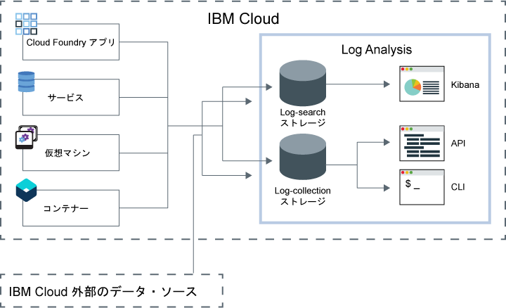

---

copyright:
  years: 2017, 2019

lastupdated: "2019-03-06"

keywords: IBM Cloud, logging

subcollection: cloudloganalysis

---

{:new_window: target="_blank"}
{:shortdesc: .shortdesc}
{:screen: .screen}
{:pre: .pre}
{:table: .aria-labeledby="caption"}
{:codeblock: .codeblock}
{:tip: .tip}
{:download: .download}
{:important: .important}
{:note: .note}

# IBM Cloud Log Analysis
{: #log_analysis_ov}

{{site.data.keyword.loganalysisfull}} サービスを使用して、{{site.data.keyword.Bluemix}} におけるログ収集、ログ保存、およびログ検索の機能を拡張できます。 アプリケーションまたは環境に関する総合的な洞察を得るためにアプリケーションおよび環境のログを集約する機能や、ログを暗号化する機能、必要な期間だけログ・データを保存する機能、問題を素早く検出してトラブルシューティングする機能などを DevOps チームで使用できるようになります。 高度な分析タスクを実行するため、Kibana を使用します。
{:shortdesc}

{{site.data.keyword.Bluemix_notm}} ロギング機能はプラットフォームに組み込まれています。

* クラウド・リソースに関するデータ収集は自動的に有効になります。 {{site.data.keyword.Bluemix_notm}} は、デフォルトで、アプリ、アプリ・ランタイム、およびそれらのアプリの実行場所である計算ランタイムについて、ログの収集と表示を行います。 
* 1 日当たり 500 MB までのログを検索できます。 
* {{site.data.keyword.loganalysisshort}} サービスのコンポーネントの 1 つである Log Search に、最近 3 日間のログが保管されます。

{{site.data.keyword.Bluemix_notm}} のロギング機能を使用して、クラウド・プラットフォームと、そこで稼働しているリソースの動作を理解することができます。 標準出力と標準エラーのログを収集するために特別な計測装置は必要ありません。 例えば、ログを使用することによって、アプリケーションの監査証跡の提供、ご使用のサービスにおける問題の検出、脆弱性の識別、アプリケーション・デプロイメントおよびランタイム動作の障害追及、アプリを実行しているインフラストラクチャーの問題の検出、クラウド・プラットフォームの複数のコンポーネントにわたるアプリのトレース、および、サービス SLA に影響する可能性のあるアクションを回避するために使用できるパターンの検出を行うことができます。

{{site.data.keyword.loganalysisfull}} サービスは、{{site.data.keyword.Bluemix_notm}} プラットフォーム用のログ収集サービスとログ検索サービスを提供し、アプリケーションおよび {{site.data.keyword.Bluemix_notm}} サービスのデータを、選択した {{site.data.keyword.Bluemix_notm}} サービスから自動的に収集します。

以下の図は、{{site.data.keyword.loganalysisshort}} サービスの概要を示しています。 

あるスペース内で実行しているクラウド・リソースのログを収集および検索するには、それらのクラウド・リソースが稼働している同じスペース内で {{site.data.keyword.loganalysisshort}} サービスをプロビジョンする必要があります。 デフォルトで、ログは Log Search で収集され保管されます。 高度な検索機能および収集機能が含まれるサービス・プランを選択すると、ログは Log Collection コンポーネントでも収集されて保管されます。 Log Collection に保管されるログ・データは暗号化されます。

デフォルトでは、{{site.data.keyword.Bluemix_notm}} は Log Search 内にログ・データを最大 3 日間保管します。   

* スペースごとに 1 日に最大で 500 MB のデータが保管されます。 500 MB の上限を超えるログは破棄されます。 上限割り当ては、毎日午前 12:30 (UTC) にリセットされます。
* 1.5 GB までのデータを最大 3 日間検索可能です。 ログ・データは、データが 1.5 GB に達するか 3 日が過ぎると、ロールオーバーします (先入れ先出し)。

{{site.data.keyword.loganalysisshort}} サービスには、必要な期間 Log Collection にログを保管できる追加プランがあります。 Log Collection で収集して保管できるログのサイズは、選択するサービス・プランによって決まります。 保管されるデータの GB 単位で月ごとに支払い料金が算出されます。 ログはLog Collection に JSON として保管されます。

高度なログ検索分析タスクのために Kibana 5.1 を使用できます。

* プランに応じて、1 日当たりに検索できるログのサイズが制限されます。 
* 検索でカバーされるのは過去 3 日分のデータのみです。

Log Collection CLI または Log Collection API を使用して、ログをローカルにダウンロードするか、または、他のアプリケーションまたはサード・パーティー製クラウド・サービスにログをパイプすることによって、3 日間よりも古いログにアクセスできます。 

ログの削除は、保存ポリシーを設定することによって自動的に行うか、または、{{site.data.keyword.loganalysisshort}} CLI を使用して手動で行うことができます。

## Log Analysis サービスを使用する理由
{: #value}

1. **アプリケーションでの計測に費やす時間を減らし、アプリケーションの価値を強化することにより多くの時間をかけることができます**

    {{site.data.keyword.loganalysislong_notm}} は、選択された {{site.data.keyword.Bluemix_notm}} サービスからデータを自動的に収集します。特別なツールは必要ありません。
	
	1 日当たりに検索できるログの量を選択することができます。  1 日当たり最大 500MB、2GB、5GB、および 10GB のログを検索するために使用できるさまざまなプランが使用可能です。

2. **ログ・データをアプリケーション・ワークロードの近くで保持し、クラウド・クラスの安価な保管ソリューションで安全に保護することができます**

    {{site.data.keyword.Bluemix_notm}} で実行されている従来のアプリケーションやマイクロサービス駆動型アプリケーションからのログ・データを集中ログに収集して保管します。 ログ・データは必要な期間保存できます。
	
	ログは {{site.data.keyword.IBM_notm}} クラウド・ストレージに保管されます。 ログは、必要に応じてダウンロードできます。

3. **環境についての洞察を得て、問題を迅速に検出、診断、特定することができます**

    カスタマイズ可能なダッシュボードを使用して、データの視覚化および分析、データとの対話を行うことができます。 ログ検索機能は、Elastic スタック・プラットフォームに構築され、Kibana の柔軟性、使い慣れた操作性を提供します。そのため、ユーザーはダッシュボードを自分のアプリケーションのニーズに合わせて素早く構築することができます。

4. **API との堅固な統合**

    サービスの API を介して、ログ・データをアプリケーションやオペレーションに統合できます。 保存されたログを管理して、ログ・データを {{site.data.keyword.IBM_notm}} クラウドの外部から送信するには、{{site.data.keyword.loganalysisshort}} サービス API を使用します。

## 地域
{: #regions}

{{site.data.keyword.loganalysisfull_notm}} サービスは、以下の地域で使用可能です。

* ドイツ
* 英国
* 米国南部
* シドニー

## データの場所
{: #data_location}

以下の表は、地域ごとのログの場所を示します。

<table>
  <caption>地域別のログの場所</caption>
  <tr>
    <th>地域</th>
	<th>Log Search ログ</th>
	<th>Log Collection ログ</th>
  </tr>
  <tr>
    <td>ドイツ</td>
	  <td>ドイツでホスト</td>
	  <td>ドイツでホスト</td>
  </tr>
  <tr>
    <td>英国</td>
	  <td>英国でホスト</td>
	  <td>英国でホスト</td>
  </tr>
  <tr>
    <td>米国南部</td>
	  <td>米国南部でホスト</td>
	  <td>米国南部でホスト</td>
  </tr>
  <tr>
    <td>シドニー</td>
	  <td>シドニーでホスト</td>
	  <td>米国南部でホスト (*)</td>
  </tr>
</table>

(*) シドニーの場合、Log Collection ログは現在は米国南部でホストされます。 Log Collection ログ・データの場所をシドニーにすることが計画されています。

## サービス・プラン
{: #plans}

{{site.data.keyword.loganalysisshort}} サービスには複数のプランが用意されています。 ログ収集機能およびログ検索機能はプランによって異なります。 

**注:** サービス・プランに含まれるフィーチャーは、そのプランで {{site.data.keyword.loganalysisshort}} サービスをプロビジョンしたスペースでのみ有効になります。

プランは {{site.data.keyword.Bluemix_notm}} UI またはコマンド・ラインを使用して変更できます。 プランはいつでもアップグレードまたは削減することができます。 サービス・プランのアップグレードについて詳しくは、『[プランの変更](/docs/services/CloudLogAnalysis/how-to/change_plan.html#change_plan)』を参照してください。 

使用可能なプランの概要を次の表に示します。

<table>
    <caption>プランごとの Log Search およびLog Collection 機能の概要</caption>
      <tr>
        <th>プラン</th>
        <th>ログの取り込み</th>
        <th>ログの保存</th>
        <th>データ暗号化</th>
        <th>Log Search</th>
      </tr>
      <tr>
        <td>ライト (デフォルト)</td>
        <td>いいえ</td>
        <td>過去 3 日間</td>
        <td>いいえ</td>
        <td>500 MB まで検索</td>
      </tr>
      <tr>
        <td>Log Collection</td>
        <td>はい</td>
        <td>構成可能な日数。</td>
        <td>はい</td>
        <td>1 日当たり 500 MB まで検索</td>
      </tr>
      <tr>
        <td>Log Collection と 2 GB/日の検索</td>
        <td>はい</td>
        <td>構成可能な日数。</td>
        <td>はい</td>
        <td>1 日当たり 2 GB まで検索</td>
      </tr>
      <tr>
        <td>Log Collection と 5 GB/日の検索</td>
        <td>はい</td>
        <td>構成可能な日数。</td>
        <td>はい</td>
        <td>1 日当たり 5 GB まで検索</td>
      </tr>
       <tr>
        <td>Log Collection と 10 GB/日の検索</td>
        <td>はい</td>
        <td>構成可能な日数。</td>
        <td>はい</td>
        <td>1 日当たり 10 GB まで検索</td>
      </tr>
</table>

**注:** Log Collection ストレージの 1 カ月のコストは、請求サイクルの平均として計算されます。

