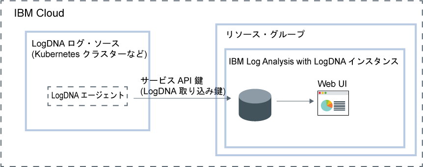

---

copyright:
  years:  2018, 2019
lastupdated: "2019-03-23"

keywords: LogDNA, IBM, Log Analysis, logging, overview

subcollection: LogDNA

---

{:new_window: target="_blank"}
{:shortdesc: .shortdesc}
{:screen: .screen}
{:pre: .pre}
{:table: .aria-labeledby="caption"}
{:codeblock: .codeblock}
{:tip: .tip}
{:download: .download}
{:important: .important}
{:note: .note}

# {{site.data.keyword.la_full_notm}} について
{: #about}

{{site.data.keyword.la_full}} は、ログ管理機能を追加するために、{{site.data.keyword.cloud_notm}} アーキテクチャーの一部として組み込むことのできるサード・パーティー・サービスです。 {{site.data.keyword.la_full_notm}} は、{{site.data.keyword.IBM_notm}} とのパートナーシップにより LogDNA で運用されます。
{:shortdesc}

{{site.data.keyword.la_full_notm}}を使用して、{{site.data.keyword.cloud_notm}} 内のシステムとアプリケーションのログを管理できます。

{{site.data.keyword.la_full_notm}} は、管理者、DevOps チーム、および開発者に、ログ・データのフィルタリング、検索、およびテール、アラートの定義、そしてアプリケーションとシステムのログをモニターするカスタム・ビューの設計を行うための、拡張された機能を提供します。

## 概要
{: #ov}

{{site.data.keyword.cloud_notm}} で LogDNA にロギング機能を追加するには、{{site.data.keyword.la_full_notm}} のインスタンスをプロビジョンする必要があります。

{{site.data.keyword.la_full_notm}} のインスタンスをプロビジョンする前に、以下の情報を検討してください。
* ログ・データは {{site.data.keyword.cloud_notm}} でホストされます。
* ログ・データはサード・パーティーに送信されます。
* ユーザーには、{{site.data.keyword.cloud_notm}} でサービスのインスタンスを作成、表示、および削除するためのプラットフォーム許可が必要です。
* ユーザーには、LogDNA インスタンスのプロビジョンを計画するリソース・グループのコンテキスト内で、リソースを作成するためのプラットフォーム許可が必要です。

{{site.data.keyword.la_full_notm}} インスタンスをリソース・グループのコンテキスト内にプロビジョンします。 リソース・グループを使用して、アクセス制御と請求のために、サービスを編成します。 *デフォルト*のリソース・グループまたはカスタムのリソース・グループ内にインスタンスをプロビジョンできます。

{{site.data.keyword.la_full_notm}} のインスタンスをプロビジョンすると、LogDNA 内にアカウントが作成されて、アカウント用の取り込み鍵を受け取ります。

その後、ログ・ソースごとに LogDNA エージェントを構成する必要があります。 ログ・ソースは、ログを生成するクラウドまたはオンプレミスのリソースです。 例えば、Kubernetes クラスターをログ・ソースにすることができます。 取り込み鍵を使用して、ログを収集して {{site.data.keyword.la_full_notm}} インスタンスに転送するための LogDNA エージェントを構成します。

LogDNA エージェントがログ・ソースにデプロイされた後は、ログの収集と {{site.data.keyword.la_full_notm}} インスタンスへの転送が自動的に行われます。

{{site.data.keyword.la_full_notm}} Web UI を起動して、ログを表示、モニター、および管理することができます。

以下の図は、{{site.data.keyword.cloud_notm}} で稼働している {{site.data.keyword.la_full_notm}} サービスのコンポーネントの概要を示しています。

## ログ・データ
{: #overview_data}

{{site.data.keyword.la_full_notm}} は、1 つの集中化ロギング・システムで、ログを収集して集約します。

* ログ・データは {{site.data.keyword.cloud_notm}} でホストされます。
* データは、{{site.data.keyword.la_full_notm}} インスタンスがプロビジョンされる地域に共同配置されます。 例えば、米国南部にプロビジョンされるインスタンスのログ・データは、米国南部地域でホストされます。

{{site.data.keyword.la_full_notm}} インスタンス用に選択するサービス・プランでは、データが保管されて LogDNA 内に保持される日数が定義されます。 例えば、*無料*プランを選択した場合、データはまったく保管されません。 しかし、7 日のプランを選択した場合は、データは 7 日間保管され、LogDNA Web UI によってアクセス可能です。

{{site.data.keyword.la_full_notm}} のインスタンスを {{site.data.keyword.cloud_notm}} から削除すると、すべてのデータが削除されます。

## フィーチャー
{: #overview_features}

**リアルタイムでログのトラブルシューティングを行い、問題を診断して問題を特定します。**

*ライブ・ストリーミング・テール*機能を使用することにより、開発者と DevOps チームは、問題を診断し、スタック・トレースと例外を分析し、エラーの原因を特定し、単一ビューでさまざまなログ・ソースをモニターできます。 この機能は、コマンド・ラインおよび Web インターフェースを通して使用できます。

**重要なアクションを通知するためにアラートを出します。**
 
重大または警告として識別されるアプリケーションやサービスのイベントに素早く対応するために、DevOps チームは、以下のシステムへのアラート通知の組み込みを構成することができます: E メール、Slack、HipChat、webHook、PagerDuty、および OpsGenie。

**ログを、分析のためにローカル・ファイルに、または監査要件を満たすためにアーカイブ・サービスにエクスポートします。**

特定のログ行をローカル・コピーにエクスポートするか、またはログを {{site.data.keyword.la_full_notm}} から IBM Cloud Object Storage にアーカイブします。
ログ行は、JSON 行フォーマットでエクスポートされます。 ログは JSON フォーマットでアーカイブされて、各行に関連付けられたメタデータは保持されます。

**{{site.data.keyword.la_full_notm}} によってどんなログを管理するかをカスタマイズすることにより、ロギング・インフラストラクチャー・コストを制御します。**

ログを収集して管理する対象のログ・ソースを構成することにより、IBM Cloud でのロギング・インフラストラクチャーのコストを制御します。

## 価格プラン
{: #overview_pricing_plans}

{{site.data.keyword.la_full_notm}} インスタンス用に選択できる、さまざまな価格プランが選択可能です。 各プランでは、検索に対してデータが保持される日数、データの管理を許可されるユーザーの数、および有効な LogDNA 機能が定義されます。

| プラン                     | 
|--------------------------|
| `30 日間のログ検索`  |
| `14 日間のログ検索`  |
| `7 日間のログ検索`   |
| `ライト`                  |
{: caption="表 1. サービス・プランのリスト" caption-side="top"} 

{{site.data.keyword.la_full_notm}} は、ログがシステムを通過する際にそれを表示するために使用できる`「ライト」`プランを提供しています。 ログ追尾を使用してログを表示できます。 また、より長期の保存期間プランにアップグレードするための準備として、フィルターを設計することもできます。 このプランの保存期間は 0 日です。

以下の表に、各サービス・プランに含まれる、さまざまな機能の概要を示します。

| 機能                          | `「30 日間のログ検索」`プラン | `「14 日間のログ検索」`プラン    | `「7 日間のログ検索」プラン     | `「ライト」プラン | 
|----------------------------------|-------------------------|-------------------------------|-----------------------------|--------------|
| `ログが保管されて検索可能となるか` | はい - 30 日間       | はい - 14 日間             | はい - 7 日間            | いいえ           |
| `ライブ・ストリーミング・テール`            | はい                     | はい                           | はい                         | はい          |
| `アーカイブ`                      | はい                     | はい                           | はい                         | いいえ           |
| `マルチチャネル・アラート`         | はい                     | はい                           | はい                         | いいえ           | 
{: caption="表 2. 各サービス・プランで使用可能な機能のリスト" caption-side="top"} 

## 地域
{: #overview_regions}

{{site.data.keyword.la_full_notm}} でのロギングは、以下の地域で使用可能です。

| 地域                | ロケーション  |
|-----------------------|-----------|
| **米国南部**          | ダラス    |
| **EU-DE**             | フランクフルト | 
{: caption="表 3. サービスが使用可能な地域のリスト" caption-side="top"} 

現在、**フランクフルト**のロケーションは EU が管理**していません**。 詳しくは、[「EU サポート対象」設定の有効化](/docs/account?topic=account-eu-hipaa-supported#bill_eusupported)を参照してください。
{: important}

