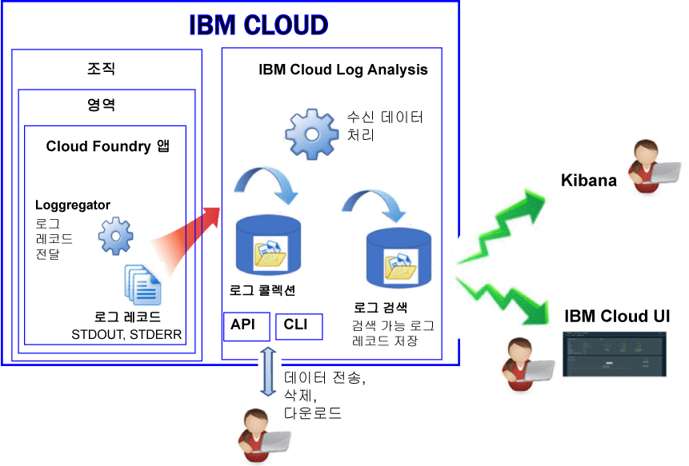

---

copyright:
  years: 2017, 2019

lastupdated: "2019-03-06"

keywords: IBM Cloud, logging

subcollection: cloudloganalysis

---

{:new_window: target="_blank"}
{:shortdesc: .shortdesc}
{:screen: .screen}
{:pre: .pre}
{:table: .aria-labeledby="caption"}
{:codeblock: .codeblock}
{:tip: .tip}
{:download: .download}
{:important: .important}
{:note: .note}

# Cloud Foundry 앱
{: #logging_cf_apps}

{{site.data.keyword.Bluemix}}에서 {{site.data.keyword.Bluemix_notm}} 대시보드, Kibana 및 명령행 인터페이스를 통해 CF(Cloud Foundry) 로그를 보고 필터링하고 분석할 수 있습니다. 또한, 외부 로그 관리 도구로 로그 레코드를 스트림할 수 있습니다. 
{:shortdesc}

{{site.data.keyword.Bluemix_notm}}는 Cloud Foundry 플랫폼 및 Cloud Foundry 애플리케이션에서 생성된 로그 데이터를 기록합니다. 로그에서 사용자의 앱에 대해 생성된 오류, 경고 및 정보 메시지를 볼 수 있습니다. 

{{site.data.keyword.Bluemix_notm}}에서 Cloud Foundry와 같은 클라우드 PaaS(Platform-as-a-Service)에서 앱을 실행하는 경우, 로그에 액세스하기 위해 앱이 실행 중인 인프라로 SSH 또는 FTP를 할 수 없습니다. 플랫폼은 클라우드 제공자에 의해 제어됩니다. {{site.data.keyword.Bluemix_notm}}에서 실행 중인 Cloud Foundry 앱은 Loggerator 컴포넌트를 사용하여 Cloud Foundry 인프라의 내부에서 로그 레코드를 전달합니다. Loggregator는 자동으로 STDOUT 및 STDERR 데이터를 선택합니다. {{site.data.keyword.Bluemix_notm}} 대시보드, Kibana 및 명령행 인터페이스를 통해 이러한 로그를 시각화하고 분석할 수 있습니다.

다음 그림에는 {{site.data.keyword.Bluemix_notm}}에서 Cloud Foundry 앱에 대한 로깅의 상위 레벨 보기가 표시됩니다.

 
Cloud Foundry 앱의 로깅은 {{site.data.keyword.Bluemix_notm}}에서 앱을 실행하려고 Cloud Foundry 인프라를 사용할 때 자동으로 사용 가능하게 설정됩니다. Cloud Foundry 런타임 로그를 보려면 STDOUT 및 STDERR에 로그를 작성해야 합니다. 자세한 정보는 [CF 앱을 통해 런타임 애플리케이션 로깅](/docs/services/CloudLogAnalysis/cfapps/logging_writing_to_log_from_cf_app.html#logging_writing_to_log_from_cf_app)을 참조하십시오.

{{site.data.keyword.Bluemix_notm}}는 제한된 양의 로그 정보를 보관합니다. 정보가 로그되면 이전 정보는 새 정보로 대체됩니다. 감사 또는 다른 목적으로 일부 또는 모든 로그 정보를 보존하도록 하는 조직 또는 산업 정책을 따라야 하는 경우, 외부 로그 호스트(예: 서드파티 로그 관리 서비스 또는 다른 호스트)에 로그를 스트림할 수 있습니다. 자세한 정보는 [외부 로그 호스트 구성](/docs/services/CloudLogAnalysis/external/logging_external_hosts.html#thirdparty_logging)을 참조하십시오.

## 로그 수집
{: #log_ingestion1}

다중 테넌트 Logstash 포워더를 사용하여 {{site.data.keyword.loganalysisshort}}에 로그를 전송할 수 있습니다. 자세한 정보는 [다중 테넌트 Logstash 포워더(mt-logstash-forwarder)를 사용하여 로그 데이터 전송](/docs/services/CloudLogAnalysis/how-to/send-data/send_data_mt.html#send_data_mt)을 참조하십시오.

{{site.data.keyword.loganalysisshort}} 서비스는 여러 가지 플랜을 제공합니다. *Lite* 플랜을 제외한 모든 플랜에는 로그 콜렉션으로 로그를 전송할 수 있는 기능이 포함되어 있습니다. 플랜에 대한 자세한 정보는 [서비스 플랜](/docs/services/CloudLogAnalysis/log_analysis_ov.html#plans)을 참조하십시오.

## 로그 콜렉션
{: #log_collection}

기본적으로 {{site.data.keyword.loganalysisshort}} 서비스는 최대 3일 동안 로그 검색에 로그 데이터를 저장합니다.   

* 하루에 영역당 최대 500MB의 데이터가 저장됩니다. 500MB 상한을 넘는 로그는 버려집니다. 상한 분배는 매일 오전
12:30 UTC에 재설정됩니다.
* 최대 1.5GB의 데이터를 최대 3일 동안 검색할 수 있습니다. 로그 데이터는 1.5GB의 데이터에 도달하거나 3일 이후에 롤오버(FIFO)됩니다.

{{site.data.keyword.loganalysisshort}} 서비스는 필요한 기간 만큼 로그 콜렉션에 로그를 저장하도록 허용하는 추가 플랜을 제공합니다. 

* 로그 콜렉션에 로그를 보존하기 원하는 일 수를 정의하기 위한 로그 보존 정책을 구성할 수 있습니다. 자세한 정보는 [로그 보존 정책](/docs/services/CloudLogAnalysis/manage_logs.html#log_retention_policy)을 참조하십시오.
* 명령행 또는 API를 사용하여 로그를 수동으로 삭제할 수 있습니다.

각 플랜의 가격에 대한 자세한 정보는 [서비스 플랜](/docs/services/CloudLogAnalysis/log_analysis_ov.html#plans)을 참조하십시오.

## 로그 검색
{: #log_search1}

기본적으로 Kibana를 사용하여 {{site.data.keyword.Bluemix_notm}}에서 하루에 최대 500MB의 로그를 검색할 수 있습니다. 

{{site.data.keyword.loganalysisshort}} 서비스는 여러 가지 플랜을 제공합니다. 각 플랜에는 각기 다른 로그 검색 기능이 있으며, 예를 들어 *로그 콜렉션* 플랜은 하루에 최대 1GB의 데이터를 검색하도록 허용합니다. 플랜에 대한 자세한 정보는 [서비스 플랜](/docs/services/CloudLogAnalysis/log_analysis_ov.html#plans)을 참조하십시오.

## CF 앱 로그 분석 방법
{: #logging_bluemix_cf_apps_log_methods}

다음 방법 중에서 선택하여 Cloud Foundry 애플리케이션의 로그를 분석할 수 있습니다.

* 애플리케이션의 최신 활동을 보기 위해 {{site.data.keyword.Bluemix_notm}} UI에서 로그를 분석합니다.
    
    {{site.data.keyword.Bluemix_notm}}에서 각 Cloud Foundry 애플리케이션에 사용 가능한 **로그** 탭을 통해 로그를 보고 필터링하고 분석할 수 있습니다. 자세한 정보는 [CF 앱 대시보드를 통해 CF 앱 로그 분석](/docs/services/CloudLogAnalysis/cfapps/launch_logs_cloud_ui_cf.html#cfapp_ui)을 참조하십시오.
    
* 고급 분석 태스크를 수행하기 위해 Kibana에서 로그를 분석합니다.
    
    {{site.data.keyword.Bluemix_notm}}에서는 오픈 소스 분석 및 시각화 플랫폼인 Kibana를 사용하여 다양한 그래프(예: 차트, 표)로 된 데이터를 모니터, 검색, 분석 및 시각화할 수 있습니다. 자세한 정보는 [{{site.data.keyword.loganalysisshort}} UI를 통해 CF 앱 로그 분석](/docs/services/CloudLogAnalysis/cfapps/launch_logs_cloud_ui_cf.html#cfapp_la)을 참조하십시오.
	
	**팁:** Kibana를 실행하려면 [CF 앱의 대시보드에서 Kibana로 이동](/docs/services/CloudLogAnalysis/kibana/launch.html#launch_Kibana_from_cf_app)을 참조하십시오.

* 로그를 프로그래밍 방식으로 관리하도록 명령을 사용하기 위해 CLI를 통해 로그를 분석합니다.
    
    {{site.data.keyword.Bluemix_notm}}에서 **cf logs** 명령을 사용하여 명령행 인터페이스를 통해 로그를 보고 필터링하고 분석할 수 있습니다. 자세한 정보는 [명령행 인터페이스에서 Cloud Foundry 앱 로그 분석](/docs/services/CloudLogAnalysis/cfapps/logging_view_cli.html#analyzing_logs_cli)을 참조하십시오.

## Diego에 배치된 CF 앱에 대한 로그 소스
{: #cf_apps_log_sources_diego}

Diego를 기반으로 하는 Cloud Foundry 아키텍처에 배치된 CF(Cloud Foundry) 애플리케이션의 경우, 다음과 같은 로그 소스를 사용할 수 있습니다.
    
|로그 소스 |컴포넌트 이름 |설명 | 
|------------|----------------|-------------|
|LGR |Loggregator |LGR 컴포넌트는 Cloud Foundry의 내부에서 로그를 전달하는 Cloud Foundry Loggregator에 대한 정보를 제공합니다. |
|RTR |라우터 |RTR 컴포넌트는 애플리케이션에 HTTP 요청에 대한 정보를 제공합니다. | 
|STG |스테이징 |STG 컴포넌트는 애플리케이션을 스테이징하거나 다시 스테이징하는 방법에 대한 정보를 제공합니다. | 
|APP |애플리케이션 |APP 컴포넌트는 애플리케이션에서 로그를 제공합니다. 여기에서 사용자 코드의 stderr 및 stdout가 표시됩니다. | 
|API |Cloud Foundry API |API 컴포넌트는 애플리케이션의 상태를 변경하는 사용자의 요청의 결과인 내부 조치에 대한 정보를 제공합니다. | 
|CELL |Diego 셀 |CELL 컴포넌트는 애플리케이션의 시작, 중지 또는 충돌에 대한 정보를 제공합니다.|
|SSH |SSH |SSH 컴포넌트는 **cf ssh** 명령을 사용하여 사용자가 애플리케이션에 액세스할 때마다 정보를 제공합니다. |
{: caption="표 1. Diego를 기반으로 하는 CF 아키텍처에 배치된 CF 앱에 대한 로그 소스" caption-side="top"}

다음 그림에는 Diego를 기반으로 하는 Cloud Foundry 아키텍처의 여러 가지 컴포넌트(로그 소스)가 표시됩니다. 

")
	
## DEA에 배치된 CF 앱에 대한 로그 소스
{: #logging_bluemix_cf_apps_log_sources}

DEA(Droplet Execution Agent) 아키텍처에 배치된 CF(Cloud Foundry) 애플리케이션의 경우, 다음과 같은 로그 소스를 사용할 수 있습니다.
    
|로그 소스 |컴포넌트 이름 |설명 | 
|------------|----------------|-------------|
|LGR |Loggregator |LGR 컴포넌트는 Cloud Foundry의 내부에서 로그를 전달하는 Cloud Foundry Loggregator에 대한 정보를 제공합니다. |
|RTR |라우터 |RTR 컴포넌트는 애플리케이션에 HTTP 요청에 대한 정보를 제공합니다. | 
|STG |스테이징 |STG 컴포넌트는 애플리케이션을 스테이징하거나 다시 스테이징하는 방법에 대한 정보를 제공합니다. | 
|APP |애플리케이션 |APP 컴포넌트는 애플리케이션에서 로그를 제공합니다. 여기에서 사용자 코드의 stderr 및 stdout가 표시됩니다. | 
|API |Cloud Foundry API |API 컴포넌트는 애플리케이션의 상태를 변경하는 사용자의 요청의 결과인 내부 조치에 대한 정보를 제공합니다. | 
|DEA |DEA(Droplet Execution Agent) |DEA 컴포넌트는 애플리케이션의 시작, 중지 또는 충돌에 대한 정보를 제공합니다.   이 컴포넌트는 애플리케이션이 DEA를 기반으로 하는 Cloud Foundry 아키텍처에 배치된 경우에만 사용 가능합니다. | 
{: caption="표 2. DEA를 기반으로 하는 CF 아키텍처에 배치된 CF 앱에 대한 로그 소스" caption-side="top"}

다음 그림에는 DEA를 기반으로 하는 Cloud Foundry 아키텍처의 여러 가지 컴포넌트(로그 소스)가 표시됩니다. 

를 기반으로 하는 Cloud Foundry 아키텍처의 컴포넌트(로그 소스).")

## {{site.data.keyword.Bluemix_notm}} UI를 통해 표시된 CF 앱 로그의 로그 형식
{: #log_format_cf}

{{site.data.keyword.Bluemix_notm}} CF 앱의 로그는 다음 패턴과 유사한 고정된 형식으로 표시됩니다.

<code><var class="keyword varname">Component</var>/<var class="keyword varname">instanceID</var>/<var class="keyword varname">message</var>/<var class="keyword varname">timestamp</var></code>

각 로그 항목에는 다음 필드가 포함됩니다.

|필드 |설명 |
|-------|-------------|
|시간소인 |로그 명령문의 시간입니다. 시간소인은 밀리초 단위까지 정의됩니다. |
|컴포넌트 |로그를 생성하는 컴포넌트입니다. 다른 컴포넌트의 목록을 보려면 [CF 앱의 로그 소스](/docs/services/CloudLogAnalysis/cfapps/logging_cf_apps.html#logging_bluemix_cf_apps_log_sources)를 참조하십시오.   각 컴포넌트 유형은 슬래시와 애플리케이션 인스턴스를 표시하는 숫자가 뒤이어 옵니다. 0은 첫 번째 인스턴스에 할당된 숫자이고, 1은 두 번째에 할당된 숫자이며 이런 식으로 계속됩니다. |
|메시지 |컴포넌트에서 발행하는 메시지입니다. 메시지는 컨텍스트에 따라 달라집니다. |
{: caption="표 1. CF 앱 로그 항목 필드" caption-side="top"}

## 튜토리얼: Kibana에서 Cloud Foundry 앱에 대한 로그 분석
{: #tutorial}  

Kibana를 사용하여 Cloud Foundry 앱에 대한 로그를 분석하는 방법을 알아보려면 [Kibana에서 Cloud Foundry 앱에 대한 로그 분석](https://console.bluemix.net/docs/tutorials/application-log-analysis.html#generate-access-and-analyze-application-logs)을 참조하십시오.
