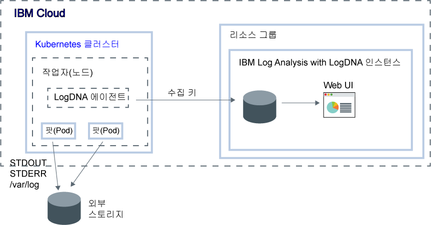

---

copyright:
  years:  2018, 2019
lastupdated: "2019-03-07"

keywords: LogDNA, IBM, Log Analysis, logging, getting started

subcollection: LogDNA

---

{:new_window: target="_blank"}
{:shortdesc: .shortdesc}
{:screen: .screen}
{:pre: .pre}
{:table: .aria-labeledby="caption"}
{:codeblock: .codeblock}
{:tip: .tip}
{:download: .download}
{:important: .important}
{:note: .note}

# 시작하기 튜토리얼
{: #getting-started}

{{site.data.keyword.la_full}}를 사용하여 {{site.data.keyword.cloud_notm}} 아키텍처에 로그 관리 기능을 추가하십시오. {{site.data.keyword.la_full_notm}}는 {{site.data.keyword.IBM_notm}}과 협력 관계인 LogDNA에서 운영됩니다.
{:shortdesc}

## 1 단계. 시작하기 전에
{: #getting-started_prereqs}

* {{site.data.keyword.la_full_notm}}에 대해 읽으십시오. 자세한 정보는 [{{site.data.keyword.la_full_notm}} 정보](/docs/services/Log-Analysis-with-LogDNA?topic=LogDNA-about#about)를 참조하십시오.
* 서비스가 사용 가능한 지역을 확인하십시오. 자세한 정보는 [지역](/docs/services/Log-Analysis-with-LogDNA?topic=LogDNA-about#overview_regions)을 참조하십시오.
* {{site.data.keyword.cloud_notm}} 계정의 구성원 또는 소유자인 사용자 ID를 가져오십시오. 

    {{site.data.keyword.cloud_notm}} 사용자 ID를 가져오려면 [등록 ](https://cloud.ibm.com/login){:new_window}을 클릭하십시오.

## 2단계. 시작
{: #getting-started_step2}

로그를 관리할 클라우드 리소스를 선택하십시오. 그런 다음 {{site.data.keyword.la_full_notm}} 서비스를 통해 해당 로그를 모니터할 수 있도록 이 로그 소스를 구성하십시오. 로그 소스는 {{site.data.keyword.la_full_notm}} 인스턴스를 프로비저닝하는 동일한 지역 또는 다른 지역에 있습니다.

다음 표에는 {{site.data.keyword.la_full_notm}} 서비스를 사용하여 로그를 저장하고 관리하도록 구성할 수 있는 클라우드 리소스의 예가 나열되어 있습니다. 리소스의 튜토리얼을 완료하여 {{site.data.keyword.loganalysisshort}} 서비스를 시작하십시오.

<table>
  <caption>{{site.data.keyword.la_full_notm}} 서비스에 대한 작업을 시작하기 위한 튜토리얼 </caption>
  <tr>
    <th>리소스</th>
    <th>튜토리얼</th>
    <th>환경</th>
    <th>시나리오</th>
  </tr>
  <tr>
    <td>{{site.data.keyword.containershort}}에서 실행되는 컨테이너</td>
    <td>[{{site.data.keyword.la_full_notm}}로 Kubernetes 클러스터 로그 관리](/docs/services/Log-Analysis-with-LogDNA?topic=LogDNA-kube#kube)</td>
    <td>{{site.data.keyword.cloud_notm}} Public </td>
    <td></td>
  </tr>
  <tr>
    <td>Linux Ubuntu, Linux Debian</td>
    <td>[{{site.data.keyword.la_full_notm}}로 Linux Ubuntu 로그 관리](/docs/services/Log-Analysis-with-LogDNA?topic=LogDNA-ubuntu#ubuntu)</td>
    <td>온프레미스</td>
    <td></td>
  </tr>
</table>

## 3단계. 플랜 업그레이드
{: #getting-started_step3}

추가 로깅 기능을 사용하십시오.

[로그 필터링](/docs/services/Log-Analysis-with-LogDNA?topic=LogDNA-view_logs#view_logs_step5), [로그 검색](/docs/services/Log-Analysis-with-LogDNA?topic=LogDNA-view_logs#view_logs_step6), [보기 정의](/docs/services/Log-Analysis-with-LogDNA?topic=LogDNA-view_logs#view_logs_step7) 및 [경보 구성](https://docs.logdna.com/docs/alerts)을 수행할 수 있도록 {{site.data.keyword.la_full_notm}} 서비스 플랜을 유료 플랜으로 업그레이드하십시오. {{site.data.keyword.la_full_notm}} 서비스 플랜에 대한 자세한 정보는 [가격 플랜](/docs/services/Log-Analysis-with-LogDNA?topic=LogDNA-about#overview_pricing_plans)을 참조하십시오.

## 4단계. 다음 단계 
{: #getting-started_iam}

그런 다음 IAM으로 사용자 액세스를 관리하십시오.

사용자가 {{site.data.keyword.la_full_notm}} 서비스에 대한 작업을 수행하는 데 필요한 IAM 정책을 식별하십시오.

{{site.data.keyword.la_full_notm}} 서비스와의 IAM 통합에 대해 자세히 보려면 [IAM으로 사용자 액세스 관리](/docs/services/Log-Analysis-with-LogDNA?topic=LogDNA-iam#iam)를 참조하십시오.

예를 들어, {{site.data.keyword.la_full_notm}} 서비스에 대한 작업을 수행할 수 있는 권한을 사용자에게 부여하는 방법에 대해 알아보기 위해 하나의 사용자 역할을 선택하십시오. 

| {{site.data.keyword.cloud_notm}}의 사용자 역할 | 자세한 정보                     |
|-----------------------------------------------------|------------------------------------------|
| 계정 소유자                                       | [{{site.data.keyword.cloud_notm}} 계정의 서비스 관리자가 될 수 있는 권한을 사용자에게 부여](/docs/services/Log-Analysis-with-LogDNA?topic=LogDNA-work_iam#admin_account) |
| 계정의 플랫폼 서비스 관리자       | [{{site.data.keyword.cloud_notm}} 계정의 서비스 관리자가 될 수 있는 권한을 사용자에게 부여](/docs/services/Log-Analysis-with-LogDNA?topic=LogDNA-work_iam#admin_account) |
| 리소스 그룹의 플랫폼 서비스 관리자  | [리소스 그룹 내 서비스 관리자가 될 수 있는 권한을 사용자에게 부여](/docs/services/Log-Analysis-with-LogDNA?topic=LogDNA-work_iam#admin_rg) |
| 계정의 플랫폼 DevOps 운영자           | [{{site.data.keyword.cloud_notm}} 계정의 서비스를 관리할 수 있는 권한을 DevOps 사용자에게 부여](/docs/services/Log-Analysis-with-LogDNA?topic=LogDNA-work_iam#devops_account) |
| 리소스 그룹의 플랫폼 DevOps 운영자        | [리소스 그룹 내 서비스를 관리할 수 있는 권한을 DevOps 사용자에게 부여](/docs/services/Log-Analysis-with-LogDNA?topic=LogDNA-work_iam#devops_rg) |
| LogDNA의 서비스 관리자                     | [LogDNA에서 로그를 관리하고 경보를 구성할 수 있는 권한 부여](/docs/services/Log-Analysis-with-LogDNA?topic=LogDNA-work_iam#admin_user_logdna)              |
| 사용자/개발자                                    | [LogDNA에서 로그를 보고 관리할 수 있는 권한을 사용자에게 부여](/docs/services/Log-Analysis-with-LogDNA?topic=LogDNA-work_iam#user_logdna)               |
{: caption="표 2. {{site.data.keyword.cloud_notm}}의 클라우드 역할" caption-side="top"}

